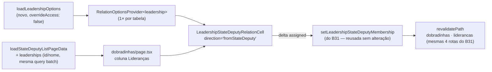

# Chips de lideranças na lista de dobradinhas (espelho da coluna Municípios de Assessores)

Status: entregue (2026-07-26)
Atualizado em: 2026-07-26
Item do roadmap: [docs/roadmap.md](../roadmap.md) (Trilha B, item **B36** ✓)
Impeccable: B — encaixe na coluna "Lideranças" de `/campanha/dobradinhas`, reusando o padrão visual já em produção em `/campanha/assessores` (**B19 ✓**) e a mutação entregue pelo **B31 ✓** para o lado inverso da mesma relação
Appetite: ~0,75–1d (B31 já aterrissado; paga a extração da célula compartilhada que o B31 deixou pendente)
Responsável: —

## Revisão na entrega (2026-07-26)

Auditoria pré-implementação contra o B31 as-built:

1. **Context → columns factory.** O plano pedia `RelationOptionsProvider`; o B31 `/simplify` rodada 2 já tinha deletado o Context em favor de `leadershipColumns(options)`. Entrega seguiu o precedente: `stateDeputyColumns(..., leadershipOptions)` + `toLeadershipRelationOptions`.
2. **Casca por rota.** `setLeadershipStateDeputyMembershipFormAction` ganhou cópia fina em `dobradinhas/formActions.ts` (não importa de `liderancas/` — `formActions` são cascas por rota no codebase-map). Mutação/schema/lock inalterados.
3. **Célula compartilhada.** `LeadershipStateDeputiesCell` deletado; nasce `shared/LeadershipStateDeputyRelationCell` com `direction` + `measureOverflow` (default true; lado liderança passa `false`). Tipos de UI: `RelationCellItem` / `RelationCellOption`.
4. **Loader.** `leadershipCount` → `leaderships: {id,name}[]` em `StateDeputyRowViewModel`; `loadLeadershipOptions` em `campaignRelationOptions.ts`.

As-built bate com as Decisões travadas de mutação/reuso; só o packaging de UI/catalogo divergiu do rascunho de 25/07, alinhado ao B31 real.

## Design (Impeccable)

Âncoras: `PRODUCT.md` (princípios 3 **Edit where you see**, 4 **Auto-save, no Save button**, 8 Feel the action; anti-goals "spreadsheet mode" e "always-mounted inputs on every row") / `DESIGN.md` (register `product`; Field Desk) · tema `data-theme='campaign'` · precedentes de interação [`AdvisorMunicipalityCell.tsx`](../../src/components/campaign/advisor/AdvisorMunicipalityCell.tsx) (B19 ✓ — chips removíveis + typeahead + otimista + `ResizeObserver`/"Ver mais…") e o desenho ainda não implementado do **B31** ([`dobradinhas-lista-liderancas.md`](dobradinhas-lista-liderancas.md) — chips + Popover + `Command`, sem "Ver mais…", para a mesma relação `leadership.stateDeputies` na direção oposta) · shells `CampaignTable` / `CampaignPageShell` · regras `.cursor/rules/campanha-edit-where-you-see.mdc` e `campanha-action-feedback.mdc`.

Na implementação (`implement-roadmap-item`): craft compacto (a maior parte da interação já foi decidida no B31; craft aqui é sobretudo a direção nova + o clamp de overflow) → critique → polish. `harden`/`optimize` só sob gatilho do Passo 8.

Brief compacto:

- **Persona / contexto:** CG / Assessor olhando `/campanha/dobradinhas` e querendo ver, de um deputado estadual, **quais lideranças já estão amarradas a ele** — e corrigir isso sem abrir uma ficha de liderança por vez. É o mesmo job do B31, visto do lado do deputado em vez do lado da liderança.
- **Job principal:** ver e editar as lideranças de uma dobradinha direto na tabela, com o mesmo gesto com que já se edita a carteira de município de um assessor.
- **Estratégia de cor:** Restrained — chips `Badge variant="secondary"`, sem paleta nova.
- **Edit where you see:** sim — mesma affordance do B31/Assessores (chips removíveis, busca inline, sem toggle de tabela inteira); o pedido do usuário nomeia explicitamente "não duplicar lógica" — a resposta de design é reusar a mesma mutação e a mesma forma de célula, não inventar uma segunda.
- **Anti-goals:** modo "Editar" de tabela inteira; segundo componente de célula fazendo a mesma coisa que o do B31 com um nome diferente; agrupamento por município/TI nos chips (essa relação não tem hierarquia territorial).

## Dados → decisão → apresentação

- **Vou apresentar dados?** Sim — a mesma relação categórica `leadership.stateDeputies`, vista do lado do `stateDeputy`. Hoje a lista de dobradinhas descarta o detalhe e mostra só `leadershipCount: number`.
- **Decisões desbloqueadas:**
  - Coordenador/Assessor olhando a ficha de um deputado: "quais lideranças já estão de fato amarradas a ele — e há alguma faltando?" (mesmo flanco de fogo amigo intra-campo nomeado em [CUSTOMER.md](../CUSTOMER.md)).
  - Coordenador fazendo triagem por deputado (em vez de por liderança, como o B31 já resolve): completar em lote as fichas de um deputado específico, útil quando o dado chega organizado "por candidato" em vez de "por pessoa" (o caso comum de planilha de campanha).
- **Forma escolhida:** tabela/lista — coluna com chips nomeados (link para `/campanha/liderancas/[id]`), igual ao tratamento já decidido para "Municípios"/"Organizações" e ao que o B31 decidiu para "Dobradinhas" na tabela de lideranças. **Rejeitado:** manter a contagem (esconde o nome, que é a decisão); qualquer chart/mapa (dado nominal/categórico, "quem" não "onde"/"quanto").
- **Profile:** categórico; granularidade `stateDeputy` × `leadership`; tamanho **potencialmente maior** por linha do que no B31 — um deputado popular pode acumular dezenas de lideranças engajadas, enquanto uma liderança tipicamente dobra com 0–2 deputados. Essa assimetria é a razão de design central deste item (ver Decisões travadas #3).
- **Anti-goals de dado:** sem métrica eleitoral derivada; sem ranking de deputados por número de lideranças; sem inferir a partir de `municipality.stateDeputies` (união automática misturaria vínculo sabido com suposto, mesmo anti-goal do B31).

Self-check dados: 5/5.

## Contexto

`/campanha/dobradinhas` ([`page.tsx`](<../../src/app/(campaign)/campanha/(app)/dobradinhas/page.tsx>)) lista deputados estaduais com colunas Nome · Partido · Municípios · Lideranças. As duas últimas são só contagens (`municipalityCount`/`leadershipCount`) calculadas em [`stateDeputyData.ts`](../../src/utilities/stateDeputyData.ts) por uma query batch em `leadership`/`municipality` filtrada por `stateDeputies: { in: stateDeputyIDs } }` — a mesma forma de agregação que a ficha [`loadStateDeputyDetail`](../../src/utilities/stateDeputyData.ts) já usa para resolver **nomes** (não só contagem) de município e liderança, só que ali para um único deputado.

O usuário pediu explicitamente que a coluna "Lideranças" ganhe "as mesmas funcionalidades e UI" da coluna "Municípios" de `/campanha/assessores` (**B19 ✓** — chips clicáveis, chips removíveis + busca no modo edição, gravação por delta com estado otimista, "Ver mais…" quando a carteira não cabe em 3 linhas) — e pediu para **não duplicar lógica**, reutilizando funções e componentes.

Isso importa porque existe hoje, em plano (ainda não implementado), o item **B31** ([`dobradinhas-lista-liderancas.md`](dobradinhas-lista-liderancas.md)) resolvendo **exatamente a mesma relação `leadership.stateDeputies`**, só que a partir da tabela de lideranças: lá, cada linha é uma liderança fixa e os chips são as dobradinhas dela; aqui, cada linha é uma dobradinha fixa e os chips são as lideranças dela. É a mesma aresta de grafo, editada dos dois lados — exatamente o cenário em que "reusar, não duplicar" tem uma resposta concreta: a mutação (ler o array `leadership.stateDeputies`, aplicar um toggle, escrever) é **idêntica** nas duas direções, porque o campo relacional só existe do lado da `leadership`. O que muda é qual id fica fixo e qual vem da busca — e a UI da célula (chips + Popover + `Command` + otimista) também é idêntica na forma, mudando só a lista de origem/destino e o link do chip.

## Objetivos

- Coluna "Lideranças" em `/campanha/dobradinhas` troca a contagem morta por chips nomeados, cada um linkando para `/campanha/liderancas/[id]`.
- Adicionar/remover liderança **na própria linha**, com busca acento-insensível por nome sobre o catálogo de lideranças acessíveis ao ator, **sem botão "Salvar"**: grava por delta, com chip otimista, erro revertido + toast.
- **Clamp de 3 linhas + "Ver mais…"** (mesma medição por `ResizeObserver` do `AdvisorMunicipalityCell`) — necessário aqui porque, ao contrário do B31, o volume de chips por linha pode crescer bastante (ver Decisões travadas #3).
- **Zero segunda implementação da mutação ou da mecânica de célula**: reutiliza a action/schema/lock que o B31 introduz para a mesma relação, e um único componente de célula cobre as duas direções (B31 e este item).
- `StateDeputyRowViewModel.leadershipCount` é substituído por `leaderships: LeadershipRelationSummary[]` (id + nome), resolvido pela mesma query batch já existente (mais um `depth`/`select`, não uma segunda consulta).
- Guardrails: sem migration, sem collection, sem Consent, sem mudança de contrato de URL da lista; access reaproveitado (a leitura/escrita de `leadership` com `overrideAccess: false` já resolve o escopo do assessor); `leader` continua fora da rota (`isCampaignStaff` já exclui).

## Decisões travadas

- **Reusar literalmente a mutação do B31, sem um segundo caminho de código.** A relação mora só em `leadership.stateDeputies`; "editar do lado do deputado" continua sendo ler-modificar-escrever o documento da `leadership`, só que com `leadershipId` variável (escolhido na busca) e `stateDeputyId` fixo (o da linha) — o espelho exato de como o B31 chama a mesma função com `stateDeputyId` variável e `leadershipId` fixo. Este item **não** introduz uma action nova: usa `setLeadershipStateDeputyMembershipRecord`/`setLeadershipStateDeputyMembership` (schema `leadershipStateDeputyMembershipSchema`, lock `leadership-state-deputies:{id}`) exatamente como o B31 os deixar. **Por quê:** é a definição operacional do pedido "não duplicar lógica" — a mesma checagem de escopo, o mesmo lock, o mesmo teto (`MAX_LEADERSHIP_STATE_DEPUTIES`, 20) e a mesma transação já resolvem os dois sentidos. **Rejeitado:** uma action "do lado do `stateDeputy`" espelhando a lógica — duplicaria exatamente a leitura-modificação-escrita que o B31 já resolve; um endpoint JSON dedicado só para esta direção — mesmo raciocínio, sem ganho.
- **Um único componente de célula bidirecional para a mesma aresta, não dois componentes que fazem a mesma coisa com nomes diferentes.** `LeadershipStateDeputyRelationCell` (client, em `src/components/campaign/shared/`) recebe `direction: 'fromStateDeputy' | 'fromLeadership'`, o id da linha fixa, os itens já vinculados (`{id, name, href}[]`) e o catálogo de opções do outro lado (já filtrado/rotulado pelo chamador). O B31 monta essa célula com `direction: 'fromLeadership'` (chips = dobradinhas, catálogo = `loadStateDeputyOptions`); este item monta com `direction: 'fromStateDeputy'` (chips = lideranças, catálogo = `loadLeadershipOptions`, novo). **Por quê:** as duas montagens compartilham 100% da mecânica (Popover, `Command`, `matchesAtWordStart`, `useTransition`, estado otimista, reversão em erro, toast) — só o rótulo dos chips, o link e qual lado da tupla `{leadershipId, stateDeputyId}` é fixo mudam. **Rejeitado:** um componente `StateDeputyLeadershipsCell` próprio deste item, irmão gêmeo do `LeadershipStateDeputiesCell` do B31 — é exatamente a "segunda cópia da mesma lógica" que o pedido do usuário proíbe; um editor genérico `RelationshipChipEditor` agnóstico de qual relação edita — prematuro (só existe uma relação com esta forma até aqui; a de municípios tem agrupamento por TI/ZE, é outra forma — ver Adiado com gatilho).
- **Incluir o clamp de 3 linhas + "Ver mais…" (portado do `AdvisorMunicipalityCell`) no componente compartilhado, atrás de um prop opcional (`measureOverflow`, default `true`).** O B31 decidiu **não** portar essa medição para a direção "de liderança" porque uma liderança tipicamente dobra com 0–2 deputados (poucos chips, sem estouro). Este item pede exatamente a paridade com Assessores — cujo motivo de existir é uma carteira que **pode** crescer além de 3 linhas — e aqui a assimetria é real: um deputado popular pode acumular dezenas de lideranças engajadas. **Por quê:** ligar/desligar por prop custa uma linha de código no componente compartilhado; não portar deixaria a linha de um deputado popular crescer sem limite ao lado de Nome/Partido/Municípios, quebrando a densidade da própria lista que este item está tentando tornar legível. **Rejeitado:** sem clamp em nenhuma direção (`whitespace-normal`) — reproduziria em `/campanha/dobradinhas` o mesmo problema que motivou o "Ver mais…" em Assessores; clamp obrigatório sempre — گasto de `ResizeObserver` sem necessidade real no lado "de liderança", que o B31 já mediu como raro.
- **Catálogo de busca (`loadLeadershipOptions`, novo em `campaignRelationOptions.ts`) via `payload.find({ collection: 'leadership', user, overrideAccess: false })`, sem interseção manual com `getAccessibleLeadershipIds`.** **Por quê:** é o mesmo padrão que já sustenta `loadStateDeputyOptions`/`loadMunicipalityOptions`/`loadOrganizationOptions` — o access de linha de `canReadLeadership` já resolve o escopo do assessor no próprio `find`; a autoridade real de qualquer forma está na mutação (`overrideAccess: false` no read-modify-write), então escopar a busca de novo seria replicar uma regra que o Payload já aplica. **Rejeitado:** buscar todas as lideranças com `overrideAccess: true` e filtrar em memória — reintroduz manualmente uma regra de acesso que já existe.
- **`stateDeputyData.ts`: a query batch de `leadership` (já filtrada por `stateDeputies: { in: stateDeputyIDs } }`) ganha `depth: 1` + `select: { stateDeputies: true, contact: true }` e passa a agrupar `{id, name}` por deputado, no lugar da contagem — mesma forma que `loadStateDeputyDetail` já usa para a ficha, promovida para a query em lote da lista.** `StateDeputyRowViewModel.leadershipCount` é substituído por `leaderships: LeadershipRelationSummary[]`. **Por quê:** é uma extensão de campos (`select`) na mesma query já existente, não uma segunda consulta — literalmente a definição de "não duplicar lógica" aplicada ao loader. **Rejeitado:** manter `leadershipCount` e adicionar uma segunda query de nomes sobre o mesmo `where` — dois round-trips ao banco para o mesmo filtro é a duplicação que o pedido nomeia.
- **i18n e naming** seguem o AGENTS.md: identificadores em inglês (`LeadershipStateDeputyRelationCell`, `loadLeadershipOptions`, `LeadershipRelationSummary`), strings visíveis em pt-BR ("Lideranças", "Adicionar liderança…", "Ver mais…").

## Questões em aberto

- **O componente compartilhado (`LeadershipStateDeputyRelationCell`) mora em `shared/` ou em `stateDeputy/`?** **Opções:** A) `src/components/campaign/shared/` — é consumido por duas rotas de dois domínios diferentes (`dobradinhas/page.tsx` e `liderancas/page.tsx`) | B) `src/components/campaign/stateDeputy/`, importado cross-domínio pela rota de lideranças. **Recomendação:** A — `codebase-map.mdc` já reserva `shared/` para o que mais de um domínio consome (precedente: `CampaignTable`, `CampaignListFooter`); manter em `stateDeputy/` obrigaria `liderancas/` a importar de outro domínio, o acoplamento que o mapa de código proíbe.
- **Este item entra na mesma entrega do B31, ou depois, consumindo o que o B31 já tiver extraído?** **Opções:** A) mesma PR/sessão — constrói a célula e a action uma vez, já cobrindo as duas direções | B) B36 entra depois do B31 (padrão de corrida já usado em B21/B29/B33: quem chega primeiro paga a peça compartilhada, o outro só consome). **Recomendação:** B — mantém cada entrega revisável e no appetite calculado acima; se produto preferir as duas juntas, o appetite combinado (~1,5–2 dias) cobre.
- **Existe algum teto simétrico do lado do `stateDeputy` (limite de lideranças por deputado)?** **Opções:** A) nenhum teto novo — o teto de 20 lideranças por dobradinha (`MAX_LEADERSHIP_STATE_DEPUTIES`, do lado da `leadership`) já limita o fan-out sem necessidade de um segundo campo | B) adicionar teto simétrico. **Recomendação:** A — sem evidência de necessidade; o clamp visual (item de design acima) já resolve a legibilidade da célula independente de quantos chips existem de fato.

## Abordagem proposta

Componentes:

- **`src/components/campaign/shared/LeadershipStateDeputyRelationCell.tsx`** (novo — se o B31 já tiver entregue seu `LeadershipStateDeputiesCell`, este item **promove/renomeia** aquele componente para `shared/` e adiciona `direction`/`measureOverflow` em vez de criar um arquivo paralelo). Props: `direction: 'fromStateDeputy' | 'fromLeadership'`, `fixedId: number`, `items: { id: number; name: string; href: string }[]`, `options: RelationOption[]`, `measureOverflow?: boolean` (default `true`), `disabled?: boolean`. Internamente: chips (`Badge` + `Link`) no repouso; Popover com chips removíveis + `Command` (busca via `matchesAtWordStart`) para adicionar; `useTransition` + estado otimista + `toast.error` com reversão; quando `measureOverflow`, o mesmo `ResizeObserver` de 3 linhas + "Ver mais…" do `AdvisorMunicipalityCell`.
- **`src/components/campaign/shared/RelationOptionsProvider.tsx`** (novo, genérico só na forma — não na relação): `Context<RelationOption[]>` + `useRelationOptions()`; monta uma vez em volta do `CampaignTable`. Reusado pelo B31 (catálogo de dobradinhas) e por este item (catálogo de lideranças) — mesmo formato (`RelationOption[]`), dois consumidores reais, sem parametrizar nada específico de domínio.
- **`src/utilities/campaignRelationOptions.ts`**: `loadLeadershipOptions(payload, user)` (novo) — espelha `loadStateDeputyOptions`: `payload.find({ collection: 'leadership', depth: 1, select: { contact: true }, user, overrideAccess: false })`, mapeando para `{ id, name: contact.name }`.
- **`src/utilities/stateDeputyData.ts`**: `StateDeputyRowViewModel.leadershipCount` → `leaderships: LeadershipRelationSummary[]` (`{id, name}`); a query batch de `leadership` em `loadStateDeputyListPageData` ganha `depth: 1` e `select: { stateDeputies: true, contact: true }`, agrupando por deputado no lugar de só contar. `LeadershipRelationSummary` exportado para o componente da célula construir `href`/label.
- **`src/app/(campaign)/campanha/(app)/dobradinhas/page.tsx`**: a coluna `leaderships` passa a renderizar `<LeadershipStateDeputyRelationCell direction="fromStateDeputy" fixedId={row.id} items={row.leaderships.map(l => ({...l, href: \`/campanha/liderancas/${l.id}\`}))} .../>`; a página carrega `loadLeadershipOptions(payload, user)`no mesmo`Promise.all`do loader da lista e envolve a tabela em`<RelationOptionsProvider options={...}>`.
- **Sem migration, sem collection, sem action nova, sem endpoint JSON, sem schema novo** — reusa integralmente `setLeadershipStateDeputyMembership`/`leadershipStateDeputyMembershipSchema`/lock do B31.
- **Testes:** estende os testes de `nextStateDeputyIdsAfterMembership`/action do B31 com um caso de invocação "pelo lado do deputado" (mesmo resultado, ids trocados); teste de `loadLeadershipOptions` respeitando escopo do assessor; teste do loader de `stateDeputyData.ts` confirmando `leaderships` (não mais `leadershipCount`) no row.

Depth check: reusa `CampaignTable`, `Popover`/`Command`/`Badge` do kit, `wordStartFilter`, a action/schema/lock do B31, `campaignAccess`. Não introduz um segundo caminho de mutação nem um segundo componente de célula — o ponto central do pedido.

## Dependências

- **Soft, corrida com B31** (`docs/plans/dobradinhas-lista-liderancas.md`): quem entrar primeiro paga a extração de `LeadershipStateDeputyRelationCell` (a partir do `LeadershipStateDeputiesCell` que o B31 desenha) + `RelationOptionsProvider` + a action/schema/lock; o outro consome sem alterar. Mesmo padrão de corrida já documentado para B21/B29/B33.
- Soft: **B19 ✓** (padrão de interação de origem, `AdvisorMunicipalityCell`), **E4R ✓** (criou o catálogo de dobradinhas e deixou as fichas de liderança vazias — é o motivo de haver trabalho de preenchimento em lote dos dois lados), **B33** (mesma tabela — se o header de sort/filtro de dobradinhas entrar primeiro, esta coluna nasce sob o header rico; se entrar depois, herda).
- Reusa sem alterar: `withPayloadTransaction`, `acquireTextAdvisoryLocks`, `canManageLeadership`/`canReadLeadership` (`src/utilities/access/leaderships.ts`), `canReadStateDeputy` (`src/utilities/access/stateDeputies.ts`), `runCampaignFormAction`.
- Nenhuma dependência dura de outro item aberto do roadmap.

## Não escopo

- Agrupamento de chips por município/Território de Identidade (a metade "lote" do widget de Assessores) — a relação dobradinha↔liderança não tem hierarquia territorial análoga; mesma decisão do B31 para a direção espelhada.
- Filtro/ordenação por lideranças no header de `/campanha/dobradinhas` — o **B33** cobre apenas Nome/Partido; vira gatilho registrado ali se a mesa pedir.
- Editar a coluna "Municípios" de `/campanha/dobradinhas` pelo mesmo padrão — vínculo indireto via `municipality.stateDeputies` (outra collection, outro dono de escrita), fora do pedido.
- Criar liderança nova a partir da célula ("adicionar e cadastrar") — `/campanha/liderancas/nova` continua sendo o caminho.
- Generalizar `LeadershipStateDeputyRelationCell`/`RelationOptionsProvider` para qualquer relação (municípios, organizações) — ver Adiado com gatilho.

## Rabbit holes

- **Generalizar demais enquanto o arquivo já está aberto.** É tentador, ao extrair a célula para `shared/`, torná-la um editor de relação totalmente agnóstico (qualquer collection, qualquer campo). **Mitigação:** parar em `LeadershipStateDeputyRelationCell`, escopado literalmente à aresta `leadership.stateDeputies`; a de municípios (`MunicipalityPortfolioCell`, do plano [`chips-municipios-lista-liderancas.md`](chips-municipios-lista-liderancas.md)) tem agrupamento TI/ZE — é uma forma diferente, não o mesmo componente com um nome trocado.
- **Migrar consumidores de `leadershipCount` sem verificar quem mais lê esse campo.** Antes de remover `leadershipCount` de `StateDeputyRowViewModel`, `git grep -w leadershipCount` — se algum outro lugar (painel/overview) só precisa do número, `row.leaderships.length` substitui sem tocar naquele markup fora do escopo deste item.
- **Ajustar o clamp de 3 linhas do B31 "por tabela ter mudado" quando na verdade o volume só mudou no lado do deputado.** O prop `measureOverflow` existe exatamente para isolar essa decisão por direção; não elevar/reduzir o limiar do lado "de liderança" sem evidência nova.

## Adiado com gatilho

- **Editor de relação totalmente genérico (`RelationshipChipEditor`), incluindo municípios/organizações.** Revisitar quando uma 3ª relação sem agrupamento territorial pedir exatamente esta forma (mesmo gatilho já registrado no B31).
- **Busca de liderança no servidor em vez de catálogo client-side completo.** Revisitar quando o catálogo de lideranças passar de ~200 registros (mesmo gatilho/métrica do B31).
- **Teto simétrico de lideranças por dobradinha.** Revisitar só com evidência real de um deputado acumulando um volume que quebre a legibilidade mesmo com o clamp.

## Referências

- `docs/roadmap.md` (Trilha B — item B36, ao lado de B31/B33)
- [`dobradinhas-lista-liderancas.md`](dobradinhas-lista-liderancas.md) (B31) — desenho da mutação/ação/lock/schema que este item reusa sem alteração, e da célula que este item promove para `shared/`
- [`gerenciar-assessores.md`](gerenciar-assessores.md) (B19 ✓) — origem do padrão de chips + busca + otimista + "Ver mais…"
- `src/app/(campaign)/campanha/(app)/dobradinhas/page.tsx`, `src/utilities/stateDeputyData.ts` — superfície e view model a estender
- `src/components/campaign/advisor/AdvisorMunicipalityCell.tsx` — origem do clamp de 3 linhas + `ResizeObserver`/"Ver mais…" a portar
- `src/utilities/campaignRelationOptions.ts` (`loadStateDeputyOptions`, `loadMunicipalityOptions`) — padrão a espelhar em `loadLeadershipOptions`
- `src/utilities/access/leaderships.ts` (`canReadLeadership`, `canManageLeadership`) — access que a leitura/escrita reusa sem alterar
- `src/lib/wordStartFilter.ts` (`matchesAtWordStart`, `normalizeSearchPhrase`) — busca acento-insensível reusada
- AGENTS.md — Campaign Municípios model, Transaction Safety, naming em inglês/copy em pt-BR
- `.cursor/rules/campanha-edit-where-you-see.mdc`, `.cursor/rules/campanha-action-feedback.mdc` — princípios de UX herdados de Assessores/B31
