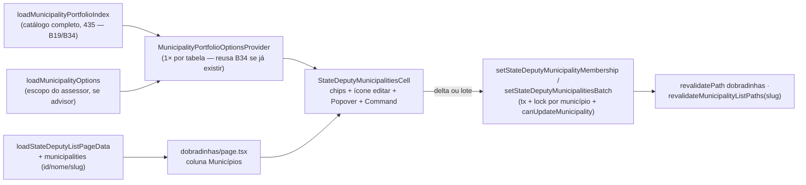

# Chips editáveis de municípios na lista de dobradinhas (paridade com Assessores)

Status: entregue (2026-07-28)
Atualizado em: 2026-07-28
Item do roadmap: [docs/roadmap.md](../roadmap.md) (Trilha B, item **B37**)
Impeccable: B — encaixe na coluna "Municípios" de `/campanha/dobradinhas`; sem rota nova
Appetite: ~0,75–1 dia eng — 1 componente de célula novo (Popover + Command), 2 server actions + schema + helper puro, ajuste no loader da lista; sem migration. (Menor que o B34 análogo: sem piso mínimo, sem `assertMunicipalitiesWithinScope`, lock por município em vez de por documento.)
Responsável: —

## Entregue (2026-07-28) — as-built

**A célula é a mesma peça do B34, sem cópia.** Este item não construiu `StateDeputyMunicipalitiesCell` nem um provider novo — plugou `shared/MunicipalityPortfolioCell` (já promovida pelo B34 ✓) direto na coluna "Municípios" de `/campanha/dobradinhas`, com as costuras que o B34 já desenhou para isso: sem `minItems` (uma dobradinha pode ficar sem município — o piso deste plano nunca existiu no schema, e o comentário permanece correto), sem `maxItems` do lado da dobradinha (o teto que existe é por município — `MAX_STATE_DEPUTIES_PER_MUNICIPALITY`, inalterado), `addableIds` só quando o ator é `advisor`. O container herda **integralmente** a decisão do B34: sempre editável em `pointer-fine` (chips + "×" no hover/foco + input de busca na própria linha), Drawer em `pointer-coarse` — nenhuma decisão de container nova foi tomada aqui, e o "conflito com o pedido literal" registrado abaixo já estava fechado antes deste item começar (ver B34 ✓ e a nota B34/B36/B37 em `codebase-map.mdc`).

**Generalização feita nesta entrega, não adiada para um "3º call site" futuro.** Este plano registrava a extração de um `RelationshipChipEditor` agnóstico em "Adiado com gatilho", esperando B31+B34+este landarem primeiro. Na crítica pós-implementação (`/simplify` + `/impeccable`) ficou visível que **este item já era o 3º call site**: `MunicipalityPortfolioCell` (município) e `LeadershipStateDeputyRelationCell` (dobradinha↔liderança, B31 ✓/B36 ✓) tinham interfaces incompatíveis para o mesmo padrão (delta otimista, undo, combobox ARIA, piso/teto, split pointer-fine/coarse) — P1 do critique. A resposta foi generalizar imediatamente em vez de registrar um quarto "adiado com gatilho": `src/components/campaign/shared/RelationChipCell.tsx` (813 linhas) nasceu como a máquina de interação única, e `MunicipalityPortfolioCell` (816 → ~180 linhas) e `LeadershipStateDeputyRelationCell` (450 → ~185 linhas) foram reduzidos a wrappers finos — chips/busca/`FormData`/copy por domínio, nada de interação duplicada. `LeadershipStateDeputyRelationCell` ganhou `ownerName` (para o Drawer e os `aria-label`) e perdeu sua própria implementação de Popover+Command, sem mudar contrato para os dois call sites existentes (`liderancas/page.tsx`, `dobradinhas/page.tsx`) além de passar o novo prop.

**Segundo P1 do critique, também resolvido nesta entrega:** um assessor via — e tentava remover — chips de municípios fora do seu escopo, e a remoção falhava em silêncio no nível do documento (`canUpdateMunicipality` recusa, mas a célula não sabia explicar por quê). `MunicipalityPortfolioCell` agora filtra `municipalityIds` por `addableIds` quando presente (`visibleIds`), então um assessor só vê — e só pode tentar remover — municípios que administra; staff sem `addableIds` continua vendo e removendo todos os vínculos. Trade-off aceito: em uma janela rara de reatribuição de carteira, um piso client-side poderia recusar uma remoção que o servidor aceitaria — aceitável porque o servidor segue sendo a fonte de verdade e o pedido explícito era esconder, não apenas explicar.

**Escrita:** `setStateDeputyMunicipalitiesBatch` — uma única action de lote (não a dupla delta+lote do plano), transacional, com lock por município (`municipality-state-deputies:{id}`, um por município tocado, ordenado) e leitura+escrita de `municipality.stateDeputies` com `overrideAccess: false` (o acesso real é `canUpdateMunicipality`; sem `assertMunicipalitiesWithinScope`, como planejado). **Falha em lote é tudo-ou-nada**: se qualquer município do lote está fora do escopo do assessor ou não existe, a transação inteira é revertida com uma mensagem única — decisão explícita desta sessão (rejeita a alternativa "aplica o que pode, ignora o resto", que deixaria o assessor sem saber quais municípios silenciosamente falharam). `nextStateDeputyMunicipalityIdsAfterMembership` (em `src/lib/municipalityStateDeputyMembership.ts`, puro) espelha `nextAdvisorIdsAfterMembership`.

**Cap de 20 → 435 em `stateDeputiesArraySchema`** (`src/lib/schemas/municipality.ts`): o teto original de 20 dobradinhas por município era um vestígio de outra era do dado; com a coluna agora permitindo lote de território/ZE (até 435 municípios de uma vez do lado do dobradinha), o teto do lado do município precisava cobrir o universo inteiro em vez de truncar silenciosamente um lote grande. `MUNICIPALITY_STATE_DEPUTIES_CAP_MESSAGE` foi ajustado e reexportado como mensagem segura da nova action.

**Loader:** `StateDeputyRowViewModel.municipalityCount` (número) → `municipalityIDs: number[]` — não o `{ id, name, slug }[]` do plano. Mesma razão do B34: a célula já recebe o catálogo completo (435 municípios) via `municipalityIndex`, então nome/slug/território resolvem no cliente e o loader não repete strings por linha.

**Sem provider de contexto** (mesma decisão do B34): `municipalityIndex` e `addableIds` viajam como props da factory de colunas que o RSC monta uma vez por tabela.

**Testes:** unit da lib pura (`municipalityStateDeputyMembership.unit.spec.ts`), int da action de lote (`campaignStateDeputyMunicipalityMembership.int.spec.ts` — escopo do assessor, teto, lock, tudo-ou-nada, no-op idempotente), e uma nova suite unit dedicada a `LeadershipStateDeputyRelationCell` (`leadershipStateDeputyRelationCell.unit.spec.ts`) que não existia antes desta entrega — o componente tinha zero cobertura própria.

**Gate:** `tsc`/`lint`/`format:check`/`check:cycles` limpos; unit 651/651, int 452/452 (suítes completas, não só os arquivos tocados); Aikido 0 findings nos arquivos de primeira parte editados; `knip` bloqueado pela limitação pré-existente e já ledgerada de não conseguir carregar `payload.config.ts` (P3 em `TECH-DEBT.md`) — não uma regressão desta entrega.

## ⚠️ Conflito com o pedido literal — leia antes de implementar

O pedido de produto pede um **botão de "modo de edição"** para a coluna inteira, espelhando o toggle "Editar" de `/campanha/assessores` (`AdvisorsTable`). No mesmo dia (2026-07-25), essa **mesma classe de pedido** já foi resolvida quatro vezes na direção oposta, em três tabelas diferentes: **B28**/**B31**/**B32** (lista de lideranças) e **B34** (a mesma pergunta, para a coluna "Municípios" de lideranças). O argumento se repete porque a estrutura se repete: o toggle de `AdvisorsTable` existe porque **todas** as colunas daquela tela são editáveis (nome/e-mail/celular/carteira); em `/campanha/dobradinhas`, só "Municípios" seria editável — "Nome", "Partido" e "Lideranças" continuam leitura. Este plano **segue o precedente travado** (Popover disparado pela célula, não modo de tabela) em vez do texto literal do pedido. Todas as demais funcionalidades pedidas — chips, link para o município, adicionar por digitação, remover, lote de território/ZE — estão contempladas; só o **container** muda. _(proposto — validar com produto; se a mesa realmente quiser o toggle de tabela aqui, é a exceção que reabre B28/B31/B32/B34 também — mudar um muda todos, porque o argumento é o mesmo.)_

## Design (Impeccable)

Âncoras: `PRODUCT.md` (princípio 3 **Edit where you see** com os anti-goals explícitos "spreadsheet mode" / "always-mounted inputs on every row", princípio 4 **Auto-save, no Save button**, princípio 8 **Feel the action**) / `DESIGN.md` (register `product`, Field Desk) · tema `data-theme='campaign'` · precedentes vivos: [`chips-municipios-lista-liderancas.md`](chips-municipios-lista-liderancas.md) (**B34** — mesmo pedido, mesma resolução, para a coluna "Municípios" de Lideranças; este plano copia a arquitetura, não o container), [`AdvisorMunicipalityCell.tsx`](../../src/components/campaign/advisor/AdvisorMunicipalityCell.tsx) / [`advisorMunicipalityPortfolio.ts`](../../src/lib/advisorMunicipalityPortfolio.ts) (**B19 ✓** — lógica pura de agrupar território/ZE e buscar, que o B34 já promove para nomes neutros e este item reaproveita), [`combobox-assessores-lista-municipios.md`](combobox-assessores-lista-municipios.md) (**B27** — chips + `Command` em Popover, delta sem "Salvar"), [`setAdvisorMunicipalityMembershipRecord`](<../../src/app/(campaign)/campanha/actions/advisor.ts>) (delta com lock **por município** — a forma certa aqui, porque o array mora em `municipality.stateDeputies`, não num campo do dobradinha).

Na implementação (`implement-roadmap-item`): craft compacto (Popover + `Command` já são peças do produto) → critique → polish.

Brief compacto:

- **Persona / contexto:** CG/Assessor completando as fichas de dobradinha que o **E4R ✓** semeou só no lado do município (`municipality.stateDeputies`) — hoje a única leitura na lista é um contador (`row.municipalityCount`), sem nome, sem link, sem edição; a única escrita é abrir cada município e usar o combobox de `MunicipalityStrategyForm`.
- **Job principal:** ver quais municípios uma dobradinha já cobre — pelo nome, não por número — e ajustar sem sair da lista, no mesmo gesto de digitar-e-adicionar já em produção em `/campanha/assessores`.
- **Estratégia de cor:** Restrained — chips `Badge variant="secondary"`, chip de território com `MapPinIcon`, sem cor semântica nova.
- **Edit where you see:** sim — o campo já é editável pelo staff (`municipality.stateDeputies` tem `access` de staff, não admin-only) e hoje é um contador morto na lista de dobradinhas.
- **Anti-goals:** modo "Editar" de tabela inteira (ver conflito acima); inputs montados em todas as linhas; "Salvar" no Popover; segundo design system de célula de relação (reaproveitar `Popover`/`Command`/`Badge`, e a lib pura do B19/B34 — não inventar).

## Dados → decisão → apresentação

- **Vou apresentar dados?** Sim, superfície já existente (`StateDeputyRowViewModel.municipalityCount`, hoje um número) — este item troca a apresentação por nomes navegáveis, sem introduzir agregação nova.
- **Decisões desbloqueadas:** CG/Assessor: "quais municípios esta dobradinha já cobre — e qual falta completar?" (hoje só se sabe abrindo cada ficha de município, um a um, para ler o combobox de dobradinhas); insumo direto do preenchimento em lote que a coordenação faz durante o onboarding logo depois do E4R.
- **Forma escolhida:** **tabela/lista** — chips nomeados com link, igual ao tratamento da mesma coluna em Assessores (**B19 ✓**) e ao que o **B34** propõe para Lideranças. **Rejeitado:** manter a contagem (esconde justamente o nome que decide o preenchimento); mapa (vínculo nominal, não leitura territorial agregada).
- **Profile:** categórico; granularidade `stateDeputy` × `municipality`; tamanho típico 0–15 chips (sem piso, sem teto de schema deste lado — limitado só pelo universo de 435); catálogo de dezenas de dobradinhas; absoluto (o nome em si).
- **Anti-goals de dado:** sem métrica eleitoral na célula; sem ranking de dobradinhas por município.

Self-check dados: 5/5.

## Contexto

`/campanha/dobradinhas` ([`page.tsx`](<../../src/app/(campaign)/campanha/(app)/dobradinhas/page.tsx>)) lista dobradinhas com `CampaignTable` (Nome · Partido · Municípios · Lideranças). A coluna "Municípios" hoje é só `row.municipalityCount` — um número, sem nome, sem link — porque `StateDeputy` não guarda a relação; ela é **invertida**: `municipality.stateDeputies` (hasMany, `access.update: canManageCampaignStaffField` — staff, não admin-only) e `leadership.stateDeputies` são os dois lados que apontam para `stateDeputy` ([`stateDeputyData.ts:69-101`](../../src/utilities/stateDeputyData.ts) conta agregando as duas coleções). A única forma de vincular hoje é abrir a ficha do município (`MunicipalityStrategyForm`, combobox `stateDeputies`, submit explícito) ou da liderança, um documento por vez — exatamente o trabalho de mesa que o **E4R ✓** deixou pendente ao semear dobradinha só do lado do município.

O mesmo pedido de produto, na mesma data, já foi feito para a coluna "Municípios" de `/campanha/liderancas` — **B34** ([chips-municipios-lista-liderancas.md](chips-municipios-lista-liderancas.md)) — e resolvido com Popover por célula em vez do toggle de tabela inteira, promovendo a lib pura de `/campanha/assessores` (**B19 ✓**) para nomes neutros e construindo um cell novo, mais simples (Popover + `Command`, sem o `ResizeObserver` de `AdvisorMunicipalityCell`, cuja medição resolve um problema — empacotar 3 linhas numa célula sempre visível — que não existe dentro de um Popover). Este item segue a mesma arquitetura, com duas diferenças estruturais importantes:

1. **A relação mora no lado errado para reaproveitar `leadership.municipalities`.** Em Lideranças (B34), o array vive no próprio documento editado (`leadership.municipalities`) e tem piso 1 (`requireAtLeastOneMunicipality`). Aqui, como em Assessores (B19), o array-alvo vive no **município** (`municipality.stateDeputies`) — a escrita é uma leitura+atualização do município tocado, não do dobradinha. **Não há piso mínimo**: uma dobradinha pode não cobrir nenhum município (estado válido, o deputado ainda não tem território definido).
2. **Sem `assertMunicipalitiesWithinScope`.** Esse helper existe para validar o array inteiro de `leadership.municipalities` contra o escopo do assessor. Aqui a escrita é por delta direto no `municipality` — `canUpdateMunicipality` (acesso do próprio Payload) já restringe um assessor a atualizar só municípios que administra; não é preciso reimplementar a checagem.

## Objetivos

- Coluna "Municípios" de `/campanha/dobradinhas` mostra **chips** (não mais um número); cada chip de município navega para `/campanha/municipios/[slug]`; chip de território (quando a dobradinha cobre o TI inteiro) mostra `MapPinIcon` e não navega — mesma leitura de `AdvisorMunicipalityCell`/da futura `LeadershipMunicipalitiesCell` (B34).
- Um ícone de edição ao fim da célula abre um **Popover** com os chips já atribuídos (removíveis) sobre um combobox `Command` com busca acento-insensível por município, território de identidade ou zona eleitoral — adicionar/remover grava **na hora**, sem botão "Salvar".
- Adicionar/remover um **território ou ZE inteiro** de uma vez (lote), igual ao padrão de `/campanha/assessores` — paridade explicitamente pedida ("todas as outras funcionalidades").
- Pode ir a zero: remover o último município vinculado é permitido (dobradinha sem território ainda é um estado válido); nenhum piso client-side ou server-side análogo ao de Lideranças.
- Assessor só consegue **adicionar** municípios que administra — o servidor recusa fora do escopo (`canUpdateMunicipality`) e a busca já sugere só o escopo dele, para não oferecer becos sem saída; chips já atribuídos (mesmo fora do escopo do assessor logado) continuam visíveis, agrupados contra o catálogo completo.
- Access idêntico ao já existente (staff geral escreve, dentro do escopo do próprio município — não é `isCampaignUnrestricted`-only); nenhuma migration, nenhuma collection, nenhum Consent novo, nenhuma mudança no contrato de URL da lista.

## Decisões travadas

- **Popover disparado por célula, não modo "Editar" de tabela inteira.** Ver o aviso de conflito no topo — é a mesma decisão travada quatro vezes em 2026-07-25 (B28, B31, B32, B34), agora numa quinta tabela com o mesmo argumento estrutural. **Rejeitado:** toggle "Editar" de tabela inteira (pedido literal do usuário — reabriria os quatro precedentes); célula sempre em edição sem Popover (inputs montados em 25+ linhas).
- **Mutação por delta direto em `municipality.stateDeputies`** (ler o array atual do município tocado, aplicar o toggle/lote, `payload.update`), nunca substituição do array inteiro via `updateMunicipalityStrategyRecord`. Mesmo argumento do B19/B27: aquele record recebe o array **inteiro** de `stateDeputies` e reenviá-lo a partir de um snapshot da lista de dobradinhas apagaria edições concorrentes feitas pela ficha do município. **Rejeitado:** reenviar o array completo do município a cada delta (colisão entre atores); calcular o array a partir da lista carregada no cliente (fica obsoleto assim que outra aba edita o mesmo município).
- **Lock por município (`municipality-state-deputies:{id}`), não por dobradinha.** A escrita real acontece no documento `municipality`; travar o `stateDeputy` não protegeria a corrida de verdade (dois deltas concorrentes na mesma dobradinha, mas em municípios diferentes, não colidem — e o mesmo município sendo tocado por duas dobradinhas ao mesmo tempo, sim). Mesmo padrão de B19 (`municipality-advisors:{id}`), diferente do B31/B34 (lock por documento do lado que guarda o array). **Rejeitado:** lock por dobradinha (protege o documento errado); lock composto dobradinha+município (complexidade sem ganho — o município já é a granularidade certa).
- **Sem piso mínimo.** `stateDeputy` não tem hook análogo a `requireAtLeastOneMunicipality` porque o array não é dele — é inteiramente razoável (e hoje já possível pela ficha do município) uma dobradinha sem nenhum município vinculado ainda. **Rejeitado:** replicar o piso de 1 do B34 "por paridade visual" (paridade pedida é da coluna de Assessores — que **também** não tem piso, o array pode ir a zero — não da de Lideranças).
- **Cap de 20 dobradinhas por município reaproveitado do schema existente**, não um cap novo do lado "municípios por dobradinha" (que não existe, porque não há array nesse lado — o teto natural já é o universo de 435). O helper puro de próximo-array reaproveita a mesma constante de `stateDeputiesArraySchema` (`src/lib/schemas/municipality.ts`) em vez de duplicar o número 20. **Rejeitado:** inventar um teto de "municípios por dobradinha" sem pedido nem evidência.
- **Promoção da lib pura (`advisorMunicipalityPortfolio.ts` → `municipalityPortfolio.ts`, `loadAdvisorMunicipalityIndex` → `loadMunicipalityPortfolioIndex`) é comum com o B34 — quem chegar primeiro faz a renomeação; o outro só importa.** Os dois itens pedem exatamente a mesma promoção pelo mesmo motivo (`codebase-map.mdc`: prefixo de domínio não pode vazar para um 2º consumidor). Implementar aqui sem checar se o B34 já rodou duplicaria o `git mv`; a Fase 0 da implementação deste item **é** verificar se `src/lib/municipalityPortfolio.ts` já existe antes de tocar em `advisorMunicipalityPortfolio.ts`. **Rejeitado:** cada item manter sua própria cópia da lib (diverge no primeiro bugfix); esperar o B34 landar antes de começar este (nenhuma dependência dura de fato — só a ordem de quem faz o `git mv`).
- **Server action + `revalidatePath`, não endpoint JSON.** A lista de dobradinhas tem poucas linhas (não 435) e há dois derivados a jusante que ficariam obsoletos: a própria ficha `/campanha/dobradinhas/[slug]` (contagem de municípios) e a lista/detalhe de `/campanha/municipios` (o município tocado, cujo card de estratégia mostra `stateDeputies`). Revalidar `/campanha/dobradinhas`, `/campanha/dobradinhas/[slug]` do deputado tocado e as rotas de município via `revalidateMunicipalityListPaths({ slug })` — mesmo padrão do B19/B31/B34. **Rejeitado:** endpoint JSON espelho do `expected-votes/` (deixaria a ficha do município e a ficha da dobradinha mentindo).
- **Sugestões de busca restritas ao escopo do assessor via `loadMunicipalityOptions`; chips já atribuídos agrupados pelo catálogo completo.** Mesma decisão do B34: o agrupamento "cobre o TI inteiro" só é correto com o catálogo completo (435); as sugestões de **adição**, quando o ator é `advisor`, ficam restritas a `loadMunicipalityOptions(payload, user)` (já usado em outros combobox de município escopado) para não sugerir um município que o servidor vai recusar. **Rejeitado:** índice único sem escopo (sugere becos sem saída para o assessor); índice único escopado em toda parte (quebra o agrupamento territorial para coordenador/candidato, que não têm escopo).
- **i18n e naming** (AGENTS.md): identificadores em inglês (`StateDeputyMunicipalitiesCell`, `setStateDeputyMunicipalityMembership`, `setStateDeputyMunicipalitiesBatch`, `nextStateDeputyMunicipalityIdsAfterMembership`), strings visíveis em pt-BR ("Editar municípios", "Buscar município, território ou ZE…", "Remover Salvador").

## Questões em aberto

- **Toggle de tabela (pedido literal) vs Popover por célula (precedente travado quatro vezes).** Já registrado como conflito no topo — **Recomendação: Popover**, por consistência com B28/B31/B32/B34 em três tabelas distintas no mesmo dia. _(proposto — validar com produto antes de implementar; é a decisão mais cara de reverter deste plano.)_
- **Restringir a busca de assessor por `loadMunicipalityOptions` mesmo sem `assertMunicipalitiesWithinScope` aqui.** **Opções:** A) restringir (mesma decisão do B34, evita becos sem saída) | B) não restringir (mais simples; servidor já recusa). **Recomendação:** **A** — o custo é uma query já existente (`loadMunicipalityOptions`), e o ganho de UX (não deixar o assessor "adicionar" algo que o servidor vai rejeitar) é o mesmo do B34. _(assumido)_
- **Editar dentro do escopo de um único município já basta pela ficha — vale a pena a coluna aqui?** **Opções:** A) sim, mesmo pedido de produto de B34 aplicado à tabela de dobradinhas | B) não, porque a ficha de município já resolve. **Recomendação:** **A** — o pedido explícito é "mesma funcionalidade da coluna de Assessores"; a ficha do município resolve **um** município por vez, a coluna resolve o preenchimento em lote por **dobradinha**, que é o padrão de trabalho de mesa depois do E4R (uma pessoa por dobradinha, não uma pessoa por município).

## Abordagem proposta

Componentes:

- **`src/lib/municipalityPortfolio.ts`** / **`src/utilities/municipalityPortfolioIndex.ts`**: reusa a promoção já decidida no **B34** (renome de `advisorMunicipalityPortfolio.ts`/`loadAdvisorMunicipalityIndex`). Se este item for implementado antes do B34, ele executa a mesma renomeação (mecânica, comportamento intacto); se depois, só importa. Não duplicar a lib sob um terceiro nome.
- **`src/components/campaign/stateDeputy/MunicipalityPortfolioOptionsProvider.tsx`** (novo se o B34 ainda não criou o seu; se já existir um provider genérico do B34 em `shared/` ou `leadership/`, reusar de lá — decidir no craft pela localização real após o primeiro dos dois landar): contexto `{ index, addableIds }`, montado uma vez em volta do `CampaignTable` de `/campanha/dobradinhas`.
- **`src/components/campaign/stateDeputy/StateDeputyMunicipalitiesCell.tsx`** (novo, cliente): chips de leitura (`Badge` + `Link` para município; `Badge` + `MapPinIcon` para território completo, via `buildMunicipalityPortfolioChips` contra o índice completo) + ícone de edição (`PopoverTrigger`); `PopoverContent` com chips removíveis sobre `Command` (`shouldFilter={false}`, itens de `searchMunicipalityPortfolio` contra `addableIds`-restrito quando o ator é `advisor`); estado otimista local (`useState`/`useTransition`, sem `ResizeObserver`); `toast.error` + reversão em falha; sem lógica de piso mínimo (diferença do B34).
- **`src/lib/schemas/stateDeputy.ts`**: `stateDeputyMunicipalityMembershipSchema` (`stateDeputyId`, `municipalityId`, `assigned: z.boolean()`) e `stateDeputyMunicipalitiesBatchSchema` (`stateDeputyId`, `municipalityIds: z.array(positiveRelationshipId).min(1).max(435)`, `assigned`), espelhando `src/lib/schemas/advisor.ts`.
- **`src/lib/municipalityStateDeputyMembership.ts`** (novo, puro): `nextStateDeputyIdsAfterMembership(currentIds, stateDeputyId, assigned)` — `null` se não muda nada, lança a mensagem do teto quando o próximo array de `municipality.stateDeputies` excederia o limite já existente em `stateDeputiesArraySchema` (`src/lib/schemas/municipality.ts` — extrair a constante `MAX_STATE_DEPUTIES_PER_MUNICIPALITY = 20` de lá em vez de duplicar o número). Espelha `nextAdvisorIdsAfterMembership`.
- **`src/app/(campaign)/campanha/actions/stateDeputy.ts`** (acréscimos): `setStateDeputyMunicipalityMembershipRecord`/`setStateDeputyMunicipalityMembership` e a variante em lote, cada uma em `withPayloadTransaction` + `reloadStaffActor` (mesmo guard de `updateMunicipalityStrategyRecord`) + `acquireTextAdvisoryLocks(['municipality-state-deputies:{id}'])` (ou N locks ordenados no lote) + leitura/escrita do **município** tocado com `user`/`overrideAccess: false` (o acesso real é `canUpdateMunicipality`, que já escopa o assessor — nada de bypass admin aqui, ao contrário do B19) + `revalidatePath('/campanha/dobradinhas', 'page')` + `revalidatePath('/campanha/dobradinhas/[slug]', 'page')` + `revalidateMunicipalityListPaths({ slug })` do município tocado.
- **`src/app/(campaign)/campanha/(app)/dobradinhas/formActions.ts`** (novo arquivo na rota da lista — a `[slug]/formActions.ts` existente é só do detalhe): casca sobre `runCampaignFormAction`.
- **`src/utilities/stateDeputyData.ts`**: `StateDeputyRowViewModel.municipalities: { id: number; name: string; slug: string }[]` substitui `municipalityCount` (a query já existente que agrega `municipality.stateDeputies` passa a trazer `name`/`slug` em vez de só contar; `git grep -w municipalityCount` confirma que o único consumidor é `dobradinhas/page.tsx`).
- **`src/app/(campaign)/campanha/(app)/dobradinhas/page.tsx`**: `Promise.all` carrega `loadMunicipalityPortfolioIndex(payload)` e, só se `user.role === 'advisor'`, `loadMunicipalityOptions(payload, user)`; envolve `<CampaignTable/>` em `<MunicipalityPortfolioOptionsProvider>`; a coluna `municipalities` troca `row.municipalityCount` por `<StateDeputyMunicipalitiesCell stateDeputyId={row.id} municipalities={row.municipalities} />`.
- **Testes:** unit de `nextStateDeputyIdsAfterMembership` (add/remove/no-op/teto 20) e da lib promovida (se este item chegar primeiro, mover `tests/unit/advisorMunicipalityPortfolio.unit.spec.ts` → `tests/unit/municipalityPortfolio.unit.spec.ts`, senão só importar); int das duas actions — assessor fora do escopo é recusado (erro de acesso do próprio Payload, sem `assertMunicipalitiesWithinScope`), assessor no escopo grava, teto de 20 respeitado, delta concorrente no mesmo município serializado pelo lock, dobradinha pode ficar com zero municípios; e2e opcional (abrir Popover, digitar, ver chip sem "Salvar").
- **Migration:** nenhuma.

Depth check: reusa `Popover`/`Command`/`Badge` do kit, `CampaignTable`, a lib pura promovida pelo B19/B34, `withPayloadTransaction`, `acquireTextAdvisoryLocks`, `runCampaignFormAction`, `loadMunicipalityOptions`, `revalidateMunicipalityListPaths`, `reloadStaffActor`. Não constrói `useAutosave`/`EditableCell`/multi-select genérico novo; não porta o `ResizeObserver` de `AdvisorMunicipalityCell`.

## Dependências

- **Nenhuma dura.** Soft: **B34** (mesma promoção de lib/loader e mesma decisão de container — quem chegar primeiro faz o `git mv` e a extração do provider; o outro só importa. Se os dois landarem antes de qualquer generalização, contam juntos com **B31** como o conjunto que pode disparar a extração de um `RelationshipChipEditor` agnóstico — ver Adiado com gatilho, mesmo gatilho já registrado no B34), **B31** (mesma família de pedido — coluna de relação em Popover, sem toggle de tabela — em outra tabela), **B19 ✓** (origem da lib pura e do cálculo de próximo array a espelhar), **B33** (mesma tabela — ordenação/filtro no header; ordem de chegada não importa, cada um toca uma parte diferente da página), **E4R ✓** (semeou dobradinha só no lado do município — este item é o preenchimento em lote que faltava).
- Reusa sem alterar: `canUpdateMunicipality` (`src/utilities/access/municipalities.ts`), `reloadStaffActor`, `withPayloadTransaction`, `acquireTextAdvisoryLocks`, `loadMunicipalityOptions` (`src/utilities/campaignRelationOptions.ts`), `runCampaignFormAction`, `revalidateMunicipalityListPaths`.

## Não escopo

- Toggle "Editar" de tabela inteira — anti-goal travado (ver conflito no topo).
- Editar "Nome"/"Partido" in-list — fora do pedido (a ficha `/dobradinhas/[slug]` já resolve com `StateDeputyForm`); "Lideranças" fica número (mesmo padrão do **B31**, que edita pelo lado da liderança).
- Corrigir/tocar `updateMunicipalityStrategyRecord`/`MunicipalityStrategyForm` — continuam existindo para edição em massa por município; este item só acrescenta o caminho por delta.
- Restrição/piso mínimo de municípios por dobradinha — não existe hoje, não é criado aqui.
- "Ver mais…" / colapso de chips por medição de layout (`ResizeObserver`) — mesmo corte do B34, sem evidência de dobradinha com carteira grande.
- Extrair já um `RelationshipChipEditor` genérico — ver Adiado com gatilho (mesmo gatilho do B34).

## Rabbit holes

- **Duplicar a promoção da lib pura sob um nome diferente do B34** ("já que estou aqui, faço a minha própria versão"). Diverge no primeiro bugfix e cria dois catálogos de município no cliente. **Mitigação:** decisão travada acima — checar `src/lib/municipalityPortfolio.ts` antes de qualquer `git mv`.
- **Generalizar o editor de chips agora** a partir de três casos ainda não implementados (B31, B34, este). **Mitigação:** construir a célula do domínio (`StateDeputyMunicipalitiesCell`); extração só sob o gatilho já registrado no B34.
- **Portar a máquina de `ResizeObserver` do `AdvisorMunicipalityCell`** "já que existe". Resolve um problema que não existe dentro de um Popover. **Mitigação:** decisão travada; revisitar só com evidência de overflow real.
- **"Aproveitar e consertar" `MunicipalityStrategyForm`/o combobox de `stateDeputies` da ficha do município** já que o mesmo campo está aberto. **Mitigação:** só acrescentar o caminho por delta; não tocar no formulário completo.

## Adiado com gatilho

- **`RelationshipChipEditor` agnóstico de relação (Municípios de Assessores/Lideranças/Dobradinhas num único primitivo).** Mesmo gatilho já registrado no B34: revisitar quando existirem os call sites reais (B31 + B34 + este) implementados e a forma comum (Popover + `Command` + delta, com/sem grupamento territorial, com/sem piso mínimo) puder ser lida do código em vez de imaginada.
- **"Ver mais…" / colapso de chips por medição.** Revisitar quando aparecer dobradinha com carteira grande o suficiente para a célula ficar visualmente pesada (sem evidência hoje).
- **Migrar para endpoint JSON (padrão B27).** Revisitar só se a lista de dobradinhas crescer a ponto de `revalidatePath` por clique ficar perceptível (sem evidência hoje — o catálogo de dobradinhas é de dezenas, não de centenas).

## Referências

- `docs/roadmap.md` (Trilha B, item **B37**; grafo; Janela 1–2)
- [`chips-municipios-lista-liderancas.md`](chips-municipios-lista-liderancas.md) (**B34**) — mesmo pedido, mesma resolução, arquitetura-espelho
- [`dobradinhas/page.tsx`](<../../src/app/(campaign)/campanha/(app)/dobradinhas/page.tsx>), [`stateDeputyData.ts`](../../src/utilities/stateDeputyData.ts) — superfície e view model a estender
- [`AdvisorMunicipalityCell.tsx`](../../src/components/campaign/advisor/AdvisorMunicipalityCell.tsx) / [`advisorMunicipalityPortfolio.ts`](../../src/lib/advisorMunicipalityPortfolio.ts) / [`advisorData.ts`](../../src/utilities/advisorData.ts) (**B19 ✓**) — lógica pura e índice, promovidos pelo B34 ou por este item, o que chegar primeiro
- [`actions/advisor.ts`](<../../src/app/(campaign)/campanha/actions/advisor.ts>) (`nextAdvisorIdsAfterMembership`, `setAdvisorMunicipalityMembershipRecord`, lock por município) — espelho direto das novas actions
- [`actions/municipality.ts`](<../../src/app/(campaign)/campanha/actions/municipality.ts>) (`updateMunicipalityStrategyRecord`, `getFreshStaffActor`) — padrão de acesso real (`overrideAccess: false`) a seguir, em vez do bypass admin do B19
- [`src/collections/Municipality.ts`](../../src/collections/Municipality.ts) (campo `stateDeputies`, `access.update: canManageCampaignStaffField`) / [`src/utilities/access/municipalities.ts`](../../src/utilities/access/municipalities.ts) (`canUpdateMunicipality`)
- [`src/lib/schemas/municipality.ts`](../../src/lib/schemas/municipality.ts) (`stateDeputiesArraySchema`, teto 20) / [`src/lib/schemas/stateDeputy.ts`](../../src/lib/schemas/stateDeputy.ts)
- [`campaignRelationOptions.ts`](../../src/utilities/campaignRelationOptions.ts) (`loadMunicipalityOptions`) — escopo do assessor para sugestões
- [`combobox-assessores-lista-municipios.md`](combobox-assessores-lista-municipios.md) (**B27**), [`dobradinhas-lista-liderancas.md`](dobradinhas-lista-liderancas.md) (**B31**), [`gerenciar-assessores.md`](gerenciar-assessores.md) (**B19 ✓**), [`ordenacao-filtros-lista-dobradinhas.md`](ordenacao-filtros-lista-dobradinhas.md) (**B33**)
- AGENTS.md — Campaign Municípios model, Transaction Safety, naming inglês/copy pt-BR
- `.cursor/rules/campanha-edit-where-you-see.mdc`, `.cursor/rules/campanha-action-feedback.mdc`
