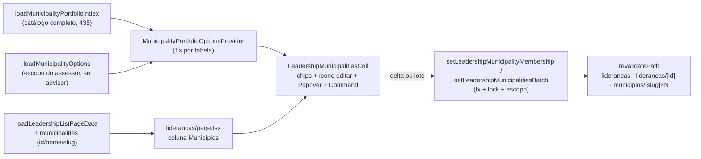

# Chips editáveis de municípios na lista de lideranças (paridade com Assessores)

Status: rascunho
Atualizado em: 2026-07-25
Item do roadmap: [docs/roadmap.md](../roadmap.md) (Trilha B, item **B34**)
Impeccable: B — encaixe na coluna "Municípios" de `/campanha/liderancas`; sem rota nova
Appetite: ~1–1,25 dia eng — promoção de lib/loader puros existentes, 1 componente de célula novo (Popover + Command), 2 server actions + schema, provider de catálogo; sem migration
Responsável: —

## ⚠️ Conflito com o pedido literal — leia antes de implementar

O pedido de produto pede um **botão de "modo de edição"** para a coluna inteira, espelhando o toggle "Editar" de `/campanha/assessores` (`AdvisorsTable`). No mesmo dia (2026-07-25), essa **mesma tabela** (`/campanha/liderancas`) já travou três vezes a decisão oposta: **B28** ("edição in-list adiada"), **B31** ("paridade é da coluna, não do modo... o toggle 'Editar' de tabela inteira... é o anti-goal literal do princípio 3 do `PRODUCT.md` já travado no B28") e **B32** ("sem depender do toggle 'Editar' de tabela inteira, anti-goal nomeado explicitamente no pedido e já travado no B28/B31"). Este plano **segue o precedente travado**, não o texto literal do pedido — ver "Decisões travadas" abaixo. Todas as demais funcionalidades pedidas (chips, navegação, remover, adicionar por digitação, território/ZE em lote) estão contempladas; só o **container** da edição muda de "modo de tabela" para "Popover por célula". _(proposto — validar com produto antes de implementar; se a mesa realmente quiser o toggle de tabela aqui, é a exceção que reabre B28/B31/B32 também.)_

## Design (Impeccable)

Âncoras: `PRODUCT.md` (princípio 3 **Edit where you see** com o anti-goal explícito "spreadsheet mode" / "always-mounted inputs on every row", princípio 4 **Auto-save, no Save button**, princípio 8 **Feel the action**) / `DESIGN.md` (register `product`, Field Desk) · tema `data-theme='campaign'` · precedentes vivos: [`MunicipalityListAdvisorsControl.tsx`](../../src/components/campaign/municipality/MunicipalityListAdvisorsControl.tsx) (Popover disparado pela célula, **B9 ✓**), [`combobox-assessores-lista-municipios.md`](combobox-assessores-lista-municipios.md) (**B27** — chips removíveis + `Command` dentro do Popover, gravação por delta sem "Salvar"), [`dobradinhas-lista-liderancas.md`](dobradinhas-lista-liderancas.md) (**B31** — mesma tabela, mesma decisão de container, delta com lock + `revalidatePath` + provider de catálogo uma vez por tabela), [`AdvisorMunicipalityCell.tsx`](../../src/components/campaign/advisor/AdvisorMunicipalityCell.tsx) / [`advisorMunicipalityPortfolio.ts`](../../src/lib/advisorMunicipalityPortfolio.ts) (**B19 ✓** — a lógica pura de agrupar território/ZE e buscar, que este item reaproveita sem portar a UI inteira).

Na implementação (`implement-roadmap-item`): craft compacto (Popover + `Command` já são peças do produto) → critique → polish.

Brief compacto:

- **Persona / contexto:** CG/Assessor dividindo carteira e corrigindo cobertura territorial das lideranças durante o onboarding, varrendo `/campanha/liderancas` — hoje só é possível ver o nome dos municípios (texto morto, sem link) e só é possível editar abrindo a ficha e usando o `RelationMultiSelect`.
- **Job principal:** ver, navegar e ajustar os municípios de uma liderança sem sair da lista, no mesmo gesto de digitar-e-adicionar já em produção em `/campanha/assessores` e `/campanha/municipios`.
- **Estratégia de cor:** Restrained — chips `Badge variant="secondary"`, chip de território com `MapPinIcon`, sem cor semântica nova.
- **Edit where you see:** sim — `canManageLeadership` já autoriza a escrita; a célula é hoje um readout morto do mesmo dado que o formulário completo edita.
- **Anti-goals:** modo "Editar" de tabela inteira (ver conflito acima); inputs montados em todas as linhas; "Salvar" no Popover; segundo design system de célula de relação (reaproveitar `Command`/`Popover`/`Badge`, não inventar).

## Dados → decisão → apresentação

- **Vou apresentar dados?** Sim, superfície já existente (`LeadershipRowViewModel.municipalityNames`, hoje texto puro) — este item troca a apresentação, não introduz agregação nova.
- **Decisões desbloqueadas:** CG/Assessor: "que municípios esta liderança cobre — e onde erro a carteira?" (hoje só se sabe abrindo a ficha, um clique por liderança, no meio da varredura de 25+ linhas); Assessor: "isso já está dentro do que eu administro?" (feedback imediato ao adicionar, o servidor recusa fora do escopo). Navegação cruzada: da liderança para a ficha do município (o inverso, `MunicipalityLeadershipsPanel`/dossiê **E16 ✓**, já existe).
- **Forma escolhida:** **tabela/lista** — chips nomeados com link, igual ao tratamento de Organizações/Dobradinhas da mesma tabela. **Rejeitado:** contagem ("3 municípios" — some o nome que decide a carteira); mapa (é vínculo nominal, não leitura territorial agregada — isso é papel do mapa em `/campanha`, não desta célula).
- **Profile:** categórico; granularidade `leadership` × `municipality`; tamanho típico 1–5 chips (piso 1, teto de schema 30); catálogo de 435; absoluto (o nome em si).
- **Anti-goals de dado:** sem métrica eleitoral na célula; sem ranking de lideranças por município.

Self-check dados: 5/5.

## Contexto

`/campanha/liderancas` ([`page.tsx`](<../../src/app/(campaign)/campanha/(app)/liderancas/page.tsx>)) lista lideranças com a coluna "Municípios" renderizando `row.municipalityNames.join(', ')` — texto puro, sem link, sem edição ([`leadershipData.ts:106-109`](../../src/utilities/leadershipData.ts)). A única forma de mudar os municípios de uma liderança hoje é abrir `/liderancas/[id]`, usar o `RelationMultiSelect` do [`LeadershipInternalForm`](../../src/components/campaign/leadership/LeadershipInternalForm.tsx) (substituição integral do array) e submeter.

`leadership.municipalities` é `hasMany`, `required: true`, `maxRows: MAX_LEADERSHIP_MUNICIPALITIES` (30) ([`src/lib/schemas/leadership.ts:38-46`](../../src/lib/schemas/leadership.ts)), com o hook `requireAtLeastOneMunicipality` ([`src/collections/Leadership.ts`](../../src/collections/Leadership.ts)) recusando qualquer update que zere o array — diferente do lado assessor↔município (**B19 ✓**), onde o vínculo é a reverse relationship `municipality.advisors` e pode ir a zero. `assertMunicipalitiesWithinScope` ([`actions/leadership.ts`](<../../src/app/(campaign)/campanha/actions/leadership.ts>)) já restringe assessores a municípios que administram, hoje aplicado ao array inteiro recebido por `createLeadershipRecord`/`updateLeadershipInternalRecord`.

Em `/campanha/assessores` (**B19 ✓**), a coluna "Municípios" resolve o padrão pedido — mas com o container que **B27/B28/B31/B32 já deixaram obsoleto para esta geração de listas**: [`AdvisorMunicipalityCell.tsx`](../../src/components/campaign/advisor/AdvisorMunicipalityCell.tsx) (~470 linhas) é uma célula sempre-visível com toggle de tabela inteira (`AdvisorsTable`) e um `ResizeObserver` para empacotar chips em 3 linhas antes de "Ver mais…". A lógica **pura** de agrupar município/território/ZE e buscar (`buildAdvisorPortfolioChips`/`searchAdvisorPortfolio`, [`advisorMunicipalityPortfolio.ts`](../../src/lib/advisorMunicipalityPortfolio.ts)) é boa e reaproveitável; a **UI** de célula não é o alvo certo para copiar aqui.

## Objetivos

- Coluna "Municípios" de `/campanha/liderancas` mostra **chips** (não mais texto plano); cada chip de município navega para `/campanha/municipios/[slug]`; chip de território (quando a liderança cobre o TI inteiro) mostra `MapPinIcon` e não navega.
- Um ícone de edição ao fim da célula abre um **Popover** com os chips já atribuídos (removíveis) sobre um combobox `Command` com busca acento-insensível por município, território de identidade ou zona eleitoral — adicionar/remover grava **na hora**, sem botão "Salvar".
- Adicionar/remover um **território ou ZE inteiro** de uma vez (lote), igual ao padrão de `/campanha/assessores` — paridade explicitamente pedida ("todas as outras funcionalidades").
- Nunca é possível zerar os municípios de uma liderança pela lista: o cliente desabilita a remoção do último município (ou do último território/ZE que cobriria o resto) e o servidor recusa com a mesma mensagem do formulário completo, como defesa em profundidade.
- Assessor só pode **adicionar** municípios/territórios/ZE que administra (mesma regra de `assertMunicipalitiesWithinScope`); as sugestões de busca já vêm restritas a esse escopo para não oferecer becos sem saída. Os chips já atribuídos (mesmo fora do escopo do assessor) continuam visíveis e agrupados corretamente contra o catálogo completo.
- Access idêntico ao já existente (`canManageLeadership` escreve, leitura já resolvida no loader); nenhuma migration, nenhuma collection, nenhum Consent novo, nenhuma mudança no contrato de URL da lista.

## Decisões travadas

- **Popover disparado por célula, não modo "Editar" de tabela inteira.** Ver o aviso de conflito no topo. É a mesma decisão travada três vezes na mesma tabela em 2026-07-25 (B28, B31, B32): o toggle de `AdvisorsTable` existe lá porque **todas** as colunas daquela tela são editáveis; aqui só uma coluna é. **Rejeitado:** toggle "Editar" de tabela inteira (pedido literal do usuário — anti-goal do princípio 3, reabriria B28/B31/B32); célula sempre em edição sem Popover (inputs montados em 25+ linhas).
- **Mutação por delta direto em `leadership.municipalities`** (ler o array atual do próprio documento, aplicar o toggle/lote, `payload.update`), nunca substituição do array inteiro via `updateLeadershipInternalRecord`. **Por quê:** aquele record valida o array **inteiro** contra o escopo do assessor — reenviá-lo quebraria qualquer liderança cujos municípios já ultrapassem o escopo de um assessor (criada pela coordenação, por outro assessor, ou herdada da remodelagem). A rota de delta valida só o(s) id(s) sendo **adicionado(s)**, espelhando `setAdvisorMunicipalityMembership`. **Rejeitado:** reenviar o array completo (quebra o caso cross-boundary); recalcular a validação para aceitar "o que já estava lá" (duplica lógica que o delta resolve de graça).
- **Lock único por liderança (`leadership-municipalities:{id}`), não por município tocado.** Ao contrário do B19 (o array mora no `municipality.advisors`, então cada delta trava o **município**), aqui o array mora no próprio `leadership`, então uma única trava por documento basta — mesmo padrão do B31 (`leadership-state-deputies:{id}`). **Rejeitado:** travar por município como no B19 (a escrita real é num único documento; travar N municípios para um lote de território seria lock desnecessário e mais chance de deadlock entre lotes concorrentes).
- **Piso de 1 respeitado em duas camadas:** cliente desabilita a remoção que zeraria o array (chip individual ou território/ZE cujo `municipalityIds` cobre o restante); servidor mantém `requireAtLeastOneMunicipality` como defesa em profundidade (a mesma mensagem "Vincule a liderança a pelo menos um município." já existe e passa pelo `mapCampaignFormActionError`). **Rejeitado:** só servidor (deixaria o clique de remover o único chip terminar em toast de erro para uma ação obviamente inválida).
- **Território/ZE em lote incluído** (não cortado) — reaproveita `searchAdvisorPortfolio`/`buildAdvisorPortfolioChips` sem custo extra de lib; o trabalho novo real é só a action de lote espelhando `setAdvisorMunicipalitiesBatch`. Pedido explícito do usuário ("todas as outras funcionalidades").
- **Promover a lógica pura para nomes neutros — `src/lib/advisorMunicipalityPortfolio.ts` → `src/lib/municipalityPortfolio.ts`, `loadAdvisorMunicipalityIndex` (`advisorData.ts`) → `loadMunicipalityPortfolioIndex` (`src/utilities/municipalityPortfolioIndex.ts`) — mas NÃO portar/generalizar a UI de `AdvisorMunicipalityCell`.** A lib e o índice não têm nada de específico de assessor (catálogo/busca de município), e o prefixo `advisor*` violaria a convenção de prefixo de domínio (`codebase-map.mdc`) assim que um 2º domínio consumir. A UI, porém, resolve um problema que este item não tem (medir quantos chips cabem em 3 linhas de uma célula sempre-visível) — construir um componente novo e mais simples (Popover + `Command`, sem `ResizeObserver`) é mais barato e mais alinhado ao container já decidido acima. **Rejeitado:** portar `AdvisorMunicipalityCell` inteiro para `shared/` (draft anterior deste plano) — a máquina de medição de layout não serve ao container em Popover, e extrair um "editor de chips" genérico a partir de um caso e meio (este + B27, se ainda não entregue) é prematuro (ver Rabbit holes/Adiado).
- **Sugestões de busca restritas ao escopo do assessor; chips já atribuídos agrupados pelo catálogo completo.** O agrupamento "cobre o TI inteiro" só é correto matematicamente com o catálogo completo; já as sugestões de **adição** devem ficar restritas ao escopo do assessor (mesma regra que `RelationMultiSelect` já aplica no formulário completo) — sugerir município fora do escopo é beco sem saída, o servidor vai recusar. **Rejeitado:** índice único sem escopo em toda parte (sugere o que não pode ser adicionado); índice único escopado em toda parte (quebra o agrupamento de território para a maioria dos visitantes desta lista, que são assessores).
- **Server action + `revalidatePath`, não endpoint JSON (diferente do B27, igual ao B31).** A lista de lideranças tem 25 linhas (não 435), e há dois derivados a jusante que ficariam obsoletos: o próprio detalhe `/campanha/liderancas/[id]` (mesma liderança) e o painel de lideranças do **município** tocado (`MunicipalityLeadershipsPanel`/dossiê **E16 ✓**, que lê `leadership.municipalities` pelo lado do município). Revalidar `/campanha/liderancas`, `/campanha/liderancas/[id]` e `/campanha/municipios/[slug]` de cada município tocado (add **e** remove) na mesma chamada. **Rejeitado:** endpoint JSON espelho do `expected-votes/` (barato aqui, mas deixaria o painel do município mentindo); só `router.refresh()` (não limpa a rota do município).
- **Catálogo entregue uma vez por tabela via provider cliente** (`MunicipalityPortfolioOptionsProvider`, mesmo padrão do `MunicipalityEstimateScenarioContext` e do provider de dobradinhas do B31): `{ index: catálogo completo (435), addableIds: Set<number> | null (restrição do assessor) }`. **Rejeitado:** props por célula (multiplicaria o payload por linha); buscar o catálogo no cliente a cada tecla (é estático, 435 entradas cabem no cliente).
- **Ícone de edição como alvo de clique separado dos chips, não a célula inteira.** Os chips de município são `Link`s de navegação; um `<button>` (Popover trigger) não pode conter outro elemento interativo (`<a>`) sem quebrar semântica/acessibilidade, e usar a célula inteira como trigger criaria ambiguidade entre "clicou no chip = navegar" e "clicou no fundo = editar". Um ícone (lápis/`+`) ao fim da linha de chips é o alvo de clique inequívoco. **Rejeitado:** célula inteira como `PopoverTrigger` (conflito de hit-target com os chips-link); chip clicável só em modo edição via toggle (reabre o container rejeitado acima).
- **i18n e naming** (AGENTS.md): identificadores em inglês (`LeadershipMunicipalitiesCell`, `MunicipalityPortfolioOptionsProvider`, `setLeadershipMunicipalityMembership`, `setLeadershipMunicipalitiesBatch`, `nextMunicipalityIdsAfterLeadershipMembership`), strings visíveis em pt-BR ("Editar municípios", "Buscar município, território ou ZE…", "Remover Salvador", "Vincule a liderança a pelo menos um município.").

## Questões em aberto

- **Toggle de tabela (pedido literal) vs Popover por célula (precedente travado).** Já registrado como conflito no topo — **Recomendação: Popover**, por consistência com B28/B31/B32 na mesma tabela no mesmo dia. _(proposto — validar com produto antes de codar; é a decisão mais cara de reverter deste plano.)_
- **"Ver mais…" quando há muitos chips?** **Opções:** A) não — `whitespace-normal` deixa a célula crescer, sem medição por `ResizeObserver` | B) portar a medição do `AdvisorMunicipalityCell`. **Recomendação:** **A** — sem evidência de liderança com carteira grande hoje (teto de schema é 30, mas o uso real é de poucos municípios por pessoa); a medição é a parte mais cara do componente de origem e não se paga sem evidência. Registrado em Adiado com gatilho.
- **Ícone do trigger de edição.** **Opções:** A) `PencilIcon` pequeno, `aria-label="Editar municípios"` | B) reaproveitar o mesmo affordance visual do `MunicipalityListAdvisorsControl` (hover na célula muda o cursor, sem ícone visível). **Recomendação:** **A** — os chips já são links visualmente distintos; um ícone explícito evita que o alvo de edição fique invisível numa célula que mistura navegação e edição. _(assumido)_

## Abordagem proposta

Componentes:

- **`src/lib/municipalityPortfolio.ts`** (renomeado de `advisorMunicipalityPortfolio.ts`): mesma lógica pura, tipos/funções neutros (`MunicipalityPortfolioIndexEntry`, `MunicipalityPortfolioChip`, `MunicipalityPortfolioSearchHit`, `buildMunicipalityPortfolioChips`, `searchMunicipalityPortfolio`); `AdvisorMunicipalityCell.tsx` passa a importar daqui (import mecânico, comportamento intacto). `tests/unit/advisorMunicipalityPortfolio.unit.spec.ts` → `tests/unit/municipalityPortfolio.unit.spec.ts`.
- **`src/utilities/municipalityPortfolioIndex.ts`** (novo, `server-only`): `loadMunicipalityPortfolioIndex(payload)`, corpo movido de `loadAdvisorMunicipalityIndex` (bypass admin intencional, dado de referência só-leitura); `advisorData.ts` e `assessores/page.tsx` passam a importar daqui.
- **`src/components/campaign/leadership/MunicipalityPortfolioOptionsProvider.tsx`** (novo, cliente): contexto com `{ index, addableIds }`, montado uma vez em volta do `CampaignTable` de `/campanha/liderancas`.
- **`src/components/campaign/leadership/LeadershipMunicipalitiesCell.tsx`** (novo, cliente): chips de leitura (`Badge` + `Link` para município; `Badge` + `MapPinIcon` para território completo, via `buildMunicipalityPortfolioChips` contra o índice completo do provider) + ícone de edição (`PopoverTrigger`); `PopoverContent` com chips removíveis (mesmo componente de chip, agora com "×") sobre `Command` (`shouldFilter={false}`, itens de `searchMunicipalityPortfolio` contra `addableIds`-restrito quando ator é assessor); estado otimista local (`useState`/`useTransition`, sem `ResizeObserver`); `disabled` no botão de remover quando removeria o último município; `toast.error` + reversão em falha.
- **`src/lib/schemas/leadership.ts`**: `leadershipMunicipalityMembershipSchema` (`leadershipId`, `municipalityId`, `assigned: z.boolean()`) e `leadershipMunicipalitiesBatchSchema` (`leadershipId`, `municipalityIds: z.array(positiveRelationshipId).min(1).max(MAX_LEADERSHIP_MUNICIPALITIES)`, `assigned`), espelhando os schemas de assessor (`src/lib/schemas/advisor.ts`).
- **`src/app/(campaign)/campanha/actions/leadership.ts`** (acréscimos): `nextMunicipalityIdsAfterLeadershipMembership` (helper puro — `null` se não muda nada, lança a mensagem do piso de 1 se o próximo array ficaria vazio, lança a mensagem do teto de 30 se estourasse); `setLeadershipMunicipalityMembershipRecord`/`setLeadershipMunicipalityMembership` e a variante em lote, cada uma em `withPayloadTransaction` + `getFreshStaffActor` + `acquireTextAdvisoryLocks(['leadership-municipalities:{id}'])` + `assertMunicipalitiesWithinScope` só nos ids **adicionados** + leitura/escrita do próprio doc com `user`/`overrideAccess: false` + `revalidatePath` das rotas listadas acima (slugs dos municípios lidos na mesma transação).
- **`src/app/(campaign)/campanha/(app)/liderancas/formActions.ts`** (novo arquivo na rota da lista, precedente: `[id]/formActions.ts`/`nova/formActions.ts`): casca sobre `runCampaignFormAction`.
- **`src/utilities/leadershipData.ts`**: `LeadershipRowViewModel.municipalities: { id: number; name: string; slug: string }[]` substitui `municipalityNames` (estender o `select` de `namesForIds` para trazer `slug`, ou reusar `loadMunicipalityPortfolioIndex` filtrado pelos ids do lote — decidir no craft pelo menor número de queries); consumidores de `municipalityNames` (nenhum fora desta página, a confirmar por `git grep`) acompanham o rename.
- **`src/app/(campaign)/campanha/(app)/liderancas/page.tsx`**: `Promise.all` carrega `loadMunicipalityPortfolioIndex(payload)` e, só se `user.role === 'advisor'`, `loadMunicipalityOptions(payload, user)`; envolve `<CampaignTable/>` em `<MunicipalityPortfolioOptionsProvider>`; a coluna `municipalities` troca o texto por `<LeadershipMunicipalitiesCell leadershipId={row.id} municipalities={row.municipalities} />`.
- **Testes:** unit de `nextMunicipalityIdsAfterLeadershipMembership` (add/remove/no-op/piso 1/teto 30) e da lib renomeada (cobertura já existente, só imports); int das duas actions — assessor fora do escopo é recusado ao adicionar, assessor no escopo grava, remover o único município é recusado (mensagem do hook), teto de 30 respeitado, delta concorrente serializado pelo lock; e2e opcional (abrir Popover, digitar, ver chip sem "Salvar").
- **Migration:** nenhuma.

Depth check: reusa `Popover`/`Command`/`Badge` do kit, `CampaignTable`, `wordStartFilter` (via `matchesAtWordStart` já em `municipalityPortfolio.ts`), `withPayloadTransaction`, `acquireTextAdvisoryLocks`, `runCampaignFormAction`, `loadMunicipalityOptions`, `campaignAccess`. Não constrói `useAutosave`/`EditableCell`/multi-select genérico novo.

## Dependências

- **Nenhuma dura.** Soft: **B19 ✓** (origem da lib pura e do cálculo de próximo array a espelhar), **B27** (mesma peça de célula — Popover + `Command` + delta; quem entrar depois herda o padrão do primeiro), **B31** (mesma tabela e mesma decisão de container — extração de um editor de chips genérico só no 3º call site real; se B31 e este chegarem antes de qualquer extração, os dois contam como os dois primeiros call sites, não gatilho ainda), **B28/B29/B30/B32** (mesma tabela — colunas/ordem/ação de linha), **B17** (a tabela cresce; seletor de colunas fica mais valioso), **E16 ✓** (o painel de lideranças do município que este item revalida).
- Reusa sem alterar: `assertMunicipalitiesWithinScope`, `getFreshStaffActor`, `withPayloadTransaction`, `acquireTextAdvisoryLocks`, `canManageLeadership` (`src/utilities/access/leaderships.ts`), `loadMunicipalityOptions` (`src/utilities/campaignRelationOptions.ts`), `runCampaignFormAction`.

## Não escopo

- Mesmo padrão de chips editáveis nas colunas "Organizações" e "Dobradinhas" de Lideranças — a de Dobradinhas é o **B31** (item próprio, mesma tabela); Organizações fica para pedido futuro.
- Endpoint JSON dedicado (padrão do **B27**) — a lista de lideranças não tem a escala dos 435 municípios fixos; `revalidatePath` via server action basta (ver Decisões travadas).
- Corrigir o comportamento pré-existente de `updateLeadershipInternalRecord`/`RelationMultiSelect` (valida o array inteiro contra o escopo do assessor, mesmo para municípios que já estavam lá antes de qualquer assessor existir) — bug não relacionado, fora do pedido.
- Criação inline de liderança na própria lista (draft row) — `/liderancas/nova` continua página própria.
- "Ver mais…" / colapso de chips por medição de layout — ver Adiado com gatilho.

## Rabbit holes

- **Generalizar demais o editor de chips agora.** Extrair um `RelationshipChipEditor` agnóstico de coluna a partir de um caso e meio (este + B31, se ainda não entregue) produz parâmetros genéricos sem um 3º call site real para validar a forma. **Mitigação:** construir a célula do domínio (`LeadershipMunicipalitiesCell`); extração só sob o gatilho abaixo.
- **"Aproveitar e consertar" o bug de escopo do formulário completo** já que o arquivo `actions/leadership.ts` está aberto. **Mitigação:** só acrescentar funções novas e aditivas; não tocar no fluxo de formulário completo.
- **Portar a máquina de `ResizeObserver` do `AdvisorMunicipalityCell`** "já que existe". Ela resolve um problema (empacotar 3 linhas numa célula sempre-visível) que este item não tem, porque o container é um Popover. **Mitigação:** decisão travada acima; revisitar só com evidência de overflow real.
- **Renomeação (`advisorMunicipalityPortfolio` → `municipalityPortfolio`) vazar para mais lugares do que o esperado.** **Mitigação:** confirmar com `git grep -w` antes de apagar o arquivo antigo; cobrir com os testes existentes de Assessores (unit + `campaignAdvisorManagement.int.spec.ts`) antes de escrever código novo de Lideranças.

## Adiado com gatilho

- **"Ver mais…" / colapso de chips por medição (`ResizeObserver`).** Revisitar quando aparecer liderança com carteira grande o suficiente para a célula ficar visualmente pesada na lista (sem evidência hoje).
- **`RelationshipChipEditor` agnóstico de relação (Municípios/Dobradinhas/Organizações num único primitivo).** Revisitar quando existir o 3º call site real depois deste item e do B31.
- **Migrar para o padrão de endpoint JSON do B27.** Revisitar só se a base de lideranças crescer a ponto de `revalidatePath` por clique ficar perceptivelmente lento (sem evidência hoje — ao contrário dos 435 municípios fixos).

## Referências

- `docs/roadmap.md` (Trilha B, item **B34**; grafo; Janela 1–2)
- [`liderancas/page.tsx`](<../../src/app/(campaign)/campanha/(app)/liderancas/page.tsx>), [`leadershipData.ts`](../../src/utilities/leadershipData.ts) — superfície e view model a estender
- [`MunicipalityListAdvisorsControl.tsx`](../../src/components/campaign/municipality/MunicipalityListAdvisorsControl.tsx) — Popover disparado pela célula (**B9 ✓**)
- [`combobox-assessores-lista-municipios.md`](combobox-assessores-lista-municipios.md) (**B27**) — chips + `Command` + delta sem "Salvar", contrato a espelhar
- [`dobradinhas-lista-liderancas.md`](dobradinhas-lista-liderancas.md) (**B31**) — mesma tabela, mesma decisão de container/lock/`revalidatePath`/provider
- [`AdvisorMunicipalityCell.tsx`](../../src/components/campaign/advisor/AdvisorMunicipalityCell.tsx) / [`advisorMunicipalityPortfolio.ts`](../../src/lib/advisorMunicipalityPortfolio.ts) / [`advisorData.ts`](../../src/utilities/advisorData.ts) — lógica pura e índice a promover
- [`actions/advisor.ts`](<../../src/app/(campaign)/campanha/actions/advisor.ts>) (`nextAdvisorIdsAfterMembership`, `setAdvisorMunicipalityMembershipRecord`, `setAdvisorMunicipalitiesBatchRecord`) — espelho direto das novas actions
- [`actions/leadership.ts`](<../../src/app/(campaign)/campanha/actions/leadership.ts>), [`src/lib/schemas/leadership.ts`](../../src/lib/schemas/leadership.ts), [`src/collections/Leadership.ts`](../../src/collections/Leadership.ts) (hook `requireAtLeastOneMunicipality`, `MAX_LEADERSHIP_MUNICIPALITIES`)
- [`src/utilities/access/leaderships.ts`](../../src/utilities/access/leaderships.ts) (`canManageLeadership`)
- [`campaignRelationOptions.ts`](../../src/utilities/campaignRelationOptions.ts) (`loadMunicipalityOptions`) — escopo do assessor para sugestões
- [`MunicipalityEstimateScenarioContext.tsx`](../../src/components/campaign/municipality/MunicipalityEstimateScenarioContext.tsx) — precedente de provider cliente escopado
- `tests/int/campaignLeadershipActions.int.spec.ts`, `tests/int/campaignAdvisorManagement.int.spec.ts`, `tests/unit/advisorMunicipalityPortfolio.unit.spec.ts`, `tests/helpers/campaignFixtures.ts`
- AGENTS.md — Campaign Municípios model, Transaction Safety, naming inglês/copy pt-BR
- `.cursor/rules/campanha-edit-where-you-see.mdc`, `.cursor/rules/campanha-action-feedback.mdc`
