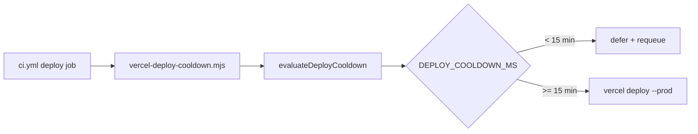

# Impl: CI — cooldown de deploy de produção: 30 → 15 min

Status: aprovado
Atualizado em: 2026-08-02
Issue: #259
Intenção: docs/plans/ci-deploy-cooldown-15min.md
Appetite restante: herdado (~0,25 dia) — só constante + pins

## Leitura da intenção

- **Outcome:** intervalo mínimo entre deploys READY de produção passa de 30 para **15 minutos**; deferral + requeue inalterados; logs/pins honestos.
- **O que NÃO negociar:** não remover cooldown; não mudar fonte da idade (Vercel READY production); não tocar `ci-pr.yml` / required checks / preview Git.
- **O que reavaliar:** hipótese do plano de intenção confirma — dono é `DEPLOY_COOLDOWN_MS` em `scripts/lib/vercel-deploy-cooldown.mjs`; CLI já deriva minutos do constante.

## Abordagem recomendada

**Opções consideradas:**

- **A)** Alterar só `DEPLOY_COOLDOWN_MS` + pins — mínimo diff, CLI auto-ajusta log.
- **B)** Parametrizar via env `DEPLOY_COOLDOWN_MINUTES` no workflow — flexível, mas YAGNI e duplica fonte da verdade.
- **C)** Documentar 15 min só no workflow, constante 30 no script — mente nos testes.

**Recomendação:** **A** — uma constante nomeada já é o contrato OPS11; workflow só precisa do echo humano.

**Rejeitadas:** B (over-engineering); C (pins mentirosos).

### Componentes / mudanças

- **`DEPLOY_COOLDOWN_MS`** (`scripts/lib/vercel-deploy-cooldown.mjs`): `30 * 60 * 1000` → `15 * 60 * 1000`.
- **`.github/workflows/ci.yml`**: echo de deferral "30 minutes" → "15 minutes".
- **`tests/unit/vercelDeployCooldown.unit.spec.ts`**: pin da constante + descrições; ajustar `waitSeconds` no caso 10 min atrás (20 min → 5 min residual).
- **Migration:** sem migration.
- **Access / Consent:** N/A.
- **UI:** N/A (Impeccable A).

### Dados → forma

N/A — política de infra.

## Fases verificáveis

1. **Constante + workflow log** — alterar `DEPLOY_COOLDOWN_MS` e echo em `ci.yml`.
2. **Pins unitários** — atualizar `vercelDeployCooldown.unit.spec.ts`.
3. **Gates** — `pnpm gate:fast`; entrega com `pnpm push`.

## Rabbit holes / Não escopo (engenharia)

- Reescrever `docs/plans/ci-deploy-cooldown-vercel.md` (histórico OPS11).
- Parametrizar cooldown por env sem pedido de produto.
- Batch de merges / teto diário de deploys.

## Riscos e mitigação

- **429 `api-upload-free` volta:** observar pós-merge; reabrir com evidência (assumido na intenção).
- **Echo hardcoded no workflow:** aceito — único lugar; constante é fonte da verdade para lógica.

## Aceite de engenharia

- [x] Aceite de produto da intenção ainda coberto
- [x] Invariantes AGENTS/engineering-standards
- [x] Testes de domínio previstos (unit pins existentes)
