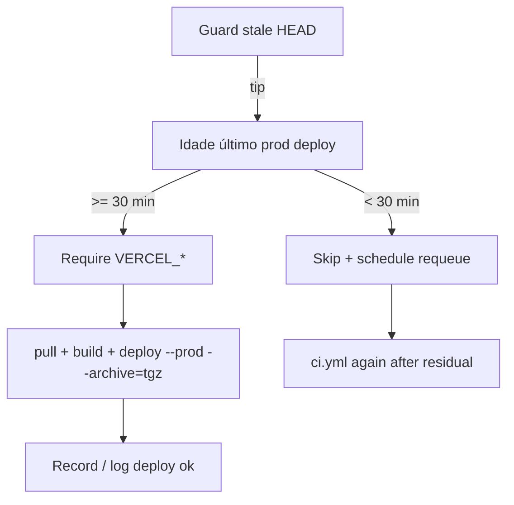

# CI — cooldown mínimo de 30 min entre deploys de produção (Vercel)

Status: rascunho
Atualizado em: 2026-08-01
Issue: —
Priority: P0
Model: composer-2.5
Impeccable: A — N/A (sem superfície UI)
Appetite: ~0,5–1d eng; 1 job step em `ci.yml` + retry/requeue; sem migration
Responsável: —

## Dados → decisão → apresentação

Dados: N/A — gate de infra/CI; sem KPI de produto.

## Contexto

O verificador `ci.yml` (push em `main`) sobe produção com `vercel deploy --prebuilt --prod`. No plano Hobby/Free da Vercel o upload da CLI estoura o teto diário (`api-upload-free`, “Too many requests — try again in 24 hours / more than 5000”). Em 2026-08-01 vários merges em sequência (incl. **B92–B94**) passaram nos checks e **falharam no job `deploy`** — o código ficou em `main` sem ir a produção.

Já existe um “stale HEAD” guard (só o tip de `main` faz deploy) + `requeue` se `main` avançou. **Não** há intervalo mínimo entre deploys bem-sucedidos: cada merge verde dispara upload completo.

Pedido de produto (2026-08-01): **mínimo 30 minutos** entre um deploy e o próximo; antes de continuar, o job verifica a idade do último deploy.

**Consequência imediata (não é bug de UI):** o empty/suggest do wizard de município (**B92–B94**, Issues #92–#94, merged) **não está em produção** porque o deploy falhou por rate limit — não porque o idle esteja “quebrado” no código de `main`.

## Objetivos

- Antes de `vercel pull`/`build`/`deploy --prod`, consultar o **último deployment de produção** do projeto e, se a idade for **&lt; 30 min**, **não** fazer upload agora.
- Em skip por cooldown: sair com sucesso “adiado” (não vermelho falso) e **reagendar** o workflow (mesmo espírito do `requeue` atual) para rodar depois do restante do intervalo — assim o tip de `main` ainda chega a produção sem depender de humano.
- Opcional barato no mesmo PR: passar `--archive=tgz` no `vercel deploy` (a própria CLI sugere) para reduzir pressão de upload — **não** substitui o cooldown.
- Guardrails: sem migration; secrets `VERCEL_*` já usados; não tocar `ci-pr.yml` (sem deploy); Vercel preview Git continua ignorado (`vercel-ignore-build.sh`).

## Decisões travadas

- **Fonte da idade = último production deployment do projeto Vercel (API/`vercel ls`/`vercel inspect`), não o last successful `ci.yml` run.** Motivo: o teto é da conta Vercel; um deploy manual/CLI fora do Actions também conta. **Rejeitado:** só olhar `gh run list --workflow=ci.yml` (ignora deploys fora do GHA); sleep fixo de 30 min em todo run (desperdício quando já passou).
- **Cooldown = 30 min (constante nomeada no workflow/script).** Fonte: pedido 2026-08-01. **Rejeitado:** 1 h (atrasa demais o tip); só backoff após 429 (já estouramos o dia — tarde demais).
- **Skip por cooldown ≠ failure.** Job `deploy` marca “adiado”, `requeue`/dispatch agenda novo `ci.yml` com delay (ou workflow auxiliar `workflow_dispatch` + `wait`). **Rejeitado:** `exit 1` (alarme falso; agentes/CI “dono do PR” interpretam vermelho); skip silencioso sem requeue (main fica sem deploy até o próximo merge).
- **Stale HEAD continua primeiro.** Ordem: tip check → cooldown check → credentials → pull/build/deploy. **Rejeitado:** cooldown antes do tip (adiaria deploy que já seria skipado).
- **i18n:** ids em inglês (`DEPLOY_COOLDOWN_MS`, `lastProductionDeployAt`); logs pt-BR ou EN ok no Actions.

## Questões em aberto

- **Como obter o timestamp do último prod deploy?** **Opções:** A) `vercel ls <project> --prod` / API REST deployments filtrando `target=production` + `ready` | B) gravar timestamp em Actions cache/artifact após deploy OK | C) GitHub Deployment API. **Recomendação:** **A** — fonte de verdade Vercel; B desincroniza se houver deploy fora do CI. _(assumido)_
- **Delay do requeue: `gh workflow run` imediato + step `sleep` residual, ou cron/`repository_dispatch`?** **Opções:** A sleep no mesmo job até completar 30 min (bloqueia runner) | B dispatch com `sleep` curto só do residual num job leve | C Actions `schedule` a cada 15 min checando tip≠prod. **Recomendação:** **B** — job leve espera o residual (cap ~30 min) e re-dispara `ci.yml`; A gasta minutos caros no job de build. _(assumido — validar custo de runner)_

## Abordagem proposta

Componentes:

- **`.github/workflows/ci.yml` (job `deploy`)**: step `Check deploy cooldown` após tip; output `cooldown=true|false` + `wait_seconds`; condicionar steps de build/deploy; estender `requeue` (ou step irmão) para “main tip sem deploy recente / cooldown”.
- **Script pequeno** (`scripts/vercel-deploy-cooldown.mjs` ou shell no step): chama API Vercel com `VERCEL_TOKEN` + `VERCEL_PROJECT_ID`; devolve idade; constante `DEPLOY_COOLDOWN_MS = 30 * 60 * 1000`.
- **`vercel deploy --prebuilt --prod --archive=tgz`**: redução de arquivos no upload (hint da CLI no erro 2026-08-01).
- **Verificação pós-entrega:** após um deploy OK, smoke do idle do wizard (`mode: wizard-municipality-suggest`) em produção — confirma que B92–B94 saíram do limbo.
- **Migration:** Sem migration, sem collection, sem server action de app.

## Dependências

- Nenhuma Issue de produto. Soft: entendimento do `requeue` atual em `ci.yml`; secrets Vercel já no repo.
- Desbloqueia visualização em prod de tudo que está em `main` sem deploy (incl. B92–B94).

## Não escopo

- Upgrade de plano Vercel / mudança de limites da conta.
- Deploy de preview por branch (já skipado).
- Mudar gate de merge (`checks` / `migration-lock`).
- Refatorar o orquestrador do agent-pool para “batch merges” (adiado).
- Bugfix de UI do empty state — causa raiz = undeployed; se após deploy OK o idle ainda falhar, abrir Issue B nova com evidência.

## Rabbit holes

- **“Já que toco deploy, migro para OIDC / Vercel Git / multi-env.”** Explode appetite. **Mitigação:** só cooldown + archive + requeue.
- **State machine de fila de deploys no Postgres.** **Mitigação:** workflow + API Vercel bastam.
- **Deduplicar builds com cache Vercel remoto exótico.** **Mitigação:** fora; `--prebuilt` já isola build→upload.

## Adiado com gatilho

- **Batch de merges → um deploy.** Revisitar se, com cooldown de 30 min, o tip ainda atrasar &gt;1 h sob carga do pool **e** produto aceitar “deploy só a cada N merges”.
- **`--archive=tgz` sozinho sem cooldown.** Se o teto 5000/dia continuar após archive, o cooldown permanece necessário.

## Referências

- `.github/workflows/ci.yml` — jobs `deploy` / `requeue`, tip guard
- Erro observado 2026-08-01: `Too many requests … code: "api-upload-free"` no merge de B94 (#100)
- Issues B92–B94 (#92–#94) — código em `main`, deploy falhou
- `scripts/vercel-ignore-build.sh` — previews Git off
- `docs/AGENT-OPS.md` — entrega = merge em `main`; deploy gated por `ci.yml`
- AGENTS.md — região `gru1`; deploy via Actions

Qualidade de decisão: 5/5
