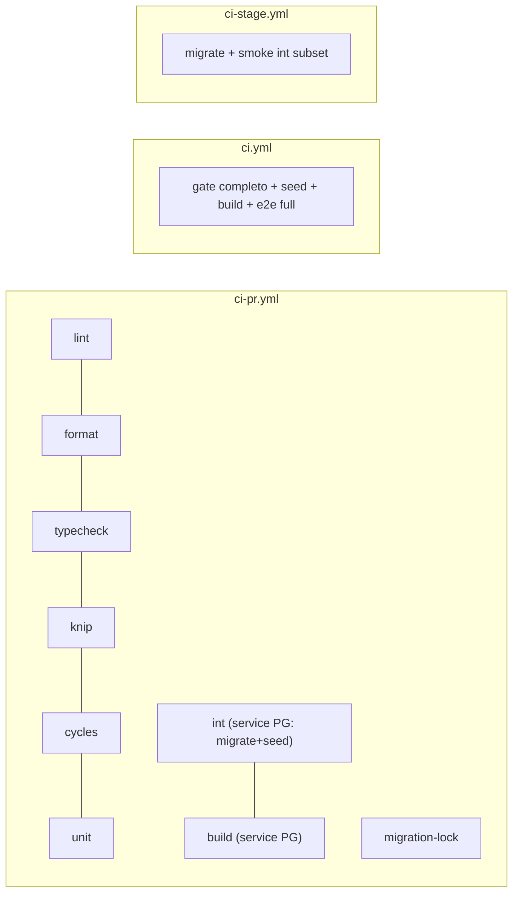

# CI paralela no PR — quebrar o job único do ci-pr em jobs com needs reais

Status: entregue (2026-07-30 — executado em sessão única, fora do fluxo agent:register, a pedido do humano)
Atualizado em: 2026-07-30
Issue: —
Priority: P1
Model: composer-2.5
Impeccable: A — N/A (sem superfície UI)
Appetite: ~1 dia eng; 1 workflow reescrito + matriz documentada em AGENT-OPS
Responsável: —

## Dados → decisão → apresentação

Dados: N/A — infra de CI. A métrica de sucesso é wall-clock do workflow (ver critérios de aceite), lida no próprio GitHub Actions.

## Contexto

`.github/workflows/ci-pr.yml` roda **tudo em série num único job `checks`**: lint → format → tsc → knip → madge → unit → migrate → seed → int → build (último run do PR #50: 9m37s até falhar no int — e a falha só aparece no minuto ~9, depois de todos os gates baratos passarem). Cada falha de lint custa um ciclo completo de feedback. `.github/workflows/ci.yml` (main) replica o mesmo job único sem `seed:minimal`, sem `build` e sem e2e; `ci-stage.yml` roda só `migrate` + smoke int contra Neon (subset curado — a suíte completa estourou 30 min duas vezes em 2026-07-30 por latência, comentário no próprio workflow).

Decisão de produto (2026-07-30, brief do lote CI): jobs paralelizáveis com `needs` só onde há dependência real; push em `stage` e `main` roda suíte **completa** como rede de segurança.

## Objetivos

- `ci-pr.yml` vira N jobs paralelos; feedback de lint/format/typecheck em < ~3 min.
- Dependências reais explícitas: só `int` e `build` precisam do Postgres service; `build` pode `needs: [int]` (ou rodar contra o próprio service — decidir na implementação por tempo medido).
- Matriz **PR vs push stage vs push main** documentada em `docs/AGENT-OPS.md` (tabela "CI por alvo").
- Invariantes preservados: `pnpm build` nunca perto de `STAGE_DATABASE_URL`; comandos bare; `migration-lock` intacto (com o fix de checkout do OPS3).

## Decisões travadas

- **Stage continua smoke (migrate + subset curado), não suíte completa.** A suíte int completa contra Neon remoto estourou o timeout duas vezes (registrado no comentário de `ci-stage.yml:22-30`); a rede de segurança completa fica no ci-pr (DB mínimo) e no ci.yml (main). **Rejeitado:** full int no stage (latência ~120 ms/query — inviável, já medido); dropar o smoke do stage (é a única verificação contra snapshot real de prod).
- **`ci.yml` (main) ganha `db:seed:minimal` + `build` + int completo, espelhando o ci-pr.** Hoje main não roda seed/build/e2e; como o promote PR já passou no ci-pr, o ci.yml é rede de segurança contra drift de merge — barato (service DB local). **Rejeitado:** manter main minimal (a tensão do brief fica sem resolução); build contra qualquer URL remota (proibido).
- **E2E entra no ci-pr como job afetado por manifesto (OPS5), bloqueante; stage não roda e2e; main roda full e2e.** Detalhes e fallback no plano OPS5. **Rejeitado:** e2e fora do caminho crítico para sempre (o "fora do caminho crítico" do AGENT-OPS era placeholder "nightly/label futura" — este lote é a futura); full e2e em todo PR (custo de boot do dev server por PR sem relação com o diff).
- **Uma estrutura de jobs compartilhada via YAML anchors/reusable steps, sem reusable-workflow separado.** **Rejeitado:** extrair `.github/workflows/_reusable.yml` (cerimônia para 2 consumidores; revisitado quando o 3º workflow precisar da mesma cadeia).

## Questões em aberto

- **`build` precisa de `needs: [int]`?** **Opções:** A) build paralelo ao int (cada um com seu service Postgres) | B) build só após int verde. **Recomendação:** A — build não depende do resultado do int; paralelo corta o caminho crítico. Se medir contenção de runner, cair para B é mudança de uma linha.
- **Cache de pnpm/Next entre jobs.** **Opções:** A) cada job instala (cache pnpm já existe) | B) artefato de `node_modules` compartilhado. **Recomendação:** A — upload/download de artefato costuma perder para o cache pnpm; medir no primeiro run.

## Abordagem proposta

Componentes:

- **`.github/workflows/ci-pr.yml`** — quebrar `checks` em jobs: `lint`, `format`, `typecheck`, `knip`, `cycles`, `unit` (sem service), `int` (com service Postgres 17 + migrate + seed:minimal), `build` (com service), `migration-lock` (inalterado salvo fix OPS3). Sem `needs` entre os baratos.
- **`.github/workflows/ci.yml`** — adicionar steps `db:seed:minimal` e `build`; preparar para receber e2e full (OPS5).
- **`docs/AGENT-OPS.md`** — atualizar tabela "CI por alvo" com a matriz final (incl. e2e por alvo) e o tempo-alvo de feedback.
- Sem migration, sem código de app.

## Dependências

- **OPS3** (migration-lock funcionando) — dura, senão o CI fica vermelho por infra no PR desta entrega.
- OPS5 (affected tests) depende desta — a seleção vira flags nos jobs `int`/`e2e` aqui criados.

## Não escopo

- Manifesto e2e / `--changed` do vitest → OPS5.
- Hooks locais (`gate:fast`/`gate:push`) → OPS6. Docs de política de agente → OPS7.
- Nightly e2e full agendado → Adiado (abaixo).

## Rabbit holes

- **Reusable workflows / composite actions.** Cerimônia YAML sem 3º consumidor. **Mitigação:** decisão travada acima; gatilho de revisitação registrado.
- **Shard da suíte int em N workers.** O gargalo medido é serialização, não CPU de um job; sharding adiciona setup de DB por shard. **Mitigação:** adiado com gatilho (int > 15 min no job único por 2 semanas).

## Adiado com gatilho

- **Nightly e2e full + shard de int.** Revisitar quando: job `int` > 15 min sustentado ou e2e full no ci.yml > 25 min.

## Referências

- `.github/workflows/ci-pr.yml` (job único atual), `ci.yml`, `ci-stage.yml` (comentário do subset)
- `docs/AGENT-OPS.md` — tabela "CI por alvo" e "Contrato de PR"
- AGENTS.md / `.cursor/rules/engineering-standards.mdc` — gate em duas velocidades, comandos bare
- Run 30558184687 — baseline de wall-clock (9m37s serial até a falha)
