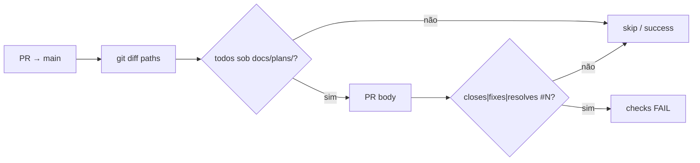

# CI — proibir `Closes`/`Fixes` em PR só `docs/plans`

Status: registrado
Atualizado em: 2026-08-01
Issue: #116 (OPS12)
Priority: P1
Model: composer-2.5
Impeccable: A — N/A (sem superfície UI; CI + skill)
Appetite: ~0,5 dia eng; script puro + job em `ci-pr.yml` + unit + 2 linhas de skill; sem migration
Responsável: —

## Dados → decisão → apresentação

Dados: N/A — política de PR/CI; sem métrica de produto.

## Contexto

Incidente (2026-08-01, PR [#115](https://github.com/fsolla/teqo/pull/115) / Issue [#114](https://github.com/fsolla/teqo/issues/114) B100): o agente de `plan-issue` abriu PR que **só** adicionava `docs/plans/bottom-drawer-peek-acoes-busca.md`, mas o body trazia `Closes #114`. O merge fechou a Issue de **implementação** via keyword nativa do GitHub (+ `issue-done-on-main-merge.yml` flipou `done`/`in-prod`). A Issue teve de ser reaberta à mão.

Causa: o contrato `Closes #N` em `agent-pr-workflow` / `work-issue` foi aplicado a um PR de **registro de plano**, onde o entregável não é a feature. Não há guarda programática hoje.

Pedido (2026-08-01): checagem que **proíba ou limpe** keywords de fechamento quando o diff do PR toca **apenas** `docs/plans/`.

## Objetivos

- Em `pull_request` → `main`: se **todos** os arquivos mudados (vs base) estão sob `docs/plans/`, o body do PR **não** pode conter keyword de fechamento do GitHub (`closes`/`fixes`/`resolves` + `#N`, case-insensitive).
- Violação → job CI **falha** com mensagem acionável (`Related #N` / tire o `Closes`; implementação = outro PR).
- O job entra no rollup **`checks`** de `ci-pr.yml` (mesmo gate que bloqueia auto-merge).
- Lógica pura testável em unit (lista de paths + body → ok|erro).
- `plan-issue` Passo 6 + nota em `agent-pr-workflow` / template: PR só-plano **nunca** usa `Closes #N`.
- Guardrails: sem migration; permissões CI mínimas (`pull-requests: read` basta se só falhar).
- **Tracer bullet:** unit com fixture do incidente (#115 body + `['docs/plans/….md']` → fail) → job no `checks` → merge.

## Decisões travadas

- **Proibir (fail CI), não auto-limpar o body.** Opções: A) fail | B) bot edita o body e remove keywords | C) A+B. **Recomendação: A.** Auto-merge arma na criação do PR; um job que só edita o body **corre** com o merge (keyword ainda presente no instante do merge → Issue fecha). Fail no rollup `checks` **impede** o merge até o body estar limpo. **Rejeitado:** B sozinho (race); C como v1 (complexidade + token write sem ganho se A já bloqueia).
- **Escopo de paths = só `docs/plans/**`.** Se o PR também mexe skill/CI/código, `Closes`continua legítimo (ex. guardrail que fecha`agent-miss`). **Rejeitado:** banir `Closes`em qualquer PR que *inclua* plans (quebra work-issue que atualiza plano + código); banir em todo`docs/\*\*` (PRs de AGENT-OPS/CHANGELOG às vezes fecham chores).
- **Keywords = as que o GitHub e o nosso flip entendem.** Espelhar `issue-done-on-main-merge.yml` (`closes|fixes`) **e** o conjunto oficial ampliado (`resolve(s|d)?`) para não deixar buraco. Match case-insensitive, keyword adjacente a `#N` (mesmo critério do workflow de flip).
- **Kind: `chore` (OPS12), não só `agent-miss`.** A miss comportamental pode ser registrada em paralelo via `pnpm agent:file-miss`; este item **implementa** a guarda. **Rejeitado:** só doc na skill (judgment-only — já falhou uma vez).
- **i18n:** script/ids em inglês (`assertPlansOnlyPrBody`, `plans-only-closes`); mensagens de erro CI podem ser pt-BR (time).

## Questões em aberto

- **Registrar também `agent:file-miss` do incidente #115?** **Opções:** A) sim, miss separada; OPS12 fecha com `Closes #miss` | B) só OPS12 com origem citada no plano/GUARDRAILS. **Recomendação:** **B** neste lote (menos ruído); A se quiser harvest OPS2 explícito. _(assumido)_
- **Template `.github/pull_request_template.md`:** tirar o `Closes #` default?\*\* **Opções:** A) trocar por `Related #` / comentário “só use Closes na entrega da feature” | B) deixar. **Recomendação:** **A** — o template empurra o erro. _(proposto)_

## Abordagem proposta

Componentes:

- **`scripts/lib/plansOnlyClosesGuard.mjs`** (puro):  
  `isPlansOnlyDiff(paths: string[]): boolean`  
  `findIssueClosingKeywords(body: string): { keyword, number }[]`  
  `assertPlansOnlyPrAllowsBody({ paths, body }): { ok: true } | { ok: false, closers, message }`
- **`scripts/check-plans-only-pr-closes.mjs`:** CLI — paths via `git diff` merge-base…HEAD (ou `GITHUB_BASE_REF`); body via `gh pr view $PR --json body` quando `GITHUB_EVENT_PATH` / `PR_NUMBER` presentes.
- **`ci-pr.yml`:** job leve (checkout depth 0 + pnpm opcional só se o script for node sem deps — preferir node stdlib) paralelo a `migration-lock`; incluir em `needs` do job `checks`.
- **`tests/unit/plansOnlyClosesGuard.unit.spec.ts`:** cases — plans-only+Closes fail; plans-only+Related ok; plans+skill+Closes ok; empty; Fixes/Resolves; case fold.
- **Docs/skills:** Passo 6 de `plan-issue/SKILL.md` — “PR de planos: sem `Closes #N`”; uma linha em `agent-pr-workflow.mdc`; entrada em `docs/GUARDRAILS.md`; opcional ajuste do PR template.
- **Migration:** nenhuma.

## Dependências

- Nenhuma dura. Sinérgica com `issue-done-on-main-merge.yml` (mesmas keywords). Soft: OPS2 harvest (#41) se houver miss separada.

## Não escopo

- Auto-editar body do PR.
- Proibir `Closes` em PRs mistos ou em todo `docs/`.
- Mudar o flip `done`/`in-prod` (continua baseado em keyword na entrega real).
- Implementar B100 (#114).

## Rabbit holes

- **Hook local Cursor vs CI.** Mitigação: CI é a fonte de verdade (Cloud usa `ManagePullRequest`, bypassa hook). Skill é defesa em profundidade, não substituto.
- **Listar arquivos via API do PR vs git diff.** Mitigação: git diff merge-base (já usado em `ci-scope.mjs`); coerente com o restante do gate.
- **Falsos positivos em citações** (`see Closes #1 in docs`). Mitigação: regex alinhada ao GitHub (keyword + `#N` na mesma “menção”); se aparecer ruído, apertar para início de linha / bullet — Adiado com gatilho.

## Adiado com gatilho

- **Auto-strip + re-check.** Revisitar se agentes ignorarem o fail com frequência e pedirem remediação automática (ainda assim o fail deve permanecer até body limpo).
- **Estender a pastas `docs/plans` + só `*.md` de skill no mesmo PR de registro.** Só se `plan-issue` passar a commitar skill+plano no mesmo PR com frequência.

## Referências

- Incidente: PR #115 · Issue #114 (reaberta)
- `.github/workflows/ci-pr.yml` (job `checks` / `migration-lock` como paralelo barato)
- `.github/workflows/issue-done-on-main-merge.yml` — regex `closes|fixes`
- `.github/pull_request_template.md` — `Closes #` default
- `.cursor/skills/plan-issue/SKILL.md` — Passo 6
- `.cursor/rules/agent-pr-workflow.mdc`
- `docs/GUARDRAILS.md`
- `scripts/ci-scope.mjs` — precedente de classificar diff

## Revisões

- **2026-08-01:** Aberto a pedido pós-incidente B100/plano-only + `Closes`.
