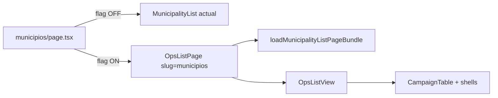

# CL3 — `OpsListPage`/`OpsListView` + municípios na arquitetura nova (tracer)

Status: rascunho
Atualizado em: 2026-08-01
Issue: #157
Priority: P1
Model: cursor-grok-4.5-medium
Impeccable: B — mesma superfície `/campanha/municipios`, render novo atrás de flag
Appetite: ~2 dias eng
Depends: CL2
Responsável: —

## Premissas

1. Com `LIST_UNIFIED` ausente, `/campanha/municipios` renderiza exactamente o código actual (flag OFF).
2. Loader e parser de municípios **não** mudam — a factory só os consome.

→ Corrija agora ou sigo com estas.

## Objetivos

- `OpsListView` client genérico (toolbar/table/empty/footer slots) + casca `OpsListPage` server.
- `/campanha/municipios` com flag ON renderiza pela factory com **paridade total**: tabela, filtros, saved filters, seletor de colunas, paginação, mobile cards.

## Dados → decisão → apresentação

Dados: N/A — mesma superfície de dados, nova arquitetura de render.

## Abordagem proposta



Componentes:

- **`src/components/campaign/shared/OpsListView.tsx`** (novo). Assinatura exacta:

```tsx
type OpsListViewProps = {
  /** Região acima da tabela: KPIs/overview (municipios, apoiadores) ou null. */
  overview: ReactNode | null
  /** Barra de filtros/search do domínio (MunicipalityFilters, LeadershipFilters, …). */
  toolbar: ReactNode
  /** A tabela já resolvida (CampaignTable com colunas do domínio). */
  table: ReactNode
  /** Empty state (CampaignListEmptyState ou Empty do domínio). */
  empty: ReactNode
  /** Footer/paginação (CampaignListFooter / CampaignListPagination). */
  footer: ReactNode
}

export const OpsListView = ({ overview, toolbar, table, empty, footer }: OpsListViewProps) => (
  <CampaignListPendingBoundary>
    {overview}
    {toolbar}
    {table /* ou {empty} conforme totalDocs — decisão fica na page, não aqui */}
    {footer}
  </CampaignListPendingBoundary>
)
```

Nota: a view é **composição de slots, não dona de dados** — quem decide `table` vs `empty` é a page do domínio (como hoje).

- **`src/app/(campaign)/campanha/(app)/municipios/page.tsx`** (alterado): resolve `resolveListUnifiedEnabled()`; OFF → JSX actual intacto; ON → mesma sequência de gate/loader/`readCampaignColumnVisibility`, montando `OpsListView` com as peças que a page já monta hoje:
  - `overview` → `<MunicipalityListOverview view={overview} shameHref={shameHref} />`
  - `toolbar` → `<MunicipalityFilters … />` (+ `SaveMunicipalityFilterControl`)
  - `table` → `<MunicipalityList … />` (mesma chamada actual, com `signalFormAction`)
  - `footer` → `<CampaignListFooter … />` (mesmos props)
- **Regra de ouro:** nenhuma peça de domínio (heads ricos, chips, edit-where-you-see) é reescrita — só reorganizada como slots passados à view.

## Fases verificáveis

### Fase 1 — Tracer: view + flag OFF intacto

- **Quota:** ~0,4
- **Entrega:** `OpsListView` + wiring da flag na page; OFF renderiza o JSX actual byte a byte.
- **Aceite:**
  - [ ] `pnpm gate:fast` verde
  - [ ] e2e municípios existente verde **sem** env
- **Verify:** `pnpm gate:fast` + e2e municípios
- **Files:** `src/components/campaign/shared/OpsListView.tsx`, `src/app/(campaign)/campanha/(app)/municipios/page.tsx`
- **Tamanho:** M

### Fase 2 — Flag ON com paridade

- **Quota:** ~0,6
- **Entrega:** caminho ON completo (overview, filtros, saved filters, colunas, paginação, mobile cards).
- **Aceite:**
  - [ ] `LIST_UNIFIED=1` renderiza a mesma tabela (desktop) e cards (mobile)
  - [ ] saved filters criar/aplicar/apagar funciona igual
  - [ ] seletor de colunas persiste no mesmo cookie
  - [ ] sort/paginação/URL canónica idênticas (redirect de params lixo igual)
- **Verify:** `pnpm gate:fast` + e2e municípios com env ligada + check manual mobile viewport
- **Files:** mesmos + `tests/e2e/` spec existente
- **Tamanho:** M

### Checkpoint

Paridade validada por produto (screenshots desktop/mobile) antes de abrir CL4.

## Dependências

- CL2 (registry + flag). Reusa `loadMunicipalityListPageBundle`, `resolveMunicipalityListUrl`, `MunicipalityFilters`, `CampaignTable`, saved filters.

## Não escopo

- Outros domínios (CL4+). Mudança de copy/UX. Mudança de URL.

## Rabbit holes

- **“Melhorar” a lista aproveitando a factory.** Se alguém “só ajustar”: paridade morre e o tracer não prova nada. **Mitigação:** diff zero de UX — qualquer melhoria é outra issue.
- **Extrair colunas para o registry já.** Registry v1 não guarda colunas de domínio (ficam no componente de domínio); quem tentar cria dupla fonte de verdade. **Mitigação:** registry só metas.

## Referências

- [`src/app/(campaign)/campanha/(app)/municipios/page.tsx`](<src/app/(campaign)/campanha/(app)/municipios/page.tsx>)
- [`src/components/campaign/municipality/MunicipalityList.tsx`](src/components/campaign/municipality/MunicipalityList.tsx)
- [`src/components/campaign/shared/CampaignTable.tsx`](src/components/campaign/shared/CampaignTable.tsx)
- [`src/utilities/municipality/municipalitySavedFilters.ts`](src/utilities/municipality/municipalitySavedFilters.ts)
