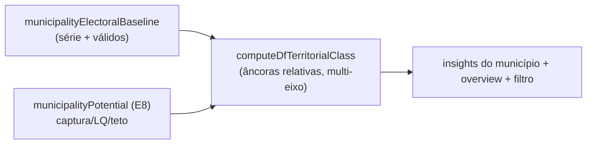

# E10 — Classificação territorial relativa (defesa/ataque para DF)

Status: rascunho
Atualizado em: 2026-07-24 (refs sincronizadas pós-remodelagem Municípios + hardening)
Item do roadmap: [docs/roadmap.md](../roadmap.md) (seção "Inteligência de campanha", E10; plano-mestre [inteligencia-campanha.md](inteligencia-campanha.md))
Impeccable: B — muda o conteúdo de cards/badges existentes (insights do município, overview da lista); sem rota nova
Appetite: ~1 dia eng; sem migration (derivação em leitura, limiares versionados em lib)
Responsável: —

## Design (Impeccable)

Âncoras: `PRODUCT.md` (princípio 5) / `DESIGN.md` (register `product`) · badges/Alert existentes do stack de insights.

Na implementação: craft compacto → critique → polish.

- **Persona / contexto:** assessor lendo o município; coordenador filtrando a lista por classe.
- **Job principal:** a classe transforma número em verbo (defender/atacar/consolidar/minimizar) sem mentir na aritmética de DF.
- **Estratégia de cor:** manter o mapeamento de badges já usado (defesa verde, ataque contorno vermelho, indecisa âmbar, perdida cinza — precedente A5-2).
- **Edit where you see:** não — classe é sugestão automática; discordância do coordenador vira nível/nota (E14), não override do cálculo.
- **Anti-goals:** classe como sentença (é sugestão); limiar absoluto hardcoded sem racional.

## Contexto

Os limiares herdados de A5-2 (`TERRITORIAL_DEFESA_MIN = 0.35` etc. em `src/lib/electionInsights.ts`) foram calibrados para leitura majoritária. O relatório (D4) mostra a degeneração em DF: share local típico 1–5% → o estado inteiro vira "perdida". Prescrição: **âncoras relativas** — múltiplos do share estadual do próprio candidato (LQ ≥ 2–3 = defesa; ~1 = padrão; < 0,5 = fraqueza) e/ou múltiplos do share da cadeira marginal — e classificação **multi-eixo**: dominância + importância do município na própria votação (concentração) + competição local + teto do campo. Cortes exatos são calibráveis por backtest (E15); aqui entra o método com valores iniciais versionados.

## Objetivos

- Novo classificador em `electionInsights.ts` (ou módulo irmão `dfTerritorialClass.ts`): entrada = dominância, LQ, share do município na votação própria, captura vs. teto do campo, NEC/desequilíbrio local; saída = classe + fatores ("por quê").
- Limiares versionados como constantes nomeadas com comentário de estatuto (ilustrativos, calibráveis por E15) — mesmos 4 rótulos operacionais existentes.
- Substituição nos consumidores: card de insights do município, distribuição no overview da lista, filtro por classe (se existente) e cor de classe onde o mapa a usar (B13).
- "Por quê" exposto: a UI mostra os 2 fatores dominantes ("LQ 2,8 · município é 6% da sua votação"), não só o rótulo — antídoto do excesso de confiança (relatório §6.4).
- Testes unit com fixtures das 4 classes + casos de borda (município sem baseline, válidos 0 — reusar branches `semBaseline` existentes).

## Decisões travadas

- **Âncora primária = múltiplos do share estadual do próprio candidato (LQ); âncora secundária = share da cadeira marginal.** A régua viaja entre eleições/candidatos e ancora no que "eleger" significa. **Rejeitado:** manter 35/20/10 (degeneração comprovada na aritmética); quantis puros como classe (quantil não tem semântica operacional de meta — fica para escala do mapa B13).
- **Classe continua sugestão automática, não editável.** Precedente A5-2 mantido; julgamento humano entra por E14 (nível) e `allocationDecision`. **Rejeitado:** override manual da classe (duas verdades no mesmo badge).
- **i18n e naming:** `computeDfTerritorialClass`, `DF_CLASS_ANCHORS`, fatores `dominance | ownShare | capture | competition`; rótulos pt-BR existentes (`Defesa`, `Ataque`, `Indecisa`, `Perdida`).

## Questões em aberto

- **Manter o classificador antigo para leituras majoritárias?** Opções: substituir tudo | manter ambos com seletor de contexto. **Recomendação:** substituir nos consumidores de município (o produto é DF); manter as constantes antigas exportadas até B13 estabilizar, depois remover.
- **NEC/desequilíbrio entram na v1 do classificador?** **Recomendação:** sim como fator qualificador de "ataque" (disputa aberta), com fallback neutro quando o cálculo por município não estiver disponível — não bloquear a entrega pelos índices.

## Abordagem proposta

Componentes:

- **`src/lib/electionInsights.ts`** (ou `dfTerritorialClass.ts` ao lado): classificador puro + âncoras versionadas; manter helpers de badge/label existentes (`territorialClassBadgeVariant`, `territorialClassLabel`).
- **Consumidores:** componente de insights do município (stack atual), `MunicipalityListOverview.tsx` (distribuição), `municipalityPageData.ts` (cálculo no load, sem N+1 — reusa agregados do bundle).
- **Sem migration, sem collection, sem server action.**

## Dependências

- Dura: **E8** (LQ/captura/teto derivados). Suave: E15 (calibração futura dos cortes); B13 (consome as classes).
- Reusa: `municipalityElectoralBaseline.ts`, `municipalityCandidateComparison.ts` (share de outros candidatos para competição), helpers de badge existentes.

## Não escopo

- Escala visual do mapa (B13); override/nível humano (E14); calibração empírica dos cortes (E15); classificação em nível TI (E12 usa rollup próprio).

## Rabbit holes

- **Calibração prematura.** Discutir "LQ 2 ou 3?" sem backtest é bikeshedding — valores iniciais documentados como ilustrativos; E15 decide.
- **Índices de competição por município exigirem query nova pesada.** Se NEC/desequilíbrio por município não saírem baratos do que `municipalityCandidateComparison.ts` já carrega, degradar para fator neutro — não criar agregado SQL novo neste item.

## Adiado com gatilho

- **Fator "tendência da série" na classe.** Gatilho: E15 mostrar que a série 2014→2022 melhora a separação ex-ante.

## Referências

- `docs/roadmap.md` (Inteligência de campanha, E10) · [plano-mestre](inteligencia-campanha.md)
- `docs/research/relatorio-entrevista-persona-campanha.md` D4 (degeneração + âncoras), §5 nota mapa/métricas
- `docs/plans/insight-classificacao-territorial.md` (as-built A5-2 — limiares antigos, UI, testes)
- `src/lib/electionInsights.ts`, `src/utilities/municipalityElectoralBaseline.ts`, `src/utilities/municipalityCandidateComparison.ts`, `src/components/campaign/MunicipalityListOverview.tsx`
- AGENTS.md — limiares versionados, naming
