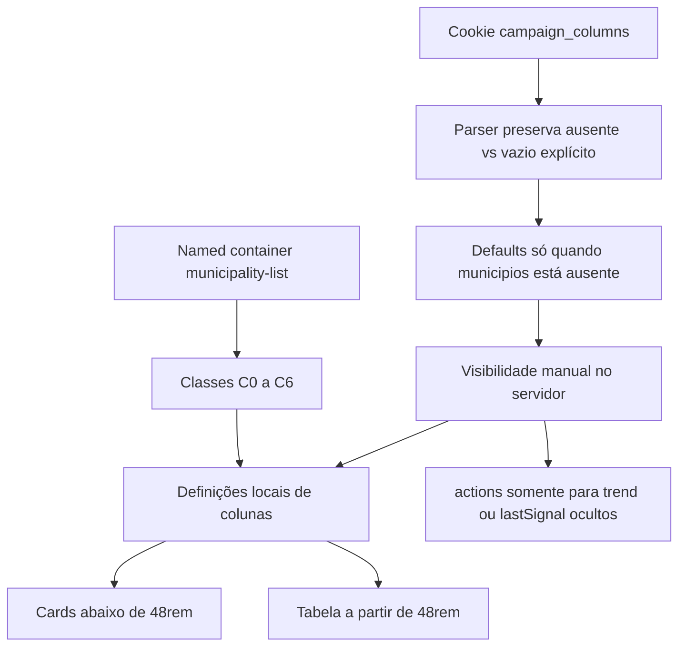

# Impl: B158 — Colunas adaptativas na tabela de Municípios

Status: aprovado
Atualizado em: 2026-08-05
Issue: #364
Intenção: docs/plans/colunas-responsivas-municipios.md
Appetite restante: ~1,5–2 dias eng; preservar o corte de um único outcome verificável

## Leitura da intenção

- **Outcome:** `/campanha/municipios` responde à largura real do painel de conteúdo: cards abaixo de 48rem; acima disso, uma tabela sem scroll horizontal que acrescenta contexto progressivamente, preserva preferência manual e mantém os quick edits acessíveis.
- **O que NÃO negociar:** container query em vez de viewport/JavaScript; ordem C0–C6; `leader` continua fora da rota; Dobradinha só para coordinator/candidate; território continua filtrável e `sort=region` continua válido; nenhum editor duplicado entre coluna adaptativa e `actions`; nenhuma migration, collection, Consent, server action ou mudança de URL pública.
- **O que reavaliar:** a intenção sugere um seam em `CampaignTable`, mas o código atual já aceita `className` em cada head e `cellClassName` em cada célula; a política responsiva pode e deve permanecer no dono local. A frase “uma instância por linha” será verificada dentro da superfície de tabela, porque cards e tabela já são árvores irmãs simultâneas no DOM, ocultadas por CSS; desmontar a superfície inativa exigiria estado/JavaScript e reabriria B42 fora do appetite.

## Abordagem recomendada

### Decisão 1 — onde vive a política responsiva

**Opções consideradas:**

- A. Classes de container query locais nas definições de `MunicipalityList`, aplicadas simetricamente a head/cell.
- B. Generalizar `CampaignTableColumn` com prioridade/breakpoint responsivo.
- C. Medir largura com `ResizeObserver` e recalcular colunas no cliente.

**Recomendação:** A — `CampaignTable` continua um módulo profundo para renderização e preferência manual; a matriz C0–C6 é política exclusiva de Municípios e todos os heads já aceitam `className`. Um record local de classes literais e tipadas evita divergência entre `<th>` e `<td>` sem criar API compartilhada prematura.

**Rejeitadas:** B vazaria uma política de uma lista para todas as tabelas e transformaria breakpoints de produto em configuração genérica; C adicionaria hidratação, estado e risco de flicker para um problema resolvido nativamente por CSS.

### Decisão 2 — ausência vs vazio explícito no cookie B17

**Opções consideradas:**

- A. Sentinel reservado `__none__` no formato atual (`municipios:__none__`).
- B. Cookie novo em JSON/versionado, migrando todos os consumidores.
- C. Manter o cookie atual e guardar um segundo cookie de “configurado”.

**Recomendação:** A — é retrocompatível, cabe no parser/serializer puro existente e não cria uma segunda fonte de verdade. O parser trata o sentinel somente como vazio explícito; ele nunca emerge como column ID. O serializer usa presença da chave para distinguir “ausente” de `[]`.

**Rejeitadas:** B amplia a migração e o risco de decoding entre `document.cookie` e `cookies()` sem benefício; C duplica estado e permite combinações contraditórias.

### Decisão 3 — montagem única de Tendência/Sinal

**Opções consideradas:**

- A. Definir uma função local por controle e chamá-la ou na coluna real ou em `actions`, conforme a ocultação manual resolvida no servidor.
- B. Renderizar coluna e `actions` sempre, escondendo uma cópia com CSS.
- C. Mover quick edits para um menu genérico de ações por linha.

**Recomendação:** A — apenas uma célula chama cada factory por linha. A coluna adaptativa permanece montada ao variar capacidade e troca compacto ↔ completo apenas por CSS; `actions` só é incluída na definição quando `trend` e/ou `lastSignal` está manualmente oculta.

**Rejeitadas:** B viola o contrato de uma instância e duplica estado/autosave; C remove edição “onde se vê”, muda o fluxo aprovado e cria uma abstração rasa.

### Decisão 4 — prova de responsividade e compatibilidade

**Opções consideradas:**

- A. Apenas snapshots/static markup e inspeção manual.
- B. Unit/static markup + Playwright medindo o named container em cada corte + interação real com sidebar/chat + projeto WebKit focado.
- C. Expandir toda a suíte campaign para uma matriz permanente Chromium/WebKit.

**Recomendação:** B — prova o mecanismo pelo tamanho do container, não por proxy de viewport, e cobre sticky/container queries em WebKit sem duplicar a suíte inteira. O spec focado roda no projeto Chromium já existente e em um projeto WebKit dedicado; CI instala somente os dois engines necessários.

**Rejeitadas:** A não detecta overflow nem erros de corte; C aumenta muito o tempo/custo de CI para uma necessidade localizada. WebKit é a automação disponível no Linux para compatibilidade Safari; uma checagem em Safari/iPad físico continua sendo validação de lançamento, não gate reproduzível deste agente.

### Componentes / mudanças

- **`parseCampaignHiddenColumns` / `serializeCampaignHiddenColumns` / resolver de defaults** (`src/lib/campaignColumnVisibility.ts`): preservar chave ausente versus vazio explícito, declarar o sentinel reservado e o preset de Municípios (`goalCoverage`, `lastSignal`) sem alterar defaults das outras listas.
- **`readCampaignColumnVisibility`** (`src/utilities/campaignColumnVisibilityCookie.ts`): aplicar preset somente quando a entrada da lista está ausente; devolver `[]` quando o sentinel registra “todas visíveis”.
- **`CampaignColumnPicker`** (`src/components/campaign/shared/CampaignColumnPicker.tsx`): manter o fluxo atual; `Restaurar todas` já chama `apply([])` e passará a persistir vazio explícito por efeito do serializer. Ajustar comentários/testes, não criar estado novo.
- **`MunicipalityList`** (`src/components/campaign/municipality/MunicipalityList.tsx`):
  - envolver cards+tabela em `@container/municipality-list` com seletor estável de teste;
  - reordenar colunas para Nome, 2022, 2026, Nível, Classe, Assessor, Tendência, Liderança, Dobradinha, Cobertura, Sinal, Ações;
  - mover `TerritoryLink` para a segunda linha do nome e retirar `region` da tabela/picker;
  - declarar `MunicipalityTableColumnId = MunicipalityListColumnId | 'actions'` localmente;
  - declarar classes C0–C6 como strings literais, reutilizadas em head/cell;
  - calcular ocultação manual uma vez e incluir `actions` somente quando necessário;
  - remover `overflow-x-auto` local e manter o wrapper sem scroller horizontal;
  - preservar legenda/caption, inclusive `sort=region` ativo.
- **`MunicipalityListMobileCards`** (`src/components/campaign/municipality/MunicipalityListMobileCards.tsx`): trocar somente `md:hidden` pela variante do named container; conteúdo/interação ficam intactos.
- **`MunicipalityListTrendControl`** (`src/components/campaign/municipality/MunicipalityListTrendControl.tsx`): seam tipado de trigger adaptativo para a tabela; uma instância contém ícone compacto e badge/readout completo alternados por CSS. O botão continua com nome acessível textual e sem depender apenas de cor.
- **`MunicipalityListSignalControl`** (`src/components/campaign/municipality/MunicipalityListSignalControl.tsx`): manter o slot `children`; o chamador fornece, na mesma instância, trigger compacto e `SignalAgeReadout` completo. Em `actions`, fornecer somente o trigger compacto apropriado.
- **`MunicipalityListLevelControl` / `MunicipalityLevelBadge`** (`src/components/campaign/municipality/`): a face vazia na célula de tabela passa a `—`, preservando “Sem nível” no `aria-label`, filtro e formulários/cards.
- **Labels e URL** (`src/utilities/municipality/municipalityLabels.ts`, `src/utilities/municipality/municipalityListUrl.ts`): retirar `region` apenas de `MunicipalityListColumnId`/records de coluna; manter `region` em sort/parser/serializer/resumo. Separar label de picker (`Estimativa 2026`) do head telegráfico (`2026`) e usar singular nos demais heads aprovados.
- **Filtros** (`MunicipalityFilters.tsx`, `municipalityOmnibox.ts`): sem mudança comportamental; regressões garantem `regionFilterOptions`, chips e `?region=`.
- **Migration:** sem migration.
- **Access / Consent:** nenhuma mudança; a composição por papel continua usando `isStaffView` e `isCampaignUnrestricted` existentes.
- **UI:** Impeccable Adapt, modo Operate. Shape já está fixado pela matriz; execução segue craft → critique → polish em duas rodadas visuais no máximo. Reusar tokens e shells existentes; sem redesign.
- **Documentação:** entrada curta em `docs/CHANGELOG-AGENTS.md`; não alterar `docs/ARCHITECTURE.md`, pois nenhuma fronteira muda.

### Dados → forma

- **Forma escolhida:** tabela essencial + disclosure progressivo por coluna, com cards no container estreito.
- **Por quê:** nome/2022/2026/nível/classe sustentam decisão imediata; responsabilidade e rede entram à medida que o painel comporta; trend/sinal preservam ação por trigger compacto.
- **Rejeitadas:** scroll horizontal mantém informação mas esconde contexto fora da dobra; tabela fixa reduz legibilidade; cards em toda largura desperdiçam densidade operacional.

## Fases verificáveis

1. **Tracer: preferência + estrutura local (~30%)**
   - Evoluir parser/serializer/defaults com unit tests de round-trip e legado.
   - Reordenar/remover `region`, criar named container, trocar cards↔tabela em 48rem e aplicar C0 essencial.
   - Rodar testes unitários focados e `pnpm gate:fast`.
2. **Controles adaptativos + matriz completa (~35%)**
   - Implementar `actions`, factories únicas e estados compacto/completo.
   - Aplicar C1–C6 simetricamente em heads/cells, headers curtos, nome+território e nível vazio.
   - Craft com conteúdo real/nomes longos; calibrar cortes uma única vez por evidência de `scrollWidth`.
3. **Browser + compatibilidade (~25%)**
   - Spec Playwright focado com larguras 1px antes/depois de 48/54/60/66/72/78/84rem.
   - Medir `scrollWidth <= clientWidth`, visibilidade cards/tabela, ordem/entrada, defaults, `actions` e uma instância por controle dentro da tabela.
   - Remover largura forçada e validar que sidebar e chat alteram a etapa sem mudar a viewport.
   - Rodar o mesmo spec em Chromium e WebKit; incluir cenário de viewport iPad para sticky/touch targets.
4. **Polish e gates (~10%)**
   - Critique/polish em lote, teclado/foco/nomes acessíveis e alvo mínimo de 44px.
   - Atualizar changelog.
   - `pnpm gate:fast`, testes E2E focados, `pnpm exec knip`, `pnpm check:cycles`; entrega via `pnpm push`.

## Verificação prevista

### Unit/static markup

- `tests/unit/campaignColumnVisibility.unit.spec.ts`: ausente → sem chave; sentinel → chave com `[]`; round-trip explícito; entradas legadas e outras listas intactas.
- `tests/unit/campaignColumnPicker.unit.spec.ts`: “Restaurar todas” escreve `municipios:__none__`; toggles partem do preset recebido e persistem uma única sessão.
- `tests/unit/campaignComponents.unit.spec.ts`: ordem de headers por papel, `region` fora da tabela/picker, território sob nome, `actions` fora do picker, nível nulo `—`, classes simétricas e quantidade de triggers por cenário manual dentro do `<table>`.
- `tests/unit/municipalityList.unit.spec.ts` e `municipalityOmnibox.unit.spec.ts`: `sort=region`, resumo, filtros/chips/serialização continuam válidos.

### Browser/E2E

- Novo spec focado `tests/e2e/campaignMunicipalityResponsiveColumns.e2e.spec.ts`.
- Named container selecionável por atributo estável; largura controlada diretamente para provar os cortes.
- Defaults sem cookie: Cobertura/Sinal ocultos e ação de Sinal disponível; sentinel explícito: todas visíveis após reload.
- Cada faixa prova headers esperados, mudança compacta/completa e ausência de overflow.
- Sidebar/chat são acionados pelos controles reais; o teste compara a largura medida e a etapa resultante.
- Chromium desktop + WebKit focado; viewport iPad no cenário sticky/touch.

### Fonte oficial

- Tailwind CSS 4 container queries: `@container/{name}`, variantes nomeadas e valores arbitrários `@min-[…]`: https://tailwindcss.com/docs/responsive-design#container-queries

## Rabbit holes / Não escopo (engenharia)

- Não criar estado React, `ResizeObserver`, `matchMedia` ou hook de largura.
- Não adicionar política responsiva genérica a `CampaignTable` nem alterar `ui/Table` globalmente.
- Não desmontar a árvore cards/tabela com JavaScript; a montagem única é garantida entre coluna e `actions` na tabela.
- Não otimizar loaders por coluna visível.
- Não alterar conteúdo dos cards, o omnibox ou contratos de URL.
- Não converter toda a suíte E2E para uma matriz cross-browser.
- Não criar novos ícones/linguagem visual fora dos triggers adaptativos necessários.

## Riscos e mitigação

- **Tailwind não emitir classes dinâmicas:** manter todas as variantes C0–C6 como strings literais completas no arquivo; typecheck e build comprovam geração.
- **Head/cell divergirem:** usar um record local único por coluna e testes estáticos que verificam a mesma variante nos dois lados.
- **Overflow por conteúdo real, especialmente relações:** testar nomes longos e várias relações; compactar somente trend/sinal; calibrar cortes em uma rodada medida, sem loop de microajustes.
- **Sticky left em container sem scroller próprio:** testar Chromium/WebKit; manter fundo/z-index existentes e medir overflow do container.
- **Sentinel vazar como coluna:** parser reconhece o valor antes da validação de IDs; serializer nunca o aceita como entrada de usuário; tests pinam que `hiddenColumnIds` recebe `[]`.
- **Default novo parecer escolha explícita:** ausência aplica preset, mas a primeira interação escreve uma entrada explícita; “Restaurar todas” escreve sentinel e sobrevive a reload.
- **Custo CI WebKit:** projeto restrito ao spec B158, não à suíte campaign inteira.
- **Safari/iPad físico indisponível no ambiente Linux:** WebKit automatizado é gate técnico; inspeção física permanece checklist de lançamento, explicitamente não alegada como executada.

## Aceite de engenharia

- [ ] Aceite de produto da intenção ainda coberto.
- [ ] Invariantes AGENTS/engineering-standards preservados; sem schema, DB, access ou Consent.
- [ ] Preferência manual e capacidade do container permanecem dimensões independentes.
- [ ] Cada controle Trend/Sinal é montado no máximo uma vez por linha dentro da tabela.
- [ ] Testes unit/static cobrem cookie, papel, DOM e contratos URL/filtro.
- [ ] E2E mede container, overflow, shell real e compatibilidade Chromium/WebKit.
- [ ] Gate rápido, dead-code/cycles e push canônico previstos.

## Self-score decision-quality

1. Decisões caras têm alternativas rejeitadas: **1/1**.
2. Abordagem cabe no appetite: **1/1**.
3. Rabbit holes nomeados: **1/1**.
4. Depth check reusa owners/shells/helpers: **1/1**.
5. Outcome e lockdowns da intenção preservados: **1/1**.

**Total: 5/5.**
