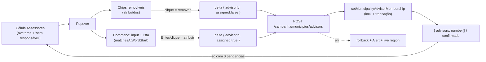

# Combobox, chips e auto-save no popover de Assessores da lista de municípios

Status: entregue
Atualizado em: 2026-07-26
Item do roadmap: [docs/roadmap.md](../roadmap.md) (Trilha B, item **B27**)
Impeccable: B — encaixe no `MunicipalityListAdvisorsControl` (tabela desktop + card mobile de `/campanha/municipios`); sem rota nova de UI
Appetite: ~0,75 dia eng; 1 componente reescrito + 1 route handler JSON + 1 record de delta + 1 helper puro movido; sem migration
Responsável: —

## Design (Impeccable)

Âncoras: `PRODUCT.md` (princípio 2 clareza sob pressão, 3 **Edit where you see**, 4 **Auto-save, no Save button**, 8 **Feel the action**) / `DESIGN.md` (register `product` — Field Desk) · tema `data-theme='campaign'` · regras `.cursor/rules/campanha-edit-where-you-see.mdc` e `.cursor/rules/campanha-action-feedback.mdc` · precedentes vivos: [`MunicipalityListExpectedVotesControl.tsx`](../../src/components/campaign/municipality/MunicipalityListExpectedVotesControl.tsx) (auto-save por endpoint JSON, mesma linha da tabela), [`AdvisorMunicipalityCell.tsx`](../../src/components/campaign/advisor/AdvisorMunicipalityCell.tsx) (chips removíveis + busca + gravação por delta), [`MunicipalityHeaderFilter.tsx`](../../src/components/campaign/municipality/MunicipalityHeaderFilter.tsx) (busca acento-insensível dentro de Popover, na **mesma coluna**).

Na implementação (`implement-roadmap-item`): craft compacto → critique → polish (sem shape — o Popover, a célula e os dois padrões que este item combina já estão no produto).

Brief compacto:

- **Persona / contexto:** Alex (Coordenador Geral) dividindo carteiras durante o onboarding (Onda 0 §4) e reatribuindo municípios ao longo da campanha, varrendo a lista de 435 linhas no desktop e conferindo no celular.
- **Job principal:** pôr (ou tirar) um assessor de um município digitando o nome — sem caçar a linha certa numa lista de checkboxes e sem procurar um botão de confirmar.
- **Estratégia de cor:** Restrained (inalterada) — chips usam `Badge variant="secondary"`; a única cor da célula continua sendo o alerta "sem responsável" (E9).
- **Edit where you see:** sim — a affordance já está na célula desde o **B9 ✓**; faltam o princípio 4 (o "Salvar assessores" é o anti-goal nomeado, e a célula vizinha da mesma linha já grava sozinha) e a legibilidade da seleção atual (hoje: iniciais no gatilho, checkbox no popover).
- **Anti-goals:** botão "Salvar" no popover; segundo design system de multi-select genérico; spreadsheet/data-grid mode; combobox que obriga a digitar para ver as opções; popover que fecha a cada atribuição (a mesa atribui 2–3 assessores de uma vez).

## Dados → decisão → apresentação

- **Vou apresentar dados?** Não. `Dados: N/A` — o item é affordance de **escrita** sobre `municipality.advisors`; nenhuma métrica, série, ranking ou mapa novo, nenhuma query nova (as opções já vêm de `getEligibleAdvisorOptions` e os nomes de `advisorNamesById`).
- **Efeitos de leitura a vigiar:** (a) o badge "sem responsável" (**E9 ✓**) é derivado da própria seleção da célula e passa a sumir/aparecer **na hora**, junto com o estado otimista; (b) faceta do filtro `?advisor=`, o toggle com/sem assessor e a ordenação `coverage` (**B16 ✓**/**B15 ✓**) só reconciliam na próxima navegação — mesma escolha já em produção nos votos estimados e travada no **B24** (ver Decisões travadas).

## Contexto

Na coluna "Assessores" de `/campanha/municipios`, o coordenador edita a atribuição desde o **B9 ✓**: [`MunicipalityListAdvisorsControl`](../../src/components/campaign/municipality/MunicipalityListAdvisorsControl.tsx) usa a pilha de avatares (`MunicipalityAdvisorAvatarStack`) como `PopoverTrigger` e abre um `<form>` com **uma lista de checkboxes** de todas as contas elegíveis (`getEligibleAdvisorOptions` → `eligibleCampaignStaffWhere`: coordinator, advisor e — desde o **E4R ✓** — candidate), submetendo por `useActionState` → `assignMunicipalityAdvisorsFormAction` → `assignMunicipalityAdvisors` (substitui o array inteiro) → `revalidateMunicipalityListPaths`. O mesmo controle é reusado no card mobile da lista.

Três defeitos, todos datados:

1. **Botão "Salvar assessores".** `PRODUCT.md` princípio 4 nomeia literalmente _"Save buttons on Popovers and quick-edit cells 'just in case'"_ como anti-goal, e a célula ao lado na mesma linha (`MunicipalityListExpectedVotesControl`) já grava sozinha via `POST /campanha/municipios/expected-votes`. O **B24** ([autosave-tendencia-lista-municipios.md](autosave-tendencia-lista-municipios.md)) resolve isso na coluna "Tendência" e registrou este popover em _Não escopo_ ("é multi-seleção... registrado como fill-in próprio") — pedido de produto em **2026-07-25** promoveu o fill-in a item, somando combobox e chips.
2. **Lista de checkboxes não escala nem se lê.** O escopo cresce com as contas staff (o E4R já criou uma conta por "ASSESSOR RESPONSÁVEL" da planilha, incluindo placeholders `@planilha.invalid`); rolar uma coluna de checkboxes para achar "Edizio" é o oposto de digitar três letras. O padrão de digitar-e-filtrar já existe **no header da mesma coluna** (`MunicipalityHeaderFilter`, busca acento-insensível acima de 8 opções) e na carteira de `/campanha/assessores` (**B19 ✓**).
3. **A seleção atual não é legível dentro do popover.** Quem está atribuído aparece como checkbox marcada no meio da lista; a leitura "quem responde por este município" exige varrer tudo. Em `/campanha/assessores` o mesmo par (entidade ↔ carteira) já se lê como **chips removíveis** com clique.

## Objetivos

- O popover **não tem botão "Salvar"**: escolher no combobox grava na hora; clicar num chip remove na hora.
- Os assessores atribuídos aparecem como **chips removíveis acima do combobox**, com o nome por extenso (inclusive além dos 3 avatares que cabem no gatilho).
- O combobox aceita digitação com filtro acento-insensível e navegação por teclado (setas + Enter), e mostra **todas** as opções quando o campo está vazio.
- Feedback honesto na própria célula (princípio 8): pendente (`aria-busy` + spinner), erro com mensagem + rollback para o último estado confirmado, live region `sr-only`; o badge "sem responsável" acompanha o estado otimista.
- O popover **permanece aberto** entre atribuições; fecha só por clique fora / Esc.
- Access inalterado: mesma regra de hoje (`reloadUnrestrictedActor` — coordenador **ou** candidato no servidor; UI segue coordenador-only, ver _Adiado com gatilho_), limite de `MAX_ADVISORS_PER_MUNICIPALITY` (10) preservado e exibido como erro legível.
- Guardrails: **sem migration**, sem collection, sem Consent, sem query nova, sem mudança no contrato de URL da lista. Nada muda para `advisor` (leitura) nem para `leader` (sem a coluna).

## Decisões travadas

- **Gravação por delta (um assessor por vez: `municipalityId` + `advisorId` + `assigned`), não substituição do array.** É o que a UI de chips significa, é o que o **B19 ✓** já faz do outro lado da mesma relação (`setAdvisorMunicipalityMembershipRecord`, lock `municipality-advisors:{id}`), e evita que duas pessoas editando o mesmo município se sobrescrevam. **Rejeitado:** manter o replace do array inteiro (uma gravação atrasada apaga a adição de outro ator, e sob auto-save isso acontece sem ninguém apertar nada); acumular deltas e gravar no fechamento do popover (é o botão "Salvar" com outro nome, e perde tudo se a aba morrer).
- **Endpoint JSON próprio `POST /campanha/municipios/advisors`, espelhando `expected-votes/route.ts`.** O form action atual chama `revalidateMunicipalityListPaths` — recomputar 435 linhas a cada chip é caro e faz a linha sumir sob um filtro `?advisor=` ativo enquanto se trabalha nela; e `useActionState` no `<form>` traz o par toast + `setOpen(false)` que fecharia o popover a cada atribuição. Mesma decisão do **B24**. **Rejeitado:** chamar o server action imperativamente + `router.refresh()` (precedente `AdvisorsTable`, que funciona porque a lista de assessores é curta); manter o form action e só trocar o submit pelo change.
- **Não reusar `setAdvisorMunicipalityMembership` (B19); criar `setMunicipalityAdvisorMembershipRecord` em `actions/municipality.ts`.** Aquele record passa por `assertTargetAdvisor`, que recusa alvo com papel ≠ `advisor` e recusa o próprio ator — regras corretas para a tela de contas, **erradas** aqui: o popover lista coordenador e candidato como elegíveis (`eligibleCampaignStaffWhere`, decisão do E4R 2026-07-24) e marca o próprio usuário com "(você)". O que os dois compartilham de verdade é o cálculo puro do próximo array, que vai para `src/lib/municipalityAdvisorMembership.ts` (relocação de `nextAdvisorIdsAfterMembership`, hoje privado em `actions/advisor.ts`, com o limite de 10 junto) — mais o mesmo lock e a mesma validação de elegibilidade do hook `validateMunicipalityAdvisors`. **Rejeitado:** afrouxar `assertTargetAdvisor` para servir as duas telas (muda silenciosamente o que `/campanha/assessores` pode fazer com a conta do CG); duplicar a aritmética do array nos dois lugares.
- **Combobox = `Command` (cmdk, `src/components/ui/Command.tsx`) dentro do `PopoverContent` que já existe, com `shouldFilter={false}` + `matchesAtWordStart`/`normalizeSearchPhrase` (`src/lib/wordStartFilter.ts`).** O primitivo já está no produto (`AsyncSearchCombobox`) e entrega input + `role="listbox"` + setas/Enter de graça; o filtro da casa é acento-insensível (o de cmdk não é). **Rejeitado:** repetir o padrão `Input` + lista do `MunicipalityHeaderFilter` (é lista de links de navegação, sem travessia por teclado depois de digitar); `StrictCombobox` (campo de formulário de **um** valor, que limpa no blur); copiar o input + `role="listbox"` manual do `AdvisorMunicipalityCell` (vem casado com a maquinaria de `ResizeObserver` que empacota chips numa célula de tabela, irrelevante dentro de um popover).
- **Opções já atribuídas continuam na lista, marcadas com check — não somem.** Alternar ali remove, igual ao chip; some o "para onde foi o nome que eu acabei de marcar". **Rejeitado:** esconder as atribuídas (o `searchAdvisorPortfolio` do B19 esconde porque busca em 435 municípios; aqui são poucas dezenas de contas e a lista **é** o estado).
- **Sem revalidação/refresh por gravação.** O estado exibido é local (otimista, confirmado pela resposta); faceta, filtro e ordenação por assessor reconciliam na próxima navegação — mesma escolha em produção nos votos estimados e travada no B24. **Rejeitado:** `revalidatePath` por delta; refresh no fechamento do popover (remove a linha debaixo de quem está trabalhando, só alguns segundos depois).
- **Requisições em voo não são abortadas, e a resposta do servidor só é adotada quando não há delta pendente.** Cada delta é um evento distinto que precisa chegar (diferente do debounce de votos, em que o valor novo supera o anterior); o `advisors` devolvido pelo endpoint reconcilia o estado só com o contador de pendências em zero, senão uma resposta antiga desfaria visualmente um clique mais novo. **Rejeitado:** `AbortController` como no controle de votos (cancelaria uma atribuição legítima); ignorar a resposta e confiar só no otimismo (perde a reconciliação com o limite de 10 e com edições de terceiros).
- **i18n e naming** (AGENTS.md): identificadores em inglês (rota `advisors`, `MunicipalityListAdvisorsResponse`, `setMunicipalityAdvisorMembership`, `nextAdvisorIdsAfterMembership`, `MunicipalityListAdvisorsControl` — nome mantido); strings visíveis em pt-BR ("Buscar assessor…", "Remover <nome>", "Salvando…", "Cada município aceita no máximo 10 assessores.").

## Questões em aberto

- **O popover de filtro (B16 ✓) e o de edição vivem na mesma coluna e vão ficar parecidos (busca + lista).** **Opções:** A) diferenciar só pelos chips no topo do de edição | B) título explícito ("Atribuir assessores") no de edição | C) redesenhar um dos dois. **Recomendação:** **A + B** — os chips já são um diferenciador forte e o cabeçalho de uma linha custa nada; C é fora do appetite. Verificar no critique. _(assumido)_
- **Contas placeholder `@planilha.invalid` (E4R) aparecem no combobox como qualquer outra.** **Opções:** A) nada | B) marcador "conta não ativada" na linha da opção | C) filtrar fora. **Recomendação:** **A** neste item — atribuir um município a uma conta ainda não ativada é justamente o fluxo do onboarding (o B19 ✓ ativa depois); C esconderia a maioria das contas semeadas. Reavaliar se o time atribuir e estranhar que a pessoa não recebe nada. _(assumido)_
- **Chip removido por engano — desfazer?** **Opções:** A) nada (re-adicionar pelo combobox) | B) toast com "Desfazer" | C) confirmação antes de remover. **Recomendação:** **A** — precedente direto em `AdvisorMunicipalityCell` (remove no clique, sem confirmar) e a re-adição custa três teclas; C mata o ganho de auto-save. _(assumido)_

## Abordagem proposta

Componentes:

- **`MunicipalityListAdvisorsControl`** (`src/components/campaign/municipality/MunicipalityListAdvisorsControl.tsx`): deixa de receber `formAction`/`municipalitySlug`; some o `<form>`, o `Button` "Salvar assessores" e o `useActionState`. Passa a manter `selectedIDs` otimista + `committedRef` + contador de pendências, renderizando chips (`Badge` + `XIcon`, `aria-label="Remover <nome>"`, padrão de `AdvisorMunicipalityCell`) acima de um `Command` (`CommandInput`/`CommandList`/`CommandItem`, `shouldFilter={false}`), `Alert` de erro e `
`. O gatilho (`MunicipalityAdvisorAvatarStack` + `MissingAdvisorBadge`) **não muda** — é o que preserva a composição de tooltip do **B23**.
- **`src/app/(campaign)/campanha/(app)/municipios/advisors/route.ts` + `types.ts`** (novos): `POST` com guarda de mesma origem, `zod` (`municipalityId`, `advisorId`, `assigned`), chamando o record e devolvendo `{ status: 'success', advisors: number[] }`; erros por `mapCampaignFormActionError` com as mensagens seguras de assessores (incl. o limite de 10), `401` em sessão expirada — cópia fiel do contrato de `expected-votes/route.ts`.
- **`setMunicipalityAdvisorMembershipRecord` / `setMunicipalityAdvisorMembership`** (`src/app/(campaign)/campanha/actions/municipality.ts`): `withPayloadTransaction` + `reloadUnrestrictedActor` + `acquireTextAdvisoryLocks(['municipality-advisors:{id}'])` + leitura `select: { advisors: true }` + `nextAdvisorIdsAfterMembership` + `payload.update` (`overrideAccess: true` com o comentário de bypass já usado no B19; a elegibilidade do alvo é reconferida pelo hook `validateMunicipalityAdvisors`). A variante exportada **não** revalida (ver decisão); devolve o array final.
- **`src/lib/municipalityAdvisorMembership.ts`** (novo, puro): `nextAdvisorIdsAfterMembership` movido de `actions/advisor.ts` junto com o erro do limite de 10; `actions/advisor.ts` passa a importar. Relocação, não abstração nova — nenhum wrapper a mais.
- **`MunicipalityList` / `municipios/page.tsx` / `municipalityStaffFormActions.ts`**: a lista para de receber e repassar `assignMunicipalityAdvisorsFormAction` (dois pontos de uso: coluna `advisors` e card mobile). O form action e `assignMunicipalityAdvisors` **permanecem** — `/campanha/municipios/[slug]/editar` (`MunicipalityAdvisorsForm`) continua consumindo. Rodar `pnpm exec knip` para confirmar que nada ficou órfão.
- **Depth check:** nenhum `useAutosave`, `EditableCell` ou multi-select genérico novo — `Command`, `Badge`, `Popover`, `wordStartFilter`, `withPayloadTransaction`, `acquireTextAdvisoryLocks` e `mapCampaignFormActionError` já existem e fazem o trabalho pesado.
- **Migration:** nenhuma — `municipality.advisors` já existe.
- **Testes:** unit do helper puro movido (adiciona/remove/no-op/limite de 10 — hoje não tem teste próprio); unit do parse/erro do route handler; int cobrindo o record (coordenador atribui a si mesmo e ao candidato — o caminho que `assertTargetAdvisor` bloquearia — e assessor comum recebe erro de acesso); e2e em `tests/e2e/campaignMunicipalities.e2e.spec.ts`: abrir a célula, digitar parte do nome, Enter, ver o chip **sem** clicar em botão, reabrir e conferir persistência.

## Dependências

- **Nenhuma dura.** Reusa `getEligibleAdvisorOptions`/`loadAdvisorSummaries` (`src/utilities/municipalityViewModels.ts`), `eligibleCampaignStaffWhere`, o lock e o padrão de delta do **B19 ✓**, o contrato de endpoint de `expected-votes/` e o filtro de `wordStartFilter`.
- **Suaves:** **B26** (registrar sinal na célula "Último sinal" — a **exceção** que confirma a regra: lá o submit continua explícito porque é criação atômica multi-campo de registro imutável; aqui é toggle de uma relação. Os dois planos precisam contar essa diferença do mesmo jeito no critique, senão a mesma linha da tabela passa a ter três contratos de gravação sem explicação); **B24** (irmão na coluna vizinha — quem chegar primeiro extrai `isSameOriginRequest` de `expected-votes/route.ts` para `src/utilities/`; o segundo só importa); **B23** (tooltip no **mesmo gatilho**: o trigger fica intacto, e os chips melhoram o fallback de toque que aquele plano presumia da lista de checkboxes — atualizar a frase correspondente lá quando este item entrar); **B16 ✓** (padrão de busca em Popover na mesma coluna e faceta `?advisor=` que fica defasada); **B9 ✓** (origem da célula); **E4R ✓** (semeou as contas de assessor que povoam o combobox); **E9 ✓** (badge "sem responsável" que agora reage otimisticamente).

## Não escopo

- **Auto-save na coluna "Tendência"** → **B24** ([autosave-tendencia-lista-municipios.md](autosave-tendencia-lista-municipios.md)).
- **Tooltip com os nomes no hover da célula** → **B23** ([tooltip-celulas-listas.md](tooltip-celulas-listas.md)).
- **`MunicipalityAdvisorsForm` em `/campanha/municipios/[slug]/editar`** — continua com submit explícito; é página de formulário, não célula de edição rápida (princípio 4 admite a exceção). Se virar incômodo, ganha o mesmo tratamento no gatilho do 3º controle (ver _Adiado com gatilho_).
- **Atribuir território/ZE inteiros de uma vez** (chips agregados do `AdvisorMunicipalityCell`) — aquele caminho é assessor → N municípios e já existe em `/campanha/assessores` (**B19 ✓**); aqui a unidade é um município.
- **Criar conta de assessor pelo combobox** → `/campanha/assessores/novo` (**B19 ✓**).
- **Reconciliar faceta/ordenação em tempo real** → mesma decisão (e mesmo débito) do controle de votos estimados e do B24.

## Rabbit holes

- **"Já que são três popovers de auto-save, extrai o shell genérico."** Nasce um `useCampaignAutosave` + `EditableCell` para acomodar select, número por cenário, textarea e multi-seleção com delta — design system paralelo (anti-goal do princípio 3). **Mitigação:** controles nomeados; extração só sob o gatilho abaixo.
- **"Já que é combobox, faz um `CampaignMultiSelectCombobox` para todo mundo."** Os call sites divergem de verdade: `RelationMultiSelect` submete hidden inputs em formulário, `AdvisorMunicipalityCell` empacota chips medindo o layout de uma célula, este grava por delta em popover. **Mitigação:** usar o `Command` cru aqui; unificação exige que dois call sites queiram literalmente o mesmo comportamento.
- **"Aproveita e faz a lista atualizar sozinha."** Puxa revalidação de 435 linhas, facetas, reordenação e a linha sumindo sob `?advisor=` ativo. **Mitigação:** decisão travada de não revalidar.
- **"Se é delta, permite arrastar assessor entre linhas / editar em lote."** Vira spreadsheet mode. **Mitigação:** uma célula por vez; operação em lote é a carteira do B19.
- **Composição Tooltip (B23) + Popover no mesmo gatilho.** Tratada de passagem, dá tap duplo e tooltip presa atrás do `PopoverContent`. **Mitigação:** não tocar no gatilho neste item; o contrato (`openOnTouch={false}`, `disabled={open}`) é do B23.

## Adiado com gatilho

- **Abrir a edição de assessores na lista também para o `candidate`** (o servidor já permite desde o B19 ✓; a UI é coordenador-only em `page.tsx`, `MunicipalityList` e no `/editar`). Revisitar quando: o candidato pedir, ou o CG delegar a divisão de carteiras — é uma varredura de 3 pontos, não cabe junto da reescrita do controle.
- **Shell compartilhado de auto-save em popover de lista.** Revisitar quando: existir o **3º** controle com a mesma máquina (candidatos: `budgetNotes`, prioridade).
- **Mesmo tratamento em `MunicipalityAdvisorsForm` (`/editar`).** Revisitar quando: alguém editar assessores por lá com frequência (hoje o caminho natural é a lista).

## Referências

- `docs/roadmap.md` (Trilha B, B27; grafo; Janela 1–2; cortes seguros)
- `src/components/campaign/municipality/MunicipalityListAdvisorsControl.tsx` — superfície entregue (chips + `Command` + auto-save por delta; antiga checkbox list + "Salvar assessores" removida)
- `src/components/campaign/municipality/MunicipalityList.tsx` (~378 e card mobile ~583) — os dois pontos de uso do controle (números de linha corrigidos nesta entrega)
- `src/components/campaign/municipality/MunicipalityListExpectedVotesControl.tsx` — máquina de auto-save (pendência, rollback, live region) a espelhar
- `src/app/(campaign)/campanha/(app)/municipios/expected-votes/route.ts` e `types.ts` — contrato do endpoint e `isSameOriginRequest`
- `src/components/campaign/advisor/AdvisorMunicipalityCell.tsx` — chips removíveis + gravação por delta (padrão visual e de interação)
- `src/app/(campaign)/campanha/actions/advisor.ts` (~90–110, 187–252) — `nextAdvisorIdsAfterMembership`, `assertTargetAdvisor`, lock `municipality-advisors:{id}`
- `src/app/(campaign)/campanha/actions/municipality.ts` — `assignMunicipalityAdvisorsRecord` (o replace que este item substitui na lista)
- `src/utilities/municipalityViewModels.ts` — `getEligibleAdvisorOptions`, `loadAdvisorSummaries`
- `src/collections/Municipality.ts` — campo `advisors` (access, `filterOptions`) e hook `validateMunicipalityAdvisors`
- `src/lib/schemas/municipality.ts` — `MAX_ADVISORS_PER_MUNICIPALITY`
- `src/components/campaign/municipality/MunicipalityHeaderFilter.tsx` e `src/lib/wordStartFilter.ts` — busca acento-insensível em Popover na mesma coluna
- `src/components/ui/Command.tsx` · `src/components/campaign/shared/AsyncSearchCombobox.tsx` — primitivo de combobox já em uso
- `docs/plans/autosave-tendencia-lista-municipios.md` (**B24**) · `docs/plans/tooltip-celulas-listas.md` (**B23**) · `docs/plans/gerenciar-assessores.md` (**B19 ✓**) · `docs/plans/edicao-rapida-lista-pracas.md` (**B9 ✓**)
- AGENTS.md — Campaign auth, naming pt-BR/inglês, `overrideAccess: false`, escrita transacional
- `PRODUCT.md` / `DESIGN.md` — princípios 2, 3, 4 e 8; Field Desk · regras `campanha-edit-where-you-see.mdc`, `campanha-action-feedback.mdc`

## Entregue (2026-07-26)

Implementado como planejado, sem desvio de escopo. `nextAdvisorIdsAfterMembership` mora agora em `src/lib/municipalityAdvisorMembership.ts` (com unit tests próprios, que faltavam); `setMunicipalityAdvisorMembershipRecord`/`setMunicipalityAdvisorMembership` em `actions/municipality.ts` cobertos por 6 int tests (coordinator/candidate, auto-atribuição, negação de `advisor`/`leader`, idempotência, limite de 10); `POST /campanha/municipios/advisors` espelha `expected-votes/route.ts` byte a byte no contrato. O polish do `/impeccable` alinhou o gatilho ao irmão `MunicipalityListExpectedVotesControl` (`aria-expanded`/`aria-haspopup`/realce ao abrir) — única mudança visual além do que o plano já especificava. `assignMunicipalityAdvisorsFormAction` sobrevive intacto só para `/editar`; `pnpm exec knip` confirma nada órfão (a checagem full falha por um problema pré-existente P3 ao carregar `payload.config.ts`, não relacionado a este item).

Achado de infraestrutura fora do escopo original: o `webServer` do Playwright (`pnpm dev`) compila uma rota `POST`-only só no primeiro hit, e o Fast Refresh disparado por essa compilação recarrega a página e aborta o fetch em voo do e2e (`ERR_ABORTED`). Corrigido com um prewarm dummy de `/campanha/municipios/advisors` e `/campanha/municipios/expected-votes` em `tests/e2e/setup.e2e.spec.ts`, antes dos specs reais.

Gate: `tsc --noEmit`, `lint --max-warnings=0`, `format:check`, `check:cycles` limpos; 393 unit+int (6 novos) verdes; `pnpm build` verde; Aikido 0 achados nos 9 arquivos novos/editados. E2E do fluxo B27 verde tanto isolado quanto dentro da suíte completa — rodadas full-suite mostraram falhas rotativas em specs **não relacionados** (checkbox de consentimento, demandas, conceitos) sob carga sustentada da máquina, sempre verdes ao isolar; tratado como flakiness de ambiente pré-existente, não regressão desta entrega.
