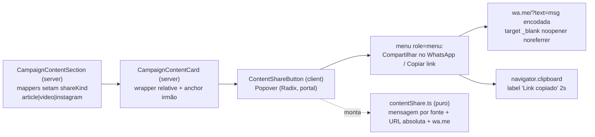

# Impl: Compartilhar conteúdos da home no WhatsApp (S4)

Status: aprovado
Atualizado em: 2026-08-19
Issue: #19
Intenção: docs/plans/compartilhar-conteudos-home-whatsapp.md
Appetite restante: herdado (~0,5–1 dia eng)

## Pós-entrega (2026-08-19)

Entregue e mergeado em `main`. Desvios de execução em relação a este plano:

- **`buildWhatsAppTextShareUrl` já existia** em `src/lib/homeSearchShare.ts` (S6) — em vez do builder próprio do rascunho, o `contentShare.ts` reusa o canônico, e o dono do builder foi movido para `src/lib/phone.ts` (o módulo wa.me) com re-export no `homeSearchShare.ts` (sem twin).
- **Roles `menu`/`menuitem` removidos do popover** (achado P1 do critique): Radix Popover não implementa o contrato de widget de menu (setas/roving focus); semântica honesta é popover de 2 ações com Tab — Radix emite `aria-expanded` no trigger.
- **Encoding do `text` é `+` para espaço** (URLSearchParams do builder canônico) — válido para o WhatsApp; os decodes de teste fazem `replace(/\+/g, ' ')`.
- **Débito deferido:** dedupe do blob de 15 campos do `updateSocialFeedSettings` (5 cópias no describe do e2e) — quando os testes S2/S3 forem tocados de novo.

## Leitura da intenção

- **Outcome:** todo card de conteúdo da home (Artigo/YouTube/Instagram — seção S1+S2+S3 entregue) ganha um botão discreto de compartilhar que abre `wa.me` com mensagem pronta por fonte + "Copiar link", sem competir com o CTA do card, sem coletar nada.
- **O que NÃO negociar:** mensagem por fonte (artigo/vídeo/post, decisão B travada); link = artigo → página canônica, YT/IG → URL da plataforma; nova aba com `noopener`; botão acessível (aria-label, alvo ≥44px no mobile) e sem mudar o layout do card; sem migration/schema/Consent — montagem de URL no cliente, sem escrita no servidor; mensagem honesta.
- **O que reavaliar:** a hipótese "reusar `buildWhatsAppUrl` (`src/utilities/phone.ts`)" está **errada** — (a) o módulo é `src/lib/phone.ts`, e (b) `buildWhatsAppUrl` **exige telefone brasileiro válido e lança erro sem ele**; S4 não tem destinatário — é o `wa.me/?text=` do próprio remetente (precedente exato: `PetitionSuccessDialog.tsx:39`). Também reavaliar: o card inteiro é um `<a>`/`<Link>` — um `<button>` aninhado seria HTML inválido e o clique navegaria; o botão precisa ser **irmão** do anchor.

## Abordagem recomendada

**Opções consideradas:** A | B | C (por decisão abaixo)
**Recomendação:** descrita nas decisões — irmão do anchor + `wa.me/?text=` + Popover Radix.
**Rejeitadas:** `buildWhatsAppUrl` (exige telefone; throw); botão aninhado no anchor (HTML inválido, clique navega); `navigator.share` nativo (não é o aceite — WhatsApp + copiar link); menu absoluto caseiro (reimplementa portal/foco/fora/escape que o `ui/Popover` já tem).

### Decisões de engenharia

**D1 — Estrutura do card (o botão não cabe dentro do anchor).**
Opções: A) wrapper `relative` no card + anchor irmão + botão absoluto (`z-10`, visual 28px em área de toque 44px, canto superior direito — `group` migra para o wrapper, preservando o zoom do cover e o `h-full` da cadeia bento/li) | B) botão aninhado com `preventDefault`/stopPropagation | C) âncora só no conteúdo e botão em fluxo normal.
Recomendação: **A** — siblings resolvem propagação e a11y por construção, sem `preventDefault` mágico; zero mudança de layout (absoluto). Rejeitadas: B (interactive dentro de interactive — invalid HTML, `role` confuso para leitor de tela); C (muda a hit-area/estética do card — viola "não muda o layout").

**D2 — Link absoluto (artigo é caminho relativo).**
Opções: A) montar no cliente no clique: `new URL(href, window.location.origin)` — hrefs YT/IG já absolutos passam inalterados; origem é a do visitante real (preview correto) | B) resolver `siteUrl` no server (metadata global) e passar link absoluto no card data.
Recomendação: **A** — casa com o aceite "montagem de URL no cliente"; zero dado novo no contrato do card; precedente `PetitionSuccessDialog` (`window.location.href`). Rejeitada: B (acopla a seção à leitura da global + prop extra sem necessidade).

**D3 — Mensagem por fonte (aceite travado).**
Opções: A) campo explícito `shareKind: 'article' | 'video' | 'instagram'` no `CampaignContentCardData`, setado pelos 3 mappers da seção (ponto único de renderização) | B) derivar da fonte por heurística (`badgeLabel`, forma do href).
Recomendação: **A** — `badgeLabel` é display (mudaria a msg se a label mudar); href é heurística frágil. A lógica pura fica em `src/lib/contentShare.ts` (unit-testável): prefixo por kind (`Olha isso do Solla: ` / `Olha esse vídeo do Solla: ` / `Olha esse post do Solla: `) + `{título} — {link}`.

**D4 — Menu (clipping do carrossel mobile).**
Opções: A) Popover Radix (`src/components/ui/Popover.tsx` — portal, escape, clique-fora, foco de graça) | B) menu absoluto caseiro dentro do card | C) Sheet/Drawer no mobile.
Recomendação: **A** — o track do `CampaignContentCarousel` é `overflow-x-auto`; um absoluto caseiro estouraria o box do card e criaria scrollbar vertical/clipping; o portal do Radix escapa qualquer container. Rejeitadas: B (reimplementa foco/fora/escape e arrisca clipping); C (overkill para 2 ações). Conferir no craft o token de superfície do conteúdo (`bg-popover` existe no tema público? senão `bg-white` + `border-(--campaign-line)` igual ao card).

**D5 — Feedback de copiar.**
Opções: A) swap inline do item para "Link copiado" + `CheckIcon` por 2s (padrão `LeadershipInviteButtons`/`CalendarFeedDialog`) | B) `toast` (sonner).
Recomendação: **A** — o layout público não monta `<Toaster>`; swap inline é o padrão do repo. `navigator.clipboard` com try/catch (fallback de label em falha).

### Componentes / mudanças

- **`ContentShareKind` + `buildContentShareMessage` + `buildContentShareLink` + `buildContentShareWhatsAppUrl`** (`src/lib/contentShare.ts`, novo, puro): frase por fonte, resolução `new URL(href, origin)` e `https://wa.me/?text=${encodeURIComponent(message)}` — a forma do `PetitionSuccessDialog` com `noopener noreferrer` no call site.
- **`CampaignContentCardData.shareKind`** (novo campo, obrigatório) + **`CampaignContentCard`** (server): wrapper `relative` (absoluto do botão), anchor irmão; renderiza `<ContentShareButton kind title href />`. Sem migration.
- **`CampaignContentSection`**: os 3 mappers (`toArticleCardData`/`toVideoCardData`/`toInstagramCardData`) setam `shareKind`. Único ponto — nada duplicado por plataforma.
- **`ContentShareButton`** (`src/components/ContentShareButton.tsx`, novo, client): trigger `aria-label="Compartilhar"` (`Share2Icon` — já usado no repo), visual 28px `rounded-full bg-white shadow` sobre área de toque ≥44px (`h-11 w-11`), `PopoverTrigger` + `PopoverContent` (portal) com `role="menu"`; itens: `<a href={waUrl} target="_blank" rel="noopener noreferrer">` com `WhatsAppIcon` (de `socialIcons`, usado no público) e botão "Copiar link" (`CopyIcon` → "Link copiado" + `CheckIcon`).
- **Migration:** nenhuma. **Access/Consent:** nenhum — zero escrita, zero leitura nova.
- **UI:** Impeccable B (discreto, não compete com o CTA) — shape → craft → critique → polish no padrão da seção (tokens `--campaign-*`, `--pt-red` no foco, `motion-reduce`).

## Fases verificáveis

1. **Lib pura + unit** — `src/lib/contentShare.ts` + `tests/unit/contentShare.unit.spec.ts` (frases por fonte, resolução de link relativo/absoluto, encoding do `wa.me`, round-trip `decodeURIComponent`).
2. **Card + seção** — wrapper relativo + `shareKind` nos mappers + `ContentShareButton` com Popover; verificar visual no dev (bento desktop + carrossel mobile, incl. card inerte do carrossel).
3. **E2E** — dentro do describe `Campaign home content section` (`tests/e2e/frontend.e2e.spec.ts`, serial, fixtures/stubs existentes): botão por card; menu abre; href `wa.me` correto por fonte (título + link absoluto, `target=_blank` `rel=noopener noreferrer`); copiar link grava a URL absoluta no clipboard (grant `clipboard-read/write`) e troca label; Escape/clique-fora fecha; mobile: área de toque ≥44px no card do carrossel e menu visível (portal não é clippado).
4. **Gates** — `pnpm exec tsc --noEmit`, `pnpm lint`, `pnpm format:check`, `pnpm exec knip`, `pnpm check:cycles`, `pnpm test`, `pnpm build`; e2e verde no CI.

## Rabbit holes / Não escopo (engenharia)

- **UTM/medição de clique** — fora (intenção: item futuro explícito); nada é coletado.
- **`navigator.share` nativo / outros canais** — fora; aceite é WhatsApp + copiar link.
- **Terceira ação no menu, ou menu por plataforma** — não; 2 itens fixos, um componente.
- **Generalizar o popover de compartilhar para fora da home** — não; 1 call site.
- **Tocar `CampaignContentCarousel`** — não; o botão vem do card, e o `inert` do carrossel já cobre os cards não ativos.

## Riscos e mitigação

- **HTML inválido / navegação ao compartilhar** → botão irmão do anchor (D1); zero propagação.
- **Clipping do menu no carrossel `overflow-x-auto`** → portal do Radix (D4).
- **Token `bg-popover` ausente no tema público** → conferir em `styles.css`; fallback `bg-white` + borda do card.
- **Quebra da cadeia `h-full` do bento/`li`** → wrapper `h-full` + anchor `h-full` (verificar no craft com o card featured).
- **Clipboard indisponível (http/privado)** → try/catch com label de erro honesto, sem crash.
- **Hidratação** → props de server→client são só `kind`/`title`/`href` (strings) — sem serialização nova.

## Aceite de engenharia

- [ ] Aceite de produto da intenção ainda coberto (mensagens por fonte, links, `noopener`, ≥44px mobile, sem mudança de layout, sem escrita)
- [ ] Invariantes AGENTS: identificadores em inglês / copy pt-BR; sem migration; sem Consent; reuso de `ui/Popover`, `WhatsAppIcon`, padrão `copied` do repo
- [ ] Unit da lib pura + E2E no describe existente da seção (cobertura de domínio: mensagem por fonte e URL absoluta)
