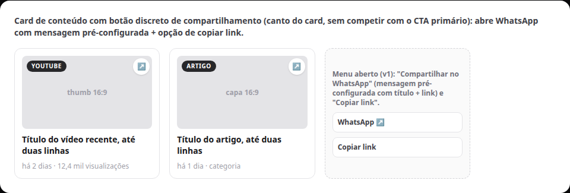

# Compartilhar conteúdos da home no WhatsApp (S4)

Status: registrado
Atualizado em: 2026-08-17
Issue: #19
Priority: P2
Model: composer-2.5
Impeccable: B — botão discreto de compartilhar por card de conteúdo (não compete com o CTA)
Rascunho UI: docs/plans/secao-conteudos-home-ui-draft.html + PNG embutido abaixo
Appetite: ~0,5–1 dia eng; botão por card + wa.me com mensagem pré-configurada + copiar link
Responsável: —

## Intenção

Depois que a seção de conteúdos da home estiver funcional (S1+S2+S3), cada card de conteúdo vira compartilhável no WhatsApp — o canal nº 1 de compartilhamento no Brasil. O visitante manda o artigo/vídeo/post para alguém com uma mensagem pronta (título + link), sem sair da home. É a fatia de viralidade do board: conteúdo circulando de volta para a campanha na reta final.

## Persona e fluxo

- **Persona / contexto:** visitante (eleitor, liderança, simpatizante) no meio de funil que achou um conteúdo bom e quer mandar para o grupo/família.
- **Job principal:** repassar um conteúdo específico da home para alguém no WhatsApp com um clique, com texto pronto.
- **Fluxo desejado:** vê o card → toca no botão de compartilhar (ícone discreto no canto do card) → opção "Compartilhar no WhatsApp" (abre `wa.me` com mensagem pré-configurada contendo título + link do conteúdo) e/ou "Copiar link" → cola onde quiser.
- **Anti-goals de produto:** o botão de compartilhar NUNCA compete com o CTA primário da página (botão discreto, não é o foco do card); não é compartilhamento por seção inteira (v1 é por card); sem WhatsApp Business API (é `wa.me` do próprio remetente).

### Esboço de fluxo (B)

```text
[card de conteúdo] → [botão compartilhar (ícone)] → [menu: WhatsApp / Copiar link]
→ [wa.me com mensagem "Olha isso do Solla: <título> — <link>"] → [remetente envia pelo próprio WhatsApp]
```

### Rascunho UI (B)



Fonte iterável: [`secao-conteudos-home-ui-draft.html`](secao-conteudos-home-ui-draft.html) (cena `compartilhar`).

## Objetivo e aceite

- Todo card de conteúdo da seção (Artigo/YouTube/Instagram) tem um botão discreto de compartilhar (canto do card, sem competir com o CTA primário da página).
- Ação principal: abre `wa.me` com mensagem pré-configurada **por fonte** (decisão do cliente): artigo → "Olha isso do Solla: {título} — {link}" · vídeo → "Olha esse vídeo do Solla: {título} — {link}" · post IG → "Olha esse post do Solla: {título} — {link}". Link: artigo → página canônica do artigo; YT/IG → URL da plataforma. Nova aba com `noopener`.
- Ação secundária: "Copiar link" (navegador/clipboard) com feedback de "copiado".
- O botão é acessível (aria-label, alvo de toque ≥44px no mobile) e não muda o layout do card. No mobile, o botão vive no card único do carrossel (1 conteúdo por tela — decisão do cliente); no desktop, no canto de cada card do bento.
- Sem migration/schema/Consent — o fluxo é montagem de URL no cliente, sem escrita no servidor.
- Mensagem padrão honesta (ex.: "Olha isso do Solla: {título} — {link}") — sem texto enganoso.

## Dados (intenção)

- **Vou apresentar dados?** Não — só a URL compartilhada. (Se a assessoria quiser medir circulação, UTM por card é um item futuro separado.)
- **Decisões desbloqueadas:** o visitante decide compartilhar; nenhum dado é coletado por este fluxo.

## Direção no codebase (hipótese)

- **Áreas prováveis:** componente client pequeno no card de conteúdo da seção S1/S2/S3 (`src/components/`), reusando `buildWhatsAppUrl` (`src/utilities/phone.ts`) e o padrão de copiar link já existente (ex.: `ShareNucleusDialog`/`campaignListShare` — ver `docs/plans/compartilhar-pagina.md` como precedente de wa.me + copiar).
- **Precedente a olhar:** `compartilhar-pagina.md` (padrão `wa.me` + copiar link + `noopener`), `src/utilities/phone.ts` (`buildWhatsAppUrl`), plano-site §7.1 ("Compartilhamento por seção" — ideia do cliente).
- **Risco de acoplamento:** o botão vive no card generalizado da seção — implementar no ponto único de renderização do card (não em três lugares por plataforma).

## Dependências

- **S3** (seção completa: artigos + YouTube + Instagram) — dura (conteúdos funcionais antes de compartilhar).

## Fora de escopo

- Compartilhar por outros canais (e-mail, X, threads) — só WhatsApp + copiar link no v1.
- UTM por seção/card e medição de circulação (item futuro — ideia §7.1 do plano-site).
- Imagem OG por seção/card (geração de card de preview) — item futuro (§7.1).
- WhatsApp Business API / disparo em massa (vedado pela Res. TSE 23.610; é `wa.me` do próprio remetente).

## Rabbit holes de produto

- **Botão de compartilhar competindo com o CTA.** Se alguém "só completar": dois pesos visuais por card. **Corte:** ícone discreto no canto, sem destaque de cor de marca.
- **Compartilhar a seção inteira.** Se alguém "só completar": mensagem gigante com N links. **Corte:** v1 é por card, um link por mensagem.
- **Telemetria disfarçada de compartilhar.** Se alguém "só completar": vira rastreador de clique. **Corte:** nada é coletado neste item; UTM fica para item futuro explícito.

## Questões em aberto (produto)

- **Mensagem padrão por fonte?** **Opções:** A) template único "Olha isso do Solla: {título} — {link}" | B) específica por fonte (artigo/vídeo/post). **Recomendação:** B — decisão do cliente nesta sessão. _(decidido — B)_

## Referências

- GitHub Issue #19
- Rascunho UI (gate): `docs/plans/secao-conteudos-home-ui-draft.html` (cena `compartilhar`) + PNG acima
- `docs/campanha/plano-site-campanha-2026.md` §7.1 — "Compartilhamento por seção" (ideia do cliente registrada)
- `docs/plans/compartilhar-pagina.md` — precedente de wa.me + copiar link no repo
- `src/utilities/phone.ts` — `buildWhatsAppUrl`
- `docs/plans/secao-conteudos-home-artigos.md` (S1) — estrutura do card onde o botão entra
