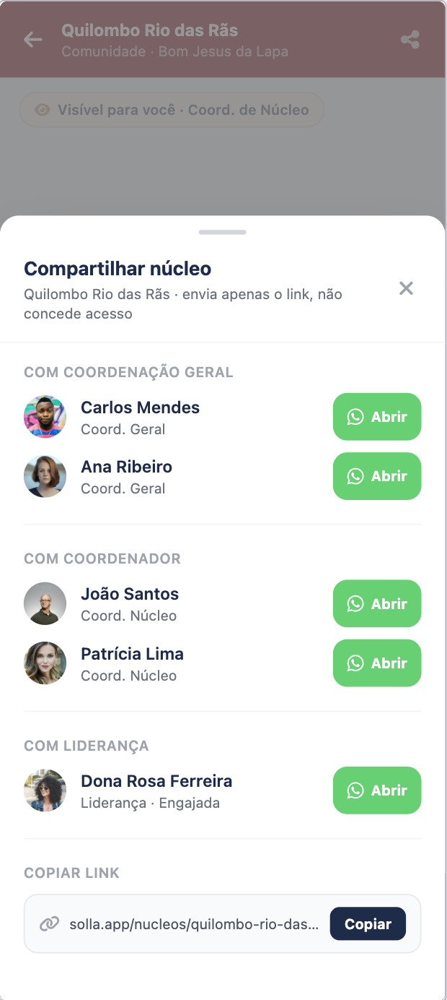
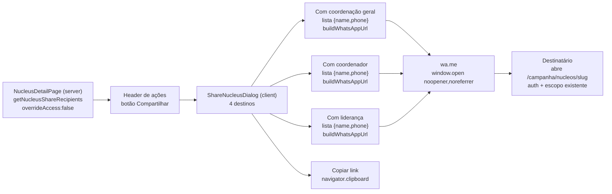

# Compartilhar página do núcleo

Status: rascunho
Atualizado em: 2026-07-17
Item do roadmap: [docs/roadmap.md](../roadmap.md) (seção "Campanha → Próximos ciclos", linha 51)
Responsável: —

## Referência visual (UX Pilot)

Design: [`Compartilhar-Nucleo.png`](../design-refs/latest/Compartilhar-Nucleo.png) · [`Compartilhar-Nucleo.html`](../design-refs/latest/Compartilhar-Nucleo.html)

Como usar:

- **Adotar a estrutura:** bottom sheet no mobile com título "Compartilhar núcleo", subtítulo reforçando "envia apenas o link, não concede acesso" (copy que materializa a decisão travada), três seções de destinatários ("Com coordenação geral", "Com coordenador", "Com liderança" — nome + papel + botão verde "Abrir" com ícone WhatsApp) e a seção "Copiar link" com a URL canônica truncada + botão "Copiar".
- **Ajuste em relação ao plano:** o plano especifica `Dialog` central (como `LeadershipInviteDialog`); o design mostra bottom sheet. Adotar o padrão responsivo já usado no painel de lideranças (Sheet/Drawer no mobile, Dialog no desktop) — a estrutura interna do design vale para ambos.
- **Lembrar das regras que o design não mostra:** ocultar a seção "Com liderança" para o papel `lideranca`; ocultar destinatários sem telefone; ocultar seções vazias; estado "copiado" após o clique.
- **Ajustar cores:** paleta antiga no HTML/PNG (header vermelho escuro, navy). Implementar com os tokens do tema `campaign` e componentes `src/components/ui`; avatares com foto viram iniciais.

## Contexto

Hoje o detalhe do núcleo (`/campanha/nucleos/[slug]`) só tem ações de escrita (Editar, Nova liderança, Nova atualização, Arquivar). Não existe um caminho rápido para um usuário da campanha mandar o link daquele núcleo a outra pessoa do mesmo núcleo. A decisão de produto (2026-07-17) é adicionar um botão **Compartilhar** que oferece quatro destinos: coordenação geral, coordenador, liderança ou copiar link. Para os três primeiros, abre o WhatsApp via `wa.me` com o telefone do destinatário — o mesmo padrão já usado pelos convites, **sem WhatsApp Business API**.

Importante: compartilhar **não concede acesso**. O link aponta para `/campanha/nucleos/[slug]`, rota autenticada que já filtra por escopo (`canReadElectoralNucleus` em `src/utilities/campaignAccess.ts`). O destinatário só vê o núcleo se tiver sessão de campanha válida e o núcleo no seu escopo. O compartilhamento é só conveniência — envia o link, não cria convite, não gera token, não toca em `Consent`.

## Objetivos

- Botão de ação "Compartilhar" no header do detalhe do núcleo, ao lado das ações existentes.
- Quatro destinos: coordenação geral, coordenador, liderança, copiar link.
- Para os três primeiros, abrir `wa.me` com o telefone do destinatário e uma mensagem pronta (remetente + nome do núcleo + link).
- Reusar o padrão `wa.me` dos convites (`buildWhatsAppUrl` em `src/utilities/phone.ts` e `buildCampaignInviteWhatsAppLink` em `src/utilities/campaignInvite.ts` como referência de texto).
- Manter access control existente: nenhum dado sensível (telefone) é exposto a quem já não pudesse lê-lo. Sem server action de escrita, sem collection nova, sem `Consent`.

## Decisões travadas

- **Escopo: só o detalhe do núcleo.** O botão vive no header de `src/app/(campaign)/campanha/(app)/nucleos/[slug]/page.tsx`. A listagem de núcleos (`NucleusCard`) fica fora deste ciclo (ver "Não escopo").
- **Compartilhar não é convite.** Não cria `campaignInvite`, não gera token, não expira, não revoga. Reusa o padrão `wa.me` apenas como canal (mesma decisão do notebook: "Convidar pelo WhatsApp" cria convite; aqui não).
- **Sem WhatsApp Business API.** Mesma justificativa do roadmap linha 57: o remetente envia pelo seu próprio WhatsApp, abrindo `wa.me` em nova aba com `noopener,noreferrer` (igual ao `LeadershipInviteDialog`).
- **Sem server action.** A URL `wa.me` é montada no cliente a partir do telefone do destinatário (já carregado no server) + mensagem com remetente/nome do núcleo/link. Nenhuma escrita, nenhuma transação, nenhum `req`.
- **Access control por `overrideAccess: false`.** Os telefones dos destinatários vêm de queries com `user` + `overrideAccess: false`, então o field access existente (`canReadCampaignUserPhone`, `canReadContacts`) filtra naturalmente quem pode ver qual telefone. O plano não inventa regra nova.
- **Link compartilhado = URL canônica do núcleo.** `${NEXT_PUBLIC_SITE_URL}/campanha/nucleos/${slug}` — reusa `getCampaignInviteBaseURL()` de `src/utilities/campaignInvite.ts` para derivar a origem (mesmo guard de produção/localhost).
- **i18n e naming** seguem o AGENTS.md: identificadores em inglês (`ShareNucleusDialog`, `getNucleusShareRecipients`), strings visíveis em pt-BR.
- **`lideranca` compartilha, mas sem "Com liderança".** `lideranca` vê "Com coordenação geral", "Com coordenador" e "Copiar link". A seção "Com liderança" fica oculta para esse papel: o escopo de `canReadLeadership` para `lideranca` é `user = self`, então só retornaria a própria liderança, o que é inútil.
- **`lideranca` lendo telefone de coordenador/geral.** `canReadCampaignUserPhone` já aprova leitura quando o alvo é coordenador de um núcleo acessível ao usuário, e `lideranca` tem núcleos acessíveis via liderança engajada. Mantém-se a política atual do app; se produto quiser bloquear, é mudar `canReadCampaignUserPhone`, não este plano.
- **`geral` é destinatário sim.** Além de coordenador e liderança, a coordenação geral (`campaignUser.role = 'geral'`) também é destinatária — própria seção "Com coordenação geral", listando todos os usuários `geral` (name+telefone, `overrideAccess: false`). Qualquer `geral` é destinatário válido de qualquer núcleo porque vê todos.
- **Loader dedicado.** `getNucleusShareRecipients` seleciona só nome+telefone de `geral`, coordenadores e lideranças do núcleo, `overrideAccess: false`, sem paginação (volume por núcleo é baixo). Evita acoplar ao estado de filtro/paginação da aba de lideranças e evita vazar telefone de quem o ator não pode ver.
- **Destinatário sem telefone é ocultado.** Sem telefone não há `wa.me`; o destinatário simplesmente não aparece na lista (em vez de aparecer desabilitado).
- **Núcleo arquivado também compartilha.** O link funciona para quem tem acesso; o botão permanece visível mesmo com `status = 'arquivado'`.
- **UI: Dialog.** Dialog central (como `LeadershipInviteDialog`), reusando `src/components/ui/dialog` e o padrão visual do `LeadershipInviteDialog` — dá espaço para listar destinatários em mobile.
- **Texto da mensagem (pt-BR).** Template fixo: `Oi {destinatário}, aqui é {remetente} da campanha do Solla. Veja o núcleo {nome}: {link}`.

## Abordagem proposta

Componentes:

- **`getNucleusShareRecipients`** (em `src/utilities/nucleusShareRecipients.ts`): recebe `payload`, `user`, `nucleusSlug`. Carrega o núcleo por slug (`overrideAccess: false`, `depth: 0`, `select: { coordinators: true }`) para confirmar acesso e obter IDs dos coordenadores. Depois:
  - Coordenação geral: `payload.find({ collection: 'campaignUser', where: { role: { equals: 'geral' } }, select: { name: true, phone: true }, overrideAccess: false, user })`.
  - Coordenadores: `payload.find({ collection: 'campaignUser', where: { and: [{ id: { in: coordinatorIds } }, { role: { equals: 'coordenador' } }] }, select: { name: true, phone: true }, overrideAccess: false, user })` (filtra `coordenador` para não duplicar `geral` já listado; `geral` eventualmente presente em `coordinators` aparece só na seção de coordenação geral).
  - Lideranças: `payload.find({ collection: 'leadership', where: { nucleus: { equals: nucleusId } }, depth: 1, select: { contact: true }, overrideAccess: false, user })` → extrai `{ id, name, phone }` do `contact` populado.
  - Retorna `{ general: Recipient[], coordinators: Recipient[], leaderships: Recipient[], nucleusUrl }`, onde `Recipient = { id, name, phone }`. Telefones que o ator não pode ler chegam como `null`/ausente e são filtrados pelo componente. Para `lideranca`, a query de lideranças já retorna só a própria (escopo do access), e o componente oculta a seção.
- **`ShareNucleusDialog`** (client, em `src/components/campaign/`): botão "Compartilhar" (`ShareIcon`) que abre `Dialog`. Dentro, quatro seções:
  - **Com coordenação geral** — lista de usuários `geral` com botão "Abrir WhatsApp" cada.
  - **Com coordenador** — lista de coordenadores do núcleo. Oculta quando vazia.
  - **Com liderança** — lista de lideranças do núcleo. Oculta para `lideranca` (e quando vazia).
  - **Copiar link** — `navigator.clipboard.writeText(nucleusUrl)` com estado "copiado" (reusar o padrão de `copied` do `LeadershipInviteDialog`).
  - Cada ação de WhatsApp monta `buildWhatsAppUrl(phone, message)` com `message = "Oi {name}, aqui é {senderName} da campanha do Solla. Veja o núcleo {nucleusName}: {nucleusUrl}"` e abre com `window.open(url, '_blank', 'noopener,noreferrer')`.
  - Reusa `<Dialog>`/`<DialogContent>`/`<Button>`/`<Alert>` e ícones `lucide-react` (`ShareIcon`, `MessageCircleIcon`, `CopyIcon`, `CheckIcon`, `ExternalLinkIcon`), igual ao `LeadershipInviteDialog`.
- **Integração na página** (`src/app/(campaign)/campanha/(app)/nucleos/[slug]/page.tsx`): chamar `getNucleusShareRecipients` no `Promise.all` já existente (junto com as demais `*PageData`), e renderizar `<ShareNucleusDialog>` no bloco de botões do header (ao lado de Editar/Nova liderança/Nova atualização). Passar `recipients`, `nucleusUrl`, `nucleusName`, `senderName={user.name}`, `role={user.role}`.
- **Sem migration, sem collection, sem server action.** Todo o fluxo é leitura no server + montagem de URL no cliente.

## Dependências

- Nenhuma de outro plano. Reusa `buildWhatsAppUrl` (`src/utilities/phone.ts`), `getCampaignInviteBaseURL` (`src/utilities/campaignInvite.ts`), access control existente (`src/utilities/campaignAccess.ts`) e UI `Dialog`/`Alert` (`src/components/ui/`).

## Não escopo

- Compartilhar a partir da listagem de núcleos (`NucleusCard` actions) — só o detalhe neste ciclo.
- Compartilhar outras páginas da campanha (dashboard, lideranças) — o padrão é extensível, mas fica para depois.
- WhatsApp Business API (item separado, roadmap linha 57).
- Criar convite/acesso — compartilhar não concede nada; o destinatário já precisa ter acesso.
- Compartilhar por canal que não WhatsApp (e-mail, SMS, push) — só `wa.me` + copiar link.

## Referências

- `docs/roadmap.md` (linha 51)
- `src/app/(campaign)/campanha/(app)/nucleos/[slug]/page.tsx` — header onde o botão entra
- `src/utilities/phone.ts` — `buildWhatsAppUrl` (`wa.me`, normalização 11 dígitos)
- `src/utilities/campaignInvite.ts` — `buildCampaignInviteWhatsAppLink` (referência de texto), `getCampaignInviteBaseURL`
- `src/components/campaign/LeadershipInviteDialog.tsx` — padrão visual de Dialog + `window.open` + copiar link
- `src/utilities/campaignAccess.ts` — `canReadCampaignUserPhone`, `canReadContacts`, `canReadElectoralNucleus` (escopo que protege o link)
- `src/utilities/leadershipViewModels.ts`, `src/utilities/nucleusCoordinatorAssignmentPageData.ts` — formato dos destinatários
- AGENTS.md — Campaign auth, naming conventions, padrão `wa.me` dos convites
