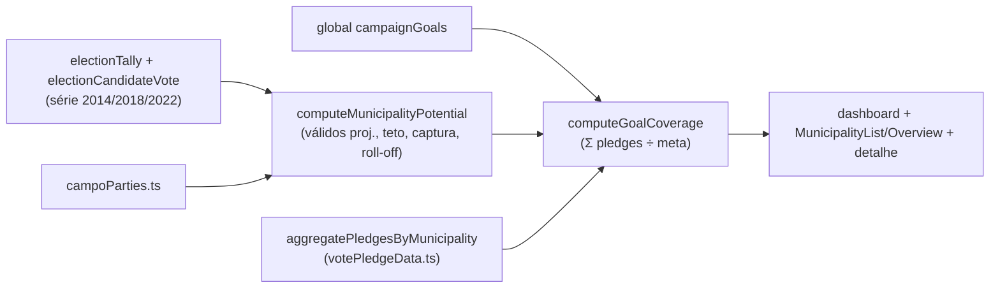

# E8 — Conta da cadeira (metas derivadas, potencial por município, cobertura)

Status: rascunho
Atualizado em: 2026-07-24 (refs sincronizadas pós-remodelagem Municípios + hardening; **A10 entregue e remodelagem em produção — dependências duras satisfeitas**; meta inicial ancorada na sessão de campo de 2026-07-23; `expectedVotes` seedados por E4R — o grupo `voteGoals` foi removido do app em 2026-07-24, a série manual por cenário é só `expectedVotes`)
Item do roadmap: [docs/roadmap.md](../roadmap.md) (seção "Inteligência de campanha", E8; plano-mestre [inteligencia-campanha.md](inteligencia-campanha.md); A10 ✓)
Impeccable: B — cobertura/metas encaixadas no dashboard, na lista de municípios e no detalhe (sem rota nova)
Appetite: ~2 dias eng; migration pequena (global `campaignGoals`) + utilities derivadas + encaixes de UI
Responsável: —

## Design (Impeccable)

Âncoras: `PRODUCT.md` (princípio 5 — métricas relativas e locais; anti-goal % estadual absoluto) / `DESIGN.md` (register `product`) · tema `data-theme='campaign'`.

Na implementação (`implement-roadmap-item`): craft compacto → critique → polish.

- **Persona / contexto:** coordenador-geral na reunião semanal; assessor conferindo "quanto falta" nas seus municípios.
- **Job principal:** responder "a conta fecha?" em uma linha — meta, comprometido, delta da semana, por município e no agregado.
- **Estratégia de cor:** Restrained; delta negativo usa o vermelho de campanha com parcimônia (não hero-metric).
- **Edit where you see:** sim — meta do município editável em contexto (Popover reusando `municipalityStaffFormActions`), como B9.
- **Anti-goals:** KPI de % estadual absoluto; contagem bruta de cadastros; gauge/velocímetro SaaS.

## Contexto

O relatório de discovery ([§5.1](../research/relatorio-entrevista-persona-campanha.md)) fixou a OMTM da campanha até 16/08: **cobertura da meta por compromissos auditáveis** (Σ pledges ÷ meta, com delta semanal como número da reunião), decomposta por município. Hoje `municipality.expectedVotes` (pessimista/média/otimista) é a única série manual por cenário (o grupo `voteGoals` foi removido em 2026-07-24), mas: não há meta estadual nem decomposição de cima para baixo; não há noção de potencial derivado (válidos projetados, captura do campo, roll-off); denominadores baseados em `aptos` inflariam municípios de abstenção estrutural (relatório §6.6/I-B); e não existe "campo" definido por ano para share intracampo. Com **E4R** ([import-planilha-projecao.md](import-planilha-projecao.md)), `expectedVotes`/`priority` chegam seedados da planilha da coordenação (~189 municípios com estimativas em 3 cenários): a decomposição meta→município nasce **reconciliando** a sugestão derivada com as estimativas reais da mesa — o valor manual continua vencendo o sugerido, e divergências grandes viram aviso, não sobrescrita. Os dados TSE necessários já estão em `electionTally` (válidos/brancos/nulos/comparecimento por cargo×ano×cidade×zona) e `electionCandidateVote`; desde o hardening 2026-07-23, a série de válidos federais T1 + votos Solla por município já existe pré-agregada no artefato commitado `src/lib/bahiaElectionAggregates.ts` — preferir o artefato para válidos projetados; teto do campo, share intracampo e roll-off continuam derivando das collections (envolver em `unstable_cache` com a tag `election-tse`, padrão dos loaders de eleições).

## Objetivos

- Global `campaignGoals` (admin group `Campanha`, staff-only): meta estadual de votos, margem, ano-base, nota.
- Utilities derivadas por município (sem persistir o derivado): válidos projetados do cargo (série 2014/2018/2022), teto do campo (majoritário 1º turno), taxa de captura, share intracampo (via `campoParties.ts`), roll-off DF×majoritária, potencial e meta sugerida (decomposição proporcional ao potencial).
- Cobertura: Σ (estimativa do cenário ativo — default **média/`central`** via A10 — `?? declaredVotes`) ÷ meta por município e agregada; delta semanal (exige C12 para série; até lá, delta vs. snapshot em memória do último load é aceitável mostrar como "—").
- Encaixes: linha de cobertura no dashboard (`campaignDashboardData.ts`), colunas meta/cobertura na lista (`MunicipalityList`/`MunicipalityListOverview`), card no detalhe do município.
- Access: tudo staff-only (`coordinator`/`advisor`); `leader` não vê metas — mesmo padrão de `expectedVotes`.
- Sanity check por TI: Σ metas dos municípios do TI vs. participação histórica do TI no voto (aviso, não bloqueio).

## Decisões travadas

- **Denominadores usam válidos projetados do cargo, nunca `aptos`** (relatório §6.6; abstenção estrutural >35% em municípios pequenos infla potencial). **Rejeitado:** `aptos` (viés pró-município-vazio); válidos da majoritária (cargo errado); eleitorado IBGE (não é cadastro eleitoral).
- **Meta estadual mora num global editável, decomposição é derivada e a estimativa por município continua editável** (`expectedVotes` manual vence a sugerida quando preenchida). Mantém julgamento humano no loop e evita reescrever E1. **Rejeitado:** meta por município 100% automática (K-C: "o erro é a conta" precisa de dono humano); collection de metas versionadas (C12 cobre auditoria via decisões).
- **"Campo" por ano é lib estática curada** `src/lib/campoParties.ts` (ano → partidos/números). **Rejeitado:** collection administrável (curadoria política rara, não CRUD); inferir por coligação do TSE (federações ≠ campo político real).
- **i18n e naming:** `campaignGoals`, `computeMunicipalityPotential`, `computeGoalCoverage`, `projectedValidVotes`, `captureRate`, `intraFieldShare`, `rollOff`; labels pt-BR.

## Questões em aberto

- **Meta estadual inicial?** **Resolvido em campo (2026-07-23 — [CUSTOMER.md](../CUSTOMER.md)):** piso projetado do coordenador = **150 mil** (2022: 129 mil) — topo da faixa da cadeira. Valor inicial do global `campaignGoals` = 150 mil, editável (margem continua dele); o QE cheio segue rejeitado como default.
- **Projeção de válidos: média simples da série ou tendência?** Opções: média 3 eleições | último ano | regressão simples. **Recomendação:** média ponderada (2022 peso 2) — barata, estável, sem cheiro de "previsão estatística" (fora de escopo).

## Abordagem proposta

Componentes:

- **`src/lib/campoParties.ts`**: mapa ano→partidos do campo (2014/2018/2022/2026), com fixture de teste.
- **`src/utilities/municipalityPotential.ts`**: deriva por município (reusa `municipalityElectionGeography.ts` para células cidade×zona e `municipalityElectoralBaseline.ts` para a série); expõe `projectedValidVotes`, `fieldCeiling`, `captureRate`, `intraFieldShare`, `rollOff`, `suggestedGoal`.
- **`src/utilities/goalCoverage.ts`**: cobertura por município/agregado consumindo `aggregatePledgesByMunicipality` (regra por cenário de [A10](cenarios-estimativa-votos.md) / `votePledgeData.ts`, default `central`) + `expectedVotes`/meta sugerida; sanity por TI via `bahiaTerritories.ts`.
- **Global `CampaignGoals`** (`src/globals/CampaignGoals.ts`): campos `stateGoal`, `margin`, `baseYear`, `note`; access staff-read/coordinator-write; hook `revalidateGlobal`.
- **UI:** linha nova em `CampaignMetricStrip` do dashboard; coluna/ordenar por cobertura em `MunicipalityList` (reusa padrão B9 para editar meta via `municipalityStaffFormActions`); card "Conta da cadeira" no detalhe.
- **Migration**: `pnpm migrate:create add_campaign_goals_global` (tabela do global). Sem mudança em collections.

## Dependências

- Duras: nenhuma pendente — **A10** entregue ([plano](cenarios-estimativa-votos.md)) e remodelagem em produção desde 2026-07-23 (schema `municipality`/`votePledge` vivo). Suave: C12 (delta semanal real da cobertura usa trajetória de pledges; até lá, sem histórico).
- Reusa: `municipalityElectoralBaseline.ts`, `municipalityElectionGeography.ts`, `votePledgeData.ts` (agregação por cenário pós-A10), `municipalityPageData.ts` (`loadMunicipalityListPageBundle`), `campaignDashboardData.ts`, `municipalityStaffFormActions.ts`, `campaignAccess.ts`.

## Não escopo

- Fila ordenada por déficit (E9 — [fila-de-alocacao.md](fila-de-alocacao.md)); histórico/trajetória (C12); recalibração de classes (E10); rollups TI além do sanity check (E12); previsão estatística (Fora de escopo do roadmap).

## Rabbit holes

- **Projeção virar modelo preditivo.** Se alguém "melhorar" com regressão/ML: viola decisão de escopo do ciclo. **Mitigação:** média ponderada fixa, documentada como não-previsão.
- **Decomposição automática sobrescrever `expectedVotes`.** **Mitigação:** meta sugerida é coluna separada; manual sempre vence; nunca escrever em `expectedVotes` por job.
- **Roll-off por zona de Salvador sem tally do majoritário na mesma malha.** Verificar cobertura de `electionTally` para presidente/governador por zona antes de expor; se faltar, roll-off só municipal (nota na UI).

## Adiado com gatilho

- **Delta semanal persistido.** Revisitar quando C12 entregar trajetória (gatilho: primeira semana com 2 snapshots).
- **Meta por cenário (Bom/Regular/Mínimo) × cobertura tripla.** Gatilho: coordenador pedir leitura por cenário na reunião (hoje: cobre contra `regular ?? suggestedGoal`).

## Referências

- `docs/roadmap.md` (seção Inteligência de campanha) · [plano-mestre](inteligencia-campanha.md) (gaps G5/G6)
- `docs/research/relatorio-entrevista-persona-campanha.md` §5.1 (OMTM), §6.6 (denominadores/roll-off), FU2 (numerador/denominador)
- `src/collections/Municipality.ts` (expectedVotes/access), `src/collections/ElectionTally.ts` (campos por cargo)
- `src/utilities/municipalityElectoralBaseline.ts`, `src/utilities/municipalityElectionGeography.ts`, `src/utilities/votePledgeData.ts`, `src/utilities/campaignDashboardData.ts`
- AGENTS.md — migrations, access staff-only, naming, transações
