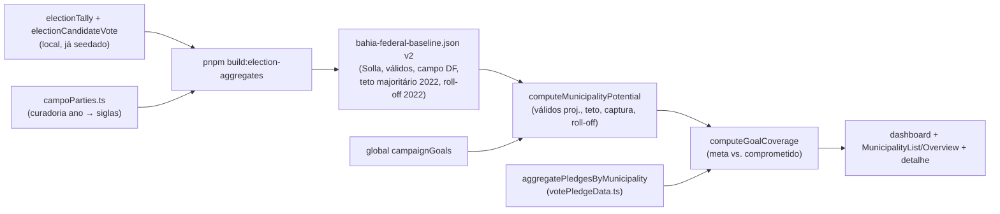

# E8 — Conta da cadeira (metas derivadas, potencial por município, cobertura)

Status: entregue em código (2026-07-24; ver "Entregue (as-built)" abaixo)
Atualizado em: 2026-07-24 (auditoria de implementação — ver "Achados da auditoria" abaixo; escopo completo confirmado com o usuário; appetite revisado ~2,5–3d; entrega registrada)
Item do roadmap: [docs/roadmap.md](../roadmap.md) (seção "Inteligência de campanha", E8; plano-mestre [inteligencia-campanha.md](inteligencia-campanha.md); A10 ✓)
Impeccable: B — cobertura/metas encaixadas no dashboard, na lista de municípios e no detalhe (sem rota nova)
Appetite: ~2,5–3 dias eng (revisado — degrau 3 da caching ladder para teto do campo/share intracampo/roll-off, ver auditoria); migration pequena (global `campaignGoals`) + artefato TSE estendido + utilities derivadas + encaixes de UI
Responsável: —

## Achados da auditoria de implementação (2026-07-24)

Confirmado contra o repositório antes do craft: dependências duras satisfeitas (A10 vivo, remodelagem em produção, `voteGoals` de fato removido); o artefato commitado [bahia-federal-baseline.json](../../src/lib/electionAggregates/bahia-federal-baseline.json) já tem `votesByYear`/`validVotesByYear` por município para 2014/2018/2022; o banco local seedado para esta sessão confirma TSE completo nos três anos (DF T1 2014/2018/2022 + ticket 2022 completo, incluindo presidente/governador por zona) — o rabbit hole "roll-off por zona sem tally do majoritário" fica **fechado por evidência para 2022** (não para 2014/2018, que só têm deputado federal).

Ajustes ao plano abaixo, travados nesta sessão:

1. **Escala.** Teto do campo / share intracampo / roll-off NÃO usam `unstable_cache` sobre as collections como a seção "Abordagem proposta" sugeria — `electionCandidateVote` tem ~100k/73k/52k linhas por ano (2022/2018/2014); varrer isso por município na lista/dashboard é exatamente o padrão que o hardening de 2026-07-23 baniu do runtime. Vai para o **degrau 3 da caching ladder**: estender o artefato commitado via `pnpm build:election-aggregates` (`campoFederalVotesByYear`, `federalTallyByYear`, `majoritarian2022`), não um loader novo com tag.
2. **Meta × comprometido (semântica).** A seção "Objetivos" abaixo (linha da cobertura) e o rabbit hole sobre `expectedVotes ?? Σ pledges` estavam ambíguos: hoje `resolveMunicipalityStaffVoteTotal` faz a expectativa **substituir** a soma dos pledges — usar isso como denominador daria 100% de cobertura nos ~189 municípios com planilha (E4R). **Travado:** `meta = expectedVotes[cenário] ?? suggestedGoal`; `comprometido = aggregate.effectiveByScenario[cenário]` (só pledges, nunca a expectativa da mesa). Cobertura = "quanto da expectativa está lastreado em compromisso auditável" — mesma regra do plano do [E9](fila-de-alocacao.md).
3. **Global sem hook de revalidação.** `revalidateGlobal` citado nos "Componentes" abaixo é cerimônia morta: `/campanha` é dinâmico com auth (nada cacheia o global) e a tag não entraria no allowlist de `revalidateRequest.ts`. O global `campaignGoals` não terá `afterChange` hook (comentário no código justificando).
4. **`campoParties.ts` não é uma segunda fonte de verdade de partido.** Já existe [electionPartySpectrum.ts](../../src/lib/electionPartySpectrum.ts) (buckets esquerda/centro/direita). `campoParties.ts` é a curadoria de **campo por ano** (2014/2018/2022/2026); um unit test prova que toda sigla do campo está no bucket `esquerda`, com exclusões documentadas.
5. **Access de global é terreno novo.** Os 4 globals existentes (`SiteSettings`, `HomePage`, `Metadata`, `PrivacyPolicy`) usam `read: () => true` / `update: Boolean(user)`; nenhum está no grupo `Campanha` nem nega leitura. `campaignGoals` precisa de access explícito (JWT de `campaignUser` alcança `/api/globals/*`).

Decisões de produto travadas na mesma sessão (detalhes na seção "Decisões travadas" e "Questões em aberto" abaixo, já atualizadas): meta estadual inicial 150.000 (editável); válidos projetados = média ponderada `(v2014 + v2018 + 2×v2022) / 4`; decomposição proporcional ao teto do campo projetado (não fórmula composta); teto do campo = presidencial do campo T1 2022 (#13) como primário, governador como leitura secundária (assumido, validar com produto); roll-off = (brancos+nulos DF) − (brancos+nulos majoritária), 2022-only.

## Entregue (as-built, 2026-07-24)

Todas as 6 fases implementadas conforme o plano de execução, com os ajustes da auditoria já incorporados:

- **Artefato v2** (`pnpm build:election-aggregates`): `campoFederalVotesByYear`, `federalTallyByYear` e `majoritarian2022` (presidente/governador T1 2022) adicionados por município a `bahia-federal-baseline.json`, ao lado de `votesByYear`/`validVotesByYear`. Curadoria `src/lib/campoParties.ts` (2014/2018/2022/2026), validada por unit test contra o bucket `esquerda` de `electionPartySpectrum.ts`. Teto de bytes do artefato revisado de 400 KB para 700 KB (`tests/unit/bahiaElectionAggregates.unit.spec.ts`).
- **Global `campaignGoals`** (`src/globals/CampaignGoals.ts`, migration `20260724_180000_add_campaign_goals_global`): `stateGoal` (default 150.000), `margin`, `baseYear`, `note`; `read` = admin/staff, `update` = admin/`isCampaignUnrestricted`; **sem** hook `afterChange` (achado #4 da auditoria — cerimônia morta, `/campanha` é dinâmico com auth). Loader `src/utilities/campaignGoals.ts` com React `cache()`.
- **Derivados puros**: `src/utilities/municipalityPotential.ts` (`projectedValidVotes`, `fieldCeiling`, `projectedFieldCeiling`, `captureRate`, `intraFieldShare`, `rollOff`, `decomposeStateGoal`, `sanityCheckSuggestedGoalsByTerritory`) e `src/utilities/goalCoverage.ts` (`meta = expectedVotes[cenário] ?? suggestedGoal`; `comprometido = aggregate.effectiveByScenario[cenário]`, nunca a expectativa da mesa — achado #2). Orquestração server-scoped em `src/utilities/municipalityGoalAccount.ts` (`cache()`-deduplicado entre dashboard/lista/detalhe).
- **UI** (Impeccable classe B, shape → craft → critique → harden): linha "Cobertura da meta" na `CampaignMetricStrip` do dashboard (`CampaignDashboard.tsx`) e do overview da lista (`MunicipalityListOverview.tsx`); nova coluna "Cobertura da meta" em `MunicipalityList.tsx` (a coluna antiga "Cobertura" foi renomeada para "Assessoria" para eliminar a ambiguidade), com célula compartilhada `MunicipalityListGoalCoverageCell.tsx` (variante `compact` para a tabela desktop, `default` para os cards mobile); card novo "Conta da cadeira" (`MunicipalityGoalAccountCard.tsx`) na aba Visão geral do detalhe do município, fixo no cenário `central` (sem seletor de cenário nessa página) — substitui o bloco "Votos estimados" que antes vivia em `MunicipalityStrategyCard.tsx`.
- **Verificação:** `tsc --noEmit`, `pnpm lint`, `pnpm exec knip`, unit + int (incl. `tests/int/campaignGoalsAccess.int.spec.ts` cobrindo a matriz de acesso por papel) e `pnpm build` verdes contra o banco local; `pnpm test:e2e` verde quando executado isolado (flakiness de timeout/`ECONNRESET` observada só sob contenção de recursos do sandbox com múltiplos dev servers em paralelo — não é regressão de código; 1 assertion ajustada para um seletor Playwright não-ambíguo pós-mudança de UI).
- **Divergências do plano original:** nenhuma decisão de produto mudou; os 6 achados da auditoria (seção acima) e as decisões travadas na sessão foram seguidos à risca. `territoryWarnings` (sanity check por TI) ficam computados e disponíveis em `municipalityPotential.ts`/`computeStatewideGoalDecomposition`, mas **não** ganharam superfície de UI nesta entrega — o brief de shape aprovado (Fase 4a) cobriu só as 4 integrações (dashboard, overview, lista, detalhe); exibir os avisos por TI é candidato natural para E12 (camada TI) ou um fill-in futuro.

### Follow-up pós-entrega (mesmo dia, feedback do usuário)

1. **Tooltips nos 4 números de diagnóstico.** O card `MunicipalityGoalAccountCard.tsx` só tinha o `CampaignInfoHint` ("?") no título; os 4 números do bloco de diagnóstico (teto do campo, captura, share intracampo, roll-off) ficaram sem explicação inline. Adicionado `GoalAccountMetric` (Tooltip do shadcn/ui, hover + foco por teclado, sem ícone de interrogação — pedido explícito do usuário) envolvendo cada par `dt`/`dd`.
2. **Majoritária 2014/2018: útil, seed expandido.** A auditoria (linha 12 acima) tinha fechado o rabbit hole do roll-off "só para 2022" citando que 2014/2018 só tinham deputado federal seedado. Decisão: essa lacuna é útil de fechar (diagnóstico histórico futuro), então `scripts/seed-tse-results.mjs` passou a importar presidente + governador também para 2014/2018 (`HISTORICAL_BASELINE_OFFICES` em `electionResultsBuild.ts`), carregando sempre os arquivos BR (nacionais) de voto/apuração — os votos presidenciais por município da Bahia vivem nesses arquivos, não nos BA. Isso expôs duplicatas de "voto em trânsito" (só existem no cargo presidente) que colidiam com o índice único de `ElectionCandidateVote`/`electionTally` em 2014 (BA, zona 154, e outras); corrigido somando os splits (`mergeDuplicateVoteRows`/`mergeDuplicateTallyRows` em `electionResultsParse.ts`). **Escopo mantido:** só o banco local ganhou os dados; o artefato commitado (`bahia-federal-baseline.json`) e as fórmulas de `municipalityPotential.ts` (teto do campo, roll-off) continuam 2022-only por design — estender isso é trabalho futuro, não pedido nesta sessão. Textos na UI/comentários que diziam "não seedado" foram corrigidos para não ficarem factualmente errados.
3. **`/impeccable critique` no card + hardening completo (mesmo dia).** Critique sobre `MunicipalityGoalAccountCard.tsx`/`CampaignInfoHint.tsx`/`MunicipalityHoverTooltip.tsx` (persistido em `.impeccable/critique/2026-07-25T01-04-34Z__omponents-campaign-municipalitygoalaccountcard-tsx.md`, 26/40) achou 2×P1 confirmados com evidência de browser real (Playwright, 1280×720 e 390×844): (a) as 4 tooltips de métrica eram **inalcançáveis por toque** — `@radix-ui/react-tooltip` ignora `pointerType: 'touch'` de propósito, e o card é usado "no campo"; (b) a bolha colidia (`side` flip do Radix) e cobria a linha "Cobertura da meta" logo abaixo do título. Mais 2×P2 (idiomas de disclosure incompatíveis no mesmo card — Popover clica-e-fica-aberto vs. Tooltip hover/foco que nunca abre no clique; cópia densa com referência cruzada entre "Captura" e "Share intracampo" que não podem estar abertas ao mesmo tempo) e 1×P3 (barra de progresso a 0% quase invisível, `h-1`). Todos endereçados na mesma sessão: `MunicipalityHoverTooltip.tsx` ganhou estado controlado com um `onPointerUp` que só reage a `pointerType === 'touch'` (mouse/teclado continuam 100% no hover/foco nativo do Radix — sem o bug simétrico de "clique fecha o que o hover acabou de abrir") e um listener de `pointerdown` fora do gatilho que fecha a bolha (Radix não tem dismiss-layer para Tooltip, só para Popover) — abrir a métrica B fecha a métrica A "de graça", já que é só um "toque fora" do ponto de vista de A. `GoalAccountMetric` trocou o `div tabIndex` por um `<button>` real com `aria-label` (toque confiável + nome acessível anunciado antes de abrir, achado da persona Sam) e `side="right" align="start"` (a bolha nunca mais colide no eixo vertical com "Cobertura da meta" — cresce para o lado e para baixo, não para cima). Cópia das 4 métricas dividida em frase-líder (termo em negrito) + linha de fórmula secundária, sem mais cross-reference (Share intracampo agora reexplica o denominador inline). Barra de progresso local (`className="h-2"`, só nesta instância — `Progress` é compartilhado com planos/lista/dashboard, não alterado globalmente). Verificado com toque sintético via Playwright (`PointerEvent` com `pointerType: 'touch'`) em 1280×720 e 390×844: abre no toque, troca de métrica fecha a anterior, toque fora fecha, nunca cobre a linha de cobertura. `tsc`/`lint`/`knip`/unit (323 testes)/`pnpm build`/Aikido verdes; só os 2 arquivos de componente mudaram.

## Design (Impeccable)

Âncoras: `PRODUCT.md` (princípio 5 — métricas relativas e locais; anti-goal % estadual absoluto) / `DESIGN.md` (register `product`) · tema `data-theme='campaign'`.

Na implementação (`implement-roadmap-item`): craft compacto → critique → polish.

- **Persona / contexto:** coordenador-geral na reunião semanal; assessor conferindo "quanto falta" nas seus municípios.
- **Job principal:** responder "a conta fecha?" em uma linha — meta, comprometido, delta da semana, por município e no agregado.
- **Estratégia de cor:** Restrained; delta negativo usa o vermelho de campanha com parcimônia (não hero-metric).
- **Edit where you see:** sim — meta do município editável em contexto (Popover reusando `municipalityStaffFormActions`), como B9.
- **Anti-goals:** KPI de % estadual absoluto; contagem bruta de cadastros; gauge/velocímetro SaaS.

## Contexto

O relatório de discovery ([§5.1](../research/relatorio-entrevista-persona-campanha.md)) fixou a OMTM da campanha até 16/08: **cobertura da meta por compromissos auditáveis** (Σ pledges ÷ meta, com delta semanal como número da reunião), decomposta por município. Hoje `municipality.expectedVotes` (pessimista/média/otimista) é a única série manual por cenário (o grupo `voteGoals` foi removido em 2026-07-24), mas: não há meta estadual nem decomposição de cima para baixo; não há noção de potencial derivado (válidos projetados, captura do campo, roll-off); denominadores baseados em `aptos` inflariam municípios de abstenção estrutural (relatório §6.6/I-B); e não existe "campo" definido por ano para share intracampo. Com **E4R** ([import-planilha-projecao.md](import-planilha-projecao.md)), `expectedVotes`/`priority` chegam seedados da planilha da coordenação (~189 municípios com estimativas em 3 cenários): a decomposição meta→município nasce **reconciliando** a sugestão derivada com as estimativas reais da mesa — o valor manual continua vencendo o sugerido, e divergências grandes viram aviso, não sobrescrita. Os dados TSE necessários já estão em `electionTally` (válidos/brancos/nulos/comparecimento por cargo×ano×cidade×zona) e `electionCandidateVote`; desde o hardening 2026-07-23, a série de válidos federais T1 + votos Solla por município já existe pré-agregada no artefato commitado `src/lib/bahiaElectionAggregates.ts`. **Teto do campo, share intracampo e roll-off também vão para esse artefato** (não para um loader novo com `unstable_cache`): `electionCandidateVote` tem ~100k/73k/52k linhas por ano (2022/2018/2014) e a lista/dashboard varreriam isso por município a cada carregamento — exatamente o padrão de runtime que o hardening de 2026-07-23 baniu. `pnpm build:election-aggregates` passa a escrever `campoFederalVotesByYear`, `federalTallyByYear` e `majoritarian2022` por município, ao lado de `votesByYear`/`validVotesByYear` já existentes.

## Objetivos

- Global `campaignGoals` (admin group `Campanha`, staff-only): meta estadual de votos, margem, ano-base, nota.
- Utilities derivadas por município (sem persistir o derivado): válidos projetados do cargo (série 2014/2018/2022), teto do campo (majoritário 1º turno), taxa de captura, share intracampo (via `campoParties.ts`), roll-off DF×majoritária, potencial e meta sugerida (decomposição proporcional ao potencial).
- Cobertura por município e agregada, para os três cenários: `meta = expectedVotes[cenário] ?? suggestedGoal` (derivado); `comprometido = aggregate.effectiveByScenario[cenário]` (só Σ pledges — declarado/estimado por leadership, nunca a expectativa da mesa); `coverageRatio = comprometido ÷ meta`. Cenário ativo escolhido no cliente (`MunicipalityEstimateScenarioProvider`, default `central`). Delta semanal (exige C12 para série; até lá, delta vs. snapshot em memória do último load é aceitável mostrar como "—").
- Encaixes: linha de cobertura no dashboard (`campaignDashboardData.ts`), colunas meta/cobertura na lista (`MunicipalityList`/`MunicipalityListOverview`), card no detalhe do município.
- Access: tudo staff-only (`coordinator`/`advisor`); `leader` não vê metas — mesmo padrão de `expectedVotes`.
- Sanity check por TI: Σ metas dos municípios do TI vs. participação histórica do TI no voto (aviso, não bloqueio).

## Decisões travadas

- **Denominadores usam válidos projetados do cargo, nunca `aptos`** (relatório §6.6; abstenção estrutural >35% em municípios pequenos infla potencial). **Rejeitado:** `aptos` (viés pró-município-vazio); válidos da majoritária (cargo errado); eleitorado IBGE (não é cadastro eleitoral).
- **Meta estadual mora num global editável, decomposição é derivada e a estimativa por município continua editável** (`expectedVotes` manual vence a sugerida quando preenchida). Mantém julgamento humano no loop e evita reescrever E1. **Rejeitado:** meta por município 100% automática (K-C: "o erro é a conta" precisa de dono humano); collection de metas versionadas (C12 cobre auditoria via decisões).
- **"Campo" por ano é lib estática curada** `src/lib/campoParties.ts` (ano → partidos/números). **Rejeitado:** collection administrável (curadoria política rara, não CRUD); inferir por coligação do TSE (federações ≠ campo político real).
- **i18n e naming:** `campaignGoals`, `computeMunicipalityPotential`, `computeGoalCoverage`, `projectedValidVotes`, `captureRate`, `intraFieldShare`, `rollOff`; labels pt-BR.

## Questões em aberto

- **Meta estadual inicial?** **Resolvido em campo (2026-07-23 — [CUSTOMER.md](../CUSTOMER.md)):** piso projetado do coordenador = **150 mil** (2022: 129 mil) — topo da faixa da cadeira. Valor inicial do global `campaignGoals` = 150 mil, editável (margem continua dele); o QE cheio segue rejeitado como default.
- **Projeção de válidos: média simples da série ou tendência?** **Resolvido (auditoria 2026-07-24):** média ponderada com peso 2 para 2022 — `(v2014 + v2018 + 2×v2022) / 4`. Barata, estável, documentada como não-previsão (fora de escopo regressão/tendência).
- **Teto do campo: presidencial ou governador?** **Assumido (validar com produto):** presidencial do campo T1 2022 (#13) como série primária; governador (também #13, mesmo campo) como leitura secundária de diagnóstico — presidencial tem participação mais homogênea entre municípios pequenos e grandes.
- **Forma da decomposição meta→município?** **Resolvido:** proporcional ao teto do campo projetado — `suggestedGoal_i = metaEfetiva × tetoProjetado_i / Σ tetoProjetado` — não uma fórmula composta com captura/share/roll-off como pesos (isso viraria um modelo preditivo multifatorial, rejeitado). Captura, share intracampo e roll-off ficam como **colunas de diagnóstico**, não como entradas da conta.
- **Roll-off: quais anos?** **Resolvido:** só 2022 por design (artefato/fórmulas não cortam a fatia majoritária para outros anos); nota na UI explicando a limitação em vez de calcular para 2014/2018. O seed local passou a importar majoritária 2014/2018 também (ver "Follow-up pós-entrega" acima), mas isso não muda esta decisão — é dado disponível para uso futuro, não uma extensão da conta atual.

## Abordagem proposta

Componentes:

- **`src/lib/campoParties.ts`**: mapa ano→partidos do campo (2014/2018/2022/2026), validado contra `electionPartySpectrum.ts` (unit test), com exclusões documentadas.
- **`scripts/build-election-aggregates.mjs` + `src/lib/bahiaElectionAggregates.ts`**: artefato estendido (v2) — por município, além de `votesByYear`/`validVotesByYear`, agora `campoFederalVotesByYear` (3 anos), `federalTallyByYear` (comparecimento/brancos/nulos) e `majoritarian2022` (presidente/governador T1: votos + brancos/nulos/válidos).
- **`src/utilities/municipalityPotential.ts`**: deriva por município a partir do artefato (nenhuma query no runtime); expõe `projectedValidVotes`, `fieldCeiling`, `captureRate`, `intraFieldShare`, `rollOff`, `suggestedGoal`.
- **`src/utilities/goalCoverage.ts`**: `meta = expectedVotes[cenário] ?? suggestedGoal`; `comprometido = aggregate.effectiveByScenario[cenário]` (só Σ pledges, via [A10](cenarios-estimativa-votos.md) / `votePledgeData.ts`, default `central`) — a expectativa da mesa nunca substitui os pledges no denominador de cobertura; sanity por TI via `bahiaTerritories.ts`.
- **Global `CampaignGoals`** (`src/globals/CampaignGoals.ts`): campos `stateGoal`, `margin`, `baseYear`, `note`; access staff-read/coordinator-write; **sem** hook de revalidação (`/campanha` é dinâmico com auth, nada cacheia este global — ver "Achados da auditoria").
- **UI:** linha nova em `CampaignMetricStrip` do dashboard; coluna/ordenar por cobertura em `MunicipalityList` (reusa padrão B9 para editar meta via `municipalityStaffFormActions`); card "Conta da cadeira" no detalhe.
- **Migration**: `pnpm migrate:create add_campaign_goals_global` (tabela do global). Sem mudança em collections.

## Dependências

- Duras: nenhuma pendente — **A10** entregue ([plano](cenarios-estimativa-votos.md)) e remodelagem em produção desde 2026-07-23 (schema `municipality`/`votePledge` vivo). Suave: C12 (delta semanal real da cobertura usa trajetória de pledges; até lá, sem histórico).
- Reusa: `bahiaElectionAggregates.ts` (artefato v2), `municipalityElectionGeography.ts` (loaders do artefato v2), `votePledgeData.ts` (agregação por cenário pós-A10), `campaignMunicipalityScope.ts` (`loadMunicipalityScope`), `campaignDashboardData.ts`, `municipalityStaffFormActions.ts`, `campaignAccess.ts`.

## Não escopo

- Fila ordenada por déficit (E9 — [fila-de-alocacao.md](fila-de-alocacao.md)); histórico/trajetória (C12); recalibração de classes (E10); rollups TI além do sanity check (E12); previsão estatística (Fora de escopo do roadmap).

## Rabbit holes

- **Projeção virar modelo preditivo.** Se alguém "melhorar" com regressão/ML: viola decisão de escopo do ciclo. **Mitigação:** média ponderada fixa, documentada como não-previsão.
- **Decomposição automática sobrescrever `expectedVotes`.** **Mitigação:** meta sugerida é coluna separada; manual sempre vence; nunca escrever em `expectedVotes` por job.
- **Roll-off por zona de Salvador sem tally do majoritário na mesma malha.** **Fechado por evidência (auditoria 2026-07-24):** o banco local seedado tem presidente/governador T1 e T2 por zona para 2022 (450 células por escopo, cobrindo as 19 zonas de Salvador). Mais tarde no mesmo dia o seed passou a cobrir presidente/governador para 2014/2018 também (ver "Follow-up pós-entrega"), mas roll-off continua 2022-only — decisão de escopo da fórmula, não limitação de dado.

## Adiado com gatilho

- **Delta semanal persistido.** Revisitar quando C12 entregar trajetória (gatilho: primeira semana com 2 snapshots).
- **Meta por cenário (pessimista/central/otimista) × cobertura tripla.** Resolvido nesta sessão como escopo do próprio E8 (não mais adiado): cobertura é computada para os três cenários no servidor, seletor de cenário fica no cliente (`MunicipalityEstimateScenarioProvider`, default `central`).
- **Modelo de disclosure do grid de diagnóstico (`GoalAccountMetric`) ainda não "assentado" para mais métricas.** O `/impeccable critique` pós-hardening (26/40; ver Follow-up #3) levantou, em "Questions to Consider", se hover/foco continua o mecanismo certo de explicação conforme **E9/E10/B13/E11/E12/E13/E14** adicionam métricas a este mesmo card, e se "Captura"/"Share intracampo" deveriam virar um único número com toggle de denominador em vez de dois números cada um explicando o outro por tooltip. Nenhum achado adicional confirmado nesta sessão (é pergunta de design, não bug) — **não registrado como item**; gatilho: revisitar quando a próxima entrega de E9–E14 for adicionar uma 5ª métrica a esta `dl`/grid (nesse ponto, decidir layout/idioma de disclosure antes de replicar `GoalAccountMetric` de novo). Largura tablet/foldable intermediária também não testada — mesmo gatilho.

## Referências

- `docs/roadmap.md` (seção Inteligência de campanha) · [plano-mestre](inteligencia-campanha.md) (gaps G5/G6)
- `docs/research/relatorio-entrevista-persona-campanha.md` §5.1 (OMTM), §6.6 (denominadores/roll-off), FU2 (numerador/denominador)
- `src/collections/Municipality.ts` (expectedVotes/access), `src/collections/ElectionTally.ts` (campos por cargo)
- `src/utilities/municipalityElectoralBaseline.ts`, `src/utilities/municipalityElectionGeography.ts`, `src/utilities/votePledgeData.ts`, `src/utilities/campaignDashboardData.ts`
- AGENTS.md — migrations, access staff-only, naming, transações
