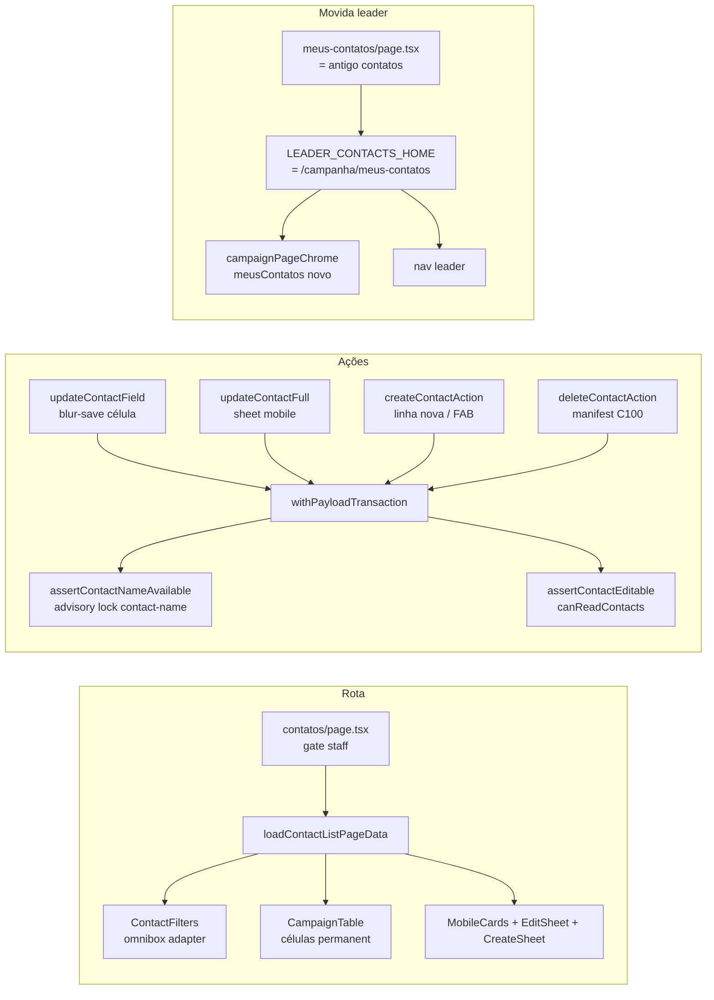

# Impl: C139 — Contatos — página da entidade Contact (lista desktop + cards mobile)

Status: aprovado
Atualizado em: 2026-08-13
Issue: #728
Intenção: docs/plans/contatos-pagina-da-entidade-contact.md
Appetite restante: herdado (~2–3 dias eng)

## Leitura da intenção

- **Outcome:** `/campanha/contatos` é a página da ficha `Contact` — tabela desktop + cards
  mobile, omnibox (busca geral por nome/e-mail/qualquer telefone + facets por propriedade e
  vínculo), ordenação por nome/cidade/estado/e-mail, edição in-place sem moldura,
  criação (linha desktop / sheet mobile) e apagar com alerta de vínculos. Leader não acessa;
  `/campanha/pessoas` permanece no ar; nenhuma migration.
- **O que NÃO negociar:** ficha pura (nada de colunas de capacidade/território/papel);
  vínculos só como facet; escopo = `canReadContacts` (assessor vê só a carteira, leader
  lockdown); nome obrigatório e único na criação com aviso amigável preservando o digitado;
  apagar com manifest de entidades linkadas; leader tool move para `/campanha/meus-contatos`
  (decisão A travada).
- **O que reavaliar:**
  - A hipótese "`updatePersonContact` é o padrão de escopo" precisa de ajuste: a regra C116
    ("assessor edita só o que tem liderança/dobradinha legível") não cobre fichas que o
    assessor vê só por apoiador. A página de fichas usa **"edita o que vê" = ficha legível
    pelo `canReadContacts`** — regra mais simples e coerente com o aceite.
  - A hipótese "células reusam `CampaignInlineEditableCell`" cobre só texto; gênero/estado
    são selects e telefones é lista — precisa de duas células novas + param trization leve
    do componente compartilhado.

## Abordagem recomendada

**Opções consideradas:**

- **A (escolhida): rota nova em `/campanha/contatos` + leader tool movida para
  `/campanha/meus-contatos`** — decisão de produto travada no gate; toca 6 constantes/catalogos
  - 3 testes, todos mapeados.
- **B: leader tool em subrota (`/campanha/contatos/meus`)** — rejeitada no gate (decisão A).
- **C: dados por `payload.find` único em `contact` com `user` threadado** (sem merge de 3
  fontes como pessoas) — escolhida: a lista É a ficha; `canReadContacts` já devolve o escopo
  `{ id: { in } }`; vínculos entram só como facets (3 queries `select: { contact: true }`).
- **D: reusar `assertPersonContactEditable` (C116)** — rejeitada: exclui fichas de
  apoiadores do escopo do assessor; a página é da ficha, não de capacidades.
- **E: `q` com `'phones.value': { like }` no where** — escolhida (Payload suporta subcampo de
  array); fallback verificado na fase tracer: se o adapter falhar, filtra `q` em memória
  (a lista é uma fonte só — custo igual).
- **F: edição do sheet mobile como 7 actions blur** — rejeitada: o sheet é um formulário
  único; uma action `updateContactFull` (schema completo) é um write atômico.
- **G: telefones da célula por input/blur com semântica "set primary"** (contrato C116) —
  rejeitada para a ficha: editar o 2º telefone não deve reordená-lo; a célula commita a
  **lista inteira** (`field: 'phones'`, contrato C112 que já existe no schema).

**Recomendação:** A+C+E+G — o chassis de listas do Pass 2 e os contratos de ficha já
existentes cobrem tudo; o trabalho novo é a camada de domínio de contatos (URL state,
loader, ações) + duas células novas + os dois sheets + a movida do leader tool.

### Componentes / mudanças

**Movida do leader tool (fase 1):**

- **`LEADER_CONTACTS_HOME`** (`src/lib/campaignPaths.ts`): `'/campanha/meus-contatos'`.
- **`src/app/(campaign)/campanha/(app)/contatos/page.tsx`** → `meus-contatos/page.tsx`
  (conteúdo igual; metadata `meusContatos`).
- **`campaignPageChrome.ts`**: novo `meusContatos` no catálogo (copy atual do leader);
  `contatos` ganha copy de staff ('Fichas da campanha — atualize dados e fale com as
  pessoas', do draft); regra de path `LEADER_CONTACTS_HOME` → `meusContatos` + regra nova
  `/campanha/contatos` → `contatos`.
- **`nav.ts`**: leaderNav usa a constante (automático); staffNav ganha entrada 'Contatos'.
- **`campaignPageActor.ts`**: denyRedirect do leader já usa a constante (automático).
- **`campaignQuickActionMount.ts`**: `isLeaderContactsPath` usa a constante (automático);
  `shouldMountQuickActionsFab` passa a retornar `false` para `/campanha/contatos` (staff —
  o FAB de criação da página substitui o de ações rápidas; FAB de IA permanece, é montado
  à parte).
- **`campaignQuickActionRegistry.ts`**: nada muda (rota leader ≠ contatos staff).
- **`campaignHomeActions.ts` / `campaignNavigationUrls.ts`**: usam a constante — o destino
  `leaderContacts` do AI continua válido no caminho novo.

**Domínio de contatos:**

- **`src/utilities/contacts/contactListUrl.ts`** (puro, espelho de `peopleListUrl`):
  state `{ page, q?, genders?, states?, cities?, ausencias?, vinculos?, sort?, dir? }`;
  params `q|gender|state|city|ausencia|vinculo|sort|dir|page`; parse/canonicalize via
  `resolveListUrl`; `ausencia` e `vinculo` com parse **sem** `parseExhaustiveEnumParam`
  (selecionar todos ≠ nenhum — mesmo racional do umbrella C125); sort keys
  `name|cidade|estado|email` (defaults asc); `contactPageSize = 25`; `buildContactListWhere`
  (q por `or: name like / email like / 'phones.value' like`; demais filtros em memória);
  labels: gênero (4 valores), UFs (`CitiesByState`), ausências (`sem_telefone|sem_email`),
  vínculos (`liderancas|dobradinhas|assessores|equipe`).
- **`src/utilities/contacts/contactListData.ts`** (server-only, espelho de `peopleData`):
  `loadContactListPageData(payload, user, state)` — 1 query `contact` (depth 0, limit 0,
  `user` + `overrideAccess: false` — o escopo é o `canReadContacts` da própria collection)
  - 3 queries de vínculo (`leadership`/`stateDeputy` com `user` threadado; `campaignUser`
    com `overrideAccess: true` justificado — mesmo precedente da fonte staff de pessoas —
    merge escopado pelo conjunto de contatos legíveis); facets do conjunto escopado com
    valores selecionados unidos (padrão `peopleFilterFacetsFromRows`); filtro/sort em memória
    (nulls last, tie-break nome→id); paginação em memória.
- **`src/utilities/contacts/contactNameInvariant.ts`**: `assertContactNameAvailable`
  (padrão `assertStateDeputyNameAvailable`): normalização = trim + colapso de espaços +
  minúsculas; lock `contact-name:{normalized}`; query `name: { like: normalized }` (ILIKE
  contains) + conferência exata em memória (cobre fichas com espaços duplicados); throw
  `CONTACT_NAME_CONFLICT_MESSAGE` ('Já existe um contato com este nome — confira a lista
  antes de salvar.'). Vale para criação E renomeação manual (rabbit hole da intenção).
- **Migration:** nenhuma (schema intocado — valores de enum inalterados).

**Ações (`src/app/(campaign)/campanha/actions/contact.ts`, 'use server):**

- **`updateContactField`** — blur-save das células desktop: schema = `contactFieldUpdateSchema`
  estendido com branches `gender|state|city|postalCode` (aditivo, o switch de person.ts
  ignora branches novas); `withPayloadTransaction`; `reloadStaffActor`; `assertContactEditable`
  (unrestricted passa; advisor: ficha legível com `user` + `overrideAccess: false` — "edita o
  que vê"); branch `name` → `assertContactNameAvailable`; write `overrideAccess: true`
  (justificado pelo gate + escopo — mesmo precedente do `updatePersonContactRecord`);
  revalida `/campanha/contatos` + pessoas/liderancas/dobradinhas.
- **`updateContactFull`** — sheet mobile: schema completo da ficha (zod novo
  `contactFullUpdateSchema`), mesmos gate/escopo/invariante; write atômico.
- **`createContactAction`** — linha desktop / sheet mobile: `contactCreateSchema` (name
  obrigatório [2..120], email opcional, phones array dedupe, gender opcional, `state`
  obrigatório — a collection exige, city/CEP opcionais); `reloadStaffActor` (criação =
  equipe, incl. assessor — a ficha sem vínculo nasce invisível para o assessor, comportamento
  aceito, ver rabbit holes); `assertContactNameAvailable`; `payload.create` com
  `overrideAccess: true` justificado (access.create é admin-only; o gate staff + invariante
  são a autorização).
- **Apagar** — reusa o contrato C100: `getContactDeleteManifestAction` / `deleteContactAction`
  via `loadPersonDeleteManifest` / `deletePersonRecord` com `reloadUnrestrictedActor`
  (coordenador/candidato — botão só para unrestricted, precedente `canDelete` de pessoas).
- **`src/app/(campaign)/campanha/(app)/contatos/formActions.ts`**: ladder
  `runCampaignFormAction` + safeMessages (nome conflito, fora de escopo, telefone inválido,
  duplicado).

**Access / Consent:** `canReadContacts` (leitura, já existe), `canManageContacts` não muda;
nenhum Consent novo (dados internos de ficha). Locks: `contact-name:{normalized}`.

**UI (Impeccable C — rota nova, shape → craft → critique → polish):**

- **Reuso:** `CampaignListOmnibox` (chips no input), `CampaignSortableHead` (C117),
  `CampaignTable` + `CampaignColumnPicker`, `CampaignListPagination`, `CampaignListFooter`,
  `CampaignListSheetProvider`, `useCampaignListFilterNavigation`, `CampaignTransitionAnchor`.
- **`CampaignInlineEditableCell`** (compartilhado, mudança aditiva): `placeholder?` prop
  (default '—') e `field` union ganha `'city' | 'postalCode'` — as 4 células de texto
  (nome/e-mail/cidade/CEP) usam `permanent` com placeholders 'Sem e-mail'/'Sem telefone'
  nos vazios (placeholder vem da célula: email/city/CEP sem valor → label pt-BR).
- **`src/components/campaign/contacts/ContactSelectCell.tsx`** (novo, client): select nativo
  sem moldura para gênero (4 valores, label do collection alterado) e estado (27 UFs);
  onChange commita via `formAction` (`field: gender|state`); erro → reverte + toast.
- **`ContactPhonesCell.tsx`** (novo, client): inputs empilhados sem moldura (máscara
  `formatBrazilianPhoneInput`); blur/Enter de qualquer linha commita a **lista inteira**
  (`field: 'phones'`, empties descartados antes do schema); "+" adiciona linha; Escape
  descarta o draft.
- **`ContactCreateRow.tsx`** (novo, client): linha vazia no topo da tabela (fundo destacado,
  inputs sem moldura), Salvar (inativo sem nome) / Descartar; conflito → mensagem na linha
  mantendo o digitado; `ContactCreateButton` no trailing do omnibox (desktop) + FAB móvel
  (criação; `md:hidden`, mesma posição do quick-actions FAB) — estado compartilhado por um
  provider client simples.
- **Mobile:** `ContactMobileCard` (nome, secundária = telefone ?? e-mail, chip gênero +
  "Cidade · Estado", ações WhatsApp/e-mail/Apagar) + `ContactEditSheet` (todos os campos
  full-bleed com divisórias, `PhonesFieldEditor` form mode para telefones, "Apagar contato"
  vermelho, Cancelar/Salvar via footer custom) + `ContactCreateSheet` (mesmo form vazio).
- **`ContactDeleteDialog.tsx`** (novo, client): alerta com manifest do `loadPersonDeleteManifest`
  (lideranças com municípios, dobradinhas, pledges, invites, apoiadores, atualizações,
  contas, ficha anonimizada) — reusa o tipo e a enumeração do C100.
- **Colunas:** Nome, Gênero, Telefone, E-mail, Cidade, Estado, CEP, Ações (ações = coluna
  obrigatória). `CAMPAIGN_LIST_IDS` ganha `'contatos'`; default hidden `['postalCode']`.
- **Chrome/copy:** catálogo `contatos` (staff) + `meusContatos` (leader).

### Dados → forma

- Forma escolhida: valores da ficha direto nas células/inputs (edição in-place); facets como
  seeds estáticos + conjuntos data-driven (cidades distintas do escopo); sem agregados —
  nenhum KPI na superfície (decisão de produto "Vou apresentar dados? Não").
- Rejeitada: COUNT(\*) FILTER SQL (sem KPI que justifique), agregado por página.

## Fases verificáveis

1. **Movida do leader tool** — constante + rota + chrome + nav + FAB mount; atualiza os
   testes que pinam o path (`leaderContactsQuickActions`, `campaignHomeActions`,
   `campaignNavigationUrls`, `campaignPageChrome`, e2e `campaignPeople` lockdown). Gate
   unit + e2e da área leader verdes.
2. **Tracer do domínio** — `contactListUrl` + `contactListData` + verificação do
   `'phones.value'` no adapter Postgres (fallback em memória se falhar) + tests unit puros
   (parse/canonical/where/filtro/sort/facets). Gate unit verdes.
3. **Ações** — `contactNameInvariant`, schemas, `actions/contact.ts`, `formActions.ts`,
   `Contact` gender label ('Outro' → 'Não binário', sem migration — verificar grep de
   testes que pinam a label). Gate unit verdes.
4. **UI desktop** — células (param trization + 2 novas), coluna de ações, create row,
   omnibox adapter, column picker. Shape → craft → critique → polish (Impeccable C).
5. **UI mobile** — cards, sheets (edição/criação), FAB, apagar no card/sheet.
6. **Gates + e2e** — `tests/e2e/campaignContacts.e2e.spec.ts` novo (criação com conflito,
   edição blur, facet, q por telefone, sort, cards/sheet mobile, apagar com manifest,
   escopo assessor) + `pnpm gate:fast` + full local.

## Rabbit holes / Não escopo (engenharia)

- **Não** empurrar filtros de vínculo para o where SQL (facet de joins exige o catálogo
  por ficha — 3 queries limit 0 são o padrão de pessoas).
- **Não** criar aggregate SQL de KPI (não há KPI no aceite).
- **Não** dedupe retroativo de nomes nem unicidade no import CSV (rabbit hole de produto
  confirmado).
- **Não** edição em massa, filtros salvos (B18 fica disponível), coluna de vínculos.
- **Não** alterar o FAB de IA, a página de Pessoas, listas especializadas.
- Ficha criada por assessor sem vínculo fica invisível para ele próprio (escopo
  `canReadContacts` exige vínculo) — comportamento aceito no v1, anotado para produto.

## Riscos e mitigação

- **`'phones.value'` no where do adapter** — testar na fase 2; fallback: `q` em memória
  (uma fonte só, custo igual ao de pessoas).
- **`canReadContacts` com `id: in` grande (coordinator = `true`, advisor/leader = lista)** —
  mesmo custo do acesso atual da collection; sem mudança de contrato.
- **Write `overrideAccess: true` em `contact`** — sempre precedido do gate staff +
  escopo/invariante na mesma transação; comentário de justificativa no local (padrão do
  repo).
- **`CampaignInlineEditableCell` compartilhado** — mudança aditiva (prop opcional + union);
  nenhum usuário atual quebra; `pnpm test` da suíte de pessoas cobre.
- **Tabela com ~7 inputs por linha × 25 linhas** — precedente de pessoas (células permanent);
  inputs sem estado de edição são baratos; verificar com e2e que a página não degrada.
- **Label de gênero 'Outro' → 'Não binário'** — valores de enum inalterados (sem
  migration); grep de testes que pinam a label antes.

## Aceite de engenharia

- [ ] Aceite de produto da intenção coberto (ficha pura, facets, edição onde se vê,
      criação com nome único, apagar com manifest, leader fora, Pessoas no ar, sem migration)
- [ ] Invariantes AGENTS/engineering-standards (gate staff por página, tx + locks nas
      escritas multi-etapa, `user` threadado na leitura, overrideAccess justificado)
- [ ] Testes de domínio previstos (unit: URL state/where/invariante de nome; int/e2e:
      escopo assessor, lockdown leader no caminho novo, conflito de nome, apagar com manifest)
- [ ] `pnpm gate:fast`, `pnpm build` local, Aikido sem novos findings nos arquivos editados

Self-score decision-quality: 4/5 — decisões mapeadas a precedentes verificados no código;
único ponto de validação em runtime é o subcampo de array no where (fallback definido).
