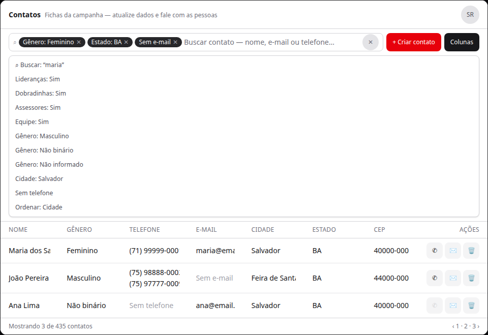
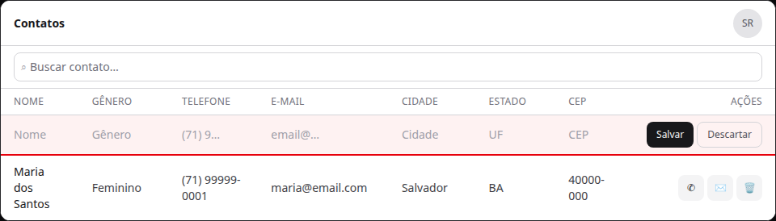
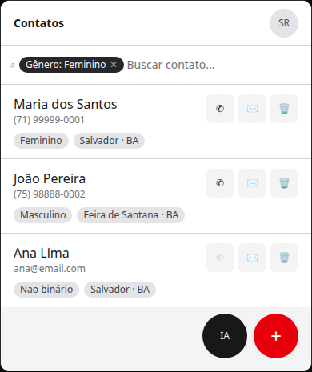
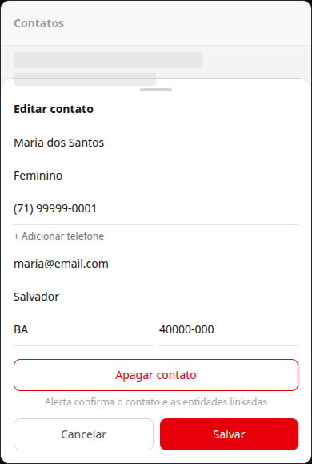

# Contatos — página da entidade Contact (fichas da campanha)

Status: rascunho
Atualizado em: 2026-08-13
Issue: #728
Priority: P1
Model: composer-2.5
Impeccable: C — fluxo novo: rota nova + tabela desktop + cards mobile + omnibox
Rascunho UI: docs/plans/contatos-pagina-da-entidade-contact-ui-draft.html
Appetite: ~2–3 dias eng; uma rota nova com chassis existentes
Responsável: —

## Intenção

A página de Pessoas (`/campanha/pessoas`) nasceu de uma necessidade real — editar o contato de todo mundo rápido num lugar só — mas o que ela virou (lista all-featuring, com colunas de capacidade por território) não tem caso de uso: a mesa não navega por capacidades nela, e cada lista especializada já faz isso melhor. O que a mesa realmente precisa é **uma lista de fichas de contato**: ver os dados de contato de qualquer pessoa da campanha num lugar só, atualizar ficha (nome, e-mail, telefones, gênero, estado, cidade, CEP) e **contatar pessoas específicas** (WhatsApp/e-mail) sem saltar entre listas.

O padrão que deu certo — **toda entidade de pessoa tem uma ficha `Contact`** — é exatamente a fundação do caso de uso: a ficha é a fonte única de dados de contato. Esta entrega constrói a página da ficha. A página de Pessoas **fica no ar como referência** enquanto esta nasce (e cai depois, em decisão futura — ver Fora de escopo).

## Persona e fluxo

- **Persona / contexto:** coordenação e assessores na mesa, com um celular na mão ("preciso falar com fulana") ou editando a ficha de quem entrou na campanha.
- **Job principal:** achar a pessoa por qualquer dado de contato (nome, e-mail, telefone, cidade…), ver a ficha completa e atualizar o que estiver errado, e partir dela para o contato (WhatsApp / e-mail).
- **Fluxo desejado:** abre `/campanha/contatos` → vê a lista de fichas (tabela no desktop, cards no mobile) → filtra na omnibox por cada propriedade da ficha (gênero, estado, cidade, ausências como "sem telefone") e/ou busca geral → ordena → edita a ficha onde vê (nome, e-mail, telefones, gênero, estado, cidade, CEP) → contata pela ação da linha (WhatsApp / e-mail / copiar telefone).
- **Anti-goals de produto:** **não** vira a página de Pessoas de novo — sem colunas de capacidade (assessora/lidera/dobra/apoiador), sem territórios, sem papel; **não** é segundo cadastro de pessoa (a ficha continua sendo `Contact`); **não** substitui as listas especializadas (`/liderancas`, `/dobradinhas`, `/apoiadores`, `/assessores` seguem intocadas); **não** é edição em massa / spreadsheet.

## Decisões de produto (travadas com o humano em 2026-08-13)

- **A página é da ficha `Contact`, pura.** Colunas desktop, nesta ordem: **Nome, Gênero, Telefone, E-mail, Cidade, Estado, CEP**. Sem coluna de vínculos — foi o que matou a página de Pessoas.
- **Gênero (vocabulário de produto):** Masculino, Feminino, **Não binário**, Não informado — facet e edição usam exatamente esses 4 valores.
- **Busca geral cobre telefone.** O `q` da omnibox casa nome, e-mail e **qualquer** telefone da ficha (multi-telefone, C112) — absorve o gatilho de C121 ("tenho um número na mão, acho a pessoa").
- **Filtros por propriedade da ficha:** gênero, estado, cidade, ausências ("sem telefone", "sem e-mail"). **Filtros de vínculo** (só facet, nunca coluna): **Lideranças, Dobradinhas, Assessores, Equipe** (nome pt-BR que cobre assessores/coordenadores/candidato — "Equipe" assumido; facet booleano "Sim" para cada vínculo).
- **Ordenação:** pelas colunas relevantes (nome default, cidade, estado, e-mail) — padrão C117 (header sortable + omnibox). Sem ordenação por telefone.
- **Edição onde se vê (desktop):** **as células de dados são inputs sem moldura** — sem borda, sem fundo, sem destaque; "somem" na célula e só mostram o valor (salva no blur ou Enter); placeholder discreto quando vazio ("Sem telefone"/"Sem e-mail"); multi-telefones empilhados um sobre o outro na célula. Mobile: toque no card abre **bottom sheet com todos os campos** editáveis (nome, gênero, telefones + adicionar, e-mail, cidade, estado, CEP), inputs full-bleed com divisórias. Mesmo padrão de escopo do `updatePersonContact` (assessor só edita ficha da carteira dele).
- **Criação de contato:** desktop botão **"+ Criar contato" ao lado de "Colunas"** → linha vazia no topo com ações **Descartar/Salvar**; mobile **FAB de criação** (substitui o FAB de ações rápidas nesta rota; FAB de IA permanece) → bottom sheet de criação.
- **Ações por linha:** **Mensagem no WhatsApp** (`wa.me`, só com telefone — `whatsAppHrefForPhone`), **Enviar e-mail** (`mailto`, só com e-mail), **Apagar contato** — com **alerta de confirmação que lista o contato e todas as entidades linkadas a ele** (liderança, dobradinha, assessor, apoiador, conta de acesso…) que serão removidas.
- **Escopo de acesso = `canReadContacts` existente:** assessor vê só fichas da carteira (via lideranças/dobradinhas/apoiadores do escopo); coordenador/candidato veem tudo. **Leader não acessa** (lockdown — a ferramenta "Meus contatos" do leader fica intocada).
- **Nenhuma migration.** `Contact` já existe; nada no schema muda.
- **Mobile: cards mostram só o telefone principal; "Cidade · Estado"** (nessa ordem); **sem rótulo "Sem e-mail"** — o que não existe simplesmente não aparece. **Omnibox sem bordas, edge-to-edge.** **Apagar contato presente no mobile:** no card (ícone junto de WhatsApp/e-mail) e no sheet de edição (botão "Apagar contato" em vermelho) — sempre com o alerta de confirmação listando entidades linkadas.

## Objetivo e aceite

- `/campanha/contatos` lista as fichas que o ator pode ler, com **tabela no desktop e cards no mobile** (mesmo chassis das listas atuais).
- Omnibox com facet por propriedade (gênero com os 4 valores, estado, cidade, ausências) + vínculos (Lideranças/Dobradinhas/Assessores/Equipe) + busca geral por nome/e-mail/qualquer telefone + ordenação (nome/cidade/estado/e-mail). **Chips do filtro dentro do input.**
- Edição where-you-see: desktop células são inputs **sem moldura** (somem na célula; salva no blur/Enter), telefones múltiplos empilhados; mobile sheet com todos os campos, CEP incluso. Escopo do ator respeitado.
- Criação: desktop "+ Criar contato" ao lado de "Colunas" (linha vazia + Descartar/Salvar); mobile FAB (no lugar do de ações rápidas, IA permanece) → bottom sheet.
- Ações por linha: WhatsApp (só com telefone), e-mail (só com e-mail), Apagar contato com alerta listando as entidades linkadas — **no desktop e no mobile** (card + sheet de edição).
- Mobile: card mostra só telefone principal; "Cidade · Estado"; sem "Sem e-mail"; omnibox edge-to-edge sem bordas.
- Leader não acessa a rota; "Meus contatos" do leader intacta.
- Nenhuma rota pública muda; nenhuma migration; `/campanha/pessoas` continua no ar como referência.

## Dados (intenção)

- **Vou apresentar dados?** Não — as colunas expressam a ficha, não métricas. Nenhum agregado entra na superfície.

## Direção no codebase (hipótese)

- **Áreas prováveis:** rota nova `src/app/(campaign)/campanha/(app)/contatos/` (ver Questões — decidido: A, mover o leader tool); shells do Pass 2 W1 (URL state, omnibox, tabela, cards, paginação); utilitários de domínio já existentes (`canReadContacts` em `src/utilities/access/contacts.ts`, `contactIdentity.ts`, `contactPhoneLocks.ts`, `src/lib/phone.ts` com `whatsAppHrefForPhone`/`formatBrazilianPhoneInput`).
- **Precedente a olhar:** C116/C130 (células editáveis in-place + célula de contato), C117 (ordenação header + omnibox), C125 (facet de ausência), C112 (multi-telefone), C100 (lista de pessoas como referência estrutural), B18 (filtros salvos — padrão disponível, não prometido no v1), `updatePersonContact` (`src/app/(campaign)/campanha/actions/person.ts` — padrão de escopo de edição de ficha), **apagar com manifest de vínculos** (precedente do `personDelete`/delete de pessoa de C100 — reusar o contrato "o que a remoção leva junto" para o alerta).
- **Risco de acoplamento:** a edição da ficha deve preservar o escopo (assessor só a carteira) e os invariantes do `Contact` (normalização de telefone, nome de dobradinha vinculada); a rota `contatos` hoje pertence ao leader tool — **mover para `/campanha/meus-contatos`** exige atualizar `LEADER_CONTACTS_HOME` (`src/lib/campaignPaths.ts`) e o catálogo `campaignPageChrome`; leader lockdown é o limite da rota; facets de vínculo precisam dos joins existentes (leadership/stateDeputy/campaignUser por ficha) — não podem vazar escopo de assessor.

## Dependências

- Nenhuma dura. Soft: C111/C112 (telefone não único / múltiplos telefones — entregues) e C120 (race de telefone em `findOrCreateContactByPhone`, aberta — não bloqueia).

## Fora de escopo

- **Derrubar a página de Pessoas** — fica no ar como referência durante esta entrega; a remoção é decisão futura do produto (a rota de Pessoas e seus planos abertos morrem juntos — planos cancelados neste lote).
- Substituir as listas especializadas (lideranças/dobradinhas/apoiadores/assessores).
- Colunas de capacidade/vínculos na lista de contatos (anti-goal explícito — vínculos entram **só** como facet).
- Filtros salvos (padrão B18 existe e pode ser reusado depois se a mesa pedir).
- Dedupe/merge de fichas duplicadas (pré-existente, fora do v1).

## Rabbit holes de produto

- **"Só completar" com colunas de capacidade.** Se alguém adicionar "Lidera/Assessora/Dobra" como coluna, vira a página de Pessoas de novo. **Corte:** ficha pura; vínculos só como facet da omnibox.
- **"Só completar" com edição em massa.** Editar várias fichas de uma vez = spreadsheet mode sem pedido. **Corte:** edição in-place de uma ficha por vez.
- **"Só completar" com a busca virando filtro por município.** Município não é propriedade da ficha `Contact` (é do vínculo). **Corte:** facet de cidade/estado (texto da ficha), não de município de capacidade.
- **"Só completar" com copiar telefone nas ações.** A mesa não pediu; WhatsApp + e-mail + apagar cobrem o job. **Corte:** sem ação extra no v1.

## Questões em aberto (produto)

_Resolvidas no gate 2026-08-13:_ rota = **A** (leader tool move para `/campanha/meus-contatos`; nova página toma `/campanha/contatos`); CEP editável = **A** (sim, no sheet mobile); ordenação por telefone = **não**; kill list = **confirmado**.

- **Nome do facet de staff?** **Opções:** A) "Equipe" | B) "Staff" | C) "Pessoal da campanha". **Recomendação:** A — pt-BR curto que cobre assessores, coordenadores e candidato. _(assumido — validar)_

## Referências

- GitHub Issue #728
- Rascunho UI (gate): docs/plans/contatos-pagina-da-entidade-contact-ui-draft.html + PNGs embutidos abaixo
- Planos cancelados neste lote (decisão "Pessoas vira referência"): C130+ (#717), C132 (#699), C135 (#714), C136 (#722), C137 (#724), C138 (#725), C121 (#664)
- Abrir primeiro: `src/collections/Contact.ts`, `src/utilities/access/contacts.ts`, `src/app/(campaign)/campanha/(app)/pessoas/page.tsx`, `src/utilities/people/peopleData.ts`, `src/components/campaign/shared/CampaignListOmnibox.tsx`
- `AGENTS.md` — `Contact` é a ficha de pessoa (convenção travada); leader lockdown; escopo de assessor por carteira

## Rascunho UI (gate)

Desktop — tabela (Nome, Gênero, Telefone, E-mail, Cidade, Estado, CEP), células = inputs sem moldura, chips dentro do input, "+ Criar contato" ao lado de "Colunas":

Desktop — linha nova após "+ Criar contato" (Descartar/Salvar):

Mobile — cards edge-to-edge, omnibox sem borda, só telefone principal, "Cidade · Estado", Apagar no card, FAB de criação (IA permanece):

Mobile — bottom sheet de edição (toque no card; Apagar contato no rodapé):

