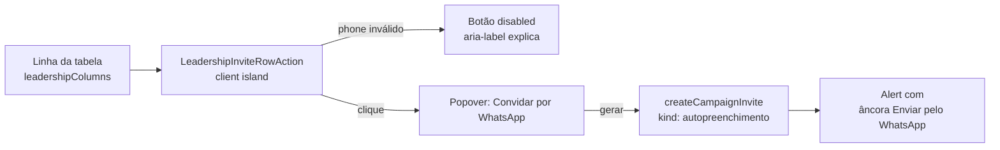

# Convite por WhatsApp na lista de lideranças

Status: entregue
Atualizado em: 2026-07-26
Item do roadmap: [docs/roadmap.md](../roadmap.md) (Trilha B, item **B30**)
Impeccable: B — encaixe de uma ação na tabela existente de `/campanha/liderancas`
Appetite: ~0,25–0,5 dia eng; zero migration/collection/action nova; um componente client encaixado na coluna `actions` existente (B28 ✓)
Responsável: —

## Design (Impeccable)

Âncoras: `PRODUCT.md` (register Field Desk) · tema `data-theme='campaign'` · princípios `campanha-edit-where-you-see.mdc` e `campanha-action-feedback.mdc`.

Na implementação (`implement-roadmap-item`): craft compacto → critique → polish (a UI já existe em dois lugares — `LeadershipInviteButtons.tsx` no detalhe e o ícone de WhatsApp em `AdvisorsTable.tsx` / coluna `actions` do B28 — este item compõe convite + contato na mesma célula).

Brief compacto:

- **Persona / contexto:** Coordenador/assessor varrendo a lista de lideranças para cobrar cadastro incompleto, sem querer abrir cada ficha.
- **Job principal:** disparar o convite de completar cadastro por WhatsApp sem saltar de tela.
- **Estratégia de cor:** Restrained (default) — botão ghost/ícone, sem cor de destaque nova.
- **Edit where you see:** sim — ação existente (`createCampaignInvite`) fica disponível na própria linha, mas **não é edição de campo** (é disparo de ação one-shot com efeito colateral externo — abrir link). Por isso o padrão aplicável é o _two-step reveal_ já usado no detalhe (gerar → depois um link real para o usuário clicar), não auto-save.
- **Anti-goals:** não reabrir o formulário completo de convites (dois botões, login+autopreenchimento) dentro da linha — só o convite de completar cadastro, que é o pedido; não usar `window.open` imediato pós-await (risco de popup blocker, ver Decisões travadas).

## Dados → decisão → apresentação

Dados: N/A — item é uma ação de disparo (convite), não introduz métrica, série, mapa ou agregado novo.

## Contexto

`/campanha/liderancas` (`src/app/(campaign)/campanha/(app)/liderancas/page.tsx`) já lista lideranças numa `CampaignTable` (Pass 2 W1 — `leadershipColumns(stateDeputyOptions)`). Colunas atuais (pós-B28 ✓ / B31 ✓): `name` | `email` | `phone` | `supportStatus` | `municipalities` | `organizations` | `stateDeputies` | `appAccess` | `actions` (WhatsApp de contato `MessageCircleIcon` + `whatsAppHrefForPhone`). `LeadershipRowViewModel` (`src/utilities/leadershipData.ts`) já expõe `phone: string | null` por linha — não falta nenhum dado no loader.

A funcionalidade "convidar para completar cadastro por WhatsApp" já existe e funciona, mas só no detalhe (`/campanha/liderancas/[id]`), via `LeadershipInviteButtons` (`src/components/campaign/invite/LeadershipInviteButtons.tsx`): chama a server action `createCampaignInvite` (`src/app/(campaign)/campanha/actions/invite.ts` → `createCampaignInviteForActor` em `src/utilities/campaignInviteCreation.ts`), que cria um `campaignInvite` com token único (`generateCampaignInviteToken`, expira em 7 dias) e monta a URL do WhatsApp (`buildCampaignInviteWhatsAppLink` em `src/utilities/campaignInvite.ts` → `buildWhatsAppUrl` em `src/lib/phone.ts`). Se `contact.phone` estiver vazio, a action lança `Error('Cadastre o celular da liderança antes de gerar o convite.')` — hoje **só** validado no servidor; o botão do detalhe nunca desabilita por telefone.

Existe um precedente de ícone de ação por linha com disable por telefone inválido: `AdvisorsTable.tsx` (`src/components/campaign/advisor/AdvisorsTable.tsx`, linhas ~411–437) — calcula `whatsAppHrefForPhone(row.phone)` com `normalizeBrazilianPhone` (`src/lib/phone.ts`) e renderiza um `Button variant="ghost" size="icon"` com `MessageCircleIcon`, ativo (âncora `wa.me`) ou `disabled` com `aria-label` explicando a ausência de celular. Esse é o padrão de disable pedido pelo usuário — falta compor com a geração de convite (que a `AdvisorsTable` não tem, porque ali o `wa.me` é só um atalho de contato, sem token).

Pedido de produto (2026-07-25): adicionar, ao fim de cada linha de `/campanha/liderancas`, uma ação rápida que dispare esse mesmo convite (`kind: 'autopreenchimento'`) sem precisar abrir a ficha, desabilitada quando a liderança não tem celular válido.

**Coincide no tempo com o item B28** (mesma leva de pedidos de produto de 2026-07-25 — [`email-celular-lista-liderancas.md`](email-celular-lista-liderancas.md)), que também adiciona uma ação de WhatsApp por linha na mesma tabela, mas com **intenção diferente**: o ícone do B28 é o atalho de contato genérico já usado em `AdvisorsTable` (`wa.me` sem mensagem/token — "falar com esta pessoa agora"), enquanto este item é o disparo do **convite de completar cadastro** (gera `campaignInvite` com token e mensagem pronta). São duas ações distintas que, se ambas chegarem à mesma linha, precisam coexistir sem confundir o operador — por isso a coordenação de layout é uma decisão travada abaixo, e a dependência entre os dois itens é **suave** (qualquer um pode ir primeiro).

## Objetivos

- Encaixar na coluna `actions` existente (B28 ✓) uma ação de "Convidar para completar cadastro (WhatsApp)" por linha, ao lado do atalho de contato.
- Reusa a mesma server action `createCampaignInvite` e o mesmo `kind: 'autopreenchimento'` já usados no detalhe — nenhuma regra de negócio nova, nenhuma mudança de access (`src/utilities/access/invites.ts` já escopa advisor a lideranças acessíveis).
- Botão desabilitado quando `row.phone` for `null` ou não passar em `normalizeBrazilianPhone` (mesmo critério do `AdvisorsTable`), com `aria-label`/tooltip explicando o motivo.
- Sem migration, sem collection nova, sem endpoint novo.

## Decisões travadas

- **Two-step reveal (gerar → depois um `<a>` real de "Enviar pelo WhatsApp") em vez de `window.open` automático pós-`await`.** O convite exige uma chamada de servidor (criação de token) antes de existir a URL do WhatsApp; abrir a aba automaticamente depois de um `await` quebra o vínculo síncrono com o gesto do usuário e é bloqueado por popup blockers em Safari/Firefox com frequência. O próprio detalhe (`LeadershipInviteButtons`) já resolve isso mostrando um `Alert` com um link real depois de gerar — este item replica o mesmo contrato, só compactado num `Popover` disparado pela linha. **Rejeitado:** `window.open(whatsappUrl, '_blank')` direto após o `await` da action — risco de bloqueio silencioso, sem precedente no código; o usuário não teria como saber que nada abriu.
- **Reusar `createCampaignInvite`/`kind: 'autopreenchimento'` sem tocar na action, no schema ou na collection `campaignInvite`.** É exatamente a mesma operação já usada no detalhe (mesmo consentimento fail-closed, mesmo token, mesma expiração) — criar uma segunda entrada de convite seria duplicar sem motivo. **Rejeitado:** action dedicada "quick invite" — não há diferença de contrato que justifique um segundo caminho.
- **Critério de "celular válido" = `normalizeBrazilianPhone(row.phone)` retorna não-nulo**, o mesmo helper já usado em `AdvisorsTable.tsx` e dentro de `buildWhatsAppUrl`. **Rejeitado:** checar só `Boolean(row.phone)` — aceitaria strings malformadas que a action rejeitaria de qualquer forma no servidor, produzindo um botão "ativo" que sempre falha.
- **i18n e naming:** identificadores em inglês — componente `LeadershipInviteRowAction` (`src/components/campaign/invite/LeadershipInviteRowAction.tsx`); strings visíveis em pt-BR ("Convidar por WhatsApp", "Sem celular cadastrado").
- **Ícone distinto do WhatsApp de contato do B28.** Como as duas ações coexistem na mesma célula `actions`, o ícone deste item é `UserPlusIcon` (não `MessageCircleIcon`) com `aria-label` explícito ("Convidar {nome} para completar cadastro por WhatsApp"). **Rejeitado:** mesmo ícone dos dois itens — ambíguo sobre qual ação cada clique dispara.

## Questões em aberto

_(Fechadas na revisão 2026-07-26 — defaults adotados na implementação.)_

- **Visibilidade da ação:** A — renderizar para todo staff que vê a linha; access na `createCampaignInvite`.
- **Ícone compacto:** B — `UserPlusIcon` + `aria-label` completo, densidade da tabela.

## Abordagem proposta

Componentes:

- **`LeadershipInviteRowAction`** (novo, `src/components/campaign/invite/LeadershipInviteRowAction.tsx`, client): recebe `leadershipID: number`, `name: string`, `phone: string | null`. Calcula validade com `normalizeBrazilianPhone`. Trigger `Button variant="ghost" size="icon"` com `UserPlusIcon`, `disabled` quando telefone inválido. Popover replica o fluxo de `LeadershipInviteButtons` só para `kind: 'autopreenchimento'` — `useTransition` + `createCampaignInvite` + Alert com âncora `whatsappUrl` e "Copiar link".
- **`leadershipColumns` → célula `id: 'actions'`:** `inline-flex justify-end gap-1` com `LeadershipInviteRowAction` + botão WhatsApp de contato do B28 (inalterado em comportamento).
- **Sem migration, sem collection, sem server action nova, sem endpoint.**

**Revisão 2026-07-26:** auditoria pré-implementação achou o plano defasado (coluna `inviteAction` separada e contagem de colunas pré-B28/B31); as-built encaixa na coluna `actions` com `UserPlusIcon`. **Entregue em código (2026-07-26):** `LeadershipInviteRowAction` + testes em `campaignInviteInteractions.unit.spec.ts`; gate tsc/lint/format/cycles/532 unit/406 int; `pnpm build` não rodou neste worktree (falta `PAYLOAD_SECRET`); knip P3 pré-existente. **Pós-`/simplify` (mesmo dia):** disable via `hasValidPhone` (mesmo critério que `whatsAppHrefForPhone` na célula); erros de convite em `src/lib/campaignInviteClient.ts` (`mapCreateCampaignInviteError` + constante compartilhada com `campaignInviteCreation`).

## Dependências

- **Soft: B28** (e-mail + celular na lista de lideranças, [plano](email-celular-lista-liderancas.md)) — mesma tabela, mesma área de ação por linha; qualquer um dos dois pode ir primeiro, mas quem chegar depois precisa acomodar o ícone do outro na mesma célula/coluna de ações (ver Decisão "ícone distinto" acima). Não é dependência dura: este item não precisa das colunas E-mail/Celular do B28 para funcionar (já tem `phone` no view model hoje).
- Reusa integralmente, sem depender de nenhum plano aberto: `createCampaignInvite` (`src/app/(campaign)/campanha/actions/invite.ts`), `campaignInvite` collection + access (`src/collections/CampaignInvite.ts`, `src/utilities/access/invites.ts`), `buildWhatsAppUrl`/`normalizeBrazilianPhone` (`src/lib/phone.ts`), `LeadershipRowViewModel.phone` (`src/utilities/leadershipData.ts`), `CampaignTable`/`CampaignTableHead` (`src/components/campaign/shared/CampaignTable.tsx`), `Popover` (`src/components/ui`).

## Não escopo

- Convite de acesso ao app (`kind: 'login'`) na lista — só existe no detalhe hoje (condicionado a `supportStatus === 'engajado'`); o pedido do usuário é só o convite de completar cadastro. Se precisar, é extensão trivial do mesmo componente, mas fora deste item.
- Disparo em massa / seleção múltipla de lideranças para convite em lote — vedado por Res. TSE 23.610 art. 33 e fora do desenho do produto (ver `docs/roadmap.md` § Fora de escopo); esta ação é sempre 1:1, uma linha por vez.
- Editar/validar o telefone da liderança a partir da lista — isso é o formulário de edição existente (`/campanha/liderancas/[id]/editar` ou equivalente); esta ação só lê `contact.phone`.
- Programa WhatsApp interno D3–D5 (bridge de sessão, inbox) — este item usa o mesmo `wa.me` manual de sempre, não abre canal novo.

## Rabbit holes

- **"Já que estou na linha, deixa eu também mostrar o link/texto copiável direto na célula, sem Popover."** Empilhar `Alert` + duas ações (WhatsApp + copiar link) dentro de uma célula de tabela quebra a densidade das outras 434 linhas quando várias forem abertas ao mesmo tempo. **Mitigação:** manter o resultado dentro do `Popover` (fecha ao clicar fora, como qualquer Popover do B9), nunca inline na célula.
- **"Vou generalizar para um `RowActionMenu` genérico já que estou tocando a tabela."** Um único botão não justifica um menu de ações genérico (regra do depth check — menos de 3 usos). **Mitigação:** um componente nomeado (`LeadershipInviteRowAction`), sem abstração de menu.

## Adiado com gatilho

- **Convite de acesso ao app (`kind: 'login'`) também na lista.** Revisitar se o coordenador pedir a mesma ação para lideranças `engajado` sem abrir o detalhe — nesse ponto o componente já criado aqui vira a base (um segundo trigger no mesmo Popover).
- **`CampaignInviteDeliveryAlert` compartilhado (Alert + WhatsApp + copiar link).** Só após um 3º call site além de `LeadershipInviteButtons` e `LeadershipInviteRowAction` (regra depth check).
- **Unificar string `MISSING_CONSENT` em `campaignInviteRedemption` / defaults de `campaignConsent`.** No próximo toque nesses módulos; constante canônica já vive em `campaignInviteClient.ts`.

## Referências

- `docs/roadmap.md` (Trilha B, item B30 — § "Próximos — Campanha")
- `src/app/(campaign)/campanha/(app)/liderancas/page.tsx` — `leadershipColumns`, ponto de inserção da coluna
- `src/utilities/leadershipData.ts` — `LeadershipRowViewModel.phone`
- `src/components/campaign/invite/LeadershipInviteButtons.tsx` — fluxo de referência (gerar → Alert com âncora)
- `src/app/(campaign)/campanha/actions/invite.ts`, `src/utilities/campaignInviteCreation.ts`, `src/utilities/campaignInvite.ts` — action + criação de convite + montagem do link
- `src/lib/phone.ts` — `normalizeBrazilianPhone`, `buildWhatsAppUrl`
- `src/components/campaign/advisor/AdvisorsTable.tsx` (linhas ~86–93, ~411–437) — precedente de ícone de linha com disable por telefone
- `tests/unit/campaignInviteInteractions.unit.spec.ts`, `tests/int/campaignInvite.int.spec.ts` — padrão de teste da action/UI de convite existente
- AGENTS.md — Local API `overrideAccess: false` (já respeitado pela action reusada), Campaign auth
- `PRODUCT.md` / `.cursor/rules/campanha-edit-where-you-see.mdc`, `.cursor/rules/campanha-action-feedback.mdc` — princípios de UI herdados
