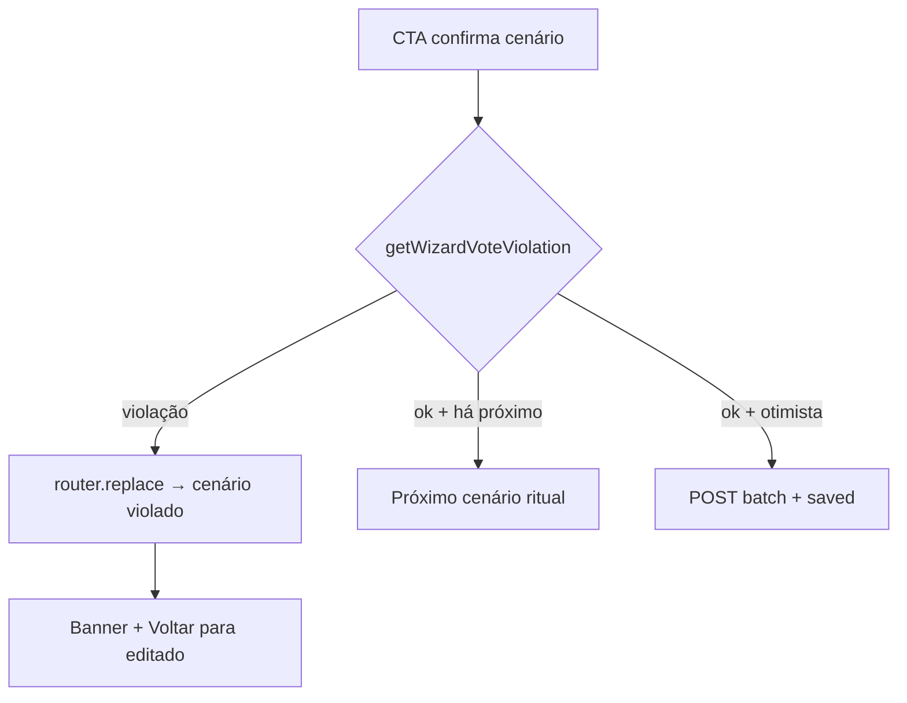

# Corrigir coerência do wizard de ajuste de votos (B61)

Status: **entregue** (2026-07-30)
Atualizado em: 2026-07-30
Item do roadmap: [docs/roadmap.md](../roadmap.md) (Trilha B, item **B76** — regressão UX-1 / B61)
Impeccable: B — correção na etapa existente `WizardExpectedVotesStep`
Appetite: ~0,25–0,5 dia eng; bug de estado client + pins de regressão; sem migration/action
Responsável: —

## As-built (entrega)

- `WizardExpectedVotesStep`: `useEffect` de troca de `?cenario=` **não** zera `violationEditedScenario` quando o cenário atual é o `violatingScenario` do jump; draft/atalho limpam o estado de violação ao editar.
- `tests/unit/wizardExpectedVotesStep.unit.spec.tsx`: pessimista `> média` → média com alerta no primeiro paint após rerender; banner some ao editar draft.

## Design (Impeccable)

Âncoras: `PRODUCT.md` (Clarity under pressure) / `DESIGN.md` · tema `campaign` · precedente [ajuste-votos-wizard.md](ajuste-votos-wizard.md) (B61 ✓).

Na implementação: craft compacto → critique → polish (só o banner e o fluxo de jump — sem reshape).

Brief compacto:

- **Persona / contexto:** CG no celular ajustando pessimista depois da média; digitou um número que quebra a ordem e precisa entender **imediatamente** onde corrigir.
- **Job principal:** ao confirmar um cenário que viola `pessimistic ≤ central ≤ optimistic`, **pular ao cenário inconsistente com warning visível** e atalho “Voltar para [cenário que acabou de editar]”.
- **Estratégia de cor:** Restrained; banner `pending` / `estimate-pending` já usado em B61 — não inventar terceiro tom.
- **Edit where you see:** não — submit explícito por cenário (exceção já travada em B61).
- **Anti-goals:** segunda árvore de decisão (“menor que média?” como modal); toast sem jump; permitir avançar ao otimista enquanto média ainda inconsistente com pessimista recém-confirmado.

## Dados → decisão → apresentação

Dados: N/A — três inteiros por cenário; a decisão é coerência ordinal, não KPI novo.

## Contexto

**B61 ✓** entregou `WizardExpectedVotesStep` com ritual **média → pessimista → otimista** e violação via `getWizardVoteViolation` + `router.replace` ao cenário quebrado + banner + link de retorno ([ajuste-votos-wizard.md](ajuste-votos-wizard.md), [fluxos-acao-primeiro-inicio.md](fluxos-acao-primeiro-inicio.md) passo 3).

**Regressão observada (2026-07-30):** ao confirmar **pessimista** com valor **não menor que média** (`pessimistic > central`), o fluxo deveria abrir **média com warning**. Na prática: média **sem warning**, o ritual segue (otimista, checagens adicionais) e o warning só aparece tarde.

**Causa raiz (auditoria de código):** em `WizardExpectedVotesStep.tsx`, o `useEffect` que re-hidrata o draft ao trocar `currentScenario` executa `setViolationEditedScenario(null)` em **qualquer** mudança de cenário — inclusive no `router.replace` disparado por violação. O jump até a média ocorre, mas o estado que alimenta o banner é zerado antes da pintura → **média sem warning**. O CG pode confirmar de novo, “consertar” média para cima sem entender o conflito com pessimista já confirmado, e só ver warning num passo posterior (otimista) — exatamente o desvio reportado.

Contrato esperado (ritual A1, árvore implícita):

```text
Média → Pessimista → (menor que média?) → [sim] → Otimista → (maior que média?) → [sim] → Salvar
                              |
                           [não] → Média **com warning** → …
```

## Objetivos

- Restaurar o contrato B61: violação ao confirmar pessimista `> central` → navega a `central` **com banner** + atalho de retorno ao pessimista editado.
- O mesmo para otimista `< central` e qualquer violação que `getVoteEstimateOrderViolation` aponte — banner visível **no primeiro paint** do cenário violado.
- **Não** limpar `violationEditedScenario` no `useEffect` de troca de cenário quando a troca veio de jump por violação; limpar só em: confirmação válida, clique em “Voltar para…”, edição consciente do draft, ou abandono do fluxo.
- Pins: unit do componente (jsdom) reproduzindo pointer sequence pessimista→jump média→banner presente; manter/estender `wizardVoteEstimate.unit.spec.ts` e e2e de violação se existente.
- Sem migration, collection, server action ou mudança de contrato JSON (`getVoteEstimateOrderViolation` permanece a fonte).

## Decisões travadas

- **Correção no estado client, não na ordem ritual.** A ordem média→pessimista→otimista e o invariante `pessimistic ≤ central ≤ optimistic` não mudam. **Rejeitado:** reordenar passos; modal “menor que média?”; segunda passagem de validação só no otimista.
- **Preservar `violationEditedScenario` através do jump.** **Rejeitado:** duplicar mensagem em query string; banner global fora do passo (o CG perde o contexto do cenário a corrigir).
- **i18n:** ids `violationEditedScenario`, `violatingScenario`; copy de banner já em `wizardVoteEstimate.ts` / `campaignWizardCopy.ts`.

## Questões em aberto

- **Limpar violação ao editar o draft no cenário violado?** **Opções:** A limpar ao primeiro keystroke | B manter até confirmar ou usar atalho de retorno. **Recomendação:** **A** — editar = o CG está corrigindo; banner obsoleto atrapalha. _(assumido)_

## Abordagem proposta



Componentes:

- **`WizardExpectedVotesStep.tsx`:** refinar `useEffect` — não resetar `violationEditedScenario` quando `currentScenario === activeViolation?.violatingScenario` após jump; opcional ref `pendingViolationFromScenario` se o timing de `router.replace` + render exigir.
- **`tests/unit/wizardExpectedVotesStep.unit.spec.tsx`** (novo) ou estender spec existente: simular confirmação em pessimista com `300` e média `200` → após replace, banner visível sem segundo clique.
- **`tests/unit/campaignHomeActionButton.unit.spec.tsx` / e2e:** smoke de navegação até violação se já houver spec B61.

## Dependências

- Dura: **B61 ✓** (superfície a corrigir). Soft: **B60 ✓** (município pré-selecionado). Não bloqueia B63/B64/B75.

## Não escopo

- Wiring A1 completo (passos 5–8 do fluxo-acao-primeiro).
- Mudar `getVoteEstimateOrderViolation` ou hook de `Municipality` — servidor já falha fechado com a mesma ordem.
- Preview de cobertura E8 no passo (adiado em B61).

## Rabbit holes

- **Reimplementar a árvore de decisão do pedido como fluxo explícito com branches Sim/Não.** **Mitigação:** manter um cenário visível + violação automática no confirm — é o que B61 já modelou.
- **Sincronizar violação via URL (`?violation=central`).** **Mitigação:** estado local com guard no `useEffect` basta; URL nova complica deep-link e B75 skip.

## Adiado com gatilho

- Unificar parsing pt-BR do input com `VoteEstimateScenarioInputs` — já registrado em B61 “Explicitamente fora”.

## Referências

- [ajuste-votos-wizard.md](ajuste-votos-wizard.md) · [fluxos-acao-primeiro-inicio.md](fluxos-acao-primeiro-inicio.md) · `src/lib/wizardVoteEstimate.ts` · `src/lib/voteEstimate.ts` · `WizardExpectedVotesStep.tsx`
