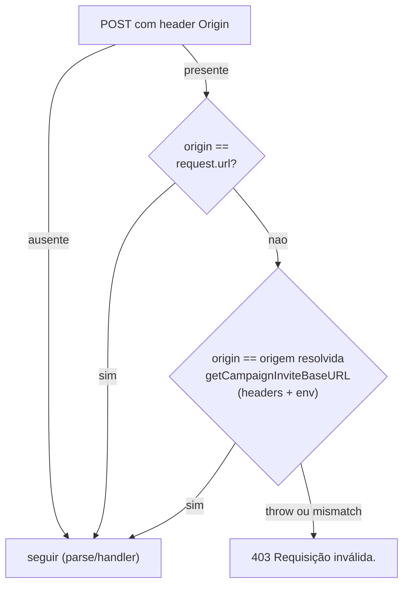

# Impl: Corrigir guarda de mesma origem do CSRF em campanha

Status: aprovado
Atualizado em: 2026-08-25
Issue: #913
Intenção: docs/plans/corrigir-guarda-mesma-origem-campanha.md
Appetite restante: herdado — ~0,5 dia de engenharia; sem migration, sem collection, sem UI

## Leitura da intenção

- **Outcome:** `POST /campanha/municipios/pledge-estimated-votes` (e toda mutation JSON de `/campanha`) volta a funcionar atrás do túnel Cloudflare: hoje `isSameOriginRequest` compara `Origin: https://jorgesolla1313.com.br` contra `request.url` cru (`http://localhost:3000/...` atrás do cloudflared) e responde 403 `"Requisição inválida."` antes de parsear o corpo. O autosave das células precisa voltar a gravar em produção, mantendo o CSRF de mesma origem intacto.
- **O que NÃO negociar:** (1) rejeição de cross-origin permanece fail-closed — nada de aceitar qualquer origem; (2) a guarda continua estrutural no `campaignJsonMutationRoute` (nenhuma rota ganha linha própria de origem); (3) zero regressão em `campaignInviteOrigin.ts`, nas rotas de convite/WebAuthn/calendário que o usam, e nos contratos de resposta dos dois consumidores diretos de `isSameOriginRequest` (`ai-transcribe` 403 `{error}`, `social-feed/sync` 403 `{ok:false}`); (4) dev/test local em qualquer porta (worktrees 3100+) e esquema segue aprovando requisições do próprio app.
- **O que reavaliar:** questão aberta assumida na intenção — a fonte da origem esperada são os headers `x-forwarded-*` com fallback `NEXT_PUBLIC_SITE_URL`. Fechada pela leitura do código: `getCampaignInviteBaseURL` JÁ implementa exatamente essa política (headers só para autoridades locais em dev/test; origem canônica de config em produção, HTTPS DNS público ou throw) — a decisão é reuso, não reimplementação.

## Abordagem recomendada

**Opções consideradas:** A | B | C

- **A)** Reconstruir inline a origem cliente-visível (`x-forwarded-proto` + `x-forwarded-host ?? host`, fallback `request.url`) com parser próprio dentro de `sameOriginRequest.ts`.
- **B)** Estender `isSameOriginRequest` para uma **união aditiva de bases**: aprova se `Origin` casa com a origem de `request.url` (base legada, comportamento atual preservado) **ou** com a origem resolvida por `getCampaignInviteBaseURL({ requestOrigin, forwardedHost: x-forwarded-host ?? host, forwardedProto })`, capturando throw como "base indisponível".
- **C)** Comparar apenas host/autoridade (precedente WebAuthn, `campaignWebAuthnConfig.ts:26–49`).

**Recomendação:** **B** — porque reusa o módulo dono da política de origem (parsing com rejeição de vírgulas/CRLF/credenciais/portas já testado em `tests/int/campaignInvite.int.spec.ts`; "edit the owner, don't twin"), fecha o buraco exato do túnel (produção ignora headers spoofáveis para nomes públicos e compara contra `NEXT_PUBLIC_SITE_URL`, que exige HTTPS DNS público ou falha fechada) e é **superconjunto estrito** do comportamento atual: nenhuma requisição que passava antes passa a ser rejeitada, logo os 16 consumidores (14 rotas via wrapper + `ai-transcribe` + `social-feed/sync`) herdam a correção sem risco de falso-negativo. Assinatura síncrona `boolean` preservada — nenhum call site muda.

**Rejeitadas:** A — twina validação de headers que `campaignInviteOrigin` já possui, confia em `x-forwarded-host` client-controlável também em produção (só não explorável porque custom headers exigem CORS preflight — argumento sutil demais para um guard de segurança) e adiciona ~30 linhas novas de casos de borda; C — host-only tolera divergência http↔https (cloudflared termina TLS na edge) e troca o contrato de _origem_ da guarda por _autoridade_, mudança de política que a intenção não pede. Também rejeitado por anti-goal: patchear as 14 rotas individualmente (espalhar lógica) e relaxar a comparação (aceitar qualquer origem).

### Componentes / mudanças

- **`isSameOriginRequest`** (`src/utilities/sameOriginRequest.ts`, editado): nova semântica união — `Origin` ausente → `true`; senão `new URL(origin).origin === new URL(request.url).origin` (legado, verbatim) OU `=== new URL(getCampaignInviteBaseURL({ requestOrigin: origin, forwardedHost: request.headers.get('x-forwarded-host') ?? request.headers.get('host'), forwardedProto: request.headers.get('x-forwarded-proto') })).origin`, com `try/catch` em torno da resolução (throw ⇒ base descartada, decide o legado); `Origin` não-parseável ⇒ `false`. Ganha `import 'server-only'` (transitivamente server-only pelo novo import; alias de teste já existe em `vitest.unit.config.mts`). Doc comment reescrito: documenta as classes de consumidor e a política duas-bases (direta vs atrás-de-proxy).
- **`tests/unit/sameOriginRequest.unit.spec.ts`** (novo — o módulo nunca teve spec próprio; cobertura vinha só via wrapper): matriz com `vi.stubEnv` + `vi.unstubAllEnvs()` (unit NÃO carrega `.env.test`). Casos: Origin ausente→true; Origin==request.url→true; **tracer do túnel** — `new Request('http://localhost:3000/campanha/x')` + `Origin: https://jorgesolla1313.com.br` + `x-forwarded-proto: https`/`x-forwarded-host: jorgesolla1313.com.br` + `NODE_ENV=production`+`NEXT_PUBLIC_SITE_URL=https://jorgesolla1313.com.br` →true; mesmo tracer com `Origin: https://evil.example` →false; produção SEM `NEXT_PUBLIC_SITE_URL` →false (fail-closed); `x-forwarded-host: 'localhost:3000,evil.example'` encadeado →decide base legada sem crash; Origin `'null'`/inválido →false; dev TLS direto `Request('https://localhost:3443')`+Origin igual →true (cobre aceite #3).
- **`tests/unit/campaignJsonMutationRoute.unit.spec.ts`**: **intacto e verde** — seus dois testes de origem continuam válidos sob a união (cross-origin `evil.example` não casa com nenhuma base; Origin==request.url casa na legada). Não "consertar" esses testes: eles são o pin da base legada.
- **Migration:** sem migration
- **Access / Consent:** N/A
- **UI:** N/A (Impeccable A)

## Fases verificáveis

1. **Tracer / server** — spec novo RED com o caso-túnel (falha no código atual: `request.url` interno ≠ Origin público); implementar a união em `sameOriginRequest.ts` até GREEN com a matriz completa; rodar os testes do wrapper confirmando que os existentes ficam verdes sem edição. Verificação operacional (leitura, não código): confirmar que `NEXT_PUBLIC_SITE_URL` está exportado no runtime de produção (`~/stack/teqo-1313.env`) — sem ele a base canônica descarta-se silenciosamente (catch) e o sintoma persiste apesar do deploy verde.
2. **Gates** — `pnpm gate:fast`; cascata completa antes do PR (`tsc --noEmit && pnpm lint && pnpm format:check && pnpm exec knip && pnpm check:cycles && pnpm test && pnpm build` — knip garante que o import novo não órfã nada); smoke e2e local do autosave alvo provando que o fluxo segue gravando em dev direto; push via `pnpm push`.

## Rabbit holes / Não escopo (engenharia)

- Tocar em `campaignInviteOrigin.ts`, `campaignWebAuthnConfig.ts` ou no envelope/respostas de `campaignJsonMutationRoute.ts` — o precedente host-vs-origin do WebAuthn tem comentário próprio explicando por que diverge; não unificar.
- Plugar `allowLocalTLS` na guarda: a normalização `https://localhost`→`http` fora de produção é política vigente (nenhum call site hoje passa `allowLocalTLS:true`); o aceite "com TLS" fica coberto pela base legada (`request.url` reflete o esquema real do acesso direto). Plumbing novo de env para TLS local é especulação.
- Harness e2e de túnel (cloudflared local): caro e frágil; a matriz unit cobre a lógica, e a prova final é o smoke manual pós-deploy com `curl -H 'Origin: https://jorgesolla1313.com.br' -X POST .../pledge-estimated-votes` esperando 400 (passou da guarda, corpo inválido) em vez de 403.
- Mudar os contratos `{error}`/`{ok:false}` das duas rotas diretas, nem mover `social-feed/sync`/`ai-transcribe` para o wrapper (allowlist da convenção tem razão declarada própria).
- Registrar pin novo: nenhum arquivo top-level novo em `utilities/` — estendemos o `sameOriginRequest.ts` já pineado (`codebaseConventions.unit.spec.ts`), então o teste de convenção não precisa de edição.

## Riscos e mitigação

- **`NEXT_PUBLIC_SITE_URL` ausente/incorreto no runtime de produção** → base canônica lança/difere, catch descarta, legado decide, e o 403 do túnel persiste silenciosamente. Mitigação: fase 1 verifica o env do stack; smoke curl pós-deploy valida o outcome #1 de verdade (deploy verde ≠ bug corrigido neste caso).
- **Falso-positivo adicional (aceitar mais que antes):** a única base nova em produção é a origem canônica de config, validada como HTTPS DNS público e imune a headers do cliente; em dev/test a resolução aceita valores a mais, mas não é superfície de ataque. Superconjunto estrito ⇒ impossível regressar negativo nos consumidores existentes.
- **Vazamento de `vi.stubEnv('NODE_ENV')` entre testes** do spec novo → `afterEach(vi.unstubAllEnvs)` e casos independentes; NODE_ENV stubado só dentro dos `it` do túnel/fail-closed.
- **Valores encadeados `x-forwarded-host: a, b`** (proxy duplo): chegam à guarda e são rejeitados pelo parser reusado ⇒ caem na base legada/config — comportamento fixado por caso de teste, sem parser paralelo.

## Aceite de engenharia

- [ ] Aceite de produto da intenção ainda coberto: autosave atrás do túnel sem "Requisição inválida."; cross-origin segue 403; dev/test localhost ±TLS e portas de worktree aprovam; zero regressão em `campaignInviteOrigin.ts` e suas rotas consumidoras
- [ ] Invariantes AGENTS/engineering-standards: editou o dono (`sameOriginRequest.ts`) em vez de gemelar parsing; identificadores em inglês, copy pt-BR existente intacta; sem migration/push:false; `server-only` onde virou módulo de servidor; nenhum URL público alterado
- [ ] Testes de domínio previstos: unit novo da matriz de origem (túnel/cross-origin/fail-closed/encadeado/TLS-local/dev-porta-diferente) + spec do wrapper intacto como pin da base legada; convenção-test de POST routes e pin top-level passam sem edição

## Triage pós-entrega (capture-review-debts, 2026-08-25)

### Já resolvido na sessão (não reabrir)

- Relaxamento dev-only (Origin localhost em porta ≠ request.url aprovado em dev/test): documentado no doc comment do módulo e pinado pelo teste "approves a dev request whose local Origin differs from the request URL port" (`tests/unit/sameOriginRequest.unit.spec.ts`).
- Gaps de cobertura apontados pelos revisores (isolamento do pin da base legada, caso dev porta-diferente, nome do teste de header encadeado): aplicados na sessão.

### Adiado com gatilho

- **S3 — extração da tripla `x-forwarded-host ?? host`/`x-forwarded-proto`/`requestOrigin`:** 2 call sites (`campaignInviteOrigin.ts` e `sameOriginRequest.ts`). Extrair quando surgir o 3º call site da política de origem proxy-aware **ou** quando a política ganhar parâmetro novo (ex.: `allowLocalTLS`) — aí são 2 pontos a manter em sincronia.

### Explicitamente fora

- **S2 — rename `campaignInviteOrigin.ts`** (o módulo virou a política de origem proxy-aware do app, nome diz "invite"): rename de pureza, score ≤2 — não desbloqueia reuso real.
- **S4 — wraps defensivos** (`new URL(getCampaignInviteBaseURL(...))` no-op hoje; catch da base legada inalcançável na prática): decisão mantida, defesa barata.
- **K1 — knip quebrado localmente** (pré-existente em main; `Error loading src/payload.config.ts` server-only guard; CI verde): fora do escopo desta entrega — registrar como Issue separada se o humano pedir.
- **K2 — `pnpm test:e2e -- <spec> -g <pattern>`** (o `--` repassado faz o playwright tratar `-g` como filtro posicional; workaround: `node_modules/.bin/playwright test ...` direto): pré-existente, fora do escopo — registrar se o humano pedir.
