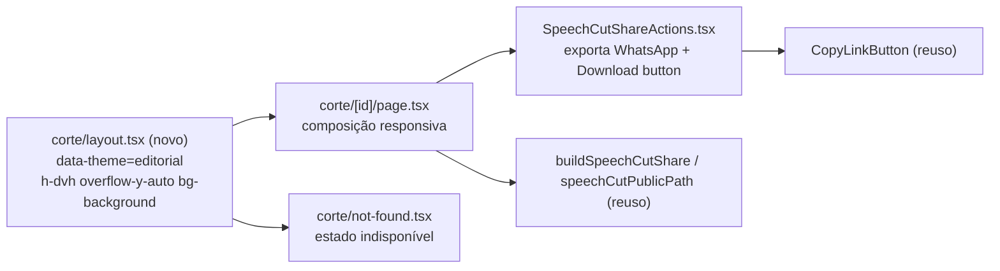

# Impl: Página pública do corte: revisão de design

Status: em execução
Atualizado em: 2026-09-16
Issue: #1086
Intenção: docs/plans/corte-pagina-publica-design.md
Appetite restante: herdado (~1–1,5 dia eng, uma página). Sem inflar.

## Leitura da intenção

- **Outcome:** a página `/corte/<id>` passa a ler como peça cuidada e compartilhável — vídeo herói, título alinhado à esquerda, meta/descrição em superfície neutra (zero fundo tintado), WhatsApp-first no celular, e o estado indisponível igualmente bonito — sem tocar rota, `noindex` ou metadata (C167).
- **O que NÃO negociar:** rota `/corte/<id>` e `robots: { index: false, follow: false }` inalterados; MP4 armazenado como player (nunca YouTube/VOD); crédito `Fonte: Câmara dos Deputados · CC BY 4.0`; mesma tela para id desconhecido e despublicado (não revela existência); comportamento do acervo/biblioteca que reusa `SpeechCutShareActions` idêntico.
- **O que reavaliar (hipóteses da intenção):**
  - _"fundo colorido por theme/`editorial-bg`/gradiente"_ — confirmado: não é `editorial-bg`; é o gradiente global do `body` (`src/app/(frontend)/styles.css:1025-1026`) + `:root --background:#ae1603` (`styles.css:124`) que `/corte` herda por **não ter `data-theme` nem layout**. O conserto é local, não na paleta global.
  - _"SiteHeader pode precisar mexer"_ — não precisa: `src/components/SiteHeader.tsx` já é `sticky` e pronto para viver dentro de um scroll container (`[type]/layout.tsx` é o precedente). Reusar como está.

## Abordagem recomendada

**Opções consideradas:** A) layout de segmento `corte/layout.tsx` + composição responsiva na page reusando botões extraídos do dono; B) editar o gradiente do `body` em `styles.css`; C) wrapper `data-theme` só dentro de `page.tsx`.
**Recomendação:** **A** — espelha `src/app/(frontend)/[type]/layout.tsx:12-20` (mesma classe `data-theme="editorial" h-dvh w-full overflow-y-auto bg-background text-foreground`), conserta **de uma vez** a page e `corte/not-found.tsx` (o `not-found` do segmento é envolvido pelo layout do segmento), usa os tokens neutros de `styles.css:143-162` (`--background:#f6f4f3`), e mantém o conserto escopado à rota. O `h-screen`/`overflow-hidden` do root (`(frontend)/layout.tsx:76,80`) já exige que a página dona do viewport forneça o scroll interno — hoje `/corte` não fornece.
**Rejeitadas:** **B** porque o gradiente do `body` sustenta as páginas públicas escuras (home/`petition`/`campaign-site`) — mexer nele vaza para fora do escopo; **C** porque um wrapper na page não cobre `corte/not-found.tsx` e duplica a responsabilidade de shell que o App Router já oferece no layout; ambas trocam um conserto de 1 arquivo por risco de regressão global.

### Decisão: ordem responsiva do share kit (WhatsApp acima da descrição no mobile, kit inline abaixo no desktop)

**Opções consideradas:** A) extrair/exportar `SpeechCutWhatsAppButton` (+`SpeechCutDownloadButton`) de `src/components/SpeechCutShareActions.tsx` e o próprio componente passar a consumi-los, compondo os marcadores responsivos na page; B) duplicar o kit inteiro em `hidden lg:flex` / `lg:hidden` sem extração; C) reordenar via utilitários `order-*` com um único kit.
**Recomendação:** **A** — mantém um único dono do URL/rótulo do WhatsApp (`buildSpeechCutShare`, já em `SpeechCutShareActions.tsx:37`) e do download do MP4, com a page só posicionando blocos: `sm:hidden` WhatsApp `h-12 w-full` logo após a meta → descrição (instância única) → `sm:hidden` grade 2 colunas (`CopyLinkButton` + `SpeechCutDownloadButton`) → `hidden sm:flex` `SpeechCutShareActions primary="whatsapp"` → YouTube inline na meta no desktop (`hidden sm:inline`) e link avulso no mobile (`sm:hidden`). O limite é `sm` (640 px) porque o gate tem exatamente duas cenas (390 e 1280): uma única fronteira realiza as duas sem inventar um estado intermédio não desenhado (o plano dizia `lg`; ajuste de execução). A API pública do componente e o markup do acervo/biblioteca permanecem idênticos (o acervo usa `primary="copy"`; nada muda em `SpeechCutResultCard.tsx:49` e `SpeechCutLibraryShareActions.tsx:25`).
**Rejeitadas:** **B** porque duplica fonte de verdade do CTA (label/URL) em dois lugares — DRY de conhecimento; **C** porque o agrupamento difere entre viewports (mobile = WhatsApp primário + grade de secundários; desktop = kit de 3 inline) e não há como "fatiar" um componente ao redor da descrição com `order-*`; **D** (prop nova `variant="mobile"` no componente) porque cria um gêmeo dentro do dono e arrisca o acervo — contra "edit the owner, don't twin". Não criar arquivo novo `src/components/*.tsx`: um componente novo fica fora do manifest e cai no fallback smoke (`scripts/lib/e2e-affected-manifest.mjs:320-325`).

### Decisão: mapa de tokens do artefato → tokens do app (sob `data-theme="editorial"`)

**Opções consideradas:** A) portar classes literais do artefato (`text-stone-*`, `bg-white`, `border-stone-300`); B) portar para tokens semânticos do app.
**Recomendação:** **B**, token-level (o artefato já usa `text-muted-foreground`/`border-border` na meta/footer, então o port é o que ele mesmo declara):
`text-stone-950` → `text-foreground`; `text-stone-700`/`text-stone-800` → `text-foreground/90`; `text-stone-600`/`text-stone-500` → `text-muted-foreground`; `bg-white` em controles → `bg-card`; superfície da página (`<main class="bg-white">`) → `bg-background`; `border-stone-300` → `border-border`; `bg-stone-100 text-stone-600` (chip indisponível) → `bg-muted text-muted-foreground`. O `<video>` continua `bg-black`.
**Divergência registrada:** o artefato declara `--background:#ffffff` no `editorial` (linha 30); a produção tem `--background:#f6f4f3` (neutro quente, `styles.css:144`). `bg-background` é o port correto porque (1) o aceite exige "superfície neutra do site público (`background`/`card`)", não branco puro; (2) usar `bg-white` cru divergiria da página de artigo irmã e furaria o contrato de tokens. `bg-card` (#fff) fica para os controles outline, como no artefato.
**Rejeitadas:** **A** porque fixa a paleta do mock e ignora o tema do site (contraste/tema divergiriam em `campaign-site`/`petition` caso a página fosse reusada).

### Decisão: copy/ícone/botão do estado indisponível

**Opções consideradas:** A) manter a copy atual ("O link pode ter sido despublicado ou o endereço está incorreto." / botão "Ir para jorgesolla1313.com.br"); B) adotar a do gate ("O conteúdo pode ter sido removido ou o endereço não está correto." / chip de ícone / botão "Voltar ao início" → `/`).
**Recomendação:** **B** — trata como literal aprovada pelo design; a intenção fixou só o título `Este corte não está disponível` e o gate é o artefato aprovado. `Voltar ao início` é mais limpo que um rótulo com domínio hardcoded.
**Assumido — validar com produto:** o parágrafo de apoio e o rótulo do botão são literal do gate, não da intenção.
**Rejeitadas:** **A** porque mantém copy mais fraca e um botão com URL de domínio embutida, destoando da peça redesenhada. Semântica: o artefato usa `h3`, mas nessa rota é o heading principal → usar `h1` com as classes de tamanho do artefato (`text-2xl sm:text-3xl font-bold`), mantendo o `text-center` (a base global `styles.css:1029` já centraliza — aqui é o desejado).

### Decisão: guard de teste da regressão do fundo tintado

**Opções consideradas:** A) asserção barata no spec existente; B) teste visual/screenshot; C) nenhum guard.
**Recomendação:** **A** — no teste "serves the published cut…" (`tests/e2e/campaignSpeechCut.e2e.spec.ts:127-157`) acrescentar `expect(html).toContain('data-theme="editorial"')`: o HTML servido prova que o segmento herdou o tema neutro e, portanto, que o gradiente dark-red não é mais a superfície. É o guard exato do bug.
**Rejeitadas:** **B** porque screenshot e2e é caro/instável e o appetite não comporta; **C** porque o bug é justamente uma regressão silenciosa de superfície. **Nenhuma asserção existente quebra:** título, `/api/media/file/`, crédito, `noindex`, thumbnail do YouTube e `Ver sessão no YouTube` permanecem; o título no HTML de not-found continua presente e o rótulo antigo do botão não é asserido.

### Componentes / mudanças

- **`src/app/(frontend)/corte/layout.tsx`** (NOVO): `
{children}
` — espelho de `src/app/(frontend)/[type]/layout.tsx:12-20`. Cobre `[id]/page.tsx` e `not-found.tsx`; conserta o fundo tintado e fornece o scroll interno (sticky do `SiteHeader`).
- **`src/app/(frontend)/corte/[id]/page.tsx`** (EDIT): mantém `generateMetadata`, `loadPublishedCut`, `noindex`, `CREDIT`; muda só o JSX de `SpeechCutPage` (L138-196) — coluna `max-w-4xl px-8 py-12`, `<video>` `aspect-video w-full rounded-xl border bg-black` (mobile full-bleed com `rounded-none border-x-0` / `sm:rounded-xl`), `h1` com `text-left` (a base global centraliza), meta com YouTube `hidden lg:inline`, descrição `max-w-[68ch] text-base leading-7 text-foreground/90`, blocos responsivos descritos acima, footer `border-border`.
- **`src/app/(frontend)/corte/not-found.tsx`** (EDIT): bloco centrado (chip `bg-muted text-muted-foreground` com ícone `XCircle` do `lucide-react` já disponível), `h1` título, parágrafo e `Link` "Voltar ao início" `border-border bg-card` para `/`. Sem `SiteHeader` duplicado — o layout não o renderiza, então a page/not-found continuam com o seu.
- **`src/components/SpeechCutShareActions.tsx`** (EDIT): exportar `SpeechCutWhatsAppButton` e `SpeechCutDownloadButton`; o `SpeechCutShareActions` passa a consumi-los internamente (mesmo markup/labels/`data-slot`). API pública e comportamento do acervo inalterados.
- **`tests/e2e/campaignSpeechCut.e2e.spec.ts`** (EDIT): guard `data-theme="editorial"` (acima).
- **Migration:** sem migration (nenhuma mudança de schema/collection/global).
- **Access / Consent:** nenhum (leitura pública read-only; sem Consent, sem write path).
- **UI:** Impeccable **C** (superfície pública existente redesenhada). Não é novo shape: o port é fiel ao gate já aprovado (`docs/plans/corte-pagina-publica-design-ui-design.html`); shape→craft→critique→polish já ocorreram no gate — aqui é port class-for-class ajustado a tokens. O overlay de player do artefato (botão fake/progresso/`NEEDS ASSET`) é **mock** — NÃO portar; manter `<video controls poster>` nativo, só portando sizing/rounding/bleed.

### Dados → forma (se aplicável)

N/A — a intenção declara explicitamente "não apresento dados"; nenhum KPI/gráfico/visualização. Nada a decidir em data-presentation.

### Notas de execução (pós-crítica do designer)

- **Duração em relógio** (`formatSpeechClock`, ex. `02:14`): literal do gate/intenção (`2:14`) ao lado do player; difere do `formatSpeechSpan` (`2min14s`) dos view models do acervo — decisão registrada em comentário no `page.tsx`. Não mexer no dono compartilhado.
- **Breakpoint único `sm`**: o gate tem exatamente duas cenas (390/1280); `sm` realiza as duas sem estado intermédio não desenhado (o rascunho dizia `lg`).
- **Poster 16:9**: `object-cover` no `<video>` faz o thumbnail 4:3 (`hqdefault`) preencher o quadro; o MP4 é 16:9, então o enquadramento da reprodução não muda.
- **Controles em `min-h-*`**: kit desktop `min-h-11`, primário mobile `min-h-12`, secundárias `min-h-11` — convergência em `min-h` (sem `h-*` fixo) para não cortar texto.
- **Débito deferido — shell editorial duplicado**: `corte/layout.tsx` é idêntico a `[type]/layout.tsx` (6 linhas). Extrair um shell compartilhado agora seria abstração para 2 call sites (e `privacidade/layout.tsx` tem classes diferentes). **Gatilho:** um terceiro layout com o mesmo shell verbatim → extrair `EditorialScrollShell`.
- **Débito deferido — `controlClassName` no share kit**: sizing livre serve só ao 1º consumidor (`/corte/<id>`); **Gatilho:** um 2º consumidor fora do C176 precisar de sizing por controle → trocar por variante de densidade (`size`) em vez de estender o free-form.

## Fases verificáveis

1. **Tracer / superfície (≈0,3 dia)** — criar `corte/layout.tsx`; redesenhar `not-found.tsx`. Verificar: `/corte/999999999` responde 404 com superfície neutra (sem vermelho) e `data-theme="editorial"` no HTML; sem scroll duplo; `SiteHeader` sticky funciona.
2. **UI da página publicada (≈0,7 dia)** — extrair botões do dono; recompor `page.tsx` (desktop 1280 + mobile 390) conforme o gate; preservar metadata/OG/`noindex`/crédito. Verificar manualmente com um corte semeado no dev local (`pnpm dev`, DB local) com e sem `youtubeUrl`, em 1280 e 390.
3. **Gates (≈0,2 dia)** — `pnpm gate:fast`; rodar `tests/e2e/campaignSpeechCut.e2e.spec.ts` (e `campaignSpeechAcervo` localmente como guard do refactor do share kit); push via `pnpm push`.

## Rabbit holes / Não escopo (engenharia)

- **Editar o gradiente do `body`/`:root` de `styles.css`** — vaza para as páginas escuras; corte explícito: conserto só na rota via layout.
- **Redesenhar `SiteHeader`, home ou paleta global** — a intenção já corta; o header é reusado como está.
- **Player custom/branded, autoplay, controles próprios** — proibido pela intenção; o overlay do artefato é mock. Só `<video controls poster>`.
- **Arquivo novo `src/components/*.tsx`** — ficaria sem mapping no manifest e2e (fallback smoke); a extração vai para dentro de `SpeechCutShareActions.tsx`, que já é prefixo mapeado.
- **Criar collection/Consent/migration/transação** — não há write path; qualquer proposta nesse sentido é escopo inflado.
- **Galeria pública, transcrição, embed de YouTube, slug amigável** — fora de escopo por desenho (unlisted).

## Riscos e mitigação

- **Refactor de `SpeechCutShareActions` mexer no acervo/biblioteca** → manter a API e o markup renderizado (mesmos rótulos, `data-slot`, variantes); rodar `campaignSpeechAcervo` + `campaignSpeechCut` localmente; a spec de acervo mapeia `src/components/campaign/speech` e cobre o card que o consome.
- **Duplicação de nós no DOM** (WhatsApp/Copiar/Baixar/YouTube existem em bloco mobile e desktop, ocultos por `sm:hidden`/`hidden sm:flex`) → visualmente só um de cada; asserções e2e são por texto, não contagem; aceitável para página estática.
- **Scroll/altura duplicados no root (`h-screen overflow-hidden`)** → o layout novo é a única fonte de scroll do segmento; testar que mobile rola até o footer e que o sticky cola no topo do container (não do viewport).
- **`h1` continua centralizado** → `text-left` explícito na page publicada (utilities vencem `@layer base`); not-found mantém centralizado de propósito.
- **Meta com `·` vazando no mobile** → separador e link do YouTube com `hidden sm:inline`; link avulso só `sm:hidden`.
- **Manifest e2e** → `corte/layout.tsx` cai no prefixo `src/app/(frontend)/corte` (`scripts/lib/e2e-affected-manifest.mjs:321`), então o spec roda; nenhum prefixo novo necessário.

## Aceite de engenharia

- [ ] Aceite de produto da intenção ainda coberto: vídeo herói; superfície neutra (zero fundo tintado); WhatsApp-first acima da dobra no mobile; leitura AA; publicado (com/sem YouTube) e indisponível coerentes.
- [ ] Invariantes AGENTS/engineering-standards: rota e `noindex` intocados; C167 congelado; copy pt-BR / identificadores em inglês; sem migration; sem collection/Consent; escopo só em `(frontend)/corte` + o dono do share kit.
- [ ] Testes: guard `data-theme="editorial"` no spec C167; `campaignSpeechCut` e `campaignSpeechAcervo` verdes; `pnpm gate:fast` verde.

## Self-score (decision-quality: 5/5)

1. **Decisões caras com rejeitadas?** Sim — superfície (rejeitadas B/C), composição responsiva (B/C/D), tokens (A) e copy do indisponível (A) têm opções + rejeitadas nomeadas. (5/5)
2. **Cabe no appetite (~1–1,5 dia, uma página)?** Sim — 1 arquivo novo + 3 edits + 1 asserção; sem schema, sem dependência nova. (5/5)
3. **Rabbit holes nomeados?** Sim — gradiente global, header/paleta, player custom, arquivo de componente novo, collection/migration. (5/5)
4. **Depth check — reusa shells/helpers?** Sim — `[type]/layout.tsx` (shell+theme), `SpeechCutShareActions`/`CopyLinkButton` (dono do share), `buildSpeechCutShare`/`speechCutPublicPath` (URL), tokens `editorial`; nenhum pass-through raso criado. (5/5)
5. **Intenção preservada?** Sim — a engenharia não reescreveu o outcome; cada corte remete ao aceite de produto. (5/5)
