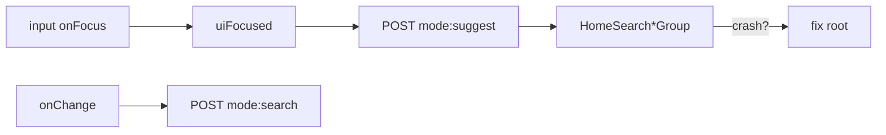

# Crash — busca no bottom drawer (focus / digitação)

Status: registrado
Atualizado em: 2026-08-01
Issue: #129 (file-miss #133)
Priority: P0
Model: cursor-grok-4.5-medium
Impeccable: B — `CampaignQuickActionsDrawer` + `CampaignGlobalSearchBody`
Appetite: ~0,5–1d eng; root-cause + fix + pin focus/type; sem migration
Responsável: —

## Design (Impeccable)

Âncoras: `PRODUCT.md` (Feel the action) · B91/B100 drawer search · tema `campaign`.

Na implementação: reproduzir → fix mínimo → pin (unit + e2e mobile se estável). Sem craft visual além do necessário para o ritual de busca voltar.

Brief:

- **Persona:** staff no detalhe de município (mobile); toca “Buscar na campanha” no drawer.
- **Job principal:** focar e digitar **sem** a página cair; ver suggest/hits.
- **Anti-goals:** redesenhar o drawer (→ **B105**); silenciar o throw com try/catch cosmético.

### Wireframe (texto)

```text
┌─ /campanha/municipios/foo (mobile) ────────────┐
│ conteúdo                                       │
├─ drawer dock ──────────────────────────────────┤
│ ═ handle                                       │
│ [ações…]                                       │
│ ┌ Buscar na campanha ──── focus/type OK ─────┐ │
│ │ Sugestões / hits (sem crash)               │ │
│ └────────────────────────────────────────────┘ │
└────────────────────────────────────────────────┘
```

## Dados → decisão → apresentação

Dados: N/A neste item (hits já existem via B48/B68/B91); só estabilidade do chrome.

## Contexto

Fora do Início, o drawer (**B79–B91**, **B100 ✓**) embute `CampaignGlobalSearchBody` sob `CampaignGlobalSearchProvider` em `CampaignAppScrollChrome`. Produto (2026-08-01): **ao clicar ou começar a escrever na barra de busca, a página crasha**.

Diagnóstico preliminar (código em `main`):

1. Unit do drawer (`campaignQuickActionsDrawer.unit.spec.tsx`) cobre `change` → POST `mode: 'search'`, **não** `focus` → `setInputFocused(true)` → `mode: 'suggest'`.
2. `useHomeSearchResultsState` entra em `suggestMode` quando `uiFocused && !query.isActive` e monta os grupos B48 dentro do snap (`overflow-hidden`, dock `12rem`).
3. `CampaignContentScrollWithPeek` chama `useHomeSearch()` — correto só dentro do provider; árvore atual amarra provider + peek. Hipótese secundária: interação Base UI Drawer non-modal + focus/teclado / nested `Drawer` dos action buttons.
4. Runtime Vercel (server) **não** mostra o digest do crash (erro de client).

**Miss de agente:** B100 / follow-up `a056616d` shipparam sem pin de focus+type no drawer. Registrar via `pnpm agent:file-miss` (`kind:defect` ou `agent-miss`) **neste delivery**, depois o fix.

## Objetivos

- Reproduzir o crash (mobile real ou Playwright viewport mobile em `/campanha/municipios/[slug]`).
- Eliminar a causa raiz (não engolir o erro).
- Pins: unit **focus** dispara suggest sem throw; unit/e2e **type** mantém search; regressão no caminho provider/`uiFocused`.
- Guardrails: sem migration; leader lockdown; Início intacto.
- Tracer: focus no input do drawer → região de resultados monta; digitar “ca” → POST search; zero uncaught.

## Decisões travadas

- **Issue própria P0 + file-miss, não absorver em B105.** Crash bloqueia o ritual. **Rejeitado:** “conserta no polish do drawer”.
- **Fix mínimo no caminho focus→suggest→render; não redesenhar snap.** Geometria/gesto → **B105**. **Rejeitado:** reescrever busca só para o drawer.
- **File-miss obrigatório** com causa + PR culpado quando conhecido. **Rejeitado:** só Issue de feature sem harvest.
- **i18n:** ids existentes; sem copy nova.

## Questões em aberto

- **Causa raiz exata antes do claim?** **Opções:** A) fechar no `work-issue` com repro primeiro | B) bipartir plan/exec. **Recomendação:** **A** — appetite cabe; hypothese já estreita. _(assumido)_

## Abordagem proposta



Componentes:

- **Repro:** Playwright mobile ou unit com `fireEvent.focus` + wait suggest; ler stack.
- **Provável superfície:** `CampaignStaffGlobalSearch` / `HomeSearchResultsLayout` / `Drawer` + focus; eventualmente provider tree se achar caminho sem `HomeSearchProvider`.
- **Pins em** `tests/unit/campaignQuickActionsDrawer.unit.spec.tsx` (+ e2e `campaignMunicipalities` se estável).
- **Migration:** Sem migration.
- **File-miss:** `pnpm agent:file-miss -- --title "…" --kind defect` com body apontando B100/`a056616d` e ausência de pin focus.

## Dependências

- Soft: B91 ✓, B100 ✓. Nenhuma dura. **B105** pode pousar depois (gesto/handle); não bloqueia o fix.

## Não escopo

- Handle no topo / scroll abre / placeholder collapsed → **B105**.
- Remover título “Sugestões” → **B103** (pode coincidir visualmente no empty, mas é copy).
- Strip bleed → **B101**.

## Rabbit holes

- **Trocar Base UI Drawer por sheet caseiro.** Mitigação: só se a root cause for o primitivo e não houver escape hatch documentado.
- **Duplicar `CampaignHomeSearch` “safe” só para drawer.** Mitigação: consertar o shared.

## Adiado com gatilho

- 3º snap alto só para resultados. Revisitar se, após o fix, critique de **B105** mostrar hits cortados no dock.

## Referências

- GitHub Issue #129 (B102) · file-miss #133
- `CampaignQuickActionsDrawer.tsx` · `CampaignAppScrollChrome.tsx` · `CampaignQuickActionsHost.tsx` · `HomeSearchResultsContext.tsx` · `CampaignStaffGlobalSearch.tsx`
- `tests/unit/campaignQuickActionsDrawer.unit.spec.tsx`
- AGENTS.md — Feel the action; client boundary
