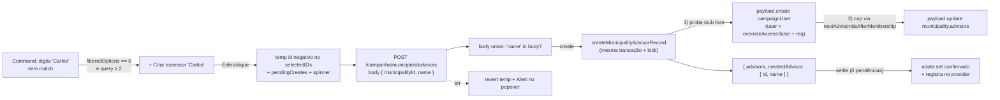

# Impl: Criar assessor inline no popover da lista de municípios

Status: aprovado
Atualizado em: 2026-08-03
Issue: #352
Intenção: docs/plans/criar-assessor-inline-popover-municipios.md
Appetite restante: herdado (~0,5 dia eng)

## Leitura da intenção

- **Outcome:** o coordenador cria uma conta `campaignUser` com papel `advisor` **só com o nome**, dentro do popover "Atribuir assessores" de `/campanha/municipios`, com atribuição automática ao município atual; chip otimista, campo limpo, popover aberto; erro visível no próprio popover quando a criação falha; a conta não faz login até um coordenador trocar credenciais em `/campanha/assessores/[id]`.
- **O que NÃO negociar:** não é formulário completo (anti-goal: sem e-mail/celular/senha/foto inline); papel sempre `advisor`; indisponível para `leader` (que já não vê o popover — a lista de elegíveis é `eligibleCampaignStaffWhere`); e-mail stub `<slug-do-nome>@criado.invalid` (padrão E4R, travado no gate 2026-08-03); faceta `?advisor=` reconcilia só na próxima navegação (contrato B24/B27); dedup por similaridade de nome fica de fora.
- **O que reavaliar:**
  - A intenção fala do "`advisorLookup` (memo do `MunicipalityListAdvisorsControl`) incluir o assessor recém-criado". Um memo por instância só cobre a linha que criou — o coordenador abre o popover de **outro** município na mesma reunião e o assessor novo precisa estar lá. Isso exige estado compartilhado entre linhas (provider client), não só o memo.
  - Colisão do e-mail stub não foi decidida no gate: dois nomes com o mesmo slug (`João` × 2) gerariam o mesmo `joao@criado.invalid` e o `email` é `unique`. Precisa de dedup determinístico.
  - "Estado otimista" do chip: o id do assessor não existe até a resposta — o otimismo exige um id temporário, disjunto dos ids reais.

## Abordagem recomendada

**Opções consideradas:** ver "Decisões de engenharia" (D1–D6).
**Recomendação:** endpoint sobrecarregado com body-union; record novo no mesmo arquivo da action do toggle (transação única: cria conta + atribui, cap com rollback); provider client para o assessor criado virar opção em todas as linhas; chip otimista com id temporário negativo reusando o maquinário de seq/pendências do B27.
**Rejeitadas:** rota nova (`advisors/create`); reusar `createAdvisorRecord` do B19 fora de transação; estado local por instância; `router.refresh()` após criar; aguardar a resposta para mostrar o chip; deixar o unique violation virar erro.

### Decisões de engenharia

**D1 — Endpoint.**
Opções: A) sobrecarregar `POST /campanha/municipios/advisors` com body-union `toggle | create` | B) rota nova `advisors/create` | C) um objeto único com `name`/`advisorId` opcionais + superRefine.
Recomendação: **A** — é a decisão travada no gate, e a union é type-honest: os dois shapes são mutuamente exclusivos, impossível enviar `name` + `assigned: false`. O toggle existente fica byte a byte igual (`'name' in body` ramifica).
Rejeitadas: B — duplica o shell `campaignJsonMutationRoute` (guarda de origem, parse, mapeamento de erro) e contraria o gate; C — permite combinações impossíveis e o tipo não reflete o contrato.

**D2 — Onde cria a conta.**
Opções: A) `createMunicipalityAdvisorRecord` em `actions/municipality.ts` (mesmo arquivo do toggle), na MESMA transação do assign | B) reusar `createAdvisorRecord` (B19) + toggle separado | C) server action de formulário.
Recomendação: **A** — uma transação (`withPayloadTransaction`) cria o `campaignUser` e atribui ao município: se o cap de 10 estoura, o rollback não deixa conta órfã. Reusa `acquireTextAdvisoryLocks(['municipality-advisors:{id}'])`, `nextAdvisorIdsAfterMembership` (fonte única do cap), `hookFilledCreateData`, `randomBytes`, `reloadUnrestrictedActor` com a mensagem de membership.
Rejeitadas: B — `createAdvisorRecord` não recebe `req` (fora de transação), revalida caminhos do B19 e não atribui; C — form action fecha popover/toast, exatamente a razão do B27 ter escolhido endpoint JSON.

**D3 — E-mail stub e colisão.**
Opções (colisão): A) probe determinístico de e-mails livres na transação (`joao@criado.invalid`, `joao-2@…`, `joao-3@…`) | B) deixar o unique violation virar erro genérico | C) sufixo aleatório.
Recomendação: **A** — o "Criar assessor 'João'" sempre funciona (nome não é unique, conta duplicada de nome é legal); helper puro `stubCampaignUserEmailFor(name, occurrence)` testável; probe por `equals` em loop bounded (sem semântica de `like`). **Bônus (mesmo comportamento do aceite):** generalizar o predicado de placeholder para cobrir `@criado.invalid` além de `@planilha.invalid` — assim o reset de senha (`PLACEHOLDER_RESET_MESSAGE`) e a célula de e-mail de `/campanha/assessores` (`AdvisorDebouncedTextCell`) tratam stubs inline como os do seed E4R.
Rejeitadas: B — mensagem enganosa (o coordenador digitou nome, não e-mail) e colapsaria para o genérico; C — não determinístico, pior para reconciliação futura.

**D4 — Estado compartilhado entre linhas.**
Opções: A) provider client `MunicipalityAdvisorCreateProvider` montado em `MunicipalityList` (server) envolvendo mobile + tabela, com `children` server | B) estado local por instância do control | C) `router.refresh()` após criar.
Recomendação: **A** — o assessor criado vira opção selecionável em QUALQUER linha no mesmo carregamento de página (decisão travada no gate); mesmo padrão do `CampaignListSheetProvider` já existente; contexto atravessa componentes server entre provider e células client.
Rejeitadas: B — só a linha criadora conhece o novo assessor, fura o aceite quando o coordenador abre o popover de outro município; C — refresh RSC no meio de delta otimista pode clobber estado em voo e diverge do contrato B27 "reconcilia na próxima navegação" (a página é dinâmica; a navegação seguinte já re-query o `getEligibleAdvisorOptions`).

**D5 — Chip otimista.**
Opções: A) id temporário NEGATIVO no `selectedIDs` (disjunto dos ids reais) + mesmo maquinário seq/`pendingCountRef`/`latestConfirmedRef`; X oculto no chip temporário | B) aguardar a resposta e só então adicionar o chip real.
Recomendação: **A** — "chip aparece imediatamente (estado otimista)" é aceite explícito; o settle reusa `finishRequest` (adota o set confirmado com o id real quando 0 pendências); falha reverte o temp id como o toggle reverte. X oculto no temp: não há como cancelar um create server-side a meio voo; remoção real após o settle. Guard `advisorId < 0` no `toggle` (belt-and-suspenders: id temporário nunca vira POST).
Rejeitadas: B — o chip demora um round trip (~150 ms) contra o instantâneo dos toggles; o aceite pede otimista.

**D6 — Schema do nome.**
Opções: A) `z.string().trim().min(2).max(160)` inline em `schemas/municipality.ts` | B) extrair `advisorNameSchema` em `schemas/advisor.ts` e importar.
Recomendação: **A** — `schemas/advisor.ts` já importa de `schemas/municipality.ts` (`MAX_ADVISORS_PER_MUNICIPALITY`…); extrair criaria ciclo de import (madge `check:cycles` é gate). A regra tem 1 linha; a divergência futura seria intencional por tela.
Rejeitadas: B — ciclo.

### Componentes / mudanças

- **`stubCampaignUserEmailFor`** (`src/lib/schemas/advisor.ts`): `slugify(name)` + sufixo `@criado.invalid`, com `-{occurrence}` a partir da 2ª ocorrência. Ao lado de `planilhaPlaceholderEmailForAdvisor` (mesmo módulo de e-mails stub). Predicado de placeholder generalizado (cobre os dois sufixos, case-insensitive) — mesmo nome de export, doc comentada.
- **`municipalityAdvisorCreateSchema`** (`src/lib/schemas/municipality.ts`): `{ municipality: positiveRelationshipId, name: z.string().trim().min(2).max(160) }` + tipo `MunicipalityAdvisorCreateInput`.
- **`createMunicipalityAdvisorRecord` / `createMunicipalityAdvisor`** (`src/app/(campaign)/campanha/actions/municipality.ts`): transação — `reloadUnrestrictedActor` (mensagem de membership) → lock → probe de stub livre (loop bounded por `equals` com `overrideAccess: true` + `req`) → `payload.create` (`campaignUser`, `user: currentActor`, `overrideAccess: false`, `req`; dados `hookFilledCreateData<'campaignUser'>` com nome + `role: 'advisor'` + stub + `password: randomBytes(24).toString('base64url')`) → `findByID` atual → `nextAdvisorIdsAfterMembership(current, created.id, true)` (cap → throw → rollback sem órfão) → `payload.update` (`overrideAccess: true` + `req`, comentário de bypass como no toggle). Retorna `{ advisors, createdAdvisorId }`. Export não revalida (contrato do endpoint).
- **`route.ts`** (`src/app/(campaign)/campanha/(app)/municipios/advisors/route.ts`): `bodySchema` vira union `toggle | create`; handler ramifica; resposta do create `{ status: 'success', message: 'Assessor criado e atribuído.', advisors, createdAdvisor: { id, name } }`. `safeMessages` inalterado (cap + unrestricted já estão lá).
- **`types.ts`**: `MunicipalityListAdvisorsResponse` success ganha `createdAdvisor?: { id: number; name: string } | null`.
- **`MunicipalityAdvisorCreateProvider.tsx`** (novo, client, `src/components/campaign/municipality/`): contexto `{ createdOptions: EligibleAdvisorOption[], registerCreatedAdvisor }`; registro deduplica por id. Padrão `CampaignListSheetProvider`.
- **`MunicipalityList.tsx`** (server): envolve `MunicipalityListMobileSection` + `CampaignTable` no provider (children server — padrão de client provider com slots server).
- **`MunicipalityListAdvisorsControl.tsx`**: quando `filteredOptions.length === 0` — se `query.trim().length >= 2`, um `CommandItem` "Criar assessor '<query>'" (`UserPlusIcon`) ANTES do "Nenhum resultado"; senão, "Nenhum resultado" como hoje. `createAdvisor(name)`: `setErrorMessage(null)`, temp id `-seq` em `selectedIDs`, `pendingCreates` (Map tempId→nome) no lookup do memo, `setQuery('')`, maquinário de pendência/seq; POST `{ municipalityId, name }`; sucesso → `latestConfirmedRef` (se seq mais novo) + `registerCreatedAdvisor({ id, name, isCurrent: false })` + remove temp do `pendingCreates`; falha → remove temp de `selectedIDs`/`pendingCreates` + `reportFailure`. `effectiveOptions = [...options, ...createdOptions]` (do provider) alimenta o filtro e o lookup. Chip temporário renderiza sem `XIcon` (indisponível enquanto pendente); `toggle` recusa `advisorId < 0`.
- **Migration:** nenhuma (campos existentes).
- **Access / Consent:** nenhum novo — create passa por `canManageCampaignUsers` (`overrideAccess: false` + `user`); sem `Consent` (conta interna de staff, precedente B19).

### Dados → forma

N/A — affordance de **escrita** sobre `municipality.advisors` via criação de `campaignUser`; nenhuma métrica, série, ranking ou mapa novo (a intenção já declara `Dados: N/A`).

## Fases verificáveis

1. **Schema/server** (maior parte do appetite): helpers puros + schemas → action record → route/types. Unit dos helpers; int do record.
2. **UI**: provider + control (opção de criar, temp chip, registro no provider). Unit de componente (render da opção sem fetch).
3. **Gates**: `pnpm gate:fast` na iteração; e2e do fluxo completo; `pnpm push` no fechamento (com o `*-impl.md` no commit).

### Testes

- **Unit:** `stubCampaignUserEmailFor` (slug sem acento via `slugify`, `-2` na 2ª ocorrência); predicado generalizado (`@planilha.invalid` e `@criado.invalid`, case-insensitive); parse da union do route (toggle sem `name` → caminho antigo; create sem `advisorId` → caminho novo; shapes inválidos 400).
- **Int** (`tests/int/campaignMunicipalityAdvisorMembership.int.spec.ts` ou spec irmão): coordinator/candidate criam + atribuem (conta criada com `role: 'advisor'` + stub `@criado.invalid`, município contém o id); advisor/leader negados; cap 10 → rejeita e **não deixa órfão** (contagem de `campaignUser` inalterada após o erro); mesmo nome duas vezes → segundo com stub `-2`.
- **Unit componente** (`tests/unit/campaignCellEditOverlay.unit.spec.ts` / `campaignComponents.unit.spec.ts`): options vazias + query ≥ 2 → item "Criar assessor" presente; query < 2 → "Nenhum resultado".
- **E2E** (`tests/e2e/campaignMunicipalities.e2e.spec.ts`): abrir popover, digitar nome sem match, Enter, chip aparece, reabrir → persistiu. A rota já está no prewarm de `setup.e2e.spec.ts` (mesmo path do B27).

## Rabbit holes / Não escopo (engenharia)

- Formulário completo inline, e-mail/celular/senha/foto no popover → `/campanha/assessores/[id]`.
- Dedup por similaridade de nome ("Maria" vs "Maria Silva") → fora do appetite, coordenador verifica (decisão de produto).
- Faceta `?advisor=` e ordenação em tempo real → contrato B24/B27.
- Revalidação de `/campanha/assessores` após criar → página dinâmica; reconcilia na próxima navegação.
- Temp id **nunca** pode vazar num POST: guard `advisorId < 0` no `toggle` + X oculto no chip temporário.
- Probe de stub: `equals` em loop bounded, **não** `like` (semântica de curinga em e-mail).

## Riscos e mitigação

- **Interação temp chip × reconcile existente:** temp id negativo é disjunto dos ids reais; `finishRequest` adota o set confirmado (id real) quando 0 pendências — o chip nunca duplica nem some antes da hora.
- **Create dentro de transação + access:** `canManageCampaignUsers` → `getFreshCampaignUser(req)` precisa que o `user` seja casado no `req` da transação — mesmo padrão já em produção no `createActivityRecord` (`user` + `overrideAccess: false` + `req`); se quebrar, falha fechada (403), não fail-open. Int tests com coordinator/candidate cobrem o caminho feliz.
- **Colisão de stub rara mas real:** probe determinística na transação; fallback (unique violation inesperado) colapsa no `genericMessage` — aceitável.
- **Flakiness E2E pré-existente sob carga:** rodar o spec isolado na validação final (padrão do time).

## Aceite de engenharia

- [ ] Aceite de produto da intenção coberto: cria `advisor` só com nome no popover; atribuição automática; chip otimista; erro no popover (Alert existente); sem login até credenciais reais (stub `@criado.invalid` + senha aleatória, reset bloqueado como placeholder); `leader` intocado; faceta reconcilia na próxima navegação
- [ ] Invariantes AGENTS/engineering-standards: transação + `req` em escrita multi-collection; `overrideAccess: false` com `user` no create; identificadores em inglês / strings pt-BR; sem migration; sem `Consent` novo
- [ ] Testes de domínio: unit (stub/predicado/union), int (roles, cap com rollback sem órfão, dedup), unit componente, e2e
- [ ] Gates: `tsc --noEmit`, `lint --max-warnings=0`, `format:check`, `check:cycles` (madge), `knip`, `pnpm test`, `pnpm build` local (nunca Neon)

Self-score decision-quality: **5/5** — decisões caras com rejeitadas registradas (D1–D6); cabe no appetite (~0,5 dia); rabbit holes nomeados; depth check reusa shells (transação, locks, `nextAdvisorIdsAfterMembership`, `campaignJsonMutationRoute`, `Command`, `useCampaignCellFailureChannel`, `CampaignListSheetProvider` como padrão de provider); aceite de produto preservado.

## Simplify (2026-08-03) — aplicado e deferido

Três revisores paralelos (qualidade, reuso/DRY, comportamento) no diff do B154; zero P1. Aplicado no cleanup (comportamento preservado, testado):

- **`effectiveOptions` dedup por id** — o provider sobrevive a re-renders server (navegação de sort/filtro re-executa `getEligibleAdvisorOptions`), então o mesmo assessor podia aparecer duas vezes na lista de opções; dedup no merge.
- **Guard de create em voo por nome** — create não é delta idempotente; re-ativar o mesmo nome com o primeiro em voo criaria uma 2ª conta. Skip se o nome já está em `pendingCreates` (o temp chip já sinaliza).
- **`finishRequest` compartilhado** — o closure de settle era byte-idêntico entre toggle e create; hoisted uma vez no corpo do componente.
- **`advisorNameSchema` em `primitives.ts`** — regra do nome espelhada em 3 pontos (route, schema B154, `advisorCreateSchema` do B19); módulo folha sem ciclo (madge verde).
- **Fallback de slug vazio no stub** — nome só de pontuação (ex. "!!!") passa `min(2)` mas slugifica para `""` → e-mail inválido e erro genérico sem saída; cai para `assessor@criado.invalid` + unit test.
- **`trimmedQuery` hoisted + gate `<= 160`** no item "Criar assessor" (espelha o contrato do servidor).
- **`createdAdvisor` sem `| null`** — a rota nunca envia `null`.

**Defer com gatilho (não registrar como Issue):**

- Probe de stub não-atômico entre municípios (dois coordenadores criando o mesmo nome simultaneamente em municípios diferentes): rollback gracioso + erro genérico. **Gatilho:** evidência real de colisão (queixa/erro observado).
- Reconcile assume commit na ordem de envio (machinery-wide do B27, toggle compartilha): um interleave raro pode dropar o chip do create até a próxima navegação. **Gatilho:** chip sumindo observado em produção.

**Descartado:** renomear `isPlanilhaPlaceholderEmail` (drive-by de 4 call sites pré-existentes); alias table do E4R no stub (TLDs distintos, sem colisão); `payload-types.ts` com drift do B134 (regenerado por cada run e2e — pertence à entrega do B134).
