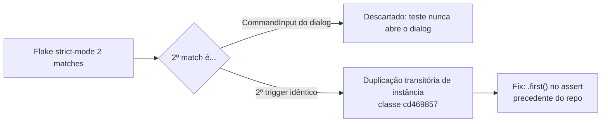

# Impl: E2E — flake do `getByLabel('Atividade relacionada')` (strict mode) sob carga

Status: aprovado
Atualizado em: 2026-08-11
Issue: #641 (D12)
Intenção: docs/plans/e2e-combobox-label-strict-mode-flake.md
Appetite restante: herdado (P3, kind: defect, sem nova superfície)

## Leitura da intenção

- **Outcome:** `campaignRegisterDemand` verde em run completo e isolado; sem mudança de DOM/labels no estado fechado que afete outros specs.
- **O que NÃO negociar:** copy visível e comportamento da combobox intactos; nenhuma regressão de a11y do dialog.
- **O que reavaliar:** a hipótese "o conteúdo do CommandDialog fica sempre montado" da intenção **não se sustenta** — ver caracterização abaixo.

## Caracterização (completada na sessão, browser real + código)

1. **Estado estável (fechado): exatamente 1 match.** O trigger (`aria-label="Atividade relacionada: Nenhuma atividade"`) é o único nó. O `CommandDialog` usa `DialogPortal` **sem** `forceMount` (src/components/ui/dialog.tsx): o conteúdo (incl. `CommandInput` com `aria-label={label}`) só monta com `open` ou na animação de saída (~200ms, `duration-200`).
2. **Dialog aberto: 2 matches** — trigger + `CommandInput` (`role="combobox"`, `aria-label="Atividade relacionada"`). Medido ao vivo.
3. **O sr-only `DialogHeader` (título + descrição) fica montado permanentemente** — é filho direto de `Dialog.Root` (render inline, fora da porta). O snapshot pós-falha do D11 ("título + descrição no DOM com o dialog fechado") é o **estado normal da página**, não evidência de dialog montado.
4. O teste que flakava (linha 38) **nunca abre o dialog** — logo o segundo match não pode ser o `CommandInput` por interação do próprio teste.
5. A intenção registra o segundo match como **"ambos botões"** com o mesmo `aria-label` do trigger → duplicação **transitória de instância** (2 comboboxes idênticos no DOM por um instante), a classe já tratada em cd469857 (2026-08-09): "transient RSC-pending duplication … strict-mode flake on loaded machines" → fix estabelecido no repo: `.first()` nos asserts.
6. Navegação dura (`page.goto`) medida ao vivo: 0→1 sem janela de 2 matches na máquina local; a duplicação é dependente de carga (máquina do pool, compiles de 6–27s).

## Abordagem recomendada

**Opções consideradas:** A (spec `.first()`) | B (spec `getByRole('button', …)`) | C (componente: remover label do `CommandInput` / `aria-hidden` no fechado)

**Recomendação:** A — `.first()` nos asserts de `getByLabel('Atividade relacionada')` dos dois specs que usam o label (`campaignRegisterDemand.e2e.spec.ts:38` e `campaignActivity.e2e.spec.ts:52`), com comentário citando o precedente cd469857.

**Rejeitadas:**

- **B** — `getByRole('button', { name: /Atividade relacionada:/ })` resolve a duplicação trigger+input (input é `role=combobox`), mas **não** resolve o caso reportado ("ambos botões" = duplicação de instância): 2 triggers de mesmo `aria-label` → mesma strict violation.
- **C** — o portal **não está montado no fechado** (medido): remover `aria-label` do `CommandInput` não muda o estado estável e degradaria a a11y do input de busca (o dialog precisa de label próprio); `aria-hidden` no fechado não tem alvo (nada montado). Não atinge a duplicação transitória, que é artefato de render do framework (Next/React), não do componente.
- (descartada na análise) "esperar o dialog abrir/fechar": o teste não interage com o dialog.

### Componentes / mudanças

- **`tests/e2e/campaignRegisterDemand.e2e.spec.ts:38`**: `page.getByLabel(CAMPAIGN_DEMAND_ACTIVITY_LABEL)` → `.first()`. Semântica preservada: o teste quer provar que o campo está presente/visível; qualquer uma das instâncias transitórias é o mesmo trigger.
- **`tests/e2e/campaignActivity.e2e.spec.ts:52`**: idem (mesmo label, mesma classe de flake — página da atividade também monta `AsyncSearchCombobox` via `DemandFields`).
- **Migration:** sem migration. **Access/Consent:** não toca. **UI/componente:** nenhuma mudança (aceite "sem mudança de DOM/labels").
- Comentário nos dois asserts no estilo cd469857 (classe + motivo, não reescrever o histórico).

## Fases verificáveis

1. **Baseline (reprodução)** — run completo do e2e em dev (em andamento, máquina com load real 11–22): registrar se o flake reproduz localmente. O D11 já provou pré-existência em main via stash (3/4 runs falharam no pool); a reprodução local é bônus, não gate.
2. **Fix** — `.first()` nos 2 asserts.
3. **Gates** — `campaignRegisterDemand` isolado (dev) + `campaignActivity` isolado; run completo do e2e verde; `pnpm gate:fast` (tsc, lint, format, unit+int) e `pnpm check:cycles`; knip.

## Rabbit holes / Não escopo (engenharia)

- Não investigar o mecanismo exato da duplicação transitória do Next/React (bug upstream, dependente de carga; o repo já decidiu a resposta pragmática em cd469857).
- Não mexer no `AsyncSearchCombobox`/`CommandDialog` (a11y do dialog é correta; portal não monta no fechado).
- Não trocar `getByLabel` por `getByRole` nos outros ~100 usos do arquivo (fora do escopo do label em questão).

## Riscos e mitigação

- **Flake não reproduz na máquina local** (condições do pool diferentes) → mitigação: validação = mecanismo caracterizado ao vivo (estado estável 1 match; 2 matches só em instância duplicada/open) + fix idêntico ao precedente aprovado cd469857 + runs completos verdes pós-fix (1+).
- **`.first()` mascarar regressão real** (ex.: 2 instâncias ESTÁVEIS) → mitigação: assert continua verificando visibilidade do campo; se um dia houver duplicação estável, os outros asserts do spec (contagem 0/1 em linhas vizinhas) pegam.
- **Aceite "grep getByLabel em e2e"** → verificado: os únicos usos do label `Atividade relacionada` são os 2 pontos alterados; nenhum outro spec depende do estado fechado da combobox.

## Aceite de engenharia

- [ ] Aceite da intenção coberto (spec verde isolado e em run completo; DOM/labels fechados intactos)
- [ ] Invariantes AGENTS/engineering-standards (sem migration/access/transação; identificadores em inglês; precedente cd469857)
- [ ] Testes: run completo e2e dev verde + specs alterados isolados; gates completos no fechamento
