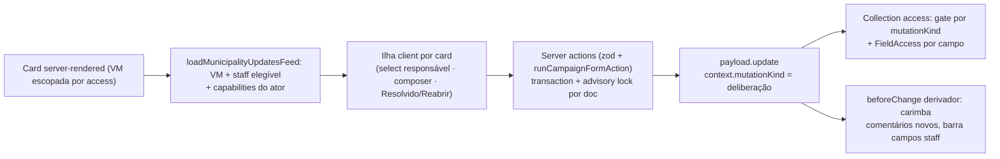

# Impl: Deliberação na atualização (responsável, thread, resolvido)

Status: rascunho
Atualizado em: 2026-08-23
Issue: #397 (C88)
Intenção: docs/plans/deliberacao-atualizacao-responsavel-thread.md
Appetite restante: herdado (~1–1,5 dia eng) — um outcome verificável (coordenação atribui, discute e fecha uma atualização)

## Leitura da intenção

- **Outcome:** a coordenação delibera na própria atualização — atribui UM responsável (staff do município), discute num fio visível para quem já lê atualizações daquele município, e marca Resolvido (com reabertura explícita). Atualização resolvida permanece legível no histórico com estado aberto/resolvido óbvio no card; liderança não vê nem participa; modelo unificado de C87 intacto (sem reintroduzir kinds/tipos de sinal).
- **O que NÃO negociar:**
  - Leader lockdown na raiz: `resolveProfileScopedRead` já resolve leader → `false` (`src/utilities/access/shared.ts:219`). O fio vive DENTRO do doc e herda o read escopado — nenhuma superfície nova (loader, action, select de staff) pode expor dado deliberativo a leader.
  - Sem reintroduzir kinds/tipos de sinal (C87): deliberação é estado e atividade sobre o doc unificado, nunca um novo tipo.
  - Imutabilidade do fato registrado: comentário/atribuição/resolvido NÃO editam `body`/`polarity`/`urgent`/`adversarySignal` (correção = nova atualização ou comentário).
  - Quem atribui responsável e marca resolvido: só coordinator/candidate (`isCampaignUnrestricted`) + admin. Responsável nunca é liderança.
  - Atualização sem responsável pode ter fio e resolvido (campos independentes).
- **O que reavaliar:**
  - "Colunas na collection" (hipótese da intenção): confirmada, MAS o caminho de escrita não é um update aberto — `MunicipalityUpdate.update` é admin-only hoje (`canMutateMunicipalityUpdate`, `access/municipalityUpdates.ts:39`). A deliberação exige um canal de update restrito por `context.mutationKind` (precedente Activity `isActivityMutationShortcut`) — decisão D5.
  - "Fio = array dentro do doc" (precedente `Activity.updates`): confirmado, mas cria tabela nova (`municipality_update_comments`) + hook derivador que carimba author/createdAt dos itens novos (precedente `deriveActivityFields`, Activity.ts:316-329).
  - `author` é FK escalar (`municipality_update.author_id`, não `_rels`): as novas rels single de deliberação (`responsible`, `resolvedBy`) seguem o MESMO formato (coluna `_id` + FK + índice), NÃO o padrão `_rels` da `CampaignDemand` (que é polymorphic/hasMany).
  - Notificações: a intenção permite "badge interno no máximo"; existe infra pronta (`notificationEvents`/`createCampaignNotifications`) — cortada nesta fatia (ver Rabbit holes) para caber no appetite, com gatilho de revisitação.

## Abordagem recomendada

**Opções consideradas / Recomendação / Rejeitadas** (formato decision-quality, caro de reverter decidido aqui):

- **D1 — Onde vive o estado deliberativo (responsável/resolvido):** A (rels single `responsible`/`resolvedBy` + coluna `resolvedAt` na própria `MunicipalityUpdate`) | B (collection `MunicipalityUpdateDeliberation` separada) | C (subsumir em `CampaignDemand`).
  **Recomendação: A** — um doc = um estado; o fio dentro do doc herda o read escopado (leader lockdown grátis, sem access novo na superfície); zero join/loaders adicionais; o aceite "depende do modelo unificado de C87" é satisfeito sem segundo registro. B cria fronteira cara (access/loaders/consistência/cleanup) para guardar 3 campos; C mistura domínios e é anti-goal explícito da intenção ("sem abrir demanda para cada fato").
- **D2 — Onde vive o fio:** A (array `comments` dentro do doc, precedente `Activity.updates` L646-688) | B (collection `MunicipalityUpdateComment` com relationship parent).
  **Recomendação: A** — precedente exato de append atômico (read→append→update com lock), herda read do pai automaticamente (leader bloqueado na raiz), página já carrega o doc com depth. B exige collection nova com access próprio, cleanup de órfãos e N+1 no load do feed. Custo futuro aceito: editar/excluir comentário individual, mentions e reações ficam mais difíceis — barato adiar, gatilho de revisitação anotado.
- **D3 — Forma do autor do comentário:** A (campo `author` rel campaignUser DENTRO do array — Payload materializa `author_id` escalar na tabela do array, precedente `activity_updates.author_id` + índice) | B (campo number puro e resolver nome no VM).
  **Recomendação: A** — espelha `Activity.updates` item a item (body/author/createdAt); o hook derivador carimba; `loadCampaignUserNamesByIds` já resolve nomes em lote. B economiza nada (o VM precisa do nome do mesmo jeito) e diverge do precedente.
- **D4 — Representação do estado resolvido:** A (`resolvedAt` date + `resolvedBy` rel; resolvido ⇔ `resolvedAt` não-nulo) | B (boolean `resolved`).
  **Recomendação: A** — o timestamp é a auditoria natural (quem/quando), elimina estado booleano flapping, e a reabertura é simplesmente limpar os dois campos. B guarda menos informação e precisaria de coluna extra `resolvedAt` de qualquer forma para o card.
- **D5 — Canal de escrita da deliberação (o caro):** A (estender o dono: `canMutateMunicipalityUpdate` vira gate por `context.mutationKind` deliberativo — `assignResponsible`/`appendComment`/`resolve`/`reopen` — + FieldAccess preciso em cada campo novo; delete continua admin-only) | B (`payload.update` com `overrideAccess: true` dentro das actions) | C (endpoints REST próprios fora da Local API).
  **Recomendação: A** — "edit the owner, don't twin": a collection access continua sendo o único portão; `overrideAccess: false` preserva o invariante do repo (nenhum `overrideAccess: true` novo); o precedente exato é `canUpdateActivity` + `isActivityMutationShortcut`. B quebra o invariante de acesso e o fail-closed; C cria superfície paralela à convenção transactions/advisory locks do repo. Defesa em profundidade: o gate por mutationKind é o coarse gate (staff não consegue tocar `body`), a FieldAccess é o precise gate (quem pode tocar cada campo).
- **D6 — Predicados de acesso por perfil:** A (novas funções em `src/utilities/access/municipalityUpdates.ts` reusando primitivos de `shared.ts`: `canAssignUpdateResponsible`/`canResolveMunicipalityUpdate` = `isCampaignUnrestricted`+admin; `canCommentOnMunicipalityUpdate` = mesmo predicado de `canCreateMunicipalityUpdate` — "quem pode criar naquele município comenta"; delegação para evitar duplicação) | B (predicados inline nas actions) | C (helper genérico de mutationKind fora do módulo de acesso).
  **Recomendação: A** — o vocabulário RBAC do repo é por módulo de domínio em `access/*` com barrel `campaignAccess`; a regra de comentar é literalmente a regra de criar (gate da intenção "qualquer staff que já pode criar atualização naquele município — B pode comentar"), então `canCommentOnMunicipalityUpdate` DELEGA ao corpo de `canCreateMunicipalityUpdate` (DRY de conhecimento). B espalha regra de acesso em actions; C cria pass-through raso (depth check: não criar).
- **D7 — Lista de staff elegível do select:** A (loader server `loadAssignableUpdateStaff(payload, municipalityID)`: `where: or [ { id: { in: advisors } }, coordinator, candidate ]` sobre `campaignUser` — advisors do município (`Municipality.advisors`) + unrestricted, espelhando `eligibleCampaignStaffWhere`) | B (só `Municipality.advisors`) | C (client busca via endpoint novo).
  **Recomendação: A** — o aceite fixa "staff do município (advisors + unrestricted)"; o where é declarativo e reusa o filtro do admin; `filterOptions: eligibleCampaignStaffWhere` no campo `responsible` alinha admin e ferramenta. B quebraria o aceite (coordinator não apareceria como responsável elegível); C cria endpoint novo onde server action já existe.
- **D8 — Feed global multi-município (`/campanha/atualizacoes`):** A (o loader do feed carrega, por página, os staff elegíveis dos municípios presentes — batch: 1 find em `municipality` (id+advisors) + 1 find em `campaignUser` com o where or — e capabilities do ator; o card é a mesma ilha) | B (select carrega sob demanda via endpoint) | C (fio não interativo no feed global, só no detalhe).
  **Recomendação: A** — o fluxo da intenção abre a atualização "no feed/detalhe"; o card compartilhado mantém consistência (dossier ganha grátis) e o batch de 2 queries por página cabe no appetite. B viola a convenção (sem endpoints novos); C quebra o fluxo principal do aceite.
- **D9 — Serialização do append/comentário:** A (advisory lock por doc `municipality-update:<id>` na action, ANTES do `payload.update`; o `beforeChange` mantém o lock por município existente `municipality-updates:<municipalityID>` como segunda camada) | B (confiar só no lock por município).
  **Recomendação: A** — lock por doc é a granularidade do read-modify-write do array (comentários em atualizações diferentes do mesmo município não se serializam) e é o padrão da casa (`activity:<id>`). Ordem de aquisição consistente em todos os escritores (doc → município) evita deadlock — ver Riscos. B é correto mas coarsa (fila por município para todo append).

**Rejeitadas:** D1-B/C, D2-B, D3-B, D4-B, D5-B/C, D6-B/C, D7-B/C, D8-B/C, D9-B (justificativas acima).

### Componentes / mudanças

- **`src/collections/MunicipalityUpdate.ts`** (estender o dono):
  - Novos fields: `responsible` (relationship campaignUser single, `index: true`, `filterOptions: eligibleCampaignStaffWhere`, label "Responsável", access `create/update: canAssignUpdateResponsible`); `resolvedBy` (relationship campaignUser single, `index: true`, label "Resolvido por", `admin.readOnly`, access `create/update: canResolveMunicipalityUpdate`); `resolvedAt` (date, `index: true`, label "Resolvido em", `admin.readOnly`, access `create/update: canResolveMunicipalityUpdate`); `comments` (array, label "Comentários", fields: `body` textarea required maxLength 4000 (espelha `Activity.updates.body`), `author` rel campaignUser `admin.readOnly` + access `canSetMunicipalityUpdateSystemField` (= payloadAdminOnly — o hook deriva, não chega pela entrada), `createdAt` date `admin.readOnly` + mesma access).
  - `beforeChange` ganha ramo deliberativo: se `context.mutationKind` ∈ `{assignResponsible, appendComment, resolve, reopen}` → (a) **allowlist** de campos alteráveis `{responsible, resolvedBy, resolvedAt, comments}` — chave fora da allowlist presente em `data` → `APIError 403` (fail-closed: nem admin-texto passa); (b) para `appendComment`, preserva itens antigos e carimba `author`/`createdAt` nos itens novos (precedente `deriveActivityFields`); para `resolve`, carimba `resolvedBy = req.user.id` e `resolvedAt = now`; para `reopen`, limpa ambos. Fora do ramo → comportamento atual intacto (admin).
  - `beforeValidate` (admin path) continua validando body/polarity sem mudança; `defaultColumns` ganha `responsible` (opcional).
- **Migration:** `20260823_<HHMM>_add_municipality_update_deliberation` (serializada após `20260820_003426`, via `pnpm migrate:create` + ajuste manual, commitando `.ts` + `.json` + `index.ts`; `pnpm migrate` local):
  1. `ALTER TABLE "municipality_update" ADD COLUMN "responsible_id" integer;` + FK `municipality_update_responsible_id_campaign_user_id_fk` (`campaign_user(id)`, `onDelete: set null`, `onUpdate: no action` — espelha `author_id`) + índice `municipality_update_responsible_idx`.
  2. Idem para `resolved_by_id` (+ FK `..._resolved_by_id_...` + índice `municipality_update_resolved_by_idx`).
  3. `ALTER TABLE "municipality_update" ADD COLUMN "resolved_at" timestamp(3) with time zone;` (nullable — sem backfill; nada existente é deliberado) + índice `municipality_update_resolved_at_idx`.
  4. `CREATE TABLE "municipality_update_comments"` espelhando `activity_updates`: `_order` integer, `_parent_id` integer (FK `municipality_update_comments_parent_id_fk` → `municipality_update(id)` `onDelete: cascade`), `id` varchar (PK), `body` varchar, `author_id` integer (índice `municipality_update_comments_author_idx`), `created_at` timestamp(3) with time zone. (Sem `_rels`: author é escalar no array, precedente `activity_updates.author_id`.)
  - `down`: drop das 3 colunas/índices/FKs + drop da tabela de comentários.
- **Access — `src/utilities/access/municipalityUpdates.ts`:**
  - `MUNICIPALITY_UPDATE_DELIBERATION_MUTATIONS` (const set compartilhada com as actions — exportada do módulo de acesso).
  - `canMutateMunicipalityUpdate` → **split**: `canUpdateMunicipalityUpdate` (admin → true; senão gate por mutationKind: `assignResponsible|resolve|reopen` → `isCampaignUnrestricted`; `appendComment` → leader false → unrestricted true → advisor com `advisorEditingAccess !== 'none'` resolve Where de escopo `advisorMunicipalityScopeWhere('municipality', ids)` (espelha `canUpdateActivity`); fora → false) e `canDeleteMunicipalityUpdate` (admin-only, comportamento atual).
  - Novos: `canAssignUpdateResponsible: FieldAccess` (admin → true; senão `isCampaignUnrestricted(freshUser)`); `canResolveMunicipalityUpdate: FieldAccess` (idem); `canCommentOnMunicipalityUpdate: Access/FieldAccess` (delega ao corpo de `canCreateMunicipalityUpdate`); `canSetMunicipalityUpdateSystemField: FieldAccess` (`payloadAdminOnly` — para author/createdAt dos comentários).
  - Barrel `src/utilities/campaignAccess.ts` reexporta os novos nomes.
- **Server actions — `src/app/(campaign)/campanha/actions/municipalityUpdateDeliberation.ts`** (novo; padrão `createMunicipalityUpdateRecord` + wrappers FormData via `runCampaignFormAction`, retornando `CampaignFormActionState`):
  - `assignUpdateResponsible(updateId, responsibleId)`: zod (`lib/schemas/municipalityUpdate.ts` ganha `municipalityUpdateDeliberationSchema`s) → `withPayloadTransaction` → `reloadCampaignActor` → `acquireTextAdvisoryLocks(payload, req, ['municipality-update:<id>'])` → `findByID` (overrideAccess: false — read escopado, fail-closed) → **valida elegibilidade do alvo** (advisors do município + coordinator/candidate; não-liderança) → `update` com `data: { responsible }`, `context: { mutationKind: 'assignResponsible' }`, `overrideAccess: false`.
  - `addUpdateComment(updateId, body)`: trim, vazio → erro, >4000 → erro → transaction + lock por doc → `findByID` (select `comments`, `municipality`) → append `{ body }` (hook carimba author/createdAt) → update `context: { mutationKind: 'appendComment' }`.
  - `markUpdateResolved(updateId)` / `markUpdateReopened(updateId)`: transaction + lock por doc → update `{ resolvedBy, resolvedAt }` / `{ resolvedBy: null, resolvedAt: null }`, mutationKind `resolve`/`reopen`. Nenhuma das quatro valida estado em nível de action além do access (resolve em já-resolvido e reopen em aberto são idempotentes por construção).
- **UI (Impeccable C — fluxo novo sobre feed existente; shape→craft→critique→polish):**
  - `src/utilities/municipality/municipalityUpdatePageData.ts`: `MunicipalityUpdateViewModel` ganha `responsibleId/responsibleName`, `resolvedAt/resolvedByName`, `comments: UpdateCommentViewModel[]` (authorName/createdAt/body) e o feed state ganha `eligibleStaff: {id, name, role}[]` + `capabilities: { canAssign, canComment, canResolve }` (calculadas server-side com os predicados de access — o client não decide permissão; leader nunca chega aqui porque o read já falha na raiz).
  - Loader batchado (D8): 1 find `municipality` (id+advisors) por município presente na página + 1 find `campaignUser` com o where or de elegibilidade.
  - `MunicipalityUpdateFeed.tsx` → card vira ilha client `MunicipalityUpdateDeliberationCard` (mantém o layout atual: Badge polaridade/urgente/adversário + autor + data + body + voluntários/apoios) + bloco deliberativo: linha de estado ("Aberta" outline / "Resolvida" + "por X em <data>" + card muted), select responsável (NativeSelect do ui kit) quando `canAssign`, fio (comentários em ordem cronológica crescente + composer Textarea + botão "Comentar" quando `canComment`), botões "Marcar como resolvido" / "Reabrir" quando `canResolve`; `useActionState` + `CampaignFormActionMessage` nas três ações; enquanto `pending`, desabilita só o controle disparador (otimismo barato = botão com spinner).
  - Superfícies: tab Updates do detalhe do município, feed global `/campanha/atualizacoes` e `MunicipalityDossier` reusam o MESMO card (consistência grátis; dossier herda a ilha). Wrappers `updateFormActions.ts` ganham as três actions FormData (`assignUpdateResponsibleFormAction`, `addUpdateCommentFormAction`, `markUpdateResolvedFormAction`/`markUpdateReopenedFormAction`).
- **`pnpm generate:types`** após schema; **sem `Consent` novo** (deliberação é uso interno staff, não LGPD de cidadão).

### Dados → forma (se aplicável)

- Fio em **ordem cronológica crescente** (leitura de conversa; composer no fim) — o feed de atualizações permanece decrescente (mais recente primeiro); a ordem do fio é o ponto de leitura, não competição com o feed.
- Estado no card: **aberto** = visual ativo atual + badge outline "Aberta" quando houver fio/responsável (sinal de "em deliberação"); **resolvido** = badge "Resolvido" (secondary) + corpo com opacidade reduzida + linha de autoria "Resolvido por X". Polimento fino (variants/opacidade) é barato — decidido na fase UI, semântica fixada aqui.
- "Atualização sem responsável ainda pode ter fio e resolvido": nenhum campo exige o outro; o card renderiza o bloco que existe.

## Fases verificáveis

1. **Schema + migration** (~0,3d): fields na collection → `pnpm migrate:create add-municipality-update-deliberation` → ajuste manual (FKs set null, tabela `comments` espelhando `activity_updates`, down simétrico) → `pnpm migrate` local → `pnpm generate:types` → `tsc --noEmit` + int specs existentes de schema (`campaignMunicipalityUpdate.int.spec.ts`, fixture `campaignFixtures.ts:715`) verdes. **Serializada: próxima migration após `20260820_003426` — nenhuma outra migration entra no PR.**
2. **Access + server actions** (~0,4d): split `canUpdateMunicipalityUpdate`/`canDeleteMunicipalityUpdate`, novos predicados D6, allowlist no `beforeChange` + derivação de comentários; as quatro actions com transaction/lock/elegibilidade; wrappers FormData. Unit specs dos predicados (por perfil: coordinator/candidate/advisor carteira/tudo/somente_leitura/leader/admin) + int novo `campaignMunicipalityUpdateDeliberation.int.spec.ts` (happy paths, leader bloqueado na raiz, advisor fora do escopo negado, elegibilidade do responsável, allowlist 403, append preserva itens).
3. **VM + page data** (~0,2d): campos novos no VM, `loadAssignableUpdateStaff` batchado, capabilities; int do page data (`campaignMunicipalityUpdatePageData.int.spec.ts`, `campaignUpdatesFeedData.int.spec.ts`) atualizados.
4. **UI** (~0,4d): ilha client no card (select/composer/botões/badges) nas três superfícies; verificação visual no browser (shape→craft); estados pending/erro.
5. **Gates + e2e** (~0,3d): e2e afetados (`campaignMunicipalities.e2e.spec.ts`, `campaignUpdatesMobile.e2e.spec.ts`) + novos (coordinator atribui → advisor comenta → resolve → badge; reopen; leader não vê card); `pnpm gate:fast` (inclui `codebaseConventions.unit.spec.ts` — sem re-espelhar where de escopo); push via `pnpm push`.

## Rabbit holes / Não escopo (engenharia)

- Notificações (push OU badge interno) — cortado; gatilho de revisitação: infra pronta (`notifyMunicipalityUpdateCommented`/`...Resolved` sobre `createCampaignNotifications` + `resolveMunicipalityStaffRecipientIds`), ~0,1d depois se o produto pedir.
- Editar/apagar comentário; mentions @; anexos; rich text; reações (exigem id estável por comentário fora do padrão array — D2-B seria o pré-requisito).
- Unificar com Demandas/Atividades; SLA/kanban; status intermediários (em andamento etc.) — o aceite tem exatamente um estado binário aberto/resolvido.
- Mudar `body`/`polarity`/`urgent` via deliberação (allowlist bloqueia; correção = nova atualização/comentário).
- Ordenação/remoção de responsável com histórico (reassign sobrescreve; sem trilha de mudanças).
- Paginação do fio (arrays não paginam; limite de comentários: fora de escopo, revisitar se abusar).
- **Adiado com gatilho (pós-simplify):** a projeção deliberativa do feed global (`campaignUpdatesFeedData.ts`) e a do feed do município (`municipalityUpdatePageData.ts`) têm donos distintos — 2 call sites com display divergente (avatar vs names) é intencional; unificar quando surgir o 3º consumidor ou um campo novo que force editar os dois (também absorve a coleta de IDs author+responsible+resolvedBy+comentários).

## Riscos e mitigação

- **Leader lockdown vazando:** fio dentro do doc herda `resolveProfileScopedRead` (leader → false na raiz) e as actions usam `findByID` com `overrideAccess: false` (fail-closed: quem não lê não comenta/atribui). Int spec pina leader negado nas quatro actions.
- **Deadlock entre locks:** a action adquire `municipality-update:<id>` (doc) ANTES do update; o `beforeChange` adquire `municipality-updates:<municipalityID>` (município) DENTRO do update. Ordem consistente doc→município em todos os escritores (create/delete só tocam o lock de município) — sem inversão possível; documentar no hook.
- **Perda de append (read-modify-write):** o lock por doc serializa o par read→update dentro da mesma transaction; `overrideAccess: false` mantém os filtros de escopo no read.
- **Testes que asserem fields exatos:** `campaignMunicipalityUpdate.int.spec.ts:195` usa `arrayContaining` (novos fields não quebram); fixture `campaignFixtures.ts:715` cria com defaults — campos novos nullable/array vazio; verificar `codebaseConventions.unit.spec.ts:684` (export paths do barrel).
- **Reintroduzir kind/tipo de sinal:** nenhum enum novo; estado = `resolvedAt` + rels; UI usa apenas badges derivados.
- **Select de responsável com portfólio:** o where de elegibilidade é server-side (advisors do município + unrestricted) — assessor nunca vê staff fora do município; int spec pina o conteúdo do select.
- **Update admin-only preservado:** admin path do `beforeChange`/`beforeValidate` intacto fora do ramo `mutationKind`; delete segue admin-only (split explícito).

## Aceite de engenharia

- [ ] Aceite de produto da intenção ainda coberto: UM responsável atribuível (staff do município, nunca liderança); fio visível para quem lê atualizações do município; Resolvido + reabertura explícita; resolvida permanece legível com estado óbvio no card; leader não vê nem participa; modelo C87 intacto (sem kinds)
- [ ] Invariantes AGENTS/engineering-standards: sem `overrideAccess: true` novo; migration commitada serializada (topo da cadeia, próxima após `20260820_003426`); `push: false`; access por perfil em `src/utilities/access/*` reexportado no barrel; identificadores em inglês, labels/copy pt-BR; `admin.group: 'Campanha'`; "edit the owner" (collection existente + access module existente, sem twin)
- [ ] Testes de domínio previstos: unit (predicados de acesso, allowlist, derivação de comentários) + int novo de deliberação + ints de page data atualizados + e2e afetados/novos; gates completos (`tsc`, lint, format, knip, cycles, unit+int, build)

## Self-score decision-quality

1. **Decisões caras têm rejeitadas?** Sim — D1–D9 com A/B/C e justificativas; as duas fronteiras caras (onde vive o estado, como se escreve num doc admin-only) são as mais deliberadas (D1, D5). (1/1)
2. **Abordagem cabe no appetite?** Sim — reuso integral de precedentes (`Activity.updates`, `canUpdateActivity`, `deriveActivityFields`, `acquireTextAdvisoryLocks`, `runCampaignFormAction`); ~1,6d estimado em fases com cortes nomeados (notificações fora). (1/1)
3. **Rabbit holes nomeados?** Sim — 7 itens com gatilhos de revisitação (notificações, edição de comentário). (1/1)
4. **Depth check: reusa shells/helpers existentes?** Sim — collection/access/VM/card são os donos atuais (edit-the-owner); novos símbolos mínimos (1 módulo de actions, 1 card client); sem provider/contexto novo; sem endpoint novo. (1/1)
5. **Intenção permanece satisfeita?** Sim — outcome do aceite mapeado 1:1 em fases; nenhuma decisão de engenharia reescreve regra de produto (atribuição/resolvido só unrestricted; comentar = criar; leader fora). (1/1)

**Self-score: 5/5** (gate ≥4).
