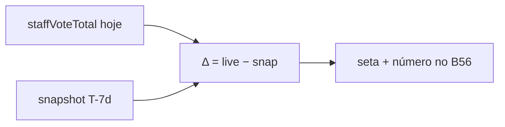

# Delta de 7 dias do total de estimativas (Início)

Status: entregue
Atualizado em: 2026-08-01
Item do roadmap: [docs/roadmap.md](../roadmap.md) (Trilha B, item B57 — baixa prioridade / futuro)
Impeccable: B — encaixe de seta + Δ no bloco **B56** (quando existir trajetória)
Appetite: ~1,5–2 dias eng quando aberto; **snapshot diário** + reader + UI; migration leve
Responsável: —

## Design (Impeccable)

Âncoras: `PRODUCT.md` / `DESIGN.md` · bloco **B56** · tema `campaign`.

Na implementação (quando priorizado): craft compacto → critique → polish.

Brief compacto:

- **Persona / contexto:** CG na reunião semanal — “subimos ou caímos na semana?”
- **Job principal:** ler o sinal do Δ ao lado do total sem abrir planilha.
- **Estratégia de cor:** Restrained; ↑/↓ com contraste acessível (não só cor — também sinal/texto).
- **Edit where you see:** não.
- **Anti-goals:** sparkline multi-semana em v1; Δ de cobertura no mesmo gesto (pode vir depois); inventar histórico a partir de um único load.

## Dados → decisão → apresentação

- **Vou apresentar dados?** Sim — série temporal curta (2 pontos: agora vs T−7d) agregada.
- **Decisões desbloqueadas:** Coordenador: “a projeção statewide/carteira moveu o suficiente esta semana para mudar a pauta da reunião / abrir A1 em lote?”
- **Forma escolhida:** seta + número absoluto do Δ (pt-BR) ao lado do total B56 — degrau pobre. **Rejeitado:** chart; dual-axis; % do Δ como único sinal sem absoluto.
- **Profile:** 1 escalar assinado (Δ do `staffVoteTotal` central); janela fixa 7 dias civis (Bahia).
- **Anti-goals de dado:** sem reconstruir “quase” com versions incompletas e apresentar como verdade.

## Contexto

**B56** entrega o total vivo + cobertura E8. Não existe série de `municipality.expectedVotes` nem snapshot statewide; versions em `votePledge` (C12) existem mas **não** cobrem a metade da mesa do `staffVoteTotal`, e não há reader de ponto-no-tempo. E8 já adiou “delta semanal persistido” até existir trajetória. Produto (2026-07-29): o Δ é desejável, mas **caro demais agora** — registrar com **prioridade baixa / futuro**, sem competir com chassis UX-1 (B46–B55) nem com B56.

## Objetivos (quando priorizado)

- Persistir **um ponto por dia** (civil America/Bahia) do `staffVoteTotal` central **por escopo relevante** — no mínimo: total irrestrito (CG/candidato); decisão aberta se assessor precisa de série por ator ou só vê Δ statewide (recomendação abaixo).
- Reader: valor em T₀ (vivo, como B56) − valor persistido mais próximo de T−7d (ou “—” se &lt;7 dias de história / buraco).
- UI: ao lado do número do **B56**, seta ↑/↓ (ou em dash se Δ≈0) + magnitude formatada; `aria-label` com direção e valor.
- Sem Consent; migration da collection/tabela de snapshot.

## Decisões travadas (para quando abrir)

- **Prioridade baixa até o chassis UX-1 + B56 estabilizarem.** **Rejeitado:** furar fila de B46–B48 / soft 03/08 por este Δ.
- **Métrica do Δ = mesmo hero do B56** (`staffVoteTotal` central). **Rejeitado:** Δ só de pledges (mente sobre a projeção da mesa); Δ de cobertura no lugar do total.
- **Persistência = snapshot diário leve**, não event-sourcing de versions. **Rejeitado agora:** versionar `municipality.expectedVotes` (caro, vazaria em todo update); reconstruir só via `_vote_pledge_v` (incompleto p/ expectedVotes).
- **i18n:** `campaignVoteSummarySnapshot` (ou nome final), `homeSummaryDelta`; copy “nos últimos 7 dias”.

## Questões em aberto

- **Escopo do snapshot para assessor?** **Opções:** A só statewide (assessor vê Δ global) | B uma linha por `campaignUser` advisor no fim do dia | C sem Δ para assessor. **Recomendação:** A em v1 (uma série; assessor já vê total da carteira no B56 — Δ statewide é contexto). _(assumido — validar ao priorizar)_
- **Escrita do snapshot: on-read (primeiro hit do dia) vs cron/job?** **Opções:** A first staff home/quadro load do dia | B script agendado | C afterChange em expectedVotes/pledge (N writes). **Recomendação:** A — zero infra nova; idempotente por `(date, scopeKey)`. _(assumido)_
- **Retenção?** **Opções:** 30 | 90 | ilimitado. **Recomendação:** 30 dias (cabe o 7d + folga; prune no write). _(assumido)_

## Abordagem proposta

Componentes (quando aberto):

- **Collection ou tabela `campaignVoteSummarySnapshot`** (admin-hidden): `day` (date), `scopeKey` (`statewide` | …), `staffVoteTotalCentral` (number), unique `(day, scopeKey)`; access admin/staff-read; write só via utility interna com `overrideAccess` justificado **ou** Local API no path de load.
- **`recordCampaignVoteSummarySnapshotIfNeeded`**: se não há row do dia civil BA, grava o total atual do escopo.
- **`loadCampaignHomeSummaryDelta`**: lê live + row ~T−7d; devolve `{ delta: number | null }`.
- **UI** em `CampaignHomeSummary`: slot ao lado do total.
- **Migration:** `pnpm migrate:create add_campaign_vote_summary_snapshot` (nome final no PR).

## Dependências

- Dura: **B56** (slot UI + semântica do total). Soft: **E8 ✓** / **C12 ✓** (contexto; C12 versions **não** substituem o snapshot).
- Não bloqueia B46–B55.

## Não escopo

- Bloco total + cobertura → **B56**.
- Backtest pós-eleição / calibração → **E15**.
- Δ de cobertura / por município / sparkline → adiado com gatilho abaixo.

## Rabbit holes

- **“Só ler versions de pledge.”** Hero B56 inclui `expectedVotes` sem versão → Δ mentiria. **Mitigação:** snapshot do escalar já agregado.
- **Snapshot por município × dia.** Explode armazenamento e UI. **Mitigação:** só o agregado statewide (e escopos extras só com evidência).
- **Cron em Vercel Hobby.** **Mitigação:** preferir on-read idempotente.

## Adiado com gatilho

- **Δ da cobertura E8 na mesma linha.** Revisitar quando o Δ do total estiver em uso ≥2 semanas e a reunião pedir o segundo número.
- **Sparkline 4 semanas.** Revisitar se B57 v1 for usado e pedirem tendência visual.
- **Versionar `expectedVotes`.** Só se auditoria por município exigir trajetória (não só o Δ statewide).

## Referências

- `docs/roadmap.md` (B57)
- [resumo-campanha-inicio.md](resumo-campanha-inicio.md) (B56)
- [conta-da-cadeira.md](conta-da-cadeira.md) — adiado “Delta semanal persistido”
- [registro-fundacao.md](registro-fundacao.md) (C12) — versions de pledge ≠ série do hero
- `src/utilities/campaignDashboardData.ts` / `votePledgeViews.ts`
- AGENTS.md — migrations; `overrideAccess` com comentário se write interno
