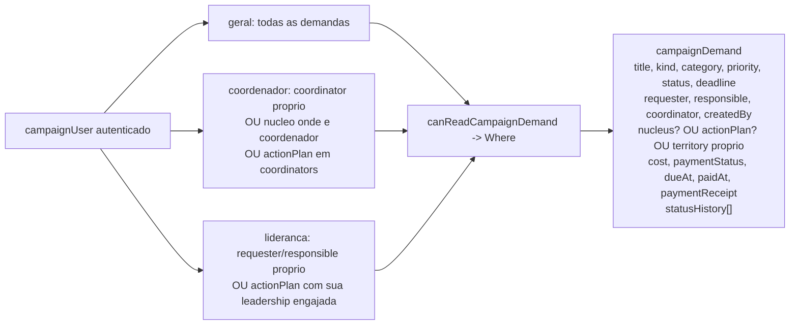

# Demandas de campanha

Status: rascunho
Atualizado em: 2026-07-17
Item do roadmap: [docs/roadmap.md](../roadmap.md) (C4 — Próximos / Janela 3)
Responsável: —

## Contexto

Hoje a `/campanha` só modela território (`electoralNucleus`) e reporte (`nucleusUpdate`). Não há como registrar, priorizar e acompanhar necessidades operacionais da campanha — material, transporte, alimentação, espaço, equipamento, pessoal de apoio — nem seu custo e comprovante de pagamento. Essas demandas hoje se perdem em WhatsApp e cadernos.

A decisão de produto (2026-07-17) é modelar o domínio "Demandas" como **uma entidade única `campaignDemand`**, que alimenta o bloco "Demandas" já reservado no overview de `/campanha/nucleos` ([overview-lista-nucleos.md](overview-lista-nucleos.md)).

A pesquisa de CRM político (O Assessor, Conecta Gabinete, FiscalNote, foreAction) indica os pilares de organização de demandas: classificação (tema/tipo/urgência/competência/território), priorização, status de ciclo (recebida → em andamento → encaminhada → resolvida), responsáveis, prazos, SLA/tempo de resolução e relatórios/heatmap por região.

### Aspecto legal (prestação de contas eleitoral)

A prestação de contas eleitoral é regulada pela Lei 9.504/1997 e pela Resolução TSE 23.604/2019, e é feita no sistema oficial do TSE (SPCE). Os gastos eleitorais devem ser comprovados com documento fiscal idôneo (data, descrição detalhada, valor, identificação de emitente/destinatário com CPF/CNPJ e endereço), sem emendas/rasuras, pagos via transação bancária ou cheque nominativo cruzado.

**Este app NÃO é o SPCE e não processa pagamentos nem doações** (roadmap: fora de escopo). Os campos `cost` e `paymentReceipt` deste domínio são **apenas controle interno de gastos da campanha**, para a coordenação acompanhar necessidades e comprovantes operacionais. Eles **não substituem** a prestação de contas oficial e não têm valor fiscal. A exportação fiscal para o SPCE fica fora do MVP (ver Não escopo).

### LGPD

Dados financeiros não são tecnicamente "sensíveis" pela LGPD (art. 5º II, art. 11), mas a jurisprudência e orientações da ANPD recomendam tratá-los com proteção equiparada, pelos princípios da necessidade/minimização, segurança, accountability e acesso restrito need-to-know (art. 6º, art. 46). A base legal do tratamento no MVP é o **cumprimento de obrigação legal/regulatória** (prestação de contas eleitoral), independentemente de consentimento. O controle de acesso por associação (ver Decisões travadas) materializa o need-to-know.

## Decisões travadas

- **Escopo financeiro = controle interno only.** Manter `cost` + `paymentReceipt` no MVP como controle interno de gastos da campanha, sem substituir o SPCE/TSE. Disclaimer jurídico no admin e na UI. (Resposta do usuário 2026-07-17.)
- **Requerente = `Contact`, MVP interno.** Demandas são registradas só por staff logado; base legal LGPD = obrigação legal. "Requerente visualiza" só se aplica quando o `Contact` tem `campaignUser` (liderança) vinculado. Sem `Consent` novo, sem rota pública self-service. (Resposta do usuário 2026-07-17.)
- **Entidade única `campaignDemand`**, admin group `Campanha`, `useAsTitle: title`.
- **Três modos de associação territorial (mutuamente exclusivos em prática):**
  - `nucleus` setado → herda território e coordenadores do núcleo; alimenta o bloco "Demandas" do overview de `/campanha/nucleos`.
  - `actionPlan` setado → herda território, `coordinators` e `leadership` do plano ([eventos-agenda-mobilizacao.md](eventos-agenda-mobilizacao.md)); não alimenta o bloco do overview de núcleos (overview é escopado por filtros de núcleo).
  - nenhum dos dois → **demanda avulsa** com `territory` próprio (validações Bahia reusadas); não alimenta o bloco do overview de núcleos.
  - Validação server-side: se `nucleus` ou `actionPlan` setado, `territory` é ignorado/limpo (origem do território é derivada, não duplicada). Pelo menos uma das três origens deve estar presente (núcleo, actionPlan ou território próprio).
- **`nucleus` é opcional** (confirmado pelo usuário 2026-07-17). Permite demanda não associada a um núcleo.
- **Pessoas = `Contact` + `campaignUser`, nunca cadastro paralelo** (convenção AGENTS.md). `requester` → `Contact` (quem tem a necessidade); `responsible` → `Contact` (executor em campo, como `actionPlan.responsible`); `coordinator` → `campaignUser` (opcional, para avulsas; vinculada a núcleo herda `coordinators`, vinculada a actionPlan herda `coordinators` do plano); `createdBy` → `campaignUser` (derivado no servidor).
- **`kind` enum** de tipos operacionais de campanha: `material`, `servico`, `transporte`, `alimentacao`, `infraestrutura`, `espaco`, `equipamento`, `pessoal_apoio`, `outro`. Valores em pt-BR (são dados/labels, não identificadores).
- **`category` texto livre opcional** (tema: saúde, educação, segurança...) — secundário, não enum, para não travar taxonomia no MVP.
- **`priority` enum**: `baixa`, `media`, `alta`, `emergencial`. Indexada.
- **`status` enum** de ciclo: `rascunho`, `recebida`, `em_andamento`, `encaminhada`, `resolvida`, `nao_resolvida`, `cancelada`. Transições para `cancelada`/`resolvida`/`nao_resolvida` restritas a `geral` ou `coordinator` (espelha `canManageNucleusLifecycle`).
- **`paymentStatus` enum** (eixo financeiro separado do status): `nao_pago`, `pago`, `reembolsado`, `cancelado`. `paidAt` (date) e `dueAt` (date, prazo de pagamento, distinto de `deadline` da demanda).
- **`cost` number** min 0, 2 casas decimais, BRL implícita. Sensível.
- **`paymentReceipt` upload → `media`.** Documento fiscal com CPF/CNPJ — muito sensível. Field-level read restrito.
- **`slug` canônico imutável após criação** (mesmo padrão `setCanonicalNucleusSlug`): derivado de `title`, único, indexado, readOnly. Rotas em `/campanha/demandas/[slug]` (segmento `demandas` é dado/SEO em pt-BR, não identificador).
- **`statusHistory` array append-only no MVP** (`{ author→campaignUser, status, note, createdAt }`, com `author`/`createdAt` derivados no servidor). Collection dedicada `demandUpdate` (espelhando `nucleusUpdate`, feed imutável paginado) fica como follow-up.
- **Access control por associação (usuário):**
  - `geral` vê todas.
  - `coordenador` vê as onde é `coordinator` **ou** vinculadas a núcleo onde é coordenador **ou** vinculadas a actionPlan onde está em `coordinators`.
  - `lideranca` vê só as onde é `requester`/`responsible` (via `Contact`↔`campaignUser`↔`leadership` engajada) **ou** vinculadas a actionPlan cuja `leadership` é uma das suas engajadas.
  - Field-level read de `cost`/`paymentReceipt`/`paymentStatus`/`paidAt`/`dueAt` restrito ao mesmo escopo + `geral`.
  - Honra a regra do produto: "somente o coordenador geral vê todas; requerente, responsável e coordenador vê só as suas".
- **Sem `Consent` novo; sem rota pública no MVP.** Base legal = obrigação legal.
- **O bloco de território (demanda avulsa) nasce no modelo vigente do núcleo** (nota de sequenciamento 2026-07-17). Se [`territorio-multi-municipio-bairro.md`](territorio-multi-municipio-bairro.md) já tiver sido implementado (ordem recomendada no roadmap), `campaignDemand.territory` nasce com `regions[]`/`cities[]`/`neighborhoods[]` e as mesmas regras de validação — nunca com o modelo single antigo.
- **i18n e naming** seguem o AGENTS.md: identificadores em inglês (`campaignDemand`, `CampaignDemand`, `CampaignDemandForm`, `loadCampaignDemandListPageData`), labels admin e strings visíveis em pt-BR.

## Questões em aberto

- ~~**Ordem de implementação vs. `actionPlan`.**~~ **Resolvida no roadmap (2026-07-17): opção (b).** `campaignDemand` pode ser implementada sem o campo `actionPlan`; a relação é adicionável depois (migration aditiva simples) e só ganha UI quando `actionPlan` existir. Na prática o roadmap prioriza Eventos antes de Demandas (agenda de mobilização é mais crítica para 16/08), então o campo provavelmente já nasce junto — mas Demandas **não bloqueia** em Eventos.
- **`lideranca` vê demandas?** Recomendação: só se for `requester`/`responsible` ou via actionPlan leadership. Confirmar com produto.
- **`responsible` aceita qualquer `Contact` ou só acessíveis?** Recomendação: só contatos no escopo do ator (`getAccessibleContactIds`), espelhando o contato principal do núcleo. Definir com produto.
- **Bloco "Demandas" no overview mostra custo?** Custo é sensível. Recomendação: só contagens (por status, emergenciais, próximas do prazo); custo só visível para `geral`. Confirmar com produto.
- **Dashboard geral ganha bloco de demandas?** Recomendação: sim, agregando todos os três modos (núcleo, actionPlan e avulsa), sem filtros de lista.
- **Demandas avulsas e actionPlan-vinculadas aparecem em algum agregado de território?** Recomendação: dashboard geral, não no overview de núcleos (que é escopado por filtros de núcleo).
- **`demandUpdate` dedicado.** Migrar o array `statusHistory` para collection separada (imutável, paginada, autor derivado) em follow-up se o histórico crescer.
- **Exportação fiscal para o SPCE.** Exportar demandas pagas + comprovantes para alimentar o SPCE? Fora do MVP, mas a arquitetura (comprovante em `media`, campos de pagamento) deve permitir no futuro.

## Abordagem proposta

Componentes:

- **`src/collections/CampaignDemand.ts`** (novo): collection em admin group `Campanha`, `useAsTitle: title`. Campos conforme "Decisões travadas". Hooks `beforeValidate` (slug canônico + validação dos três modos de território: herda de núcleo/actionPlan ou exige `territory` próprio + validações Bahia reusadas de `ElectoralNucleus`) e `beforeChange` (derivar `createdBy` em create, derivar `statusHistory.author`/`createdAt`, limpar `territory` quando `nucleus`/`actionPlan` setado).
- **`src/utilities/campaignAccess.ts`** (extensão): `canCreateCampaignDemand`, `canReadCampaignDemand` (retorna `Where` por papel), `canUpdateCampaignDemand`, `canDeleteCampaignDemand`, `canSetCampaignDemandSystemField`, `canSetCampaignDemandStatus`, `canReadCampaignDemandFinancial` (field-level para `cost`/`paymentReceipt`/`paymentStatus`/`paidAt`/`dueAt`), e `getAccessibleDemandIds` (cache em `req.context`, espelha `getAccessibleNucleusIds` — resolve IDs por `coordinator`, por núcleo acessível e por actionPlan acessível).
- **`src/app/(campaign)/campanha/(app)/demandas/page.tsx`**: lista paginada com filtros (kind, status, priority, paymentStatus, território, janela `deadline`), reusando `NucleusFilters`/`NucleusList`/`NucleusPagination` como referência de layout e `components/ui/*`.
- **`src/app/(campaign)/campanha/(app)/demandas/[slug]/page.tsx`**: detalhe com `NucleusTabNav`-style (Visão geral, Histórico de status).
- **`src/app/(campaign)/campanha/(app)/demandas/novo/page.tsx`** e **`demandas/[slug]/editar/page.tsx`**: form reusando `NucleusForm`/`NucleusTerritoryFields` como referência.
- **`demandas/formActions.ts`**, **`demandas/[slug]/campaignDemandFormActions.ts`**: server actions; escritas multi-collection (criar demanda + entrada de `statusHistory`; transição de status + append de `statusHistory`; registrar pagamento + anexar comprovante) envolvem `payload.db.beginTransaction/commitTransaction/rollbackTransaction` com `req: { transactionID }` (padrão AGENTS.md).
- **`src/components/campaign/CampaignBottomNav.tsx`**: adicionar entrada "Demandas".
- **Bloco "Demandas"**: ativar no overview de `/campanha/nucleos` (já desenhado em [overview-lista-nucleos.md](overview-lista-nucleos.md)) consumindo `campaignDemand` com `nucleus` no conjunto filtrado, agrupado por `status`/`priority`, sem expor `cost` (só `geral`). No dashboard `/campanha`, bloco agregando os três modos.

## Ondas (lean, espelhando o ciclo de Núcleos)

1. Domínio: collection `CampaignDemand.ts`, hooks, access control em `campaignAccess.ts`, migration `add_campaign_demand`, `pnpm generate:types`, `pnpm generate:importmap`, `pnpm exec tsc --noEmit`, lint.
2. Lista `/campanha/demandas` + filtros + ativação do bloco "Demandas" no overview de `/campanha/nucleos`.
3. Detalhe `/campanha/demandas/[slug]` com tabs (Visão geral, Histórico).
4. Forms novo/editar + server actions transacionais + transição de status + registrar pagamento/comprovante.
5. Dashboard "Demandas" + E2E por papel + responsividade 360/390/768/1440 + hardening + Aikido por arquivo editado.

## Dependências

- **[`territorio-multi-municipio-bairro.md`](territorio-multi-municipio-bairro.md) — pré-requisito de sequenciamento** (2026-07-17): o bloco de território da demanda avulsa nasce no modelo de arrays. Ver "Decisões travadas".
- **Soft dependency em `actionPlan`** ([eventos-agenda-mobilizacao.md](eventos-agenda-mobilizacao.md)): a relação `actionPlan` só é viável quando a collection `actionPlan` existir. Decidido (opção b): Demandas não bloqueia em Eventos; o campo é adicionável depois (ver Questões em aberto).
- Reusa validações Bahia (`src/lib/bahiaTerritories.ts`, `src/lib/cities.ts`), access control existente (`src/utilities/campaignAccess.ts`), `slugify` (`src/utilities/slug.ts`), UI `components/ui/*` e padrões de `NucleusForm`/`NucleusFilters`/`NucleusList`/`NucleusTabNav`.
- Consumidor direto: bloco "Demandas" do overview de `/campanha/nucleos` ([overview-lista-nucleos.md](overview-lista-nucleos.md)) — só agrega demandas vinculadas a núcleo.

## Não escopo

- SPCE/prestação de contas oficial — não substitui o TSE; os campos financeiros são controle interno.
- Processar pagamentos ou doações dentro deste app (roadmap fora de escopo).
- Self-service público de requerente + `Consent` — fora do MVP.
- Collection dedicada `demandUpdate` (feed imutável paginado) — follow-up; MVP usa array `statusHistory`.
- Exportação fiscal oficial para o SPCE — fora do MVP.
- Previsão/estimativa estatística de custo.
- Notificações/lembretes de demanda (item separado do roadmap, [notifications.md](notifications.md)).

## Referências

- `docs/roadmap.md` (Próximos — ver ID do item)
- `docs/plans/overview-lista-nucleos.md` — bloco "Demandas" já desenhado
- `docs/plans/eventos-agenda-mobilizacao.md` — entidade `actionPlan` (relação opcional)
- `src/collections/ElectoralNucleus.ts` — padrão de collection, hooks de slug/território, campos derivados
- `src/collections/NucleusUpdate.ts` — padrão de feed imutável, locks por núcleo, autor derivado
- `src/utilities/campaignAccess.ts` — `getAccessibleNucleusIds`, `getFreshCampaignUser`, `getAccessibleContactIds`, padrões de access por papel
- `src/lib/bahiaTerritories.ts`, `src/lib/cities.ts` — validação de território Bahia
- `src/utilities/slug.ts` — `slugify`
- AGENTS.md — Campaign auth, naming conventions, transações multi-collection, workflow de migrations, LGPD/Consent
- Pesquisa: CRM político (O Assessor, Conecta Gabinete, FiscalNote, foreAction); TSE Res. 23.604/2019, Lei 9.504/1997; LGPD Lei 13.709/2018 art. 6º/7º/11/46
