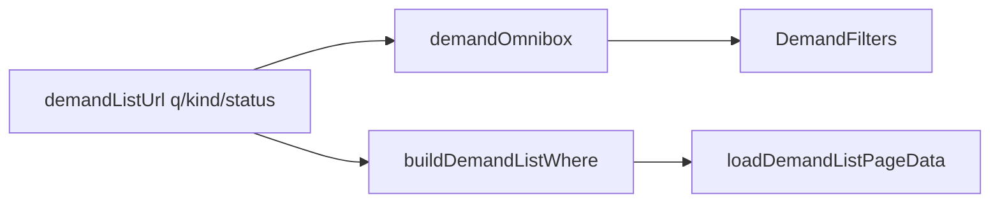

# Impl: Demandas — tipo e busca na omnibox

Status: aprovado
Atualizado em: 2026-08-02
Issue: #308
Intenção: docs/plans/demandas-omnibox-tipo-busca.md
Appetite restante: herdado (~0,5–1 dia eng)

## Leitura da intenção

- **Outcome:** Omnibox de `/campanha/demandas` expõe Tipo + Busca junto do Status; chips coexistentes e removíveis; ausência = sem restrição.
- **O que NÃO negociar:** deep-link `activity` continua URL-only (fora da omnibox); leader lockdown; sem segunda toolbar; busca só em campos visíveis na lista.
- **O que reavaliar:** B128 preservava `kind` no `clear` porque era deep-link — com tipo na omnibox, `clear` zera kind também; mantém só `activityId`.

## Abordagem recomendada

**Opções:** A) estender adapter B128 + `q` na URL · B) busca só client-side · C) novo componente de filtro  
**Recomendação:** A — precedente território (busca) + atividade (tipo); URL canônica B18.  
**Rejeitadas:** B (paginação mentirosa); C (twin).

### Componentes / mudanças

- **`demandListUrl.ts`:** `q?: string`; parse/serialize; `buildDemandListWhere(state)`.
- **`demandOmnibox.ts`:** seeds/chips/ações para `kind` e `q`; `clear` sem `kind`, com `activityId`.
- **`campaignDemandData.ts`:** usar `buildDemandListWhere`.
- **`DemandFilters.tsx`:** copy omnibox (label/placeholder).
- **Tests:** unit adapters + parser `q`; int `loadDemandListPageData` com `q` em título e solicitante.

### Migration / access

Sem migration. Access inalterado (`overrideAccess: false`).

## Fases verificáveis

1. URL + where + omnibox adapter + unit tests
2. UI copy + int test busca
3. `pnpm gate:fast` → `pnpm push`

## Rabbit holes / Não escopo

- Busca em description/anexos/histórico
- Filtro omnibox por `activity`
- Saved filters

## Riscos e mitigação

- **`leadership.contact.name` no where:** precedente lideranças/apoiadores; int test cobre solicitante.
- **`clear` quebrava expectativa de kind deep-link:** produto agora pede tipo na barra — `clear` alinha com atividades.

## Aceite de engenharia

- [x] Aceite de produto da intenção ainda coberto
- [x] Invariantes AGENTS/engineering-standards
- [x] Testes de domínio previstos (unit/int)

**Decision-quality:** 5/5
