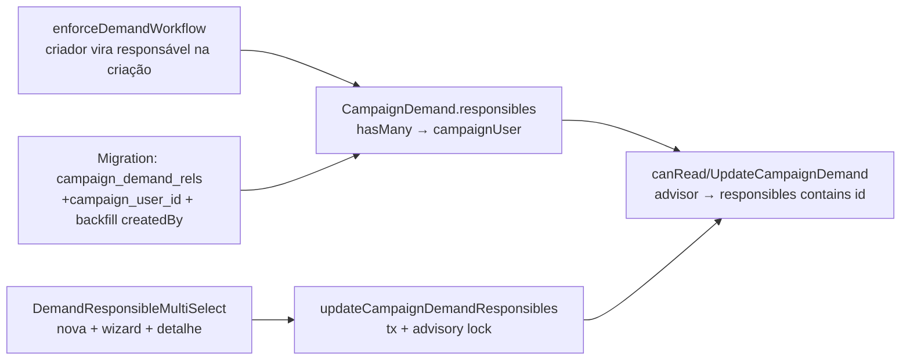

# Impl: Demandas visíveis apenas para responsáveis explícitos + candidato/coordenador

Status: aprovado
Atualizado em: 2026-08-19
Issue: #106
Intenção: docs/plans/demandas-responsaveis.md
Appetite restante: herdado (~1–1,5 dias eng; tracer primeiro, polish depois)

## Leitura da intenção

- **Outcome:** a demanda tem um conjunto de **responsáveis** (staff da campanha); candidato e coordenador sempre a veem; assessor do município relacionado que não é responsável **não vê** — nem lista, nem URL, nem busca. Criador entra automaticamente como responsável. Quem atualiza a demanda gerencia os responsáveis. Leader lockdown intacto; custo/comprovantes seguem a visibilidade da demanda.
- **O que NÃO negociar:** visibilidade **fail-closed** por vínculo explícito (nada de herança do município); regra nos dados (access), não escondida no cliente; leader nunca vê demandas; escalada continua candidato/coordenador.
- **O que reavaliar:** a hipótese da intenção era "`canReadCampaignDemand` passa a ser unrestricted ou responsável". Confirma-se no código: hoje o escopo vive **só** em `src/utilities/access/demands.ts:33` (`resolveActorScopedRead` com `municipality`), e **todos** os consumidores (lista, detalhe, busca global do dashboard, demandas vinculadas da atividade, C90, omnibox) herdam via Local API `overrideAccess: false` — não há REST nem client query. O corte é cirúrgico: regra nova + campo + migration + UI de gestão.

## Abordagem recomendada

**Opções consideradas:**

- **A — Campo `responsibles` hasMany → `campaignUser` + regra `where` de membership** (espelho de `municipality.advisors` / `{ advisors: { contains } }`).
- **B — Relação polimórfica `responsible` (union campaignUser/leadership/stateDeputy) como a `activity`.**
- **C — `or: [responsibles contains, createdBy equals]`** (criador visível mesmo se removido dos responsáveis).

**Recomendação:** **A** — single collection, sem union desnecessária (responsável é sempre staff da campanha — `eligibleCampaignStaffWhere`), query escalar `{ responsibles: { contains: id } }` (mesmo mecanismo do `advisors`), e a join table `campaign_demand_rels` **já existe** (hoje usada por `receipts`/media) — a migration só adiciona a coluna `campaign_user_id` + FK + índice.

**Rejeitadas:** **B** porque responsável é sempre `campaignUser` (não há liderança/dobradinha como responsável de demanda — a intenção fala de "pessoas da campanha"/staff; union polimórfica traria o custo do `equals { relationTo, value }` e catalog triplo sem ganho). **C** porque fura o modelo de responsável explícito: remover o criador da lista não o tiraria da visibilidade, e a intenção fixou "criador entra **como responsável**" (vínculo explícito, único source of truth). O criador entra na lista por hook **na criação** + **backfill** dos existentes.

### Decisões de engenharia

1. **Regra de leitura/atualização** — `canReadCampaignDemand` deixa de usar `resolveActorScopedRead` (que é o prólogo municipal) e vira função própria:
   `admin → true; leader → false; unrestricted → true; advisor → { responsibles: { contains: id } }; resto → false`. `canUpdateCampaignDemand = canReadCampaignDemand` (regra única "quem vê gerencia" — aceite: "quem pode atualizar pode gerenciar os responsáveis"). `canCreateCampaignDemand` **inalterado** (staff no município da carteira). `canDeleteCampaignDemand` admin-only inalterado. `canReadCampaignStaffField`/`canManageCampaignStaffField` inalterados.
2. **Criador auto-responsável** — no branch `create` do hook `enforceDemandWorkflow` (`CampaignDemand.ts:129-143`), quando `actor` é campaignUser: `data.responsibles = union(data.responsibles, [actor.id])`. Cobre **todos** os caminhos de criação: form `/demandas/nova`, wizard (A5), rascunhos C90 (activity.ts passa `user: currentActor`), admin UI (payload admin → actor null → sem responsáveis → fail-closed: invisível a assessores, o que é aceitável — quem criou via admin vê tudo). Sem auto-add no update.
3. **Backfill dos existentes** — na própria migration (padrão C90 `20260808_184113_remodel_activity_responsible.ts`, `RAISE NOTICE` + SQL no up): `INSERT INTO campaign_demand_rels (order, parent_id, path, campaign_user_id) SELECT 0, id, 'responsibles', created_by_id FROM campaign_demand WHERE created_by_id IS NOT NULL`. Preserva "a criação não some do criador" para as demandas pré-c143. Campo novo → nenhuma linha tem responsável → sem dedup.
4. **Gestão (server)** — `updateCampaignDemandResponsiblesRecord` em `actions/demand.ts`, mesmo shape dos irmãos: schema zod novo (`{ id, responsibles: array de positiveRelationshipId }`), `withPayloadTransaction`, `reloadCampaignActor`, staff check, advisory lock `campaign-demand:{id}`, `findByID` scoped (`overrideAccess: false` — a row access autoriza antes do write), `payload.update` com a lista **completa** (replace). Replace é a forma mais simples e segura: o estado do client já é a lista inteira e o advisory lock serializa editores concorrentes (add/remove atômico seria 2 formas de escrita para o mesmo dado).
5. **Busca de candidatos (UI)** — server action `searchDemandResponsibleOptions(query, municipalityId)` (padrão `searchDemandActivityOptions`): query < 2 chars → sugestões = assessores do município da demanda (read scoped de `municipality.advisors`); senão → busca por nome em `campaignUser` com `eligibleCampaignStaffWhere` (reusa o padrão de `loadEligibleAdvisorOptions`), `overrideAccess: false` (campaign users leem `campaignUser` — `canReadCampaignUsers`). Sugestão NÃO é herança: é atalho de preenchimento, a visibilidade vem só do campo salvo.
6. **Componente de multi-select** — `DemandResponsibleMultiSelect` novo em `src/components/campaign/demand/` (domain, não shared): single collection, chips removíveis, chip do criador rotulado "Você (criador)", sugestões no diálogo quando query curta, hidden inputs repetidos `responsibles` (contrato de `RelationMultiSelect`, não o JSON de `ResponsibleMultiSelect`). **Não reusar `ResponsibleMultiSelect` (C90)**: é polimórfico (typeLabel/relationTo), tem cap hardcoded `MAX_ACTIVITY_RESPONSIBLES=20`, e o contrato de FormData é JSON tipado — forçar modo single-collection seria 4 props novas + branch, um módulo raso; dois componentes com contratos distintos é honesto (mesmo critério que separou `RelationMultiSelect` de `ResponsibleMultiSelect`).
7. **Detalhe** — card `DemandResponsiblesCard` (client) com a lista (nome + avatar via `loadCampaignUserDisplayByIds`, helper existente), add por combobox, remove por chip, e o rótulo estático "Visível para: Responsáveis · Candidato · Coordenador". Layout do rascunho: grade `lg:grid-cols-3` — coluna 1–2 com os blocos atuais (descrição, decisão, workflow, controle interno), coluna 3 com o card. Todos os readers são updaters (update access = read access), então o card de gestão aparece para qualquer staff que abra a demanda — sem flag.
8. **Criação** — `DemandFields` ganha o campo responsáveis (opcional via prop `responsiblesMunicipalityId`/`currentUser`): `/demandas/nova` e wizard compartilham o mesmo parse (`parseCampaignDemandCreateFormData` ganha `responsibles: formData.getAll('responsibles')`), schema de create ganha `responsibles: z.array(positiveRelationshipId)` (sem cap — como `municipality.advisors`; o hook faz o union, dedup implícito). Draft: `/demandas/nova` em grade 2 colunas (form | responsáveis); wizard empilhado (o wizard herda via `DemandFields`).

### Componentes / mudanças

- **`CampaignDemand.responsibles`** (`src/collections/CampaignDemand.ts`): `relationship hasMany → campaignUser`, label "Responsáveis", index; sem field access (row access já gateia; staff nativo não abre `/admin`).
- **`enforceDemandWorkflow`** (`CampaignDemand.ts`): union do criador no create (campaignUser only).
- **`canReadCampaignDemand`/`canUpdateCampaignDemand`** (`src/utilities/access/demands.ts`): regra de membership; remove `resolveActorScopedRead`/`getAccessibleMunicipalityIds` deste módulo.
- **Migration:** `add_campaign_demand_responsibles` (drizzle): `ALTER TABLE campaign_demand_rels ADD COLUMN campaign_user_id` + FK (`ON DELETE cascade`, padrão `state_deputy_rels`) + índice; + backfill no up. Gerar com `pnpm migrate:create`.
- **Access / Consent:** sem Consent (dado interno staff). Fail-closed no where da access.
- **Server actions:** `updateCampaignDemandResponsiblesRecord` + `setDemandResponsiblesFormAction` (`[slug]/formActions.ts`, `revalidatePath`); `searchDemandResponsibleOptions` (`demandas/responsibleSearchActions.ts`).
- **UI:** `DemandResponsibleMultiSelect` + `DemandResponsiblesCard` em `src/components/campaign/demand/`; `DemandFields`/`DemandForm`/`WizardRegisterDemandStep` ganham o campo; `[slug]/page.tsx` ganha o card + grade lg. Impeccable B — seguir o rascunho (`demandas-responsaveis-ui-draft-*.png`): chips, placeholder "Buscar assessor…"/"Adicionar responsável…", textos informativos do rascunho.
- **View-model:** `DemandDetailViewModel.responsibles: Array<{ id, name, avatarUrl }>` via `loadCampaignUserDisplayByIds`; `nova/page.tsx` carrega o `currentUser` (id/nome) para seed do picker.

### Dados → forma

- Sem dados apresentados ao usuário além de nomes/avatares de responsáveis — forma já existente (chips com nome + avatar, padrão do código). Lista da demanda **não** ganha coluna de responsáveis (fora do aceite — apenas visibilidade muda).

## Fases verificáveis

1. **Schema + server (tracer)** — migration + campo + hook do criador + access rule; `pnpm generate:types`; int tests de access reescritos/adicionados (`campaignDemandWorkflow.int.spec.ts`, `homeSearchDemands.int.spec.ts`); backfill verificado no local.
2. **Ações + busca** — `updateCampaignDemandResponsiblesRecord` + zod + `searchDemandResponsibleOptions`; int de gestão (add/remove/self-removal, advisor não-responsável não lê).
3. **UI** — multi-select na criação (nova + wizard) e card no detalhe; shape → critique → polish contra o rascunho; e2e: assessor não-responsável não vê (lista vazia + URL → 404); ajustar e2e existentes se o aceite mudou o comportamento (criador auto-responsável preserva os fluxos atuais).
4. **Gates** — `tsc`, `lint`, `format:check`, `knip`, `check:cycles`, unit+int, `build` local; e2e afetado no CI. Aikido nos arquivos tocados.

## Rabbit holes / Não escopo (engenharia)

- **Notificação ao ser marcado responsável** (fora de escopo da intenção).
- **Coluna de responsáveis na lista / omnibox** — visibilidade herda a access, sem mudança de UI de lista.
- **C141 "Visão Tudo"** — não existe ainda; a regra nova já falha fechado para assessor em qualquer perfil futuro.
- **Generalizar `ResponsibleMultiSelect`/`RelationMultiSelect`** — rejeitado (contratos distintos, módulo raso).
- **Overflow "+N" dos chips no detalhe** — o padrão do código é wrap; o "+2" do rascunho é affordance de wireframe, não spec.

## Riscos e mitigação

- **Regra nova muda o que assessores veem em todos os pontos de demanda** (lista, detalhe, busca home, activity detail, C90). Mitigação: tudo herda por `overrideAccess: false` — um único ponto de corte; int tests cobrem cada superfície; C90 cria com `user: currentActor` → criador auto-responsável → a atividade continua listando as próprias demandas.
- **Self-removal deixa a demanda sem responsável** → visível só a candidato/coordenador (fail-closed, aceitável e coerente com o modelo explícito — gestão é dos responsáveis).
- **Join table já existente** (`campaign_demand_rels` com `path='media'`) — a migration adiciona coluna/FK; conferir o SQL gerado (não regenerar a tabela).
- **`codebaseConventions.unit.spec.ts`** — o guard anti-fragmento municipal não é violado (a regra nova não re-escreve `{ municipality: { in } }`); rodar o guard no gate.

## Aceite de engenharia

- [x] Aceite de produto da intenção ainda coberto (visibilidade fail-closed por responsáveis explícitos; criador automático; gestão por quem atualiza; leader lockdown; escalada inalterada)
- [x] Invariantes AGENTS/engineering-standards (Local API com `user`/`overrideAccess: false`; transação + advisory lock nas escritas multi-step; pt-BR em labels, identificadores em inglês)
- [x] Testes de domínio previstos (int: access rule, gestão de responsáveis, backfill; e2e: invisibilidade para não-responsável; adjust: workflow/homeSearch/listData)
