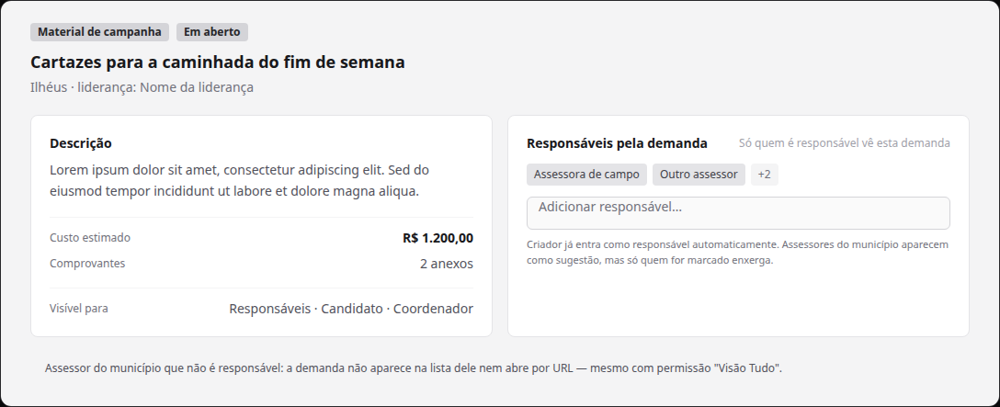
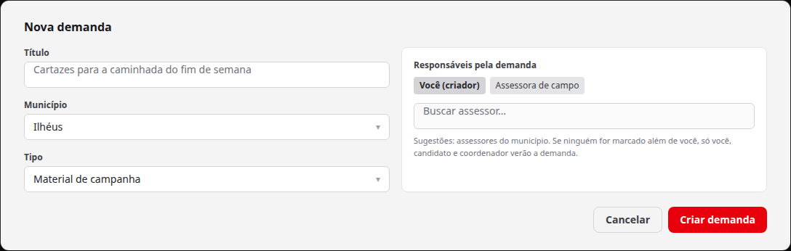

# Demandas visíveis apenas para responsáveis explícitos + candidato/coordenador

Status: aguardando execução
Atualizado em: 2026-08-19
Issue: #106
Priority: P1
Model: cursor-grok-4.5-high
Impeccable: B — encaixe no detalhe de demanda (`/campanha/demandas/[slug]`) e na criação
Rascunho UI: docs/plans/demandas-responsaveis-ui-draft.html
Appetite: ~1–1,5 dias eng; campo de responsáveis + regra de visibilidade fail-closed
Responsável: —

## Intenção

Demandas carregam custo estimado e comprovantes (controle interno de gastos). Hoje **qualquer assessor que administra o município da demanda a vê** — e a mesa descobriu que isso é amplo demais: a demanda deve ser vista **só por quem é responsável por ela**, pelo candidato e pelo coordenador geral. Mesmo um assessor do município relacionado, se não estiver marcado como responsável, não vê. Decidido no gate (2026-08-19, opção B): responsável é **vínculo explícito por demanda**.

## Persona e fluxo

- **Persona / contexto:** Alex (Coordenador Geral) e o Candidato acompanhando custos e decisões; assessores responsáveis acompanhando "suas" demandas; assessores do município que NÃO devem esbarrar em demandas que não são deles.
- **Job principal:** quem cria a demanda (ou a coordenação) define os responsáveis; só eles — além de candidato/coordenador — enxergam e tocam a demanda.
- **Fluxo desejado:**
  1. Um assessor cria uma demanda no município da carteira: o formulário pede "Responsáveis pela demanda" (criador já vem marcado; sugestões = assessores do município).
  2. No detalhe da demanda, quem pode atualizá-la adiciona/remove responsáveis.
  3. Um assessor do município que não é responsável: a demanda não aparece na lista dele, não abre por URL e não aparece em buscas — sem erro "sem permissão", simplesmente não existe para ele.
- **Anti-goals de produto:** responsável herdado automaticamente do município (a decisão do gate foi explícita); visibilidade por município como default; auditoria de quem viu (fora de escopo).

### Esboço de fluxo (B/C/D)

```text
[criar demanda] → [campo "Responsáveis" — criador pré-marcado, sugestão do município]
   → [criar] → [criador vira responsável; lista só para responsáveis + candidato/coordenador]
[detalhe] → [responsáveis gerenciam responsáveis]
[assessor não-responsável] → [demanda invisível: lista, URL e busca]
```

### Rascunho UI (B/C/D)





## Objetivo e aceite

- A demanda tem um conjunto de **responsáveis** (pessoas da campanha); candidato e coordenador sempre a veem, responsável ou não.
- **Visibilidade fail-closed:** sem responsável marcado além do criador, a demanda é visível só ao criador + candidato/coordenador. Assessor do município relacionado, se não for responsável, **não vê** — nem na lista, nem por URL, nem na busca.
- O **criador** entra automaticamente como responsável (garante pelo menos um dono e que a criação não suma do criador).
- Quem pode **atualizar** a demanda pode gerenciar os responsáveis (mesma regra de visibilidade: responsáveis + candidato/coordenador).
- A criação pede os responsáveis (sugestão = assessores do município da demanda), mas não obriga além do criador.
- Guardrails: leader lockdown intacto (liderança nunca vê demandas); decisão de escalada continua candidato/coordenador; custo/comprovantes seguem a visibilidade da demanda.

## Dados (intenção)

- **Vou apresentar dados?** Não — regra de visibilidade e controle de acesso.
- **Decisões desbloqueadas:** coordenação decide quem acompanha cada demanda.

## Direção no codebase (hipótese)

- **Áreas prováveis:** campo de responsáveis na demanda em `src/collections/CampaignDemand.ts`; regra de leitura/atualização em `src/utilities/access/demands.ts` (hoje `canReadCampaignDemand` = escopo do município — passa a ser "unrestricted ou responsável"); server actions `src/app/(campaign)/campanha/actions/demand.ts`; UI do detalhe `src/components/campaign/demand/` e do fluxo de criação (registrar pedido).
- **Precedente a olhar:** o fragmento de escopo P3-D (não re-escrever o `{ municipality: { in: ids } }` por aí — a regra nova substitui o escopo municipal de demandas); `getFreshCampaignUser`/`memoizePerRequest` para a leitura por request; o padrão de "membership" de `municipality.advisors` para o controle de responsáveis.
- **Risco de acoplamento:** atividades geram demandas (C90) e a lista/omnibox de demandas filtra por escopo — a regra nova muda o que assessores veem em todos os pontos; o Sollinha usa as mesmas queries de demanda (escopo por user).

## Dependências

- Nenhuma dura. **Guardrail:** C141 (perfis por assessor) nunca contorna esta regra — Visão "Tudo" não abre demandas fora da responsabilidade.

## Fora de escopo

- Perfil de permissão por assessor (C141) e apresentação por perfil (C142).
- Notificação/feed ao ser marcado responsável.
- Auditoria de leituras da demanda.

## Rabbit holes de produto

- **"Responsável = assessor do município, simples."** Isso é exatamente o modelo de hoje, que o gate rejeitou. **Corte:** vínculo explícito; sugestões sim, herança automática não.
- **"Vou usar o histórico de quem criou."** `createdBy` existe, mas só o criador não cobre quem vai executar a demanda. **Corte:** campo próprio de responsáveis; criador vira um responsável, não o único.
- **"Vou esconder no cliente."** Esconder na UI não segura URL direta nem a API. **Corte:** regra no acesso de dados (fail-closed) — lista, URL e busca respeitam o mesmo where.

## Questões em aberto (produto)

Fechadas no gate. Assunções operacionais (sem pergunta nova): criador entra automaticamente como responsável; quem atualiza a demanda gerencia responsáveis; sugestões do campo = assessores do município da demanda; visível para = "Responsáveis · Candidato · Coordenador" (rótulo exibido no detalhe). _Assumidas — validar se contrariarem a mesa._

## Referências

- Decisão do gate 2026-08-19 (resposta 1): responsáveis explícitos; assessor do município não-responsável não vê.
- Item irmão: `docs/plans/permissao-granular-assessores.md` (C141).
- Rascunho UI (gate): `docs/plans/demandas-responsaveis-ui-draft.html` + PNGs acima.
- Para abrir primeiro: `src/utilities/access/demands.ts`, `src/collections/CampaignDemand.ts`, `docs/plans/demandas-campanha.md`.
- `AGENTS.md` — convenção P3-D do escopo de assessor.
