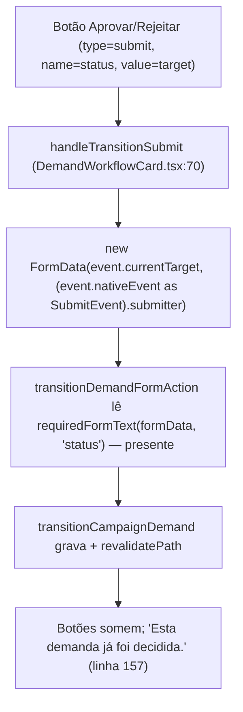

# Impl: Desbloquear deploy: decisão de demanda em /campanha parou de gravar (regressão pós-react-audit)

Status: rascunho
Atualizado em: 2026-08-25
Issue: #921
Intenção: docs/plans/desbloquear-deploy-decisao-demanda.md
Appetite restante: ~0,25–0,5 dia (fix + teste unit + e2e local; deploy é do humano pós-merge)

## Leitura da intenção

- **Outcome:** decidir demanda volta a gravar — nota + Aprovar/Rejeitar persistem e a tela exibe "Esta demanda já foi decidida."; e2e `tests/e2e/campaignMunicipalities.e2e.spec.ts:764` verde local e no verify; deploy manual verde concluído (humano, pós-merge).
- **O que NÃO negociar:** C139 intacto (dispatch manual `startTransition`+`useActionState` em todos os formulários — nota digitada preservada em erro de validação); nenhum outro formulário muda; nada de tocar retries/workers do e2e; nenhum skip/remoção de teste; sem migration, sem Consent, sem UI.
- **O que reavaliar:** nada de produto. Em engenharia: uniformizar o submitter no formulário de custo (questão a) e adicionar teste unit do glue (questão b) — decidido abaixo.

## Abordagem recomendada

**Opções consideradas:** A (FormData com submitter) | B (status via refs/state) | C (hidden input sincronizado)
**Recomendação:** **Fix A** — o construtor `new FormData(form, submitter)` do WHATWG anexa os pares name/value do botão submetido; é a correção mínima no ponto exato da regressão, sem novo estado e sem tocar no dispatch manual do C139.
**Rejeitadas:** B (mais código, zero benefício); C (mais estado, nova classe de bug); reverter e273e9ec (perde C139); converter ~20 formulários (explosão de escopo); tornar `status` opcional na server action (enfraquece validação).

### Componentes / mudanças

- **`DemandWorkflowCard.tsx`** (`src/components/campaign/demand/DemandWorkflowCard.tsx`): único arquivo de produto alterado. Extrair helper de módulo `submitterFrom(event: FormEvent<HTMLFormElement>): HTMLElement | null` que devolve `(event.nativeEvent as SubmitEvent).submitter` (cast necessário: React tipa `FormEvent<T>` como `SyntheticEvent<T, Event>` → `nativeEvent: Event`, mas o evento nativo real de submit é sempre `SubmitEvent`, cujo `.submitter` é `HTMLElement | null`). Usar em `handleTransitionSubmit` (linhas 70–73) e `handleCostSubmit` (linhas 74–77): `new FormData(event.currentTarget, submitterFrom(event))`. O `Button` de `src/components/ui/button.tsx` repassa `...props` ao `<button>` nativo, então `name`/`value` chegam ao DOM e o submitter passa a viajar no FormData. No form de custo o botão não tem `name`/`value` — spec: submitter sem name não anexa nada → no-op hoje, imunidade para o futuro. Form de comprovante (`action={submitReceipt}`) intocado. C139 preservado: `event.preventDefault()` + `startTransition(() => submit...)` não mudam; nenhum `action=` é reintroduzido.
- **Teste unit novo** (`tests/unit/demandWorkflowCard.unit.spec.tsx`): glue test que renderiza o card com `status="em_analise"`, `demandID={1}` e uma `transitionFormAction` fake que captura o FormData; preenche a nota e dispara `fireEvent.submit(form, { submitter: buttonAprovar })`. Asserts: `captured.get('status') === 'aprovada'`, `captured.get('decisionNote')` preservada, `captured.get('demandId') === '1'`. Pré-fix o teste falha (`status` nulo) — é a rede de regressão do glue no PR CI (o spec e2e não roda no CI de PR: cai no fallback smoke do `scripts/lib/e2e-affected-manifest.mjs`). Roda no unit config (`vitest.unit.config.mts`: jsdom, include `tests/unit/**/*.unit.spec.{ts,tsx}`; sem DB, sem payload). Convenções: plain vitest + testing-library, padrão de `campaignFormActionMessage.unit.spec.tsx`.
- **Migration:** sem migration
- **Access / Consent:** N/A — a server action `transitionDemandFormAction` e sua RBAC não mudam
- **UI:** Impeccable A — sem UI nova
- **Changelog:** `docs/changelog/2026-08-25-e2e-demand-decide.md` — UMA entrada curta (padrão AGENTS); nunca editar o agregado.

## Fases verificáveis

1. **Fix do card:** helper `submitterFrom` + os dois handlers usando-o. `pnpm gate:fast` verde.
2. **Teste unit do glue:** `tests/unit/demandWorkflowCard.unit.spec.tsx`; provar que falha sem o fix (estado atual) e passa com ele. `pnpm test:unit` e `pnpm gate:fast` verdes.
3. **Gates** — `pnpm gate:fast`; `pnpm test:int` (camada de registro não muda — rodar por garantia, barato); e2e local **obrigatório antes do push** (política OPS72): `pnpm test:e2e --no-deps -- tests/e2e/campaignMunicipalities.e2e.spec.ts -g "advisor opens a demand and decides it"` (usar `--workers=1` se colidir no `seedTestUser`; `E2E_PROD=1` espelha o verify). Depois `pnpm push`, PR com `Closes #921`, base `main`, auto-merge armado (convenção repo, check-run `checks` é o gate). Main verde encerra a entrega da sessão; o deploy manual (aceite 3) é do humano pós-merge: verify verde **e** job deploy concluído (conferir runner self-hosted online antes — falha "job was not acquired" é infra, fora deste item).

## Rabbit holes / Não escopo (engenharia)

- Não reverter e273e9ec nem a família 4 — perde C139.
- Não converter os outros ~20 formulários do padrão — só o DemandWorkflowCard tem botões nomeados (sweep de 27 arquivos; `ActivityOverlay.tsx:445` tem INPUT hidden `name="status"`, não botão — intocado).
- Não tornar `status` opcional na server action; não trocar `requiredFormText` por `formData.get` — validação atual é correta.
- Não corrigir o manifest de e2e afetados nem a família de flakes #882 — itens próprios.
- Não adicionar teste int do glue: o glue é cliente (`FormData` é montado no browser); a camada de registro já tem `tests/int/campaignDemandWorkflow.int.spec.ts`. Um teste unit da server action exigiria payload/DB — fora da camada unit.

## Riscos e mitigação

- **Cast `nativeEvent as SubmitEvent`:** evento de submit real é sempre `SubmitEvent` (spec HTML); React 19 entrega o evento nativo em `nativeEvent`. Risco residual baixíssimo; o e2e determinístico (browser real) é a prova final no verify.
- **C139 regredir:** o dispatch manual e o `preventDefault` não mudam — só a construção do FormData. O teste unit novo asserta `decisionNote` presente no FormData capturado, e o e2e cobre o fluxo completo (nota digitada + decisão + "Esta demanda já foi decidida.").
- **jsdom vs browser no submitter:** jsdom 28 implementa `FormData(form, submitter)` com validação igual à spec — o teste unit usa botão submit real dentro do form, sem fakes de DOM.
- **Custo do fix no form de custo:** no-op garantido (botão sem `name`/`value`); mudança é só uniformidade do padrão.

## Decisões de engenharia

- **Fix (A | B | C):** Opções: A — `new FormData(form, submitter)`; B — ler status via refs/state; C — hidden input sincronizado com último clique. **Recomendação:** A. **Rejeitadas:** B e C (mais estado/código sem benefício); revert do commit; conversão em massa; server action permissiva.
- **Questão (a) — submitter no `handleCostSubmit`:** Opções: incluir agora | deixar como está. **Recomendação:** incluir — mesma linha de código via helper `submitterFrom`, previne a classe de bug sem mudança de comportamento. **Rejeitada:** deixar como está (a próxima pessoa que nomear um botão no form de custo reproduz o bug).
- **Questão (b) — teste unit do glue:** Opções: exigir | opcional | não. **Recomendação:** exigir — é o único teste do glue no PR CI (o spec e2e não roda lá), custa ~30 min, falha sem o fix e passa com ele (prova de valor real). **Rejeitados:** testar `new FormData` puro em jsdom (testa a lib, não o nosso código); testar `transitionDemandFormAction` em unit (exige payload/DB — camada errada).
- **Helper local vs inline nos dois handlers:** **Recomendação:** helper de módulo de 2 linhas no próprio `DemandWorkflowCard.tsx` (cast concentrado num ponto). **Rejeitado:** utilitário compartilhado em `src/lib/` — 2 call sites, não justifica superfície pública.

## Aceite de engenharia

- [ ] `handleTransitionSubmit` e `handleCostSubmit` montam o FormData com o submitter (`submitterFrom` + cast `SubmitEvent`); C139 intacto (nenhum `action=` reintroduzido, `startTransition` preservado)
- [ ] `tests/unit/demandWorkflowCard.unit.spec.tsx` verde (e comprovadamente vermelho pré-fix); `pnpm gate:fast` verde
- [ ] e2e local verde: `pnpm test:e2e --no-deps -- tests/e2e/campaignMunicipalities.e2e.spec.ts -g "advisor opens a demand and decides it"`
- [ ] Entrada curta em `docs/changelog/2026-08-25-e2e-demand-decide.md`; PR `Closes #921` base `main` com auto-merge armado; main verde
- [ ] (humano, pós-merge) deploy manual: verify verde e job deploy concluído — critério final da Issue
