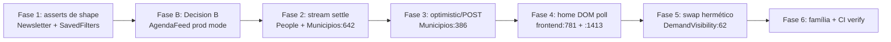

# Impl: OPS83 — Desbloquear deploy: estabilizar os e2e do verify (falhas + flakes) sem reduzir cobertura; entregar deploy real

Status: rascunho
Atualizado em: 2026-08-24
Issue: #824
Intenção: docs/plans/desbloquear-deploy-e2e-verify.md
Appetite restante: herdado (~2–3 dias eng; outcome verificável = deploy manual real verde na intenção; a forma técnica aqui fica dentro de "reescrever specs", que já foi human-gated)

## Leitura da intenção

- **Outcome:** um deploy manual a partir de main termina com o job `verify` verde (suíte e2e **full**, prod mode, 4 workers) e o job `deploy` concluído — app novo no ar. Baseline #15 (HEAD a2db543e): 1 failed + 7 flaky + 2 skipped + 1 did-not-run + 191 passed.
- **O que NÃO negociar:** não reduzir cobertura; não `test.flaky()`; não subir workers/retries como estratégia; os 2 skips do `campaignAgendaFeed` são **removidos** (rodam em prod mode); tratar a **família inteira** de classes estudadas (cast rotativa), não só as que falharam no #15; nunca tocar contrato público nem modelo de acesso.
- **O que reavaliar:** (1) a hipótese de "DOM-scoped poll vs server-HTML poll" na home pode revelar que o helper atual `waitForHomeHTML` precisa ser _parametrizado_, não duplicado — depth check antes de criar twin; (2) se a causa raiz de `frontend:781` for só propagação de ISR, o conserto pode ser um _clearing determinístico da cache_ em vez de bump de orçamento cego.

## Abordagem recomendada

**Opções consideradas:** A (só consertar as 9 que falharam no #15) | B (**família inteira de classes**, reescrita settle/poll/hermeticidade/escopo, como manda a intenção human-gated).

**Recomendação:** B — porque a cast rotativa faz a suíte re-falhar em classes irmãs a cada run; parar em A resolve o #16 e entrega o deploy amanhã, mas não cumpre o aceite de "2 runs consecutivos de verify com zero failed/flaky recorrente nas classes estudadas". Família aqui = os specs que **compartilham a classe de race**, não "rodar tudo de novo": as reescritas de helper da home e o padrão settle/`expectPostResponse` são aplicados aos testes-irmãos do mesmo serial-describe/spec que compartilham o mesmo código.

**Rejeitadas:** A porque resolve só os sintomas do #15 (a cast rotativa, estatística de 4 workers, rearranja as falhas no #16); e qualquer caminho de "configuração mágica" (workers/retries/`test.flaky`) porque viola o mandato de produto.

### Decisões de engenharia

- **D-1 — Home convergence (`frontend:1413` kill switch, `frontend:781` section hidden).**
  - Opções: A) continuar polling **server-HTML** body-wide e só trocar `toHaveCount` por `expect.poll`; B) **parametrizar `waitForHomeSectionState`/`waitForHomeHTML` para pollar o DOM rendered**, escopado ao `[data-home-section="contents"]`, e reter o server poll como gate de convergência secundário; C) apagar a cache ISR (`posts` fetch-cache) deterministamente antes de cada teste.
  - **Recomendação: B (+C para a ISR de `frontend:781`)** — porque o bug de `1413` é o IG card renderizar _no cliente dentro do payload de seção_ mesmo com a ausência convergida no body-server; pollar o DOM rendered é a ÚNICA fonte que observa o payload de seção. Reuso: `gotoHomeFresh` (cache-busting de navegação já existe), `expect.poll` (já usado no spec). Depth check: **estender** `waitForHomeSectionState` para aceitar `page` + `scope`, não criar `waitForHomeSectionDom` twin. Para `781`, a causa é propagação de ISR sob load; o trato é: (a) afirmar que o POST de `revalidate?tag=posts` **aterrissou** via `expectPostResponse(page, '/api/revalidate')` (determinístico, não wall-clock), e (b) esperar a convergência no DOM (não só no body) com orçamento explícito. Não subir "12s→N cego".
  - **Rejeitadas:** A porque não observa o payload de seção (o próprio flake); C-sozinho porque não cobre o componente cliente IG e surge como twin do helper existente (violação de depth check / reaproveitamento).
- **D-2 — AgendaFeed prod mode (2 skips).**
  - Opções: A) mudança de **app** (override explícito de origem na action); B) mudança só de **teste/config**: no `webServer.env` em prod mode setar `NEXT_PUBLIC_SITE_URL=https://feed.e2e.teqo.test` (origem canônica HTTPS, satisfaz `requireProductionDNSOrigin` — `DNS_HOSTNAME_PATTERN` casa, não é `localhost`/IP/`.local*`/`.internal`) e nos 2 testes manter o fluxo do diálogo, asserir o `path` (`/campanha/agenda/ical/<36>`), e buscar o feed via `campaign.baseURL + path` (hermético contra o server local).
  - **Recomendação: B** — porque `requireProductionDNSOrigin` (validado em `src/utilities/campaignInviteOrigin.ts`) aceita `.test`-TLD; produção real continua fail-closed (o `NEXT_PUBLIC_SITE_URL` de prod é DNS público real); nenhum dead-open é introduzido — a configuração canônica é injetada só no server de teste do Playwright. Confirmado: **nenhuma mudança de app é estritamente exigida**; a action `createCalendarFeedLink` → `buildFeedUrl` lê `NEXT_PUBLIC_SITE_URL` do processo do server e passa a usar a origem canônica de teste, gerando o mesmo caminho; o teste ignora o origin absoluto ao buscar.
  - **Rejeitadas:** A porque muda código de produção (contrato/segurança) para ceder terreno a teste — desnecessário e mais caro de reverter.
- **D-3 — Strict-mode locator `campaignSavedFilters:64` (`Municípios` resolve 2).**
  - Opções: A) `.first()`/`.last()`; B) escopar ao bar-região sidebar onde o shortcut vive (ex.: `campaignPageChrome` → container de sidebar) antes do `getByRole('link', {name:'Municípios', exact:true})`; C) trocar por `goto` (abandonaria a navegação hermética).
  - **Recomendação: B, fallback A** — porque a intenção explicitamente preserva o _goto-avoidance_ (navegação por link evita o `net::ERR_ABORTED` de RSC in-flight); escopar ao container de sidebar é o mais correto semânticamente (é o "Municípios" da navegação que queremos). O strict-mode (#669) é a feature que expôs o 2º match — absorvida aqui como causa-raiz.
  - **Rejeitadas:** C porque reintroduz a race que o comentário do teste documenta (medida em CI 2026-07-30).
- **D-4 — DSPR/streaming settle `campaignPeople:37` + `campaignMunicipalities:709`.**
  - Opções: A) aplicar em cada teste o `waitForFunction(div[id^="S:"]===0)` (padrão `campaignMunicipalities:708`) **seguido de um poll DOM escopado na row específica**; B) só o `S:` gate genérico; C) `expect(locator).toBeVisible()` hard (estado atual).
  - **Recomendação: A** — `S:` gate existente já provado no spec irmão; mas o comentário em `:642` admite que o chunk da lista pode cair depois do quiesce, então o gate genérico NÃO é suficiente — o poll em `expect.poll` escopado na row é o que observa o payload real. Recomendado **evitar `.first()`** em stream não-determinístico de milhares (usa-se poll até stabilizar match único).
  - **Rejeitadas:** B porque o comentário do próprio spec admite que o chunk atrasa além do `S:`; C é a causa da flake.
- **D-5 — Optimistic auto-apply `campaignMunicipalities:386` (facet churn).** Envolver cada interação removendo chip em `expectPostResponse(page, ...)` (fixture já provê, `:530`), e trocar `toHaveCount`/clique hard por `expect.poll` em contagem de chips e presença de opção. Opções de isolar o churn: esperar `listbox` re-render → `expect.poll` no count (Recomendação); `waitForTimeout` cego (Rejeitada — enche, não estabiliza).
- **D-6 — Swap hermenêutico `campaignDemandVisibility:62`.** Após `sessionFor(peer)` + `goto`, a navegação pode vir de RSC cache/stream da troca responsável→peer (servindo a demanda acessível em vez do 404). Opções: A) `.goto(URL, { cache: 'no-store' })`/`cache-buster` no `demandURL` da asserção de 404; B) `router.refresh()`/"nova requisição" entre os swaps; C) navegar para `about:blank` e voltar ao `demandURL` com cache-buster. **Recomendação: A** (fetch bypass de cache na navegação da asserção) — mínimo e mirar a raiz (RSC serve da cache). A guarda do swap em si (`sessionFor`→`clearCookies`+token) permanece.
- **D-7 — "1 did not run" do #15.** **Não virar task**: explicar por run (worker crash ou `serial-describe` abortado quando um teste do describe falha). Tratar como observável no Fase 6 se reproduzir, nunca como item barato de primeiro.

## Componentes / mudanças

- **`tests/e2e/frontend.e2e.spec.ts`** (serial `Campaign home content section`): parametrizar portar os helpers `waitForHomeSectionState`/`waitForHomeHTML` para aceitar `page` + scope de seção; reescrever `781` e `1413` para DOM-poll escopado; aplicar o mesmo padrão aos irmãos `1276/1337` (S2 share + IG fallback) que compartilham a classe IG card/API-down.
- **`playwright.config.ts`**: no bloco `webServer` do prod mode (`isProdMode`), setar `NEXT_PUBLIC_SITE_URL` para `https://feed.e2e.teqo.test` quando não vier do ambiente (canonical test origin) — o default atual é `baseURL` (localhost), que `requireProductionDNSOrigin` rejeita. Não tocar o `dev` mode.
- **`tests/e2e/campaignAgendaFeed.e2e.spec.ts`**: remover os 2 `test.skip(isProdMode, …)`; manter o fluxo do diálogo (cover); asserir path `/campanha/agenda/ical/<36>`; buscar via `campaign.baseURL + path` ao invés do URL absoluto.
- **`tests/e2e/campaignSavedFilters.e2e.spec.ts`**: escopar o `getByRole('link', {name:'Municípios', exact:true})` ao container de sidebar (fallback `.first()`).
- **`tests/e2e/campaignPeople.e2e.spec.ts`** (e irmãos `239/338`): `waitForFunction(S:)` + poll DOM na row específica; evitar `.first()` no stream.
- **`tests/e2e/campaignMunicipalities.e2e.spec.ts`**: `386` → `expectPostResponse` + `expect.poll` em chips/opções; `642` → poll DOM na row específica.
- **`tests/e2e/campaignNewsletter.e2e.spec.ts`**: `222` → em `toHaveURL(/#novidades/)` (drop do `$`) ou assert de `location.hash`.
- **`tests/e2e/campaignDemandVisibility.e2e.spec.ts`**: `62` → cache-busted `.goto` na asserção de 404 do peer.
- **Migration:** sem migration (nenhuma mudança de schema).
- **Access / Consent:** nenhuma; nada toca modelo de acesso nem Consent — parede de produto respeitada.
- **UI:** N/A — sem UI.

## Dados → forma (se aplicável)

N/A — sem superfície de dados; o "dado" do aceite é o resultado do workflow (failed/flaky/skipped por run).

## Fases verificáveis

1. **Fase 1 — asserts de shape (barato, zero risco).**
   - `campaignNewsletter:222` (regex sem `$`); `campaignSavedFilters:26` (escopo sidebar).
   - Verificação: `pnpm test:e2e --no-deps --project=campaign -- tests/e2e/campaignNewsletter.e2e.spec.ts` e `-- tests/e2e/campaignSavedFilters.e2e.spec.ts` (rodar cada 2× local).
2. **Fase B — Decision B, AgendaFeed prod mode (track independente).**
   - `playwright.config.ts` `webServer.env` prod; reescrever os 2 testes sem `skip`.
   - Verificação: `pnpm test:e2e --no-deps --project=campaign -- tests/e2e/campaignAgendaFeed.e2e.spec.ts` com `E2E_PROD=1`; confirmar que os 2 voltaram a **passar** em prod mode (antes: skipped) e que o C113 continua verde.
3. **Fase 2 — stream settle.**
   - `campaignPeople:15` (+ irmãos 239/338); `campaignMunicipalities:642`.
   - Verificação: `pnpm test:e2e --no-deps --project=campaign -- tests/e2e/campaignPeople.e2e.spec.ts` e `-- tests/e2e/campaignMunicipalities.e2e.spec.ts` (2×).
4. **Fase 3 — optimistic/POST.**
   - `campaignMunicipalities:386` (`expectPostResponse` + `expect.poll`).
   - Verificação: mesma spec 2× + `--grep "B176"` no no-deps.
5. **Fase 4 — home DOM poll.**
   - `frontend.e2e.spec.ts`: parametrizar helpers; reescrever `781` + `1413`; alinhar irmãos `1276/1337`.
   - Verificação: `pnpm test:e2e --no-deps --project=frontend -- tests/e2e/frontend.e2e.spec.ts` (2×; serial describe dá determinismo).
6. **Fase 5 — swap hermétic.**
   - `campaignDemandVisibility:62`.
   - Verificação: `pnpm test:e2e --no-deps --project=campaign -- tests/e2e/campaignDemandVisibility.e2e.spec.ts` (2×).
7. **Fase 6 — família inteira + job verify.**
   - Rodar a **família de classes estudadas** (não só o #15): re-rodar todos os specs tocados **mais** os irmãos da classe (frontend S2/IG, municipios stream/omnibox, people stream) e confirmar zero failed/flaky recorrente.
   - Verificação local full family; depois `CI`/verificar o job `verify` do `.github/workflows/deploy.yml` (via `workflow_dispatch`) — o mete o `deploy`.

## Rabbit holes / Não escopo (engenharia)

- Correr atrás de 1 flake isolado e fechar (rabbit hole 1 da intenção).
- "Marcar flaky/retry 3+"; subir workers (rabbit hole 2).
- Infra nova de "um server/DB por worker" sem tentar o barato primeiro (rabbit hole 3).
- O "1 did not run" do #15: **não presumir** — se não reproduzir no Fase 6, é explicado por run (worker crash / serial abort) e documentado, não vira task.
- `campaignLeaderships:59`, `campaignActivity:131`, `campaignPermissionProfile:85/101` (já curado em a97cd56f): **verificar** (Fase 6) mas não reescrever à toa se verde.

## Riscos e mitigação

- **Test hidden em prod mode volta a falhar por origem canônica não-resolvível.** Mitigação: a busca do feed usa `campaign.baseURL + path` (ignora o origin absoluto), e o origin canônico é só a string do `NEXT_PUBLIC_SITE_URL` do server de teste — nunca navegamos para ele. `requireProductionDNSOrigin` foi validado contra `.test`.
- **Helper DOM poll regressa os irmãos do serial-describe da home.** Mitigação: re‑rodar o `frontend` serial inteiro 2× (Fase 4); reuso em vez de twin reduz a superfície.
- **Dom-poll nova fonte de timeout** (orçamento). Mitigação: `expect.poll` com timeout explícito herdado do `expect` (`10s` default), não hard assert.
- **Fase 1 quiebra strict-mode em outro ponto** (unit C142 #805). Mitigação: rodar unit/int da suíte afetada (`pnpm gate:fast` de domínio) ao fechar cada fase.
- **Deploy verde num run, vermelho no próximo (cast rotativa).** Mitigação: aceite exige **2 runs consecutivos**; família inteira no Fase 6, não só o #15.

## Aceite de engenharia

- [ ] Aceite de produto da intenção coberto: deploy manual `verify` verde + `deploy` concluído (sem app change além do já-curtado a97cd56f)
- [ ] Invariantes AGENTS/engineering-standards: nada de contrato público / acesso / Consent; reuso de helpers (`expectPostResponse`, `waitForFunction(S:)`, `waitForRouterSettled`, `gotoHomeFresh`) em vez de twins
- [ ] Nenhum `test.flaky()`, nenhum skip removido indevidamente (os 2 skips do AgendaFeed **viram execução** em prod mode)
- [ ] Família de classes estudadas re-rodada (não só o #15); zero failed/flaky recorrente em 2 runs
- [ ] Unit/int de domínios tocados verdes (`pnpm gate:fast`) a cada fase com mudança de helper

## Decision quality self-score

1. Decisões caras têm rejeitadas? **Sim** — D-1 (A/C rejeitadas), D-2 (A rejeitada), D-3 (C rejeitada), D-4 (B/C), D-5 (timeout cego), D-6 (B/C).
2. Abordagem cabe no appetite da intenção? **Sim** — script de família-estudada + reescritas locais; sem infra nova (~2–3 dias).
3. Rabbit holes nomeados? **Sim** — seção própria.
4. Depth check: reusa shells/helpers existentes? **Sim** — parametriza `waitForHomeSectionState` (não twin), reusa `expectPostResponse`/`waitForFunction(S:)`/`waitForRouterSettled`/`gotoHomeFresh`/`campaign.baseURL`.
5. Intenção (aceite de produto) permanece satisfeita? **Sim** — sem perda de cobertura; sem toc em contrato/acesso; os 2 skips viram execução.
   **Score: 5/5 (gate ≥4).**

Todos os diagnósticos foram grounded no código real (specs, `waitForHomeHTML`, `requireProductionDNSOrigin` validando `.test`, `expectPostResponse`, padrão `S:`), e a Decisão B (AgendaFeed prod mode) foi confirmada como test/config-only — sem mudança de app exigida.
