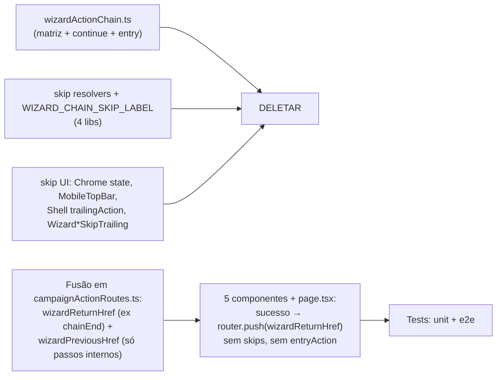

# Impl: Desfazer o encadeamento automático das ações rápidas do wizard

Status: aprovado
Atualizado em: 2026-08-08
Issue: #422
Intenção: docs/plans/desfazer-encadeamento-acoes-wizard.md
Appetite restante: herdado (~0,5–1 dia eng); sem migration

## Leitura da intenção

- **Outcome:** ao concluir **qualquer** ação rápida de ajuste (votos, tendência, atualização, liderança), o usuário volta à origem — **nunca** avança sozinho para outro wizard. Chrome sem “Pular” em etapa nenhuma; “X” (sair da ação) em todas as etapas e retorna à origem. Fila encadeada, `entryAction` de cadeia e “próxima etapa sugerida” pós-save não existem mais.
- **O que NÃO negociar:** retorno à origem via `from` allowlist (**B110** — manter); wizards standalone intactos; liderança continua fora (já gateada); sem migration; sem redesenhos de chassis/header; sem mexer no catálogo/FAB/strip das ações.
- **O que reavaliar:** a “Direção no codebase” da intenção mira `wizardActionChain.ts` (matriz + continue/end), os skip resolvers e as pontas de sucesso. Confirmei e ampliei: a cadeia está **ativa em toda entrada**, não só via deep-link — `resolveWizardChainEntry(undefined, X) → X` faz TODO wizard salvo avançar para o próximo elo (o bug reportado acontece até partindo do card do Início, sem `entry=`). A cadeia é o único produtor de `entry=`. Conclusão: o caminho é **remoção total**, não “desativar pontas”.

## Abordagem recomendada

**Opções consideradas:** A (neutralizar sem limpar) | B (remoção total) | C (B + manter prefill `notePrefill`)
**Recomendação:** **B** — porque:

- A aceita de produto diz “limpeza total do plumbing/código morto é decisão de implementação” e “o resultado não pode ter 'Pular'/fila morta aparente”.
- A cadeia é o único produtor de `entry=`, `notePrefill`, `voteFrom`/`voteTo` (verifiquei: nenhuma registry passa esses params hoje). Manter o plumbing = código morto que o `knip`/`tsc` vão apontar + “dois sistemas de navegação” que a intenção proíbe.
- B é mecanicamente pequeno (módulos pequenos, call sites enumerados).
  **Rejeitadas:** A porque deixa o módulo cadeia órfão e o smash do `skip` no chrome vivo (fila morta visível); C porque manter `notePrefill` sem produtor é especulação (adapter com 1 call site).

### Componentes / mudanças

- **`src/lib/wizardActionChain.ts`** → **deletar arquivo inteiro**. `wizardReturnHref` (ex `wizardChainEndHref`; allowlist B110 → senão `CAMPAIGN_HOME`) e `wizardPreviousHref` (só passos internos; cair a ramificação de elo da cadeia) migram para o módulo profundo que já constrói URIs de wizard — **`src/lib/campaignActionRoutes.ts`** (evita um `wizardNavigation.ts` raso; sem ciclo).
- **`src/lib/campaignActionRoutes.ts`**: remover `WIZARD_ENTRY_ACTION_QUERY_KEY`, `parseWizardEntryActionParam`, `WizardActionHrefOptions.entryAction`, param `entryAction` de `wizardTrendHref`, `WIZARD_NOTE_PREFILL_QUERY_KEY`, `WIZARD_VOTE_FROM_QUERY_KEY`, `WIZARD_VOTE_TO_QUERY_KEY`. `wizardTrendHref` final: `(actionSlug, municipalitySlug?, trendStatus?, returnPath?)`. **Manter**: `isWizardReturnPath`/`parseWizardReturnPath`/`appendWizardReturnPath` (B110), `campaignActionEntryHref`, `isCampaignWizardActionId`, `wizardActionHref` (`leadershipId`/`returnPath`), `parseWizardLeadershipIdParam`.
- **`wizardUpdateUi.ts` / `politicalTrendWizardUi.ts` / `wizardLeadershipContract.ts` / `campaignWizardCopy.ts`**: remover `*SkipAction`, `resolve*Skip`, `shouldShow*/show*`, `WIZARD_CHAIN_SKIP_LABEL`. Em `politicalTrendWizardUi` remover também `PoliticalTrendNotePrefillSource`/`buildPoliticalTrendNotePrefill`/`resolvePoliticalTrendNotePrefillSource` (sem produtor). **Manter** labels/títulos e `resolveWizardTrendNoteDestination` (redirect pós-save RSC).
- **Page `acoes/[slug]/page.tsx`**: remover parsing de `entry`/prefill; ramo `noteDestination === 'home'` simplifica para `redirect(wizardReturnHref(returnPath))`; drop de props `entryAction`/`prefillExtraParams`/`initialNote`.
- **Componentes**: `WizardExpectedVotesStep`, `WizardTrendNoteStep`, `WizardTrendChoiceStep`, `WizardUpdateBodyStep`, `WizardLeadershipStep` — drop `entryAction`+`skip`; sucesso → `router.push(wizardReturnHref(returnPath))`. `CampaignWizardShell` drop `skip`/`trailingAction`; `CampaignWizardChromeContext` drop `CampaignWizardChromeSkip`/campo `skip`; `CampaignMobileTopBar` **sempre** X (`chrome.skip` some). Deletar `WizardSkipTrailing.tsx` + `WizardTrendSkipTrailing.tsx`.
- **Liderança — botão flutuante pós-save:** destino → `wizardReturnHref(returnPath)`; **rótulo “Continuar” → “Concluir”** (opção A recomendada; ver Rabbit holes). `handleSaved` (grid + dirty) inalterado.
- **Migration:** sem migration (nenhuma mudança de schema).
- **Access / Consent:** nenhuma mudança.
- **UI:** Impeccable A/B — mudanças pontuais no chrome (remover skip) e copy; sem redesign.

## Fases verificáveis

1. **Libs + tests de domínio** — remoção em `campaignActionRoutes` + libs de wizard; `wizardActionChain.ts` → deletado (helpers fundidos); reescrever `wizardActionChain.unit.spec.ts` → `wizardNavigation`-equivalent em `campaignActionRoutes.unit.spec.ts`; atender `tests/unit` iterativamente.
2. **UI** — page + 5 steps + chrome (shell/context/mobile top bar); deletar skip components; testes de componente (`wizardExpectedVotesStep.unit.spec.tsx`) + e2e afetadas (`campaignHomeActions.e2e.spec.ts`, `campaignWizardChrome.e2e.spec.ts`).
3. **Gates** — `pnpm gate:fast` na iteração; `pnpm test:e2e:affected`; entrega com `pnpm push` (gate:ci).

## Rabbit holes / Não escopo (engenharia)

- Não redesenhos de chassis/header (nenhum “X” de desktop novo — hoje o desktop só usa o shell; mobile já tem X e passa a tê-lo sempre).
- Não mexer no catálogo/FAB/strip do Início nem nas registries de quick actions (nenhuma passa `entry` hoje).
- Não adicionar “continuar para a próxima” pós-save (rabbit hole de produto da intenção).
- Não reter `notePrefill`/`voteFrom`/`voteTo` como “feature futura” (nenhum produtor).
- **Decisão em aberto para o gate humano:** rótulo do botão flutuante de liderança — **A) “Concluir”** (recomendado: a ação terminou e sai) vs **B) manter “Continuar”** (menor churn, mas remete a encadeamento). Aplica-se também se o botão deve sumir (ver Riscos).

## Riscos e mitigação

- **Deep-link externo com `entry=` antigo** passa a se comportar como standalone (param ignorado) — sem guarda de URL pública; aceitável (params internos, sem contrato). E2E cobre com asserção “sem Pular mesmo com `entry=` stale”.
- **Prefill de nota de tendência some** — reduz superfície; hoje sem produtor. Se o produto quiser reabrir, vira issue nova.
- **E2E de tendência inexistente** — preciso adicionar “mudar tendência → salvar → volta à origem” (o próprio bug reportado). Custo de login; mantenho mínimo.
- **knip/tsc** — enumerei todas as referências de símbolos removidos (8 arquivos de teste + 7 src); verifico `git grep` antes de deletar.
- **Dupla navegação pós-save da tendência** (redirect servidor `noteDestination==='home'` + push client) converge para a MESMA origem — comportamento já existente hoje no standalone; manter.

## Aceite de engenharia

- [x] Aceite de produto da intenção ainda coberto (sem encadeamento, sem Pular, X em toda etapa, retorno à origem, B110 mantido)
- [x] Invariantes AGENTS/engineering-standards (sem migration; module-owner editado; copy pt-BR)
- [x] Testes de domínio previstos (unit `wizardReturnHref`/`wizardPreviousHref`/routes; componente votes; e2e retorno à origem para as 4 ações + tendência)

## Self-score decision-quality

1. Decisões caras têm rejeitadas? **Sim** (A/B/C explícitas, rótulo liderança aberto)
2. Cabe no appetite? **Sim** (remoção pequena, todo call site enumerado)
3. Rabbit holes nomeados? **Sim**
4. Depth check reusa shells/helpers? **Sim** (funde no módulo profundo de routes; zero módulos novos rasos)
5. Intenção satisfeita? **Sim** — engenharia remove o mecanismo, não reescreve o outcome.

**Score: 5/5**
