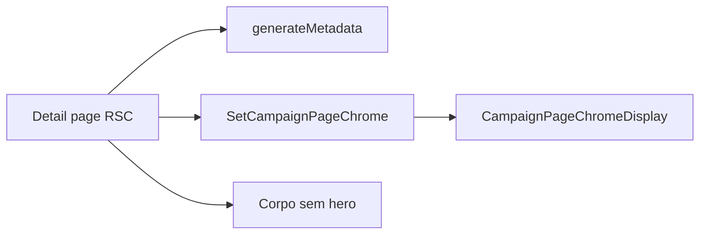

# Impl: Detalhe de entidade — título no header (sem hero espaçoso)

Status: aprovado
Atualizado em: 2026-08-02
Issue: #315
Intenção: docs/plans/detalhe-entidade-titulo-no-header.md
Appetite restante: ~0,5 dia eng (8 rotas de detalhe + catálogo + e2e)

## Leitura da intenção

- **Outcome:** Em cada detalhe de entidade em `/campanha`, a identidade do registro (título + subtítulo) vive no header da shell; o corpo começa direto em abas/seções/chips operacionais, sem hero nem “Voltar para…”.
- **O que NÃO negociar:** listas mantêm header de seção (B123/B133); edit routes inalteradas; chips operacionais no corpo; leader lockdown; aba do browser alinhada à entidade.
- **O que reavaliar:** hipótese de tocar só `campaignPageChrome` — insuficiente: títulos são dinâmicos por registro; precedente de `SetCampaignPageChrome` + `generateMetadata` nas rotas `/editar` é o dono.

## Abordagem recomendada

**Opções consideradas:**
- A) Estender `resolveCampaignPageChrome` com dados de entidade (impossível — catálogo é estático/client-safe)
- B) `SetCampaignPageChrome` + `generateMetadata` por rota (precedente edit routes)
- C) Novo provider server-side de chrome

**Recomendação:** B — reusa `SetCampaignPageChrome` e `campaignPageMetadata` já usados em `/editar` e `MunicipalityListPageChrome`; path rules de detalhe passam a `null` (como edit) para não flashar título de seção antes do override.

**Rejeitadas:** C (twin desnecessário); A (dados dinâmicos não cabem no catálogo).

### Componentes / mudanças

- **`campaignPageChrome.ts`:** regras de detalhe retornam `null`; teste unitário atualizado.
- **8 rotas de detalhe** (`municipios/[slug]`, `liderancas/[id]`, `atividades/[slug]`, `demandas/[slug]`, `dobradinhas/[slug]`, `organizacoes/[slug]`, `apoiadores/[id]`, `assessores/[id]`): `generateMetadata` + `SetCampaignPageChrome`; remover hero (`h1`, “Voltar…”, chips de identidade duplicados, linha Assessoria no município).
- **`campaignZoneMap.e2e.spec.ts`:** assert no chrome da shell (`data-slot=campaign-page-chrome-title`) em vez de `h1` no corpo.
- **Migration:** sem migration
- **Access / Consent:** inalterado

### Mapeamento chrome por rota

| Rota | title | subtitle |
| ---- | ----- | -------- |
| municipios/[slug] | view.name | formatMunicipalityGeographyLabel(view) |
| liderancas/[id] | Liderança | leadership.name |
| atividades/[slug] | view.title | view.locationLabel ou municipality.name |
| demandas/[slug] | demand.title | `${kind} · ${municipalityName}` |
| dobradinhas/[slug] | stateDeputy.name | party (opcional) |
| organizacoes/[slug] | organization.name | organizationKindLabels[kind] |
| apoiadores/[id] | Apoiador | supporter.name |
| assessores/[id] | Assessor | advisor.name |

## Fases verificáveis

1. **Catálogo + testes** — path rules `null` para detalhes; unit spec
2. **UI — 8 páginas** — chrome override + remoção de hero; metadata dinâmica
3. **Gates** — `pnpm gate:fast`; push via `pnpm push`

## Rabbit holes / Não escopo (engenharia)

- Novo bloco UI para Assessoria no município
- Wizard, giros, perfil, contatos, rotas `/editar`, listas
- Refatorar `CampaignPageChromeText` (layout já suporta subtitle)

## Riscos e mitigação

- **Flash de título de seção:** path rule `null` + `useLayoutEffect` do override (mesmo que edit routes)
- **E2E que asserta `h1`:** atualizar para chrome slot
- **Atividade sem locationLabel:** fallback para `municipality?.name`

## Aceite de engenharia

- [x] Aceite de produto da intenção ainda coberto
- [x] Invariantes AGENTS/engineering-standards
- [x] Testes de domínio previstos (unit chrome + e2e zone map)
