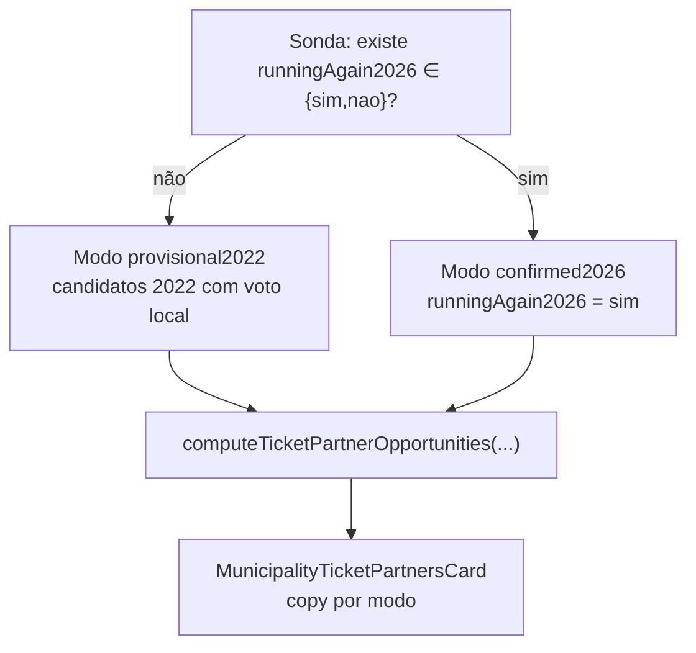

# Dobradinhas potenciais — baseline 2022 até conciliação TSE 2026

Status: rascunho
Atualizado em: 2026-07-31
Item do roadmap: follow-up de A6 (PR #82 / Issue #27)
Responsável: —

## Contexto

O PR #82 (A6) entrega o card **"Dobradinhas potenciais para 2026"** na aba Eleições do detalhe do município: candidatos proporcionais com `runningAgain2026 = sim`, ranqueados por score `0,6 alinhamento + 0,4 força local 2022`. Enquanto o TSE não publica as candidaturas de 2026 e a Fase 5 não reconcilia `runningAgain2026`, o loader retorna `{ status: 'pending2026' }` e o card mostra *"Indisponível até as candidaturas de 2026"*.

Os dados de **2022 já estão no banco** (`electionCandidate` + `electionCandidateVote` via `pnpm db:seed:tse`). O staff precisa da inteligência **agora** — quem teve força local em 2022 e qual o alinhamento partidário — para priorizar dobradinhas antes de agosto.

## Objetivos

- Exibir **desde já** a lista ranqueada por município usando candidatos proporcionais de **2022** com votos na geografia (mesma fórmula de score e tiers de A6).
- Quando a conciliação TSE 2026 popular `runningAgain2026`, **sobrepor** o modo provisório: manter só `sim`, **excluir** `nao` (quem concorreu em 2022 mas não volta em 2026).
- Comunicar claramente na UI se a lista é **provisória (baseline 2022)** ou **confirmada (candidaturas 2026 reconciliadas)**.

## Decisões travadas

- **Leitura derivada** — sem migration, sem Consent, sem escrita. Reusa `ticketPartnerOpportunities.ts` e o card de A6.
- **Mesma fórmula de score e tiers** de A6 (`campoParties` 2026 + `electionPartySpectrum` 2022; Solla excluído).
- **Mesmos cargos** — só proporcionais (`deputado_federal` + `deputado_estadual`, 1º turno).
- **Dois modos de dados**, um componente:
  - `provisional2022` — nenhum `runningAgain2026 ∈ {sim,nao}` no registry 2026; fonte = candidatos 2022 com voto local.
  - `confirmed2026` — Fase 5 reconciliada; fonte = `runningAgain2026 = sim` apenas; `nao` fora da lista.
- **Staff-only** — `leader` continua lockdown (igual A6).
- **Cache** — mesmo `unstable_cache` tag `election-tse`; bust pós-reconcile inalterado.

## Questões em aberto — RESOLVIDAS (proposta)

- **Copy do estado provisório** — RESOLVIDA. Título mantém "Dobradinhas potenciais para 2026"; subtítulo/aviso: *"Lista provisória com base em quem concorreu aqui em 2022. Atualiza automaticamente quando o TSE publicar as candidaturas de 2026."*
- **Candidatos `runningAgain2026 = desconhecido` após reconcile** — RESOLVIDA. Fora da lista confirmada (mesmo critério conservador de A6: só `sim` entra). Não inventar parceiro sem confirmação.
- **Badge "eleito em 2022"** — RESOLVIDA. Mantém no modo provisório e confirmado (campo `elected` já no registry).

## Abordagem proposta

- **Loader** `municipalityTicketPartnerData.ts`: trocar o early-return `pending2026` por ramo `provisional2022` que lê o registry 2022 (year=2022, offices proporcionais) cruzado com votos na geografia — sem exigir registry 2026.
- **Tipos** `TicketPartnerResult`: substituir `pending2026` por `provisional2022 | confirmed2026` (ambos com `opportunities[]`; vazio continua válido).
- **Card** `MunicipalityTicketPartnersCard.tsx`: remover parágrafo "indisponível"; aviso contextual por modo; lista idêntica nos dois modos.
- **Testes:** int — sem reconcile → `provisional2022` com candidatos 2022; com reconcile `sim`/`nao` → `confirmed2026` exclui `nao`; unit inalterado (puro não muda).

## Arquivos a alterar

- `src/utilities/municipality/municipalityTicketPartnerData.ts` — ramo provisório + rename de status.
- `src/lib/ticketPartnerOpportunities.ts` — tipos de resultado (`TicketPartnerResult`).
- `src/components/campaign/municipality/MunicipalityTicketPartnersCard.tsx` — copy por modo.
- `tests/int/municipalityTicketPartnerData.int.spec.ts` — cenário provisório 2022 (substitui assert de `pending2026`).
- `docs/plans/insight-dobradinha-2026.md` — nota de follow-up (A6-pre cobre o gap pré-15/08).

## Dependências

- **A6** (PR #82) mergeado em `stage` — infra de score, card e loader existem.

## Não escopo

- Overview agregado na lista de municípios (permanece follow-up pós-Fase 5, igual A6).
- Criar `stateDeputy` automaticamente — insight sugere, registro continua em `/campanha/dobradinhas`.
- Majoritários ou cargos fora de federal/estadual.

## Dados

- **Dado:** ranking local de candidatos proporcionais por força 2022 + tier de alinhamento.
- **Decisão:** priorizar com quem fechar dobradinha no município antes do registro TSE 2026.
- **Forma:** lista ordenada top-10 na aba Eleições (mesma de A6); aviso de provisionalidade até reconcile.

## Referências

- PR #82 — implementação A6
- [`docs/plans/insight-dobradinha-2026.md`](insight-dobradinha-2026.md)
- [`docs/plans/baseline-eleitoral-tse.md`](baseline-eleitoral-tse.md) — Fase 5 / `runningAgain2026`
