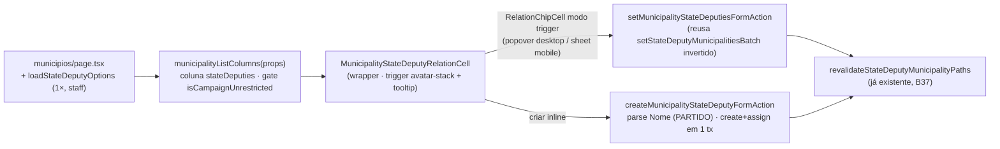

# Impl: B157 — Coluna de dobradinhas na lista de municípios (+ criação inline)

Status: aprovado
Atualizado em: 2026-08-04
Issue: #362
Intenção: docs/plans/dobradinhas-coluna-municipios.md (mergeada no main em 2026-08-04, PR #363 — **revisado contra ela após sync**)
Appetite restante: ~1–1,25 dia eng (coluna com display estilo assessores + editor popover/sheet + create inline com partido; sem migration)

## Leitura da intenção

- **Outcome:** na lista `/campanha/municipios`, uma coluna **"Dobradinhas"** entre "Assessores" e "Tendência" — vínculos de `municipality.stateDeputies` com **busca por nome e partido**, adicionar/remover por delta (auto-save, otimista com rollback + toast) e **criação inline** ("+ Criar dobradinha 'texto'", com `party` opcional via sintaxe **`Nome (PARTIDO)`**), criada e **automaticamente vinculada ao município**. Canvas: `~/.cursor/projects/teqo/canvases/plan-b157-ui-draft.canvas.tsx`.
- **Decisão de display do usuário (2026-08-04, gate):** o fechamento da célula segue o **estilo da coluna de Assessores** — agregado de círculos de perfil (iniciais, sobrepostos, máx. 3) com **hover mostrando o detalhe** (nome + partido), não chips na célula. Vazio = "—". O editor (adicionar/remover/criar) abre em **popover no desktop / sheet no mobile**, mesmo gesto do assessor (B27/B154).
- **O que NÃO negociar:**
  - Coluna **somente para `isCampaignUnrestricted`** (coordenador + candidato). Assessor **não vê** (nem read-only — lê na ficha, `MunicipalityStrategyCard`); `leader` também não.
  - `StateDeputy.name` é unique — nome já existente → erro + toast, sem duplicata.
  - Não é formulário completo (notas, editar nome/partido inline) → `/campanha/dobradinhas/<slug>`; sem dedup por similaridade; sem filtro/ordenação por dobradinha (gatilho B29).
  - Sem migration, sem collection nova, sem Consent novo, contratos de URL intactos; relação continua `municipality.stateDeputies`.
- **O que reavaliar (Direção no codebase é hipótese):** a intenção hipotetiza control bespoke (`MunicipalityListStateDeputiesControl` espelhando o B27/B154) + endpoint JSON `/campanha/municipios/state-deputies` + record `setMunicipalityStateDeputyMembershipRecord` + `loadStateDeputySummaries` extra. O codebase atual já tem a máquina compartilhada (`RelationChipCell`, extraída no B36/B37) e o caminho de escrita delta **já existe** (`setStateDeputyMunicipalitiesBatch`, B37). B157 monta em cima dos dois, com a **máquina compartilhada ganhando um modo "trigger"** (display fechado custom + overlay popover/sheet) para honrar o display estilo assessores sem duplicar ~400 linhas. **Correção de fato:** a intenção afirma que `canManageCampaignStaffField` é "restrito a `isCampaignUnrestricted`" — no código atual ele é **staff-wide** (o int spec do B37 prova assessor escrevendo). A decisão de produto (coluna só para unrestricted) é UI-gate, sem mudança de access; a superfície B37 (lista de dobradinhas) fica como está — fora deste item.

## Abordagem recomendada

**Opções consideradas:** A (modo "trigger" no `RelationChipCell` — display custom + popover/sheet — + reuso do B37 + seams de create) | B (control bespoke `MunicipalityListStateDeputiesControl` espelhando o B27/B154 + endpoint JSON + bridge — a hipótese literal da intenção) | C (chips na célula, container inline+drawer do `RelationChipCell` atual — minha 1ª proposta, **substituída pelo display estilo assessores**)

**Recomendação:** **A** — o display pedido (círculos + hover) é exatamente o trigger do control de assessores, mas a máquina por trás (delta otimista, undo, combobox ARIA, create, floor/cap) já é compartilhada no `RelationChipCell`. Em vez de duplicar o control do assessor, o `RelationChipCell` ganha um modo opcional: `trigger` (nó de display fechado) + `editorVariant` ('popover' | 'sheet') + `triggerTooltip` — o corpo do editor (chips removíveis + busca + criar) é o mesmo do Drawer de hoje, extraído uma vez. Sem as props novas, B36/B37 se comportam exatamente como hoje.
**Rejeitadas:** B — ~400 linhas de máquina duplicada (a mesma que B36/B37 extraíram para matar) + endpoint JSON + bridge de catálogo desnecessária (server action + `revalidatePath` ⇒ refresh RSC atualiza o catálogo de todas as linhas); C — chips na célula contrariam a decisão de display do gate.

### Decisões de engenharia

**D1 — Display fechado: estilo assessores (círculos + hover), sem chips na célula.**

- Trigger do `RelationChipCell` (modo trigger): **círculos de iniciais sobrepostos** (`Avatar`/`AvatarFallback` do kit + `campaignUserInitials` — helper genérico de iniciais; `-space-x-2`, `size-8`, máx. 3 visíveis — mesmo visual do `MunicipalityAdvisorAvatarStack`), com `sr-only` listando os nomes.
- **Hover = detalhe:** `tooltipContent` do overlay (popover) com uma linha por vínculo — **"Nome (Partido)"** (ex.: "Fulaninho (PT)"), mesmo formato do `formatAdvisorNamesTooltip` mas com partido (helper novo no wrapper). Vazio → "—" (aceite da intenção; sem `MissingAdvisorBadge` — aquilo é semântica de assessor/prioridade).
- Link para a ficha `/campanha/dobradinhas/<slug>`: affordance move para o **editor** (os chips removíveis do popover/sheet são links — o `RelationChipCell` já renderiza `href` nos chips), mesmo contrato da coluna de assessores (célula fechada sem link).
- Opções consideradas: A (acima) | B (chips na célula, como na lista de dobradinhas) | C (círculos sem tooltip, nome só no editor). Recomendação: **A** — é o pedido literal do gate ("círculos + hover para ver o detalhe"); B foi a proposta anterior, substituída; C perderia a leitura sem abrir (o hover do assessor existe justamente para isso — B23).

**D2 — Editor: modo "trigger" no `RelationChipCell` (popover desktop / sheet mobile).**

- Novas props opcionais no `RelationChipCell`: `trigger?: (chips, isPending) => ReactNode` (display fechado custom), `editorVariant?: 'popover' | 'sheet'`, `triggerLabel: string`, `triggerTooltip?: ReactNode`. Com `trigger` presente: renderiza o nó custom envolvido num `CampaignCellEditOverlay` do variant pedido (precedente: o control de assessores recebe `variant="popover"` no desktop e `variant="sheet"` nos cards) com o **corpo do editor** (chips removíveis + combobox + criar) — o mesmo JSX do Drawer atual, extraído para um renderer compartilhado `editorBody`; sem `trigger`, comportamento inline+drawer atual intacto.
- Call sites: tabela desktop passa `editorVariant="popover"`; cards mobile `editorVariant="sheet"` (o `CampaignListSheetProvider` do `MunicipalityListMobileSection` já hospeda o sheet — **nenhum provider novo no desktop**, já que o popover não usa Drawer; remove o item de risco da revisão anterior).
- Opções: A (modo trigger na máquina compartilhada) | B (control bespoke completo) | C (manter inline+drawer com chips). Recomendação: **A** — mesmo gesto do assessor (popover/sheet) com a máquina compartilhada; B duplica; C foi superado pelo display do gate.

**D3 — Busca: por nome E partido.**
Opções: A) `matchesNormalizedAtWordStart` sobre `plainName` **ou** `party` normalizados (WeakMap de labels pré-normalizados, padrão do irmão B36) | B) só nome (padrão B31).
Recomendação: **A** — a intenção e o canvas dizem "filtrando por nome e partido"; digitar "PT" acha "Fulano (PT)". Hit label = `Nome (Partido)`.

**D4 — Delta: reusar `setStateDeputyMunicipalitiesBatch` invertido.**
Opções: A) wrapper de form action `setMunicipalityStateDeputiesFormAction` na rota municipios mapeando `{ municipalityId, stateDeputyId, assigned }` → `setStateDeputyMunicipalitiesBatch({ stateDeputyId, municipalityIds: [municipalityId], assigned })` | B) record novo `setMunicipalityStateDeputyMembershipRecord` (a hipótese da intenção).
Recomendação: **A** — o record B37 já faz tudo (`acquireTextAdvisoryLocks(['municipality-state-deputies:{id}'])`, `user` + `overrideAccess: false`, cap via `nextStateDeputyIdsAfterMunicipalityMembership`, no-op sem revalidate, `revalidateStateDeputyMunicipalityPaths`). Wrapper novo ~20 linhas em `municipalityStaffFormActions.ts`. B é twin.

**D5 — Criação inline: parser `Nome (PARTIDO)` + seams no `RelationChipCell` + record atômico.**

- **Parser puro** `parseStateDeputyNameParty(text)` em **`src/lib/stateDeputyNameParty.ts`** (client-safe): extrai UM grupo `(...)` final → `{ name, party }`; sem parênteses → party `null`; partido trimado, ≤32. Usado pelo schema zod (server, autoridade) e pelo chip temp (cliente).
- **`municipalityStateDeputyCreateSchema`** (`src/lib/schemas/stateDeputy.ts`): `{ municipalityId, rawName }` → transform → `{ municipalityId, name, party }`, name 2..160 pós-parse, party ≤32; `(PT)` sozinho → name vazio → erro de validação (toast).
- **`createMunicipalityStateDeputyRecord`** (`actions/stateDeputy.ts`): 1 transação — `reloadStaffActor` (staff; `STATE_DEPUTY_STAFF_MESSAGE`) → lock `municipality-state-deputies:{id}` → `payload.create('stateDeputy', { name, ...(party ? { party } : {}) })` com `user`/`overrideAccess: false`, conflict (unique name/slug) → `STATE_DEPUTY_CONFLICT_MESSAGE` → leitura do município + delta (`nextStateDeputyIdsAfterMunicipalityMembership`) + update — espelho de `createMunicipalityAdvisorRecord` (B154): se a atribuição falhar, o create **rola junto** (sem órfão). Retorna `{ stateDeputy: { id, name, slug, party }, municipalitySlug }`; wrapper revalida via `revalidateStateDeputyMunicipalityPaths`.
- **`RelationChipCell`**: seams opcionais `createAction?` + `buildCreateFormData?`; quando `hits.length === 0` e query 2..160 → item **`Criar dobradinha “{query}”`** no lugar do "Nenhum resultado" (padrão B154), no corpo do editor (popover e drawer); chip temp sem remover (precedente B154); sucesso → swap para id real + delta otimista + mapa de criados (filtro `!ids.includes(id) && effectiveIds.includes(id)` — sem chip fantasma pós-remoção, sem duplicata pós-refresh); erro → revert + feedback/toast existentes. Zero mudança de comportamento sem as props novas.
- **Sem bridge provider** (diferença estrutural vs. B154): server action + `revalidatePath` ⇒ refresh RSC ⇒ `loadStateDeputyOptions` re-carrega ⇒ catálogo atualizado em todas as linhas.

**D6 — Dados: `stateDeputyIDs` no view model + catálogo como fonte única.**
Opções: A) `municipalityListSelect` += `stateDeputies: true`; `MunicipalityListViewModel` += `stateDeputyIDs: number[]`; página carrega `loadStateDeputyOptions(payload, user)` 1× e passa como prop (factory de colunas + mobile) | B) também `loadStateDeputySummaries` (hipótese da intenção).
Recomendação: **A** — o catálogo (dezenas de registros, `plainName`+`party`+`slug`) cobre display, tooltip e busca; zero query por linha; payload = ids inteiros. B é query duplicada (adiada no `/simplify` do B31).

**D7 — Coluna: id/label/description/picker + posição + gate + mobile.**

- `MunicipalityListColumnId` += `'stateDeputies'` (B17: id = chave do picker = cookie = description); `municipalityColumnLabels` += `'Dobradinhas'`; `municipalityColumnDescriptions` += entrada (B22).
- Posição: **entre `advisors` e `trend`** (decisão A da intenção, "grupo rede"); head sem sort/filtro (`CampaignTableHead` + description). **Sem `cellTooltip` na column def** — a célula embrulha o próprio tooltip no overlay (mesmo comentário da coluna de assessores — não dobrar no mesmo gesto).
- **Gate `isCampaignUnrestricted`** (coordenador + candidato — explícito na intenção; diferente do popover de assessores que é `isCoordinator`): coluna desktop, entrada mobile e entrada do picker só nesse branch. `MunicipalityListProps` += `isCampaignUnrestricted: boolean` (a página já computa o mesmo predicado para `canMoveEngagementLevel`).
- Mobile: entrada "Dobradinhas" no `dl` staff de `MunicipalityListMobileCards` com `editorVariant="sheet"` (o `CampaignListSheetProvider` do `MunicipalityListMobileSection` já hospeda o Drawer compartilhado — miss #52 respeitada).

**D8 — Revalidação e locks: nenhuma peça nova.** Delta e create revalidam via `revalidateStateDeputyMunicipalityPaths` (já em `actions/stateDeputy.ts`): lista de municípios + detalhe do município tocado + ficha da dobradinha. Lock `municipality-state-deputies:{id}` serializa toggles concorrentes na mesma linha.

### Componentes / mudanças

- **`src/lib/stateDeputyNameParty.ts`** (novo, puro): `parseStateDeputyNameParty` + unit tests (bordas: sem parênteses, `(PT)` sozinho, parênteses no meio, grupo final com espaços, party >32).
- **`src/lib/schemas/stateDeputy.ts`**: `municipalityStateDeputyCreateSchema` (com transform do parser).
- **`src/utilities/municipality/municipalityViewModels.ts`**: `municipalityListSelect` += `stateDeputies: true`; `MunicipalityListViewModel` += `stateDeputyIDs: number[]`; `toMunicipalityListViewModel` mapeia (padrão `advisorIDs`).
- **`src/utilities/municipality/municipalityLabels.ts`**: `MunicipalityListColumnId` += `'stateDeputies'`; `municipalityColumnDescriptions` += entrada.
- **`src/utilities/municipality/municipalityListUrl.ts`**: `municipalityColumnLabels` += `stateDeputies: 'Dobradinhas'`.
- **`src/app/(campaign)/campanha/actions/stateDeputy.ts`**: `createMunicipalityStateDeputyRecord` + wrapper `createMunicipalityStateDeputy` (revalida via `revalidateStateDeputyMunicipalityPaths`).
- **`src/app/(campaign)/campanha/(app)/municipios/municipalityStaffFormActions.ts`**: `setMunicipalityStateDeputiesFormAction` (delta, reusa o batch) + `createMunicipalityStateDeputyFormAction` (create+assign; success devolve `stateDeputy` via o generic do `runCampaignFormAction`).
- **`src/components/campaign/shared/RelationChipCell.tsx`**: (1) **modo trigger** — props opcionais `trigger?`/`editorVariant?`/`triggerLabel?`/`triggerTooltip?`; corpo do editor extraído para renderer compartilhado (chips removíveis + combobox + criar) usado pelo Drawer atual e pelo overlay do modo trigger (`CampaignCellEditOverlay` com o variant pedido); (2) **seams de create** — `createAction?`/`buildCreateFormData?` + item "Criar…" + chip temp + swap + mapa de criados. Sem as props novas, comportamento atual idêntico.
- **`src/components/campaign/shared/MunicipalityStateDeputyRelationCell.tsx`** (novo): wrapper fino — `buildChips` (label `Nome (Partido)`, href da ficha), `searchHits` (nome **ou** partido, WeakMap de labels), `buildFormData` (`municipalityId`+`stateDeputyId`+`assigned`), `buildCreateFormData` (`municipalityId`+`rawName`), **trigger display** (círculos de iniciais `Avatar`/`AvatarFallback` + `campaignUserInitials`, `-space-x-2`, máx. 3, `sr-only` com nomes; vazio "—") e **tooltip de detalhe** ("Nome (Partido)" por linha, helper `formatStateDeputyNamesTooltip`), copy pt-BR, `triggerLabel` "Editar dobradinhas em {nome}".
- **`src/components/campaign/municipality/MunicipalityList.tsx`**: coluna `stateDeputies` (gate `isCampaignUnrestricted`, entre `advisors` e `trend`); props novas (`stateDeputyOptions`, `stateDeputyCreateAction`, `isCampaignUnrestricted`); editor `variant="popover"` no desktop.
- **`src/components/campaign/municipality/MunicipalityListMobileCards.tsx`** (+ `MobileSection`): entrada "Dobradinhas" no dl (gate unrestricted, `editorVariant="sheet"`); props repassadas.
- **`src/app/(campaign)/campanha/(app)/municipios/page.tsx`**: `loadStateDeputyOptions` no `Promise.all` (staff view); props na lista.
- **Migration:** sem migration (relação já existe desde E4R).
- **Access / Consent:** nenhuma peça nova; o create herda `canCreateStateDeputy` (staff) e o delta herda `canUpdateMunicipality` — ambos com `user`/`overrideAccess: false`; a intenção fica satisfeita no nível da UI (gate `isCampaignUnrestricted`). **Observação registrada (não escopo):** a API continua permitindo assessor escrever em `municipality.stateDeputies` (B37) — se produto quiser restringir, é item separado.

### Dados → forma (se aplicável)

- Forma: **tabela** — célula fechada com círculos de perfil + hover com o detalhe "Nome (Partido)" (decisão do gate; precedente `MunicipalityAdvisorAvatarStack`). Rejeitado: chips na célula (display anterior, superado); contagem ("3 dobradinhas" esconde o nome que decide); KPI/chart (dado categórico nominal).
- Busca: nome **e** partido (D3); vazio = "—" (aceite da intenção).

## Fases verificáveis

1. **Server + view model + testes de domínio** — parser puro + schemas, select/view model, record create+assign, wrappers de form action, revalidate; int tests (`campaignMunicipalityStateDeputyCreate.int.spec.ts`): coordinator/candidate criam+atribuem; assessor fora do escopo → **rollback do create**; leader recusado; nome duplicado → `STATE_DEPUTY_CONFLICT_MESSAGE`; parse do partido persiste (`party` correto); delta de 1 município via wrapper (no-op sem revalidate). `pnpm gate:fast` parcial.
2. **UI** — modo trigger + seams de create no `RelationChipCell` → wrapper (display + tooltip + busca) → coluna + picker + labels/descriptions + mobile; unit pins (`campaignComponents.unit.spec.ts`: fixtures `stateDeputyIDs: []`; **tooltip count staff segue 10** — a coluna nova só renderiza com `isCampaignUnrestricted: true`, novo teste com count 11; leader segue 4; `municipalityListDefaultProps` ganha `stateDeputyOptions: []` + `isCampaignUnrestricted: false` + stub create action; teste do display: iniciais + sr-only + vazio "—").
3. **Gates** — unit do parser; e2e espelhando o teste B154 (coordenador abre "Editar dobradinhas em {município}", cria "Cicrano (PCdoB)" inline, chip aparece no popover, busca por partido acha, "Criar" some após criar, remover grava) em `campaignMunicipalities.e2e.spec.ts`; `pnpm gate:fast` → `pnpm push`.

## Rabbit holes / Não escopo (engenharia)

- **Sort/filtro por dobradinhas no header** — gatilho B29 registrado na própria intenção; não inventar.
- **Coluna para assessor (read-only)** — corte explícito da intenção; não adicionar `cellTooltip`/variante.
- **Partido com formatação complexa** — regra do parser documentada (um grupo `(...)` final; resto é name); `(PT)` sozinho → erro de validação.
- **B155 (#359, in-progress)** — coluna irmã na mesma tabela; escopos disjuntos (ids/labels/view model próprios); B155 sem branch de implementação — conflitos mecânicos de merge apenas.
- **Bridge provider de criados (padrão B154)** — desnecessário (server action + revalidatePath).
- **Renomear/estender `LeadershipStateDeputyRelationCell`** — código landed B36/B37; sem ganho de produto.
- **`loadStateDeputySummaries` por IDs na lista** — query duplicada; o catálogo cobre.
- **Restringir access de assessor na API (B37)** — item separado; só registro no gate.
- **Adotar o modo trigger no control de assessores (B27/B154)** — o control bespoke continua como está; migrá-lo para o `RelationChipCell` é item próprio (tem seq/reconcile de endpoint JSON que o modo trigger não precisa).

## Riscos e mitigação

- **`RelationChipCell` é compartilhado (B36/B37)** — modo trigger e seams de create só com props opcionais; comportamento atual inalterado; pins de unit/integ cobrem os consumidores.
- **Modo trigger vs. drawer existente** — o corpo do editor é extraído UMA vez e compartilhado; testes existentes do drawer continuam valendo (mesmo renderer).
- **Chip temp × medição de overflow** — em modo trigger não há medição de linha (o display fechado é o trigger); o chip temp vive dentro do editor (chips + busca), sem remove (precedente B154).
- **Colisão de nome na criação inline** — busca vazia ⇒ nome fora do catálogo; conflito só em corrida → `STATE_DEPUTY_CONFLICT_MESSAGE` no `safeMessages`.
- **Guarda `sharedSheetHostConventions`** — só o sheet (mobile) exige provider, e o `MunicipalityListMobileSection` já tem; desktop usa popover, sem provider novo.

## Revisão na entrega (2026-08-04)

O plano acima executou como escrito, com ajustes do gate e do `/simplify` (3 revisores paralelos — qualidade, performance, reuso):

- **Gate do usuário:** display da coluna mudou para o estilo assessores (círculos + hover) — `RelationChipCell` ganhou o modo "trigger" (display fechado custom + overlay popover/sheet com o corpo do editor compartilhado) em vez de chips inline. Sem `CampaignListSheetProvider` novo no desktop (popover não usa Drawer).
- **Correção de fato:** Payload valida unique ANTES do insert com um `ValidationError` localizado ("O campo a seguir está inválido: name") — o pattern do policy não pega o caso normal de duplicata. O mapeamento de conflito foi movido para o dono (`mapStaffEntityConflict` em `campaignEntityActions.ts`, usado por `runStaffEntityMutation` e pelo record novo) — os formulários de organização/dobradinha herdam a mensagem de conflito por tabela.
- **`/simplify` fixados:** (1) raça do `createdChips` (create→remove rápido→re-add duplicava o chip com a mesma key) — o copy agora cai quando o catálogo (`baseIds`) resolve o id, sem depender de `ids` chegar; (2) a11y — os nomes atribuídos vão no `aria-label` do trigger ("Editar dobradinhas em X — Fulano (PT)"), padrão do assessor; `sr-only` morto removido; (3) cleanup do `createdChips` com bail de no-op (B36/B37 não pagam render pass); (4) supressão do "Criar…" por **igualdade normalizada** com chip atribuído (prefixo ainda permite criar nome novo) e gate para não rodar sem wiring de create; (5) fold "Nome (Partido)" em fonte única (`stateDeputyDisplayName` no lib; `option.name` do catálogo reusado); (6) `optionById` compartilhado por WeakMap entre linhas; (7) cap message no `safeMessages` do create; (8) statusMessage com "opção de criar" quando o único item é o create; (9) padding único do corpo do editor (16px nas duas superfícies); (10) `MunicipalityStateDeputyCreateAction` tipo único exportado; (11) `payload-types.ts` fora do diff (drift de regeneração não relacionado, revertido).
- **Adiados com gatilho (ver débitos):** extração de `AvatarStack` genérico (2º call site — regra do repo); migração do `itemLabel` do irmão B36 para `stateDeputyDisplayName` (próximo toque no arquivo); cache do catálogo (medição); bounds do schema via `pick` (wording pt-BR); adapter de busca em `lib/` (próximo par de relação); **observação de produto:** a API continua permitindo assessor escrever `municipality.stateDeputies` (B37) — a intenção supunha `isCampaignUnrestricted`; se produto quiser fechar, é item separado.

Gate completo verde (tsc, lint --max-warnings=0, format:check, check:cycles, knip com o P3 pré-existente, unit 1358/1358, int 573/573, e2e B157 + vizinhos, build). Aikido: CLI não disponível no ambiente — padrões idênticos aos do B37/B154 já escaneados.

## Aceite de engenharia

- [ ] Aceite de produto da intenção ainda coberto (coluna entre Assessores e Tendência, display estilo assessores — círculos + hover com "Nome (Partido)", vazio "—", busca nome+partido, auto-save por delta otimista com rollback+toast, criar inline `Nome (PARTIDO)` com vínculo automático, gate `isCampaignUnrestricted`, unique name → toast)
- [ ] Invariantes AGENTS/engineering-standards (`overrideAccess: false` com `user`, transação no create+assign, sem migration, sem Consent, identificadores en/strings pt-BR, cap respeitado)
- [ ] Testes de domínio: int do create+assign (roles, rollback, conflito, partido), unit do parser e dos pins da lista; e2e do create inline
- [ ] Self-score decision-quality: decisões caras com rejeitadas (D1–D8) · cabe no appetite (~1–1,25 dia) · rabbit holes nomeados · depth check reusa `RelationChipCell`/batch B37/`runCampaignFormAction`/`withPayloadTransaction`/locks · intenção preservada (revisado contra `dobradinhas-coluna-municipios.md` + canvas + decisão de display do gate)
