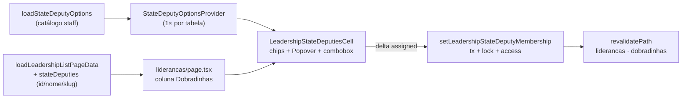

# Coluna de dobradinhas na lista de lideranças

Status: entregue
Atualizado em: 2026-07-26
Item do roadmap: [docs/roadmap.md](../roadmap.md) (Trilha B, item **B31**)
Impeccable: B — encaixe em `/campanha/liderancas` (coluna + célula editável no `CampaignTable` existente); sem rota nova
Appetite: ~1 dia eng (0,75–1,25); coluna + célula de chips com busca e gravação por delta + action nova + provider de opções; sem migration
Responsável: —

## Design (Impeccable)

Âncoras: `PRODUCT.md` (princípio 3 **Edit where you see**, 4 **Auto-save, no Save button**, 8 Feel the action; anti-goals "spreadsheet mode" e "always-mounted inputs on every row") / `DESIGN.md` (register `product`; Field Desk) · tema `data-theme='campaign'` · precedentes de interação [`AdvisorMunicipalityCell.tsx`](../../src/components/campaign/advisor/AdvisorMunicipalityCell.tsx) (B19 ✓ — chips removíveis + typeahead + otimista) e o popover de edição rápida da lista de municípios (B9 ✓ / **B27**) · shells `CampaignTable` / `CampaignPageShell` · regras `.agents/rules/campanha-edit-where-you-see.mdc` e `campanha-action-feedback.mdc`.

Na implementação (`implement-roadmap-item`): craft compacto → critique → polish. `harden`/`optimize` só sob gatilho do Passo 8.

Brief compacto:

- **Persona / contexto:** CG / Assessor no onboarding da rede, varrendo `/campanha/liderancas` para **amarrar cada liderança à(s) dobradinha(s)** — hoje o único caminho é abrir 1 ficha por vez, rolar até o `RelationMultiSelect` e clicar "Salvar".
- **Job principal:** ver e alterar as dobradinhas de uma liderança sem sair da lista, no mesmo gesto com que se lê a linha.
- **Estratégia de cor:** Restrained — chips `secondary` como nas demais relações; sem badge de status, sem cor semântica por partido.
- **Edit where you see:** **sim** — o campo é mutável pelo papel que está olhando (`canManageLeadership`: irrestrito ou assessor no escopo) e hoje é readout morto na lista. Gravação automática por chip (sem botão "Salvar"), com otimismo no controle e refresh honesto do resultado.
- **Anti-goals:** modo "Editar" de tabela inteira (spreadsheet — anti-goal explícito do princípio 3 e do **B28**); inputs montados em todas as linhas; segundo design system de célula editável; chip colorido por partido.

## Dados → decisão → apresentação

- **Vou apresentar dados?** Sim, superfície neste item — relação categórica `leadership.stateDeputies` (já persistida, já no view model como `stateDeputyNames`, hoje **não renderizada**).
- **Decisões desbloqueadas:**
  - Coordenador / Assessor: "esta liderança já está amarrada a alguma dobradinha — e a qual?" (evita prometer a mesma perna duas vezes; é o flanco de fogo amigo intra-campo nomeado em [CUSTOMER.md](../CUSTOMER.md), 2026-07-23).
  - Coordenador: "ao montar o giro/estrutura deste município, quais lideranças já andam com qual candidato a estadual?" (insumo de **E13** e da leitura de **A6**).
  - Assessor: "quais das minhas fichas ainda estão sem dobradinha e precisam ser preenchidas agora?" (o seed do **E4R ✓** trouxe dobradinha só no município, não na liderança).
- **Forma escolhida:** **tabela/lista** — coluna com chips nomeados (link para `/campanha/dobradinhas/<slug>`), igual ao tratamento de Municípios/Organizações da mesma tabela. **Rejeitado:** contagem ("3 dobradinhas") — esconde justamente o nome que decide; KPI "% de lideranças com dobradinha" (vaidade sem fila associada); chart/mapa (dado é nominal e categórico, a pergunta é "quem", não "onde" nem "quanto").
- **Profile:** categórico; granularidade `leadership` × `stateDeputy`; tamanho típico 0–3 chips por linha (teto de schema 20), catálogo de dezenas de dobradinhas; absoluto (o nome em si), sem leitura eleitoral relativa.
- **Anti-goals de dado:** sem métrica eleitoral derivada nesta célula; sem ranking de lideranças por dobradinha; sem inferir dobradinha da liderança a partir de `municipality.stateDeputies` (união automática mascararia o que é sabido do que é suposto).

Self-check dados: 5/5.

## Contexto

`/campanha/liderancas` ([`page.tsx`](<../../src/app/(campaign)/campanha/(app)/liderancas/page.tsx>)) renderiza um `CampaignTable` com Nome · Status · Municípios · Organizações · Acesso ao app. O loader [`leadershipData.ts`](../../src/utilities/leadershipData.ts) **já resolve** `stateDeputyNames` em `LeadershipRowViewModel` (mesmo `namesForIds` de municípios e organizações) — o dado chega na lista e é descartado, como aconteceu com `sector`/`updatedAt` (**B29**) e `phone` (**B28**).

Editar dobradinha de liderança hoje = abrir `/campanha/liderancas/[id]`, usar o `RelationMultiSelect` do [`LeadershipInternalForm`](../../src/components/campaign/leadership/LeadershipInternalForm.tsx) (select nativo + chips) e submeter o formulário inteiro. O **E4R ✓** (2026-07-24) importou DOBRADINHAS para `municipality.stateDeputies` e criou as lideranças **name-only** — ou seja, `leadership.stateDeputies` está praticamente vazio e o preenchimento é trabalho de mesa em lote, exatamente durante o onboarding (Onda 0 §4).

Em `/campanha/assessores` (**B19 ✓**), a coluna "Municípios" da [`AdvisorsTable`](../../src/components/campaign/advisor/AdvisorsTable.tsx) já resolve esse tipo de trabalho: chips clicáveis no modo leitura, chips removíveis + campo de busca (typeahead com agrupamentos por TI/ZE) no modo edição, gravação por delta (`setAdvisorMunicipalityMembership`) com lock e estado otimista, "Ver mais…" quando a carteira não cabe em 3 linhas.

Pedido de produto (2026-07-25): **a mesma funcionalidade, na lista de lideranças, para dobradinhas.**

Duas diferenças estruturais que o plano precisa resolver: (1) a `AdvisorsTable` é uma tabela cliente própria com **toggle "Editar" de tabela inteira** — a lista de lideranças usa o sistema de listas do Pass 2 W1 (`CampaignTable`, colunas como dado, servidor) e o toggle full-row é anti-goal declarado no **B28** e no princípio 3; (2) dobradinha não tem agrupamento análogo a território/ZE, então some a metade "batch" do widget do assessor.

## Objetivos

- Coluna **Dobradinhas** em `/campanha/liderancas`, entre "Organizações" e "Acesso ao app", com chips nomeados que linkam para `/campanha/dobradinhas/<slug>` e "—" quando vazio.
- Adicionar/remover dobradinha **na própria linha**, com busca acento-insensível por nome (e partido) sobre o catálogo, **sem botão "Salvar"**: cada chip grava sozinho, com chip otimista, erro revertido + toast e refresh do resultado.
- Gravação **por delta** (`leadershipId` + `stateDeputyId` + `assigned`), transacional, com lock consultivo por liderança e teto de `MAX_LEADERSHIP_STATE_DEPUTIES` (20) respeitado no caminho novo.
- `LeadershipRowViewModel` passa a carregar `stateDeputies: StateDeputySummary[]` (id/nome/slug/partido) no lugar de só `stateDeputyNames`, sem query extra por linha (mesmo lote já existente).
- Contadores derivados de `/campanha/dobradinhas` (`leadershipCount`) e a ficha `/campanha/dobradinhas/[slug]` não ficam obsoletos após a edição.
- Guardrails: **sem migration, sem collection, sem Consent, sem mudança de contrato de URL** da lista; access inalterado (`canManageLeadership` para escrever, `canReadStateDeputy` para o catálogo; `overrideAccess: false` nas leituras com `user`); `leader` continua fora da rota.

## Decisões travadas

- **Item de trilha B31, não absorvido em B28/B29/B30.** B28 é leitura de contato (`Contact`) com anti-goal explícito de edição in-list; B29 é ordenação/filtro do header; B30 é uma ação de linha (convite) que não escreve na ficha. Este item é escrita de relação própria da `leadership` — outro caminho de código (action + lock + provider), outro appetite. (2026-07-25, classificação roadmap-item.) **Rejeitado:** fase do B28 (contamina um slice de leitura com uma action de escrita e dobra o appetite dele); fill-in (não é rename — tem action, lock e access); esperar B29 (nenhuma dependência dura; B29 mexe no head, este item na célula).
- **Edição por célula, nunca por modo de tabela.** A paridade pedida é a **da coluna** (chips + busca + auto-save + link), não o toggle "Editar" da tela de assessores, que existe lá porque **todas** as colunas daquela tabela são editáveis (nome/e-mail/celular/carteira). Trazer o modo para lideranças ligaria inputs em todas as linhas e todas as colunas — anti-goal literal do princípio 3 do `PRODUCT.md` e do **B28**. **Rejeitado:** toggle "Editar" na lista de lideranças (spreadsheet; colide com a reforma de header do B29 e dobraria o appetite); célula sempre em edição (inputs montados em 25 linhas).
- **Escrita por delta com lock, não replace do array.** `updateLeadershipInternalRecord` grava o array inteiro via `leadershipInternalUpdateSchema` — sob auto-save por chip, dois atores na mesma ficha se sobrescrevem (mesmo argumento do **B27** para a carteira do assessor). Novo par record/action `setLeadershipStateDeputyMembership` dentro de `withPayloadTransaction`, com `acquireTextAdvisoryLocks(['leadership-state-deputies:{id}'])`, leitura com `user` + `overrideAccess: false` (o row access **é** a checagem de escopo do assessor) e cálculo do próximo array espelhando `nextAdvisorIdsAfterMembership`. **Rejeitado:** reusar o update do formulário interno (replace + campos irrelevantes no mesmo schema); escrever pelo lado do `stateDeputy` (a relação mora na `leadership`).
- **Server action + `revalidatePath`, não endpoint JSON.** B24/B27 escolheram endpoint sem revalidar porque a lista de municípios tem 435 linhas; aqui a página tem 25 e há **derivados a jusante** — `leadershipCount` da lista de dobradinhas e a lista de lideranças da ficha `/campanha/dobradinhas/[slug]` — que envelheceriam em silêncio. Revalidar `/campanha/liderancas`, `/campanha/liderancas/[id]`, `/campanha/dobradinhas` e a ficha do deputado tocado. **Rejeitado:** endpoint JSON espelho do `expected-votes/` (barato aqui, mas deixa dois readouts derivados mentindo); só `router.refresh()` sem revalidate (não limpa as outras rotas).
- **Catálogo de opções entregue uma vez por tabela, via provider cliente.** Passar o índice de dobradinhas por célula duplicaria o payload RSC em cada uma das 25 linhas. Um provider cliente fino em volta do `CampaignTable` (precedente: o provider de cenário de estimativa da lista de municípios, escopado no Pass 2 W4) entrega o catálogo às ilhas. **Rejeitado:** props por célula (payload × linhas); transformar a lista inteira em ilha cliente (abandona o sistema de listas e o streaming do servidor); buscar no servidor a cada tecla (catálogo é de dezenas, cabe no cliente).
- **i18n e naming** seguem o AGENTS.md: identificadores em inglês (`LeadershipStateDeputiesCell`, `setLeadershipStateDeputyMembership`, `nextStateDeputyIdsAfterMembership`, `StateDeputyOptionsProvider`), strings visíveis em pt-BR ("Dobradinhas", "Adicionar dobradinha…", "Remover …").

## Questões em aberto

- **Container da edição: Popover ou typeahead inline na célula (paridade literal com assessores)?** **Opções:** A) Popover disparado pela célula, com chips removíveis + combobox `Command` dentro | B) inline, edição ao focar a célula (input aparece ao lado dos chips, como no assessor) | C) toggle de tabela. **Recomendação:** **A** — é o contrato de edição in-list de todo o `/campanha` (B9 ✓, B24, B26, B27), o Radix Popover porta para fora do container que **rola horizontalmente** (a tabela de lideranças vai a 8–10 colunas com B28/B29, contra 5 fixas em assessores) e resolve toque sem gesto ambíguo; a leitura da célula continua sendo os chips, então a "funcionalidade da coluna" é a mesma — muda o container. C rejeitado acima. _(assumido — validar com produto; se a mesa quiser o gesto literal do assessor, B é troca de container no craft, não de contrato de dados.)_
- **Chip com partido ("Fulano (PT)") ou só nome?** **Opções:** A) só nome na célula, partido no resultado da busca | B) nome + partido sempre. **Recomendação:** **A** — a coluna divide largura com Municípios e Organizações; a desambiguação necessária acontece na hora de escolher. _(assumido)_
- **Adicionar filtro por dobradinha no header (B29)?** **Opções:** A) fora deste item | B) junto. **Recomendação:** **A** — o B29 adiou o facet de dobradinha por falta de decisão nomeada; esta coluna cria a decisão ("quem já está amarrado"), então vira gatilho registrado no B29, não escopo aqui.
- **Deve existir "Ver mais…" quando houver muitos chips?** **Opções:** A) não — teto prático é 2–3 por liderança, `whitespace-normal` resolve | B) portar a medição do `AdvisorMunicipalityCell`. **Recomendação:** **A**; a medição por `ResizeObserver` é a parte cara daquele componente e não se justifica sem evidência de linha estourada.

## Abordagem proposta

Componentes:

- **`leadershipData.ts`**: `LeadershipRowViewModel.stateDeputies: StateDeputySummary[]` substitui `stateDeputyNames` (o `namesForIds` do `stateDeputy` passa a selecionar `slug`/`party`, ou o lote reusa `loadStateDeputySummaries`); consumidores atuais (dossiê **E16 ✓**, painel do município) acompanham o rename — sem query nova por linha.
- **`liderancas/page.tsx`**: definição de coluna `stateDeputies` (id estável, `cellClassName` `max-w-56 whitespace-normal` como as relações vizinhas) + `loadStateDeputyOptions(payload, user)` no mesmo `Promise.all` do loader da lista; a tabela passa a ser envolvida pelo provider.
- **`components/campaign/leadership/LeadershipStateDeputiesCell.tsx`** (ilha cliente): chips (`Badge` + `Link` para `/campanha/dobradinhas/<slug>`) no repouso; Popover com chips removíveis + `Command` (busca via `matchesAtWordStart`/`normalizeSearchPhrase` de `src/lib/wordStartFilter.ts`) para adicionar; `useTransition` + estado otimista + `toast.error` com reversão; `disabled` quando o ator não pode gerenciar a ficha.
- **`components/campaign/stateDeputy/StateDeputyOptionsProvider.tsx`**: contexto cliente com o catálogo (`RelationOption` + `slug`); montado uma vez em volta do `CampaignTable`.
- **`actions/leadership.ts`**: `setLeadershipStateDeputyMembershipRecord(payload, actor, input)` + wrapper `setLeadershipStateDeputyMembership` — `getFreshStaffActor`, `withPayloadTransaction`, `acquireTextAdvisoryLocks([\`leadership-state-deputies:${id}\`])`, leitura da ficha com `user`/`overrideAccess: false`, `nextStateDeputyIdsAfterMembership`(teto 20, no-op quando já está no estado desejado), update com`user`/`overrideAccess: false`, `revalidatePath` das 4 rotas (slug do deputado lido na mesma transação).
- **`liderancas/formActions.ts`** (novo arquivo na rota da lista): casca sobre `runCampaignFormAction`, no padrão do Pass 2 W4d; zod novo em `src/lib/schemas/leadership.ts` (`leadershipStateDeputyMembershipSchema`) reusando `positiveRelationshipId`.
- **Testes:** unit de `nextStateDeputyIdsAfterMembership` (adiciona/remove/no-op/teto) e da busca do catálogo; int do action — assessor fora do escopo é recusado, assessor no escopo grava, `leader` recusado, teto de 20 respeitado, delta concorrente serializado pelo lock.
- **Migration:** sem migration, sem collection, sem server action de leitura nova (o catálogo já existe).

Depth check: reusa `CampaignTable`, `Popover`/`Command`/`Badge` do kit, `wordStartFilter`, `withPayloadTransaction`, `acquireTextAdvisoryLocks`, `runCampaignFormAction`, `loadStateDeputyOptions`, `campaignAccess`. Não extrai primitivo genérico de "célula de relação" agora — ver Adiado com gatilho.

## Dependências

- **Nenhuma dura.** Soft: **B27** (mesma peça — chips + combobox + auto-save por delta em popover de célula; quem entrar depois consome o que o primeiro deixou), **B19 ✓** (padrão de interação e o cálculo `nextAdvisorIdsAfterMembership` como espelho), **B28**/**B29**/**B30** (mesma tabela — ordem/quantidade de colunas, reforma do header e a coluna de ação de linha), **B17** (com esta coluna a tabela chega a 8–10 colunas; o seletor fica mais valioso), **E4R ✓** (criou o catálogo de dobradinhas e as fichas vazias que este item preenche).
- Reusa do código existente: `leadershipData.ts`, `campaignRelationOptions.ts`, `actions/leadership.ts`, `utilities/access/leaderships.ts`, `utilities/postgresTransactionLocks.ts`, `lib/schemas/leadership.ts`, `components/campaign/shared/CampaignTable.tsx`.

## Não escopo

- Coluna/edição de dobradinhas no painel de lideranças do município e no dossiê (**E16 ✓**) — só a leitura já existente.
- Filtro e ordenação por dobradinha no header — gatilho registrado no **B29**.
- Editar **Municípios** e **Organizações** in-list pelo mesmo gesto — item próprio se a mesa pedir (aqui só a relação pedida; municípios têm regra extra de escopo do assessor).
- Criar dobradinha nova a partir da célula ("adicionar e cadastrar") — `/campanha/dobradinhas/nova` continua sendo o caminho.
- Toggle "Editar" / edição de e-mail·celular na lista — **B28** (adiado lá).
- Seletor de colunas — **B17**.
- Insight de dobradinha 2026 (TSE) — **A6**.

## Rabbit holes

- **"Igual ao assessores" interpretado como portar a `AdvisorsTable` inteira.** Traria toggle de modo, células de texto com debounce e a medição por `ResizeObserver` — e abandonaria o sistema de listas do Pass 2 W1. **Mitigação:** paridade travada na **coluna** (chips + busca + auto-save + link), container decidido no craft.
- **Extrair já um `CampaignRelationChipsCell` genérico.** Com B27 ainda não entregue, o "genérico" seria desenhado a partir de um caso e meio, e as duas metades caras do widget do assessor (agrupamento TI/ZE e medição de linhas) não existem aqui. **Mitigação:** construir a célula do domínio; extração só com o 3º call site (ver Adiado).
- **Unir dobradinha do município com a da liderança "para a coluna não ficar vazia".** Apagaria a diferença entre vínculo sabido e suposto e envenenaria E13/A6. **Mitigação:** a célula mostra só `leadership.stateDeputies`; "—" é informação verdadeira.
- **Catálogo grande no cliente.** Se o registro de dobradinhas crescer muito (centenas), o provider vira payload. **Mitigação:** medir na entrega; acima de ~200 opções, busca no servidor com debounce (gatilho abaixo).

## Adiado com gatilho

- **Extrair a célula de relação (chips + busca + auto-save por delta) para `shared/`.** Revisitar quando existir o **3º call site** — hoje seriam este item e **B27** (a carteira do assessor na lista de municípios); o `AdvisorMunicipalityCell` só entra na conta se o agrupamento TI/ZE couber na abstração sem vazar.
- **Busca de dobradinha no servidor.** Revisitar quando o catálogo passar de ~200 registros (pós-15/08, quando o TSE publicar candidaturas e **A6** entrar).
- **"Ver mais…" / colapso de chips na célula.** Revisitar quando aparecer liderança com >4 dobradinhas em uso real (o teto de schema é 20).

## Referências

- `docs/roadmap.md` (Trilha B / Janela 1–2 — B30; grafo e paralelizáveis)
- [`AdvisorMunicipalityCell.tsx`](../../src/components/campaign/advisor/AdvisorMunicipalityCell.tsx) / [`AdvisorsTable.tsx`](../../src/components/campaign/advisor/AdvisorsTable.tsx) — o padrão pedido (chips, typeahead, otimista, delta)
- [`liderancas/page.tsx`](<../../src/app/(campaign)/campanha/(app)/liderancas/page.tsx>) — colunas atuais e shells da lista
- [`leadershipData.ts`](../../src/utilities/leadershipData.ts) — `stateDeputyNames` já resolvido no view model
- [`actions/leadership.ts`](<../../src/app/(campaign)/campanha/actions/leadership.ts>) / [`actions/advisor.ts`](<../../src/app/(campaign)/campanha/actions/advisor.ts>) — escopo do assessor; espelho do delta com lock
- [`stateDeputyData.ts`](../../src/utilities/stateDeputyData.ts) — `StateDeputySummary`, `leadershipCount` (derivado a revalidar)
- [`campaignRelationOptions.ts`](../../src/utilities/campaignRelationOptions.ts) — `loadStateDeputyOptions`
- [`combobox-assessores-lista-municipios.md`](combobox-assessores-lista-municipios.md) (B27) · [`email-celular-lista-liderancas.md`](email-celular-lista-liderancas.md) (B28) · [`ordenacao-filtros-lista-liderancas.md`](ordenacao-filtros-lista-liderancas.md) (B29) · [`convite-whatsapp-lista-liderancas.md`](convite-whatsapp-lista-liderancas.md) (B30) · [`gerenciar-assessores.md`](gerenciar-assessores.md) (B19 ✓)
- AGENTS.md — Campaign auth, naming, `overrideAccess: false`, escrita transacional, `Contact` join
- `PRODUCT.md` / `DESIGN.md` — princípios 3, 4 e 8; Field Desk · `.agents/rules/campanha-edit-where-you-see.mdc`

## Revisão na entrega (2026-07-26)

O plano acima executou como escrito, com as 5 defasagens já sinalizadas na auditoria pré-implementação corrigidas no código, não no texto deste plano (preservado como histórico):

- **Ordem de colunas.** B28 ✓ já tinha inserido E-mail/Celular e a coluna Ações antes deste item chegar; "Dobradinhas" entrou entre Organizações e Acesso ao app como previsto, só a vizinhança mudou (Nome · E-mail · Celular · Status · Municípios · Organizações · **Dobradinhas** · Acesso ao app · Ações).
- **B27 já entregue.** A questão em aberto sobre "Popover ou inline" ficou resolvida por precedente direto, não por suposição: `LeadershipStateDeputiesCell` usa a mesma mecânica Popover+`Command`+chips de `MunicipalityListAdvisorsControl` (B27), mas grava por **server action chamada direto do cliente via `useTransition`** (padrão de `AdvisorMunicipalityCell`/B19), não pelo endpoint JSON que o B27 usou — a diferença existe porque esta célula tem derivados a revalidar (`leadershipCount`, a ficha do deputado) e o B27 não tinha.
- **`MAX_LEADERSHIP_STATE_DEPUTIES` exportado**, `loadStateDeputyOptions` estendido com `plainName`/`party`/`slug` (não só `slug`) para a célula montar o chip otimista sem 2ª busca, e a chamada duplicada de `loadStateDeputySummaries` em `loadLeadershipDetail` removida — `LeadershipDetailViewModel` deriva `stateDeputyIDs` de `row.stateDeputies`.
- **Extração de célula genérica continua adiada.** Este é o **2º call site** do padrão Popover+Command+chips (depois de B27); a extração para `shared/` segue esperando o 3º (candidatos: B34/B36/B37).
- Questões em aberto resolvidas: Popover (não inline) confirmado pelo precedente B27; chip só com nome na célula, partido no resultado da busca (A); sem filtro por dobradinha no header (gatilho no B29, ainda não entregue); sem "Ver mais…" (A).

Gate verde (tsc, lint, format, knip — P3 pré-existente, check:cycles, unit+int, e2e smoke, build); Aikido 0 achados nos 9 arquivos novos/editados.

### `/simplify` (2026-07-26)

Três revisores paralelos (qualidade, performance, reuso) sobre o diff completo. Corrigidos:

- **Bug de revert otimista.** `LeadershipStateDeputiesCell` desfazia a falha de um toggle voltando para `lastPropsRef.current` (o snapshot pré-edição inteiro), o que apagava um toggle anterior já salvo com sucesso na mesma sessão de popover. Agora desfaz só o delta que falhou (mesma garantia que `MunicipalityListAdvisorsControl`/B27 tem via `revertDelta`, sem herdar sua complexidade de `requestSeq`/`latestConfirmed` — a action daqui não devolve a lista "fonte da verdade" do servidor, então não há o que reconciliar).
- **Fallback silencioso na adição.** `toggle` construía o chip otimista com `option?.plainName ?? 'Dobradinha'` / `slug: option?.slug ?? ''` — nunca deveria disparar (a opção sempre vem de `filteredOptions`), mas escondia um bug e podia gerar um link `/campanha/dobradinhas/` quebrado. Agora exige a opção e sai sem efeito se ela não existir.
- **`sameIdSet` duplicado byte a byte** entre este arquivo e `MunicipalityListAdvisorsControl.tsx` (B27) — extraído para [`src/lib/sameIdSet.ts`](../../src/lib/sameIdSet.ts), importado pelos dois.
- **No-op ainda pagava uma leitura + revalidação.** `setLeadershipStateDeputyMembershipRecord` buscava o `slug` do deputado _antes_ de checar `nextStateDeputyIDs === null`, e o wrapper sempre chamava `revalidateLeadershipStateDeputyPaths` mesmo sem escrita. Agora o no-op retorna antes da busca do slug, e o wrapper só revalida quando algo foi de fato escrito.

Adiados (achados reais, mas fora do apetite deste item — ver também o "2º call site" acima):

- Unificar `nextStateDeputyIdsAfterMembership`/`nextAdvisorIdsAfterMembership` num helper genérico parametrizado — casa com a extração adiada para o 3º call site (B34/B36/B37), não antes.
- ~~`StateDeputyOptionsProvider` como Context vs. props diretas~~ — **revertido na 2ª rodada** (ver abaixo): a evidência que faltava nesta 1ª rodada (o precedente `municipalityListColumns`) apareceu na 2ª.
- Query duplicada de `stateDeputy` na página da lista (catálogo completo para o Popover + subconjunto por IDs em `toLeadershipRows`) — `toLeadershipRows` é compartilhado com rotas que não carregam o catálogo, então não pode simplesmente consumi-lo; ficaria como uma otimização condicional só para esta rota.

Gate verde novamente após os ajustes (tsc, lint, format:check, unit 526/526, int 406/406 incl. os 6 do B31, build); Aikido 0 achados nos 4 arquivos tocados pelo `/simplify`.

### `/simplify` — segunda rodada, pós-rebase (2026-07-26)

Mesmos três revisores paralelos sobre o diff (já rebaseado em `origin/main`). Corrigidos:

- **`StateDeputyOptionsProvider` revertido para prop direta.** A primeira rodada tinha decidido manter o Context; esta rodada trouxe a evidência concreta que faltava — `MunicipalityList.tsx` já resolve exatamente o mesmo problema ("colunas estáticas + uma coluna que precisa de opções por request") com uma **columns factory** (`municipalityListColumns(props)`, chamada dentro do componente, fechando sobre `advisorOptions`), sem Context. Adotar esse precedente em vez de divergir dele: `leadershipColumns` virou `leadershipColumns(stateDeputyOptions)`, `LeadershipStateDeputiesCell` recebe `options` como prop comum, e `StateDeputyOptionsProvider.tsx` foi deletado. Zero comportamento mudado, um arquivo e uma camada de Context a menos.
- **`revalidatePath` mais largo que o necessário.** `revalidateLeadershipStateDeputyPaths` chamava `revalidatePath('/campanha/liderancas/[id]', 'page')` — a forma de padrão dinâmico, que invalida a entrada de cache de **toda** ficha de liderança a cada toggle, não só a tocada — mesmo com o `leadershipId` já em escopo. Contrasta com o precedente já estabelecido (`revalidateAdvisorPaths`/`revalidateMunicipalityListPaths`), que sempre usa o id/slug concreto quando ele é conhecido. Corrigido para `revalidatePath(`/campanha/liderancas/${leadershipId}`, 'page')`.
- **Non-null assertion evitável.** `optionById.get(stateDeputyId)!` dentro do `setCurrent` updater dependia de uma guarda feita _fora_ do updater (`if (assigned && !optionById.has(...)) return`) — correto hoje, mas as duas partes podiam se separar numa edição futura sem o TypeScript avisar. Movida a checagem para dentro do próprio updater (`if (!option) return previous`), sem asserção.

Adiados (achados reais desta rodada, registrados para quem tocar este código de novo):

- **Round-trip de DB só para resolver o `slug` do deputado a revalidar.** `setLeadershipStateDeputyMembershipRecord` faz um `findByID('stateDeputy', ..., select: { slug })` extra dentro da transação, e o cliente já tem esse slug (vem em `StateDeputyRelationOption`/`StateDeputySummary`). Passar o slug pelo `FormData`/schema evitaria a leitura, mas move a fonte de verdade do slug para o cliente só para fins de cache — a escrita em si continua validada pelo Payload (`overrideAccess: false` + FK); pior caso de um slug incorreto é invalidar a página errada, não uma falha de segurança. Ainda assim é uma mudança de superfície de confiança maior que o achado justifica isolado — fica para quando o 3º call site (B34/B36/B37) tocar esta mesma action.
- Query duplicada de `stateDeputy` (catálogo completo + subconjunto por IDs em `toLeadershipRows`) — mesmo adiado da primeira rodada, ainda válido.
- `optionById` recomputado uma vez por linha (célula) em vez de uma vez por tabela — `useMemo` já evita recomputar em cada render, só recomputa por linha no mount; moveria para o provider/hook compartilhado se algum dia importar na prática (catálogo de dobradinhas é pequeno).

Gate verde novamente (tsc, lint --max-warnings=0, format:check, unit 530/530, int 406/406 incl. os 6 do B31, knip com o P3 pré-existente do `payload.config.ts`); Aikido 0 achados nos 3 arquivos editados.
