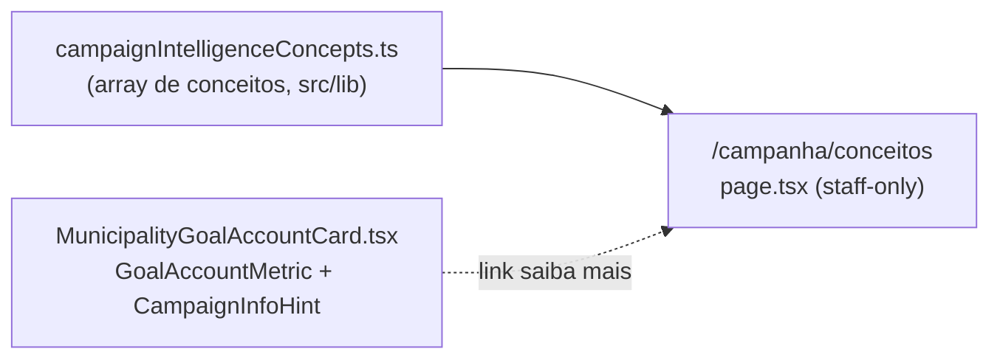

# Documentação de conceitos de inteligência de campanha

Status: rascunho
Atualizado em: 2026-07-24
Item do roadmap: [docs/roadmap.md](../roadmap.md) ("Demais itens abertos", **E18** — adjacente ao programa Inteligência de campanha E8–E16/B13/C12)
Impeccable: C — rota nova `/campanha/conceitos`, sem design-ref
Appetite: ~0,5–1 dia eng (página estática + módulo de conteúdo + 4 links "saiba mais" no card existente)
Responsável: —

## Design (Impeccable)

Âncoras: `PRODUCT.md` (register `product`) · `DESIGN.md` (tema `data-theme='campaign'`).

Na implementação (`implement-roadmap-item`): shape compacto (já feito por este brief) → craft → critique → polish. `harden`/`optimize` só se o Passo 8 do `implement-roadmap-item` acionar gatilho.

Brief compacto:

- **Persona / contexto:** Alex (CG) ou assessor lendo um card de inteligência (ex.: "Conta da cadeira") e não lembrando o que "teto do campo", "captura" ou "roll-off" significam — quer a explicação sem sair do fluxo, e sem precisar perguntar no grupo.
- **Job principal:** explicar, em prosa e fórmula, o que cada número de inteligência do produto mede e como é calculado — não é um FAQ geral do app.
- **Estratégia de cor:** Restrained (default) — página de leitura, sem hero/gauge.
- **Edit where you see:** não se aplica (conteúdo é read-only, curado por PR — ver Decisões travadas).
- **Anti-goals:** wiki geral do `/campanha` (onboarding, "como criar um plano"); FAQ de produto; fórmula renderizada matematicamente (KaTeX) para um público que não é acadêmico; segunda navegação paralela na sidebar.

## Dados → decisão → apresentação

- **Vou apresentar dados?** Não (N/A). A página só explica em prosa fórmulas já expostas em E8 (e, com o tempo, E9–E17); no máximo um exemplo numérico ilustrativo **estático** (ex.: o par hipotético "Feira de Santana: meta 3.000 / comprometido 1.200" já usado nesta sessão), nunca um cálculo ao vivo sobre um município real.
- **Decisões desbloqueadas:** nenhuma — este item explica decisões que **outras** superfícies (E8 hoje; E9–E17 depois) já habilitam. Não é vaidade porque resolve confusão de vocabulário real e evidenciada nesta própria sessão, mas não é ele quem decide alocação.
- **Forma escolhida:** prosa + fórmula em texto monospace, seção por conceito (degrau mais pobre da escada). **Rejeitado:** exemplo vivo computado de município real (2ª superfície de dados dentro da doc, foco de manutenção — ver Rabbit holes); fórmula em KaTeX/notação matemática (lib nova para um único consumidor, público não é acadêmico).
- **Anti-goals de dado:** N/A (sem dado).

## Contexto

O card "Conta da cadeira" no detalhe do município (`/campanha/municipios/<slug>`, `MunicipalityGoalAccountCard.tsx`) ganhou nesta mesma sessão tooltips de hover (`GoalAccountMetric`) explicando os 4 números de diagnóstico — teto do campo projetado, captura 2022, share intracampo e roll-off — depois que o usuário relatou não entender a que cada número se referia. Depois de ler as explicações, o próprio usuário reconheceu: "são análises muito interessantes […] mas são conceitos complicados […] importância de criarmos uma página de documentação para explicar cada conceito de inteligência usado na vertical `/campanha` e como estes valores são calculados." Isso é evidência de campo concreta e datada (2026-07-24) do mesmo tipo que a questão em aberto **O3** ("jargão") do plano-mestre [`inteligencia-campanha.md`](inteligencia-campanha.md) e do roadmap pedia antes de investir além do R6 — mas o produto ainda não tem lugar para acumular essas explicações fora do próprio tooltip pontual, e o programa de inteligência (E9–E17) vai adicionar mais conceitos (LQ, quantis, níveis N0–N4, padrões de sugestão P1–P8, elegibilidade de giro) que vão precisar da mesma explicação.

## Objetivos

- Página staff-only `/campanha/conceitos` documentando, em v1, os conceitos já entregues em **E8**: teto do campo projetado, captura, share intracampo, roll-off, meta/meta sugerida e cobertura da meta — a mesma lista já coberta pelos tooltips de `MunicipalityGoalAccountCard.tsx` e pelo `CampaignInfoHint` do card.
- Cada conceito documentado com: nome, uma frase do que mede, fórmula em texto, "por que isso importa" (ligação com a decisão que ele habilita — ex.: captura é só diagnóstico, não entra na meta).
- Links contextuais "saiba mais" a partir dos tooltips/`CampaignInfoHint` existentes que já mencionam esses conceitos, apontando para a âncora certa da página (`/campanha/conceitos#<id>`) — sem duplicar o texto do tooltip, só estendê-lo.
- Sem migration, sem collection, sem Consent, sem server action.

## Decisões travadas

- **Conteúdo em módulo de código estático (`src/lib`), não em collection Payload.** As explicações são 1:1 com fórmulas vivas em `municipalityPotential.ts`/`goalCoverage.ts` (e, depois, nos utilities de E9–E17); um texto curado por PR ao lado do código que ele descreve fica revisável junto da mudança de fórmula. **Rejeitado:** collection admin (richText) — deixaria a cópia dessincronizar da fórmula real sem qualquer teste/lint pegando, exigiria grupo `admin.group` e access novos para um conteúdo que nenhum coordenador vai editar no `/admin`.
- **Rota nova staff-only (`isCampaignStaff`), sem acesso de `leader`.** Todo conceito documentado descreve campos staff-only (estimativas, metas, teto do campo) que a liderança nunca vê — expor o glossário a ela vazaria vocabulário sem contexto (M4 vocabulário duplo, mesmo princípio de E14). **Rejeitado:** liberar leitura a todo `campaignUser` — nada para a liderança ancorar a leitura.
- **Descoberta via link contextual nos tooltips existentes, não item fixo na `staffNav`.** A sidebar hoje tem 7 itens fixos (`nav.ts`); glossário é material de referência, não destino de uso diário — Design Principle "Clarity under pressure". **Rejeitado:** adicionar a `staffNav` já nesta entrega (ver Adiado com gatilho).
- **i18n e naming**: identificadores em inglês (`campaignIntelligenceConcepts.ts`, `ConceptSection`, `conceptId`), strings visíveis em pt-BR; rota `/campanha/conceitos` (Português, mesmo padrão de `/campanha/dobradinhas`/`/campanha/planos` — não é param dinâmico).

## Questões em aberto

- **Escopo de v1: só E8 ou esperar o programa fechar?** **Opções:** A) documentar só os conceitos já entregues (E8) | B) esperar E9–E17 fecharem para lançar uma página completa. **Recomendação:** A — a confusão evidenciada agora é sobre E8; cada item subsequente do programa (E9, E10, B13, E11, E12, E13, E14) ganha sua própria seção como parte do checklist de verificação desse item (`implement-roadmap-item` Passo de verificação), evitando um E18-v2 que espera 6 outros itens não construídos.
- **Onde mora o conteúdo (TSX puro vs MDX)?** **Opções:** A) array TS de "conceito" renderizado por um componente | B) arquivos MDX. **Recomendação:** A — reaproveita `Card`/tipografia shadcn já no produto; MDX adiciona toolchain nova para um único consumidor.
- **Fórmulas com notação matemática (KaTeX)?** **Opções:** A) texto monospace/pseudo-notação (`captura = pledges ÷ tetoDoCampo`) | B) lib de renderização matemática. **Recomendação:** A — nenhum outro lugar do produto usa notação matemática; público é staff de campo, não acadêmico.

## Abordagem proposta

Componentes:

- **`src/lib/campaignIntelligenceConcepts.ts`** (novo, client-safe, dado puro): array de `{ id, category, title, oneLiner, formula, whyItMatters }` — v1 com os ~6 conceitos de E8 (teto do campo, captura, share intracampo, roll-off, meta/meta sugerida, cobertura da meta). Texto extraído das explicações já escritas em `MunicipalityGoalAccountCard.tsx` e no `CampaignInfoHint` do card, sem reinventar a redação.
- **`src/app/(campaign)/campanha/(app)/conceitos/page.tsx`** (novo, server component): gate `getCampaignUser()` + `isCampaignStaff` + `redirect('/campanha')` para `leader` — mesmo padrão de `.../planos/page.tsx`; renderiza `CampaignPageShell` com uma lista de `Card` por conceito, `id={concept.id}` no elemento da seção para permitir `#anchor`.
- **`MunicipalityGoalAccountCard.tsx`**: cada `GoalAccountMetric` e o `CampaignInfoHint` do título ganham um `Link` "Saiba mais" para `/campanha/conceitos#<id>` ao final do texto explicativo — não substitui o tooltip, só estende.
- **Sem migration, sem collection, sem server action, sem Consent.**

## Dependências

- Duro: **E8 ✓** (os conceitos a documentar em v1 já existem e estão entregues).
- Suave: cresce conforme **E9/E10/B13/E11/E12/E13/E14** entregarem — cada um adiciona sua seção ao array de conceitos e seus próprios links "saiba mais", sem exigir um re-trabalho deste item.
- Nenhuma dependência de site público/admin.

## Não escopo

- Documentar conceitos de itens ainda não construídos (E9–E17) — cada item adiciona sua própria seção quando entregar (ver Questões em aberto).
- Glossário inline automático / detecção de jargão em toda a UI — é a hipótese **O3** do roadmap, ainda sem evidência de Bloco B suficiente para um mecanismo geral; este item resolve o caso concreto já evidenciado (E8) e fixa o padrão, mas não é um sistema automático.
- Onboarding geral do `/campanha` ("como criar um plano", "como declarar um pledge") — fora do escopo de "conceitos de inteligência"; se pedido, é outro item.
- Fórmulas renderizadas matematicamente (KaTeX/rehype-math) — texto monospace basta (Questões em aberto).

## Rabbit holes

- **Exemplo "ao vivo" com dado real de um município.** Se alguém "só completar" com um cálculo dinâmico usando um município real: isso cria uma 2ª superfície de dados dentro da doc (loader, cache, desatualiza se a fórmula mudar sem o exemplo acompanhar). **Mitigação:** exemplos estáticos escritos à mão no conteúdo (como o par hipotético Feira de Santana já usado nesta sessão).
- **Página virar wiki geral do produto.** Se alguém "só adicionar" onboarding/FAQ ao lado dos conceitos: explode escopo e mistura dois jobs. **Mitigação:** escopo travado em "conceitos de inteligência de campanha" (título da página, seções por ID do programa E8–E17), qualquer outra dúvida vira R6/O3.

## Adiado com gatilho

- **Item fixo na `staffNav` (`nav.ts`).** Revisitar quando houver evidência de que staff navega direto para `/campanha/conceitos` (não via link contextual do tooltip) — ex. analytics de navegação ou pedido explícito em sessão.
- **Exemplo numérico "ao vivo" de município real.** Revisitar se o exemplo estático se mostrar insuficiente em uso real (feedback de campo pedindo números reais).

## Referências

- `src/components/campaign/MunicipalityGoalAccountCard.tsx` — `GoalAccountMetric`, `formatRollOff`, `CampaignInfoHint` do título: fonte da redação v1 e ponto de integração dos links "saiba mais"
- `src/components/campaign/CampaignInfoHint.tsx` — padrão de Popover "?" já usado no título do card (precedente de affordance, distinto do Tooltip inline)
- `src/components/campaign/nav.ts` — `staffNav`/`getCampaignNav`: por que este item não entra ali agora (Adiado com gatilho)
- `src/components/campaign/CampaignPageShell.tsx` — shell de página a reusar
- `src/utilities/municipalityPotential.ts`, `src/utilities/goalCoverage.ts` — fórmulas reais a descrever com precisão
- `src/lib/campoParties.ts` — curadoria "campo por ano" (conceito "share intracampo")
- `src/app/(campaign)/campanha/(app)/planos/page.tsx` — precedente do gate staff-only (`getCampaignUser` + `isCampaignStaff` + `redirect`)
- `docs/plans/conta-da-cadeira.md` — plano de E8, seção "Follow-up pós-entrega" com a origem exata deste pedido
- `docs/plans/inteligencia-campanha.md` — plano-mestre do programa; cada fatia futura (E9–E17) estende o array de conceitos deste item
- AGENTS.md — naming em inglês/strings pt-BR, `src/lib` client-safe vs `src/utilities` server-coupled, Campaign auth (`isCampaignStaff`)
