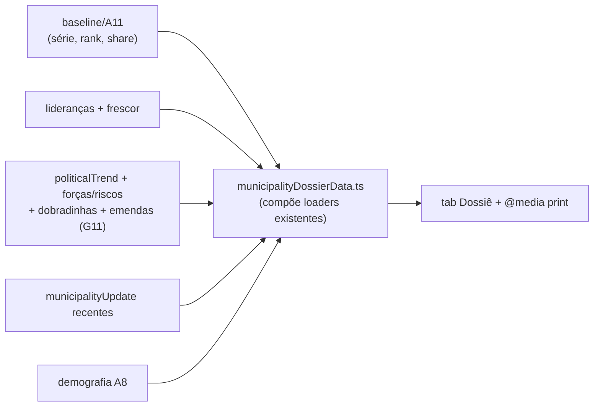

# E16 — Dossiê do município (pré-agenda)

Status: rascunho (O6 — pedido explícito da sessão de campo de 2026-07-23)
Atualizado em: 2026-07-24
Item do roadmap: [docs/roadmap.md](../roadmap.md) (Inteligência de campanha, E16; plano-mestre [inteligencia-campanha.md](inteligencia-campanha.md), gap G11)
Impeccable: B — visão nova dentro do detalhe do município existente (tab/rota `dossie` + print), sem sistema novo
Appetite: ~1 dia eng; sem migration na v1 (compõe dados existentes; campo de emendas é fase G11 manual)
Responsável: —

## Design (Impeccable)

Âncoras: `PRODUCT.md` (princípios 2 "clarity under pressure" e 6) / `DESIGN.md` (register `product`; Flat desk, print sóbrio) · detalhe do município existente (tabs, cards).

Na implementação: craft compacto → critique → polish.

- **Persona / contexto:** CG/assessor a caminho de uma agenda: "chego no território sem dossiê" (O6 — prefeito aliado?, economia, disputa local, emendas aportadas; caso Nazaré das Farinhas). Hoje esses dados existem espalhados em tabs.
- **Job principal:** uma tela (e um print/PDF de 1–2 páginas) com tudo que se lê antes de entrar na cidade.
- **Estratégia de cor:** Restrained; dossiê é leitura, não dashboard — tipografia e hierarquia, zero heat.
- **Anti-goals:** formulário novo para o assessor preencher (anti-goal E1 do relatório: extração sem devolução); duplicar os cards das tabs em vez de compô-los; virar relatório de 10 páginas.

## Contexto

A sessão real de 2026-07-23 ([CUSTOMER.md](../CUSTOMER.md)) trouxe O6 como o único pedido explícito de produto: dossiê de território pré-agenda com conjuntura local (prefeito aliado/oposição, disputa local "Jacu × Beija-Flor"), economia e **emendas aportadas** por município. O produto já tem quase tudo: série/captura (`MunicipalityBaselineCard` + artefato), pledges/estimativas (`MunicipalityPledgesPanel`, A10), lideranças (`MunicipalityLeadershipsPanel`), estratégia/conjuntura (`MunicipalityStrategyCard`: `politicalTrend`, `strengths`/`risks`, `dobradinhaNotes`, `nextSteps`, dobradinhas M4), sinais/atualizações (`municipalityUpdate`), demografia IBGE (A8 — `bahiaMunicipalityDemographics.ts`: população, faixas etárias). O que falta é a **composição** em visão única imprimível — e o único dado realmente novo é emendas (gap **G11** do plano-mestre: manual-first; fonte estruturada Câmara/Transparência adiada com gatilho).

## Objetivos

- **Tab/rota "Dossiê"** no detalhe do município (staff-only): seções na ordem de leitura de campo — capa (nome, TI, prioridade, nível quando existir), conta local (série 2014/2018/2022, % da própria votação via A11, captura/cobertura quando E8 existir), rede (lideranças ativas + responsável + frescor), conjuntura (`politicalTrend` + forças/riscos + disputa local), dobradinhas (M4 + notas), agenda/planos recentes e sinais recentes (últimos `municipalityUpdate`), perfil (demografia A8), emendas (quando houver dado — v1 mostra a seção só se preenchida).
- **Visão print:** `print:`-friendly (CSS print da mesma rota; sem lib de PDF) — 1–2 páginas A4, cabeçalho com data de geração ("dossiê de <data>" — dado envelhece).
- **Emendas manual-first (G11):** nota staff curta no `MunicipalityStrategyCard` existente se couber em campo atual (`nextSteps`/`dobradinhaNotes`) **ou** campo `budgetNotes` staff-only novo — decidir na implementação com custo de migration à vista (questão em aberto abaixo).
- Access: tudo staff (coordinator/advisor/candidate); leader não acessa (lockdown); campos staff-only seguem a redaction dos view models.

## Decisões travadas

- **Dossiê compõe, não duplica.** As seções renderizam os mesmos loaders/componentes das tabs (ou variantes compactas), nunca uma segunda fonte. **Rejeitado:** collection `dossier` ou snapshot persistido (o dossiê é leitura derivada; snapshot ex-ante é papel do `allocationDecision`/C12).
- **Print via CSS, não gerador de PDF.** 1 rota, `@media print`, sem dependência. **Rejeitado:** lib de PDF server-side (peso e manutenção por um ganho nulo — o uso real é imprimir/compartilhar do navegador).
- **Emendas entram manual-first (G11).** Fonte estruturada (Câmara/Portal da Transparência) só com gatilho (E16 em uso + pedido de dado sistemático). **Rejeitado:** import automático de emendas na v1 (pipeline novo por uma seção que começa vazia).
- **i18n e naming:** rota/tab `dossie` (valor de URL em pt, como os demais), `MunicipalityDossier*`, `municipalityDossierData.ts`; labels pt-BR ("Dossiê", "Conjuntura", "Emendas aportadas").

## Questões em aberto

- **Onde mora o dado de emendas na v1?** Opções: reusar campo texto existente (`nextSteps`) com convenção | campo staff-only novo `budgetNotes` (migration pequena). **Recomendação:** campo novo `budgetNotes` na migration de C12 se E16 for aprovado antes dela rodar (mesma janela 2 — zero migration extra); senão, convenção em `nextSteps` até C12.
- **Dossiê mostra nível N0–N4 (E14)?** **Recomendação:** sim quando existir, staff-only — mas nunca no print destinado a circulação além da coordenação (vocabulário duplo). v1: print omite nível por default.

## Abordagem proposta

Componentes: `src/utilities/municipalityDossierData.ts` (novo — orquestra loaders existentes em uma passada), `src/components/campaign/MunicipalityDossier.tsx` (+ seções compactas reusando cards atuais), entrada na `MunicipalityTabNav` (`dossie`), CSS print na própria rota.

## Dependências

- Nenhuma dura — compõe o que existe (baseline, pledges, lideranças, estratégia, updates, A8). Melhora com: **A11** (rank/share), **E8** (captura/cobertura/meta na "conta local"), **C12** (sinais tipados na seção de sinais; migration compartilhada para `budgetNotes`), **E14** (nível), **A6** (dobradinha 2026 real).
- Alimenta: **E13** (o compositor de giros linka o dossiê de cada município do giro — preparação de visita).

## Não escopo

- Import estruturado de emendas (G11 adiado com gatilho); dossiê por TI (leitura regional é E17/E12); snapshot histórico de dossiê (C12/E15 cobrem o ex-ante); dossiê para `leader` (lockdown).

## Rabbit holes

- **Virar relatório infinito.** 1–2 páginas A4; cada seção tem teto de itens (ex.: 5 sinais recentes, 8 lideranças) com link "ver tudo" na tab correspondente.
- **Economia local virar pesquisa.** v1 usa o que A8 tem (demografia); "economia" além disso é nota de conjuntura manual — não construir base socioeconômica nova.
- **Print pixel-perfect.** CSS print razoável basta; não é material de campanha, é documento de trabalho.

## Adiado com gatilho

- **G11 fonte estruturada de emendas** (Câmara/Portal da Transparência → valor por município/ano). Gatilho: E16 em uso real + coordenação pedindo o dado sistemático.
- **Compartilhamento do dossiê via WhatsApp (kit).** Gatilho: pedido de campo; hoje o print resolve.

## Referências

- `docs/roadmap.md` (E16) · [plano-mestre](inteligencia-campanha.md) (G11) · [planejador-de-giros.md](planejador-de-giros.md) (E13 — consome)
- `docs/CUSTOMER.md` — O6 (pedido explícito; Nazaré das Farinhas), restrição "perna" (dossiê barateia a preparação da agenda)
- `src/app/(campaign)/campanha/(app)/municipios/[slug]/page.tsx` (tabs), `src/components/campaign/MunicipalityBaselineCard.tsx`, `MunicipalityStrategyCard.tsx`, `MunicipalityLeadershipsPanel.tsx`, `MunicipalityPledgesPanel.tsx`
- `src/lib/bahiaMunicipalityDemographics.ts` (A8), `src/lib/bahiaElectionAggregates.ts`, [ranking-votos-municipio.md](ranking-votos-municipio.md) (A11)
- `PRODUCT.md`/`DESIGN.md` — clareza sob pressão; print sóbrio; AGENTS.md — access, naming
