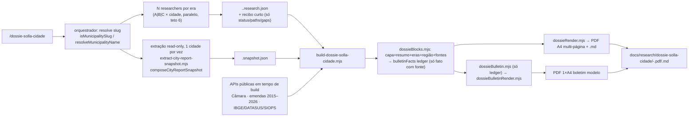

# Impl: Dossiê Solla por cidade — o que ele fez pela cidade e pela região (skill → dossiê + boletim modelo)

Status: aprovado
Atualizado em: 2026-09-17
Issue: #1132
Intenção: docs/plans/dossie-solla-cidade.md
Appetite restante: ~3–4 dias eng (herdado)

## Leitura da intenção (Outcome / O que NÃO negociar / O que reavaliar)

- **Outcome:** `/dossie-solla-cidade <cidade>` entrega, numa invocação, um par **PDF A4 datado + `.md`** (capa, resumo de uma olhada, seções por era A/B/C, região/polo, títulos/vínculos, lacunas, fontes, defeso) **e** o **Boletim Informativo modelo** (1 página A4, linguagem de eleitor, sem fontes). Toda afirmação não trivial tem URL+data; o que falta é lacuna explícita; números com fase; esfera rotulada e nunca somada; o boletim herda só fatos já com fonte do dossiê.
- **O que NÃO negociar:** defeso (dossiê e boletim são "insumo interno/modelo", sem CTA); "sem fonte, não publica"; **empenho ≠ pagamento** (autorizado/empenhado/liquidado/pago/restos por valor); esfera explícita (`município`/`região`/`polo`, nunca somada); leitura relativa (nunca % estadual absoluto); atribuição de emenda de bancada/relator só com autoria checada; PII mínima; artefato **gitignored** (repo público); falha isolada no lote não cancela as demais; **não alterar `/relatorio-cidade`**; nenhum schema/migration, nenhuma escrita no DB, nenhum segundo cadastro de pessoa.
- **O que reavaliar (hipóteses da "Direção no codebase"):**
  - "build reusando `scripts/build-city-report.mjs`" — o _page shell_, o CSS e o contrato de página 1 do C163 são do relatório eleitoral; do builder só se reusa a **técnica** (Chromium `page.pdf`, guarda de overflow), não o arquivo. O que se compartilha de verdade é `cityReportFormat`, `cityReportResearch` (primitivas), `cityReportTerritory` e `camaraFetch`/`camaraSpeeches`/`portalTransparenciaEmendas`.
  - "extrair Câmara/SIOPS/DATASUS/IBGE no snapshot" — o snapshot só carrega o que existe no DB; desses, só o **acervo de falas** (2011+) está na base. O resto é API pública em tempo de build (como as emendas já são no C163). Logo **não** se estende o extrator.
  - "boletim herda fatos do dossiê" — a herança precisa ser **estrutural** (um ledger de fatos com fonte produzido na montagem do dossiê), não uma segunda pesquisa.
- **Design (fonte de verdade do port — portar classe a classe):**
  - **Dossiê** (`docs/plans/dossie-solla-cidade-ui-design.html`), 5 cenas/`.sheet`: **01 Capa** (barra accent, kicker, caixa "INSUMO INTERNO", título, `<dl>` Território/Região-polo/Data, "Como usar" + NEEDS ASSET selo, rodapé escopo/versão); **02 Página 1 — resumo** (01 trajetória = grid-3 com 6 cartões de período; 02 principais entregas localizadas = linhas com badge `scope`, era, valor + badge `phase`, `(fonte)`; guarda "autorizado ≠ empenhado ≠ liquidado ≠ pago"; 03 ganchos para o boletim + 04 o que falta em `warning`); **03 Seção por era (Era C representativa)** = "Recorte e método" + trilha, tabela `document-table` **Objeto/Valor/Ano/Fase/Esfera/Fonte**, cards "Atuação registrada" com `scope`+ano+`(fonte)`, "Títulos, honrarias e vínculos locais" + NEEDS ASSET; **04 Região/polo** = painel de aviso "Região não é cidade. Não some os dois recortes.", comparação lado a lado `município ≠ região/polo`, tabela de itens regionais (Item/Esfera/Evidência de alcance/Fonte), gancho + lacuna prioritária; **05 Fontes e limites** = tabela de **lacunas** (Lacuna/Onde foi buscado/Limite editorial/Próximo passo), tabela de notícias com larguras fixas **9/14/49/28%**, blocos "Limites de cobertura" + "Regras para uso editorial", aside **defeso**.
  - **Boletim** (`docs/plans/dossie-solla-cidade-boletim-ui-design.html`), 1 `.sheet`: header (kicker + município + aviso "Dados ilustrativos" + `.model-label` "Modelo — insumo interno"); abertura (h1 "O que Jorge Solla fez por <cidade>" + lead + NEEDS ASSET foto); **6 `.highlight-card`** (grid-3) com eyebrow "Área · cidade/região", número grande, título curto, nota; **timeline de 4 passos** (1999–2002 / 2003–2005 / 2007–2014 / DESDE 2015); **"E mais"** com 14 itens ✓ em 2 colunas + NEEDS ASSET selo/recorte; rodapé "Fatos selecionados do dossiê da cidade." + defeso + "MODELO · INSUMO INTERNO · A4 · página 1/1".

## Abordagem recomendada

**Opções consideradas:** (a) estender o pipeline C163 com um "modo dossiê"; (b) uma skill/command/agent novos + libs de conteúdo/render próprias compartilhando os donos puros existentes.
**Recomendação:** (b) — o recorte de conteúdo e a linguagem visual são outros; forçar o C163 a carregar dois produtos reabre o contrato de página 1 e o `assertSnapshotShape` que os testes dele pinam. A forma nova reusa o que é genuinamente comum (formatters, primitivas de pesquisa, território, fetchers) e mantém **um único dono** para cada concern.
**Rejeitadas:** (a) porque o custo de reverter é alto (contrato C163 em produção + specs pinadas) e a sobreposição de conteúdo é mínima; forkar tudo sem reusar (formatters/`{{fonte}}`) twin-a guardas que já existem.

### Componentes / mudanças

**Skill / command / subagente**

- **`.agents/skills/dossie-solla-cidade/SKILL.md`** (novo) — fonte canônica. Seções: `Lote`, `Pipeline (etapas)`, `Briefing por era (A/B/C)` + `Recibo do researcher`, `Contrato dos JSONs`, `Conteúdo` (dossiê + boletim), `Guardrails`, `Troubleshooting`, `Referências`. Aponta os dois HTMLs hi-fi.
- **`.opencode/commands/dossie-solla-cidade.md`** (novo) — frontmatter só `description:` (sem `model`, pin OPS101); corpo carrega a skill pelo nome exato, cita `.agents/skills/dossie-solla-cidade/SKILL.md` e termina em `$ARGUMENTS`.
- **`.opencode/agent/dossie-solla-cidade.md`** (novo) — `description:` + `mode: subagent`; researcher **por era**; escreve `data/dossie-solla-cidade/<slug>.<era>.research.json`; devolve só o recibo; proibido `ssh`/`scp`/build/`--municipality=`/`--snapshot=`/commitar.

**Pesquisa / libs puras**

- **`scripts/lib/dossieResearch.mjs`** (novo) — dono do contrato do dossiê: `DOSSIER_RESEARCH_CHECKLIST` (itens com `era: 'A'|'B'|'C'`), `normalizeDossierResearchInput(raw, { now })` (lança sem `municipalitySlug`/`researchedAt`; item sem URL+data → lacuna; preserva `numbers[]`), `dossierItemById`, `dossierGapCount`. Reusa `isNonEmptyString`, `isValidDate`, `collectExtraSources`, `inNewsWindow`, `RESEARCH_NEWS_WINDOW_DAYS`.
- **`scripts/lib/cityReportResearch.mjs`** (editar, **aditivo**) — exportar as 5 primitivas acima; nenhuma mudança de comportamento (specs C163 seguem verdes).
- **`scripts/lib/dossieCareer.mjs`** (novo) — dono dos literais de carreira (período/papel/como recuperar/flag `uncertain`, ex.: `[INCERTO: 1989 vs 1990]`, `2005 vs 2006`) + os 4 passos condensados do boletim + constantes (`SOLLA_DEPUTY_ID=178857`, nascimento 11/04/1961, "nunca foi deputado estadual", Comenda Dois de Julho). Fonte única dos dois artefatos.
- **`scripts/lib/dossieCamara.mjs`** (novo) — `fetchCamaraActivity({ deputyId, from, to, fetchImpl })`: proposições (`/proposicoes?idDeputadoAutor=178857&itens=100`), discursos (`/deputados/178857/discursos?dataInicio=&dataFim=` — **default 7 dias**, sempre passar janela), relatorias via `/proposicoes/{id}/tramitacoes` (`/relatorias` é 405). Reusa `getJson`/`getJsonWithBackoff` (`camaraFetch.mjs`), `SOLLA_DEPUTY_ID`/`LEGISLATURE_RANGES` (`camaraSpeeches.mjs`); paginação + teto + `e mais N` + cache em `/data/dossie-solla-cidade/`; falha → lacuna.
- **`scripts/lib/dossieHealthData.mjs`** (novo) — séries SIOPS/DATASUS/IBGE (SIDRA `/values/t/{tabela}/n6/{ibge}/v/{var}/p/{ano}`, OpenDataSUS CKAN), `fetchImpl` injetável, número-only e falha-fechado → lacuna.
- **Reusos sem edição:** `cityReportFormat.mjs` (formatadores), `cityReportTerritory.mjs` (`buildTerritoryPanorama`), `cli.mjs` (`dieWithLabel`/`parseEqualsFlags`/`loadCliEnv`/`isTruthyEnv`), `portalTransparenciaEmendas.mjs` (`fetchAuthorEmendas` — o builder passa `years` explícito; **`EMENDAS_YEARS` default 2023–2026 fica intocado**).
- **`scripts/lib/reportText.mjs`** (novo) — dono único de `htmlEscape`, `htmlWithLinks`, `INLINE_SOURCE_PATTERN`, `renderInlineSourcesHtml`/`Md` (contrato `{{fonte}}`/`{{fonte:N}}`); `cityReportRender.mjs` passa a importar daqui.

**Conteúdo / render**

- **`scripts/lib/dossieBlocks.mjs`** (novo) — `buildDossierReport({ snapshot, research, sources, emendas, generatedAt })` → `{ meta, cover, page1, sections, bulletinFacts, gaps }`; ids `capa`, `resumo`, `era-a|era-b|era-c`, `regiao`, `fontes`; badges `scope`/`phase`; tabela de lacunas; **omite** seções vazias sem gastar página; **nunca soma** região/polo; constrói o `bulletinFacts` (`{ id, era, sphere, topic, headline, number, sourceUrl, sourceDate }`) **só** a partir de blocos com `sourceUrl`.
- **`scripts/lib/dossieRender.mjs`** (novo) — `renderDossierHtml`/`renderDossierMd`; porta as classes do hi-fi (`.sheet`, `.report-header/-kicker/-meta/-footer`, `.section-title`, `.eyebrow`, `.scope`/`.scope-region`, `.phase`, `.document-table`, `.placeholder-bar`, `.asset-box`) e usa `reportText.mjs` para inline sources.
- **`scripts/lib/dossieBulletin.mjs`** (novo) — `buildBulletin({ facts, municipality, generatedAt })`: seleciona **≤6 highlights** (determinístico: `municipio` antes de `regiao/polo`, com número antes de sem número, era C primeiro) + **≤14 "e mais"** + timeline de 4 passos; sem acesso a research/snapshot crus.
- **`scripts/lib/dossieBulletinRender.mjs`** (novo) — `renderBulletinHtml`; porta `.model-label`, `.highlight-card`, `.highlight-number`, `.timeline-step`, `.more-item`, `.asset-box`; **sem** seção de fontes; NEEDS ASSET foto/selo/recorte estáticos.
- **`scripts/build-dossie-solla-cidade.mjs`** (novo) — CLI `--snapshot= --research-dir= --out-dir= [--emendas=] [--author=] [--generated-at=]`; lê `<slug>.{a,b,c}.research.json` do `--research-dir` (o orquestrador não agrega corpo), exige `municipalitySlug` igual ao snapshot, busca emendas 2015–2026 + Câmara + dados de saúde, monta dossiê e boletim, grava HTML cache + `.md`, e num único Chromium emite **dois PDFs** com **duas guardas de fit** separadas: `[data-page="resumo"]` vs `DOSSIER_PAGE_ONE_BUDGET_PX` e `[data-page="boletim"]` vs `BOLETIM_PAGE_BUDGET_PX` (reusa a técnica de `build-city-report.mjs:36-45,155-165`, não o código). `DOSSIER_STRICT=1` falha em lacuna (conferência, não entrega).
- **Extração read-only:** reusa `scripts/extract-city-report-snapshot.mjs` e `composeCityReportSnapshot` **sem alteração** (mesma receita `~/teqo-report`, `CITY_REPORT_CONFIRM=1`, `withReadOnlyDatabaseUrl`, serializada 1 cidade).

**Testes**

- `tests/unit/dossieResearch.unit.spec.ts` (novo) — normalizador: lança sem slug/`researchedAt`; item/item de lista sem fonte vira lacuna; `numbers` preservados; checklist por era.
- `tests/unit/dossieBlocks.unit.spec.ts` (novo) — conteúdo: capa/resumo/timeline/eras/região/títulos/lacunas; região/polo nunca somados; seção vazia omitida; `bulletinFacts` só de fato com fonte.
- `tests/unit/dossieRender.unit.spec.ts` (novo) — espelha `cityReportRender.unit.spec.ts`: escape, âncoras de URL, `{{fonte}}`, paridade HTML↔MD.
- `tests/unit/dossieBulletin.unit.spec.ts` (novo) — boletim herda só o ledger (todo highlight/"e mais" mapeia um fato com fonte); sem linha de fontes; rótulo "modelo — insumo interno"; tetos 6/14.
- `tests/unit/dossieCamara.unit.spec.ts` / `tests/unit/dossieHealthData.unit.spec.ts` (novos) — `fetchImpl` injetado; falha/HTTP ruim → lacuna; janela de discursos sempre explícita.
- `tests/unit/dossieBatchSkill.unit.spec.ts` (novo) — espelha `cityReportBatchSkill.unit.spec.ts`: lote por vírgula, resolução canônica (`isMunicipalitySlug`/`resolveMunicipalityName`/`salvador-ze-N`), pipeline serializado na extração, fan-out por era + guarda de concorrência, recibo curto, subagente researcher-only.
- `tests/unit/opencodeCommands.unit.spec.ts` (editar) — incluir `'dossie-solla-cidade'` na lista hardcoded (senão o command fica sem guarda).
- `tests/unit/cityReportResearch.unit.spec.ts` (manter verde) — prova que os exports aditivos não mudaram o C163.

**Config / docs**

- `.gitignore` (editar) — `/data/dossie-solla-cidade/` e `/docs/research/dossie-solla-cidade/` (hoje só os dirs do relatório estão ignorados).
- `docs/changelog/2026-09-17-c186.md` (novo) — uma entrada curta (convenção OPS85).
- **Migration:** sem migration. **Access / Consent:** N/A (sem DB/schema/PII nova). **UI:** Impeccable C já aprovado nos dois HTMLs; o implementer **porta classe a classe** — o gatilho do `designer` (a/b) só reabre se o port achar superfície ausente no design.

### Dados → forma (pergunta 3 — data-presentation)

- **Dossiê — forma escolhida:** **tabelas e listas com fonte por linha** (tabela de números com colunas Objeto/Valor/Ano/**Fase**/**Esfera**/Fonte; linhas de entrega com badge `scope` + badge `phase` + `(fonte)`; tabela de lacunas com "onde foi buscado/limite/próximo passo"). É a **forma mais pobre que ainda desbloqueia** a decisão (escolher tema/ângulo e saber o que falta): número sempre colado ao seu contexto e à sua fase, e a esfera visível em cada linha. **Rejeitadas:** dashboards/KPIs agregados (perdem a fonte item a item e convidam a somar); gráficos de série (não há série comparável entre eras/cargos); mapa (sem geografia no escopo); % estadual absoluto (anti-goal de produto).
- **Boletim — forma escolhida:** **número destacado + rótulo curto** (≤6 `.highlight-card`, um por área/esfera) + **lista densa de fatos curtos** (≤14 itens ✓) + timeline de 4 passos. Densidade > destaque grande, como decidiu o produto. **Rejeitadas:** tabela/planilha (documento de gestor, não de eleitor); parágrafos longos (estouram a 1 página); fontes no boletim (vivem só no dossiê); CTA de campanha (defeso).

## Decisões de engenharia (A–G)

**A. Contrato de pesquisa do dossiê.**
Opções: A) parametrizar `cityReportResearch.mjs` (`normalizeResearchInput(raw, { profile, checklist })`); B) novo `scripts/lib/dossieResearch.mjs` reusando as primitivas de validação exportadas do dono.
**Recomendação: B** — o checklist é **por era** e a entrada adiciona `numbers`; a forma do relatório (checklist plano + validadores por lista) é o contrato de produção do C163, pinado por `cityReportResearch.unit.spec.ts`/`cityReportBatchSkill.unit.spec.ts`. Exportar 5 helpers puros de forma **aditiva** e dar ao dossiê o próprio checklist/normalizador mantém um dono por concern e não reabre o C163.
**Rejeitadas:** A — um switch de profile dentro de cada validador reabre o contrato pinado e os formatos divergem (plano × por era); reescrever `isValidDate`/`inNewsWindow` no módulo novo — twin da guarda de origem.

**B. Reuso do renderer.**
Opções: A) estender `cityReportRender.mjs`; B) fork dos renderers do dossiê/boletim; C) fork visual + extrair o contrato puro compartilhado para um dono próprio.
**Recomendação: C** — o _page shell_, o CSS e as classes do dossiê (`.sheet`, `.document-table`, `.scope`, `.phase`) e do boletim (`.highlight-card`, `.timeline-step`, `.more-item`) não existem no renderer C163 e misturá-los incha um módulo em produção. Mas `{{fonte}}`/`{{fonte:N}}`, escape e ancoragem de URL são um **contrato sutil** — vão para `scripts/lib/reportText.mjs`, que passa a ser o dono; `cityReportRender.mjs` importa de lá (saída idêntica, specs verdes) e os renderers novos também.
**Rejeitadas:** A — dois idiomas visuais no mesmo shell e o risco de tocar a guarda de página 1 do C163; B sem extração — twin-a a resolução de `{{fonte}}`, exatamente a drift que o repo proíbe.

**C. Builders de seção.**
Opções: A) parametrizar `cityReportBlocks.mjs`; B) novo `scripts/lib/dossieBlocks.mjs`.
**Recomendação: B** — a arquitetura de informação é outra (capa, eras A/B/C, região/polo não somável, honrarias, tabela de lacunas) e reusa `cityReportFormat.mjs`, `dossieCareer.mjs`, `buildTerritoryPanorama` e as primitivas de pesquisa. Parametrizar A exigiria um modo em ~14 builders e reabriria os caps da página 1 que o C163 pina.
**Rejeitadas:** A pelas razões acima; duplicar `buildSourcedListBlocks` genericamente — os builders do dossiê têm colunas e badges próprios (`scope`/`phase`), então um helper local é mais honesto que um parâmetro a mais no dono do relatório.

**D. Dois builders ou um.**
Opções: A) dois scripts (dossiê + boletim); B) um `scripts/build-dossie-solla-cidade.mjs` emitindo os dois, com `buildBulletin` puro em módulo próprio.
**Recomendação: B** — uma execução lê snapshot/pesquisa/APIs **uma vez**, monta o dossiê, deriva o ledger `bulletinFacts` e monta o boletim a partir dele; um único Chromium gera os dois PDFs. As guardas de fit são **separadas** (seletores e orçamentos distintos), o que o prompt exige. Dois scripts duplicariam o I/O e tornariam "o boletim só herda fato do dossiê" um invariante entre processos.
**Rejeitadas:** A por duplicar leitura/rede e enfraquecer o invariante; um único render com `--mode` — flag gêmea de duas saídas obrigatórias, sem ganho.

**E. Herança de fatos pelo boletim.**
Opções: A) segunda saída derivada na mesma execução, a partir do ledger `bulletinFacts`; B) segunda passada de pesquisa.
**Recomendação: A** — garantia **estrutural**: `buildBulletin` recebe apenas o ledger (`{ era, sphere, topic, headline, number, sourceUrl, sourceDate }`), populado exclusivamente por blocos do dossiê que carregam `sourceUrl`. O renderer do boletim não tem acesso a research/snapshot crus, então não há como introduzir fato novo. Teste unitário afirma que todo highlight/"e mais" mapeia um fato com fonte.
**Rejeitadas:** B — uma segunda pesquisa reintroduz a síntese sem lastro (o rabbit hole "boletim vira fact-oide sem fonte") e quebra o "nunca introduz fato novo".

**F. Extração.**
Opções: A) estender grupos do snapshot em `cityReportSnapshot.mjs`/`extract-city-report-snapshot.mjs`; B) extrator específico do dossiê reusando `withReadOnlyDatabaseUrl` + a receita ssh; C) reusar o extrator atual sem mudanças e buscar os fatos não-DB em tempo de build.
**Recomendação: C** — o único recorte do dossiê que vive na base Teqo é o **acervo de falas (2011+)**, que `composeCityReportSnapshot` já projeta (cidade/região/tema). Proposições/discursos/votações da Câmara, emendas, SIOPS/DATASUS/IBGE **não são linhas do DB** — são API pública, e o C163 já busca emendas assim em tempo de geração. Reusar a extração read-only como está preserva o contrato do C163 e mantém a leitura serializada (1 cidade por vez). Se um dia faltar um recorte que exista no DB, estende-se o dono **aditivamente**.
**Rejeitadas:** A — mexe no `assertSnapshotShape` e no formato de produção do C163 por dados que o DB não tem; B — twin da plumbing ssh/read-only e da receita do checkout `~/teqo-report`. **Emendas:** o builder passa `years` explícito (`2015–2026`) a `fetchAuthorEmendas`; `EMENDAS_YEARS` (2023–2026) fica intocado para o `/relatorio-cidade`.

**G. Onde vivem os prompts de era e quantos researchers.**
Opções: A) prompts na prosa do SKILL + um subagente único, fan-out pelo orquestrador; B) um arquivo de agente por era; C) um researcher fazendo as três eras.
**Recomendação: A** — `SKILL.md` é dona do `Briefing por era` (checklist/ids por era + templates de fonte por período + o limite "acervo cobre 2011+, pré-2011 é lacuna") e do contrato de fan-out; `.opencode/agent/dossie-solla-cidade.md` é o researcher **por era**. O orquestrador dispara `3 × N` tasks com `MAX_RESEARCHERS_IN_FLIGHT = 6` (2 cidades por vez) — a guarda de concorrência — e serializa a extração do homeserver.
**Rejeitadas:** B — três arquivos quase idênticos para o mesmo papel (drift garantido; a era é argumento); C — serializa o passo mais caro de contexto e perde o paralelismo que justifica o appetite.

## Fases verificáveis (tracer bullet first)

1. **Tracer (contrato + conteúdo + render, sem PDF) — quota de meio dia.** `dossieCareer.mjs` + `dossieResearch.mjs` + (`dossieBlocks.mjs`/`dossieRender.mjs` com capa + resumo + Era C + fontes) produzindo HTML e `.md` válidos para uma cidade, com `dossieResearch`/`dossieBlocks`/`dossieRender` unit verdes. Prova o encadeamento mais arriscado cedo. Inclui o export aditivo em `cityReportResearch.mjs` e a extração de `reportText.mjs` (specs C163 verdes).
2. **Pipeline agêntico.** `SKILL.md` + command + subagente + `dossieBatchSkill.unit.spec.ts` + `opencodeCommands.unit.spec.ts` atualizado: lote, resolução de slug, recibos, fan-out por era e guarda de concorrência. Reuso do extrator read-only na extração serializada.
3. **Fontes e build.** `dossieCamara.mjs` + `dossieHealthData.mjs` + emendas 2015–2026; `build-dossie-solla-cidade.mjs` gera HTML cache, `.md` e o **PDF multi-página** com a guarda `[data-page="resumo"]`. Unit dos fetchers (fetch injetado).
4. **Boletim + port visual.** `bulletinFacts` → `dossieBulletin.mjs` + `dossieBulletinRender.mjs` → PDF 1×A4 com a guarda `[data-page="boletim"]`; port classe a classe dos dois hi-fi; `.gitignore` dos dois dirs; changelog.
5. **Gates.** `pnpm gate:fast` (lint 0 warnings, `tsc --noEmit`, unit) → rodar o build local de 1–2 cidades reais conferindo PDF/MD (aceite manual) → `pnpm push` (PR CI roda o restante). Sem `test:int` novo (nenhuma fronteira Payload/DB tocada; o `tests/int/cityReportSnapshot.int.spec.ts` segue como está). Sem e2e — não há superfície de runtime no app.

## Rabbit holes / Não escopo (engenharia)

- Forkar a plumbing de extração read-only ou a receita ssh/`~/teqo-report` (twins); estender grupos do snapshot para dados que não estão no DB.
- Alterar `/relatorio-cidade` além dos exports aditivos; mexer no default `EMENDAS_YEARS`; tocar na `assertSnapshotShape`/contrato de página 1 do C163.
- Segunda passada de pesquisa para o boletim; qualquer caminho em que o boletim leia research/snapshot crus.
- Schema/migration/collection nova/segundo cadastro de pessoa; writes no DB.
- Índice ou PDF agregado de lote (uma cidade = um par dossiê + 1 boletim).
- Reconstruir a carreira pré-2011 fora do acervo — vira **lacuna**, não invenção.
- Reabrir o design: os hi-fi estão aprovados; só port. Se faltar superfície, aciona-se o `designer` — não se redesenha na implementação.
- Sumir/consolidar esfera, tratar empenho como pago, % estadual absoluto, CTA de campanha no boletim.

## Riscos e mitigação

- **Regressão do C163 pelos exports/extração de `reportText`:** mudanças aditivas/realocação sem alterar saída; `cityReport*.unit.spec.ts` no `gate:fast`; nenhuma edição em `build-city-report.mjs`/`cityReportSnapshot.mjs`/extrator.
- **Overflow de página com conteúdo real:** orçamentos explícitos (`DOSSIER_PAGE_ONE_BUDGET_PX`, `BOLETIM_PAGE_BUDGET_PX`) e tetos de conteúdo no `dossieBlocks`/`bulletin`; se estourar, **aperta-se o teto/corta copy — nunca se espreme o layout**.
- **Câmara com API pesada (~3.338 proposições) e 429/500:** `getJsonWithBackoff`, paginação com teto, `e mais N`, cache em `/data/dossie-solla-cidade/`, falha → lacuna datada.
- **Acervo só 2011+:** eras A/B saem como lacuna explícita; o SKILL declara o limite (o design já traz "O acervo interno de falas cobre 2011+").
- **Autoria de emenda ambígua (bancada/relator/homônimo):** mantém o match de autor do `fetchAuthorEmendas` (`authorNameMatches` + código distinto) e a esfera explícita; sem atribuição → lacuna.
- **Drift entre o SKILL (prosa da timeline) e `dossieCareer.mjs`:** teste cruza os literais-chave (períodos das eras, `178857`, 11/04/1961) entre os dois.
- **Vazamento de artefato no repo público:** `.gitignore` para os dois dirs; subagente proibido de commitar; nada em `docs/research/`/`data/` entra no git.
- **Fan-out estourando limite:** `MAX_RESEARCHERS_IN_FLIGHT = 6` + extração serializada; falha isolada por era/cidade vira `failed` no summary, sem cancelar o lote.

## Aceite de engenharia

- [ ] Aceite de produto da intenção coberto: dossiê PDF A4 + `.md` por cidade (capa/resumo/timeline/eras/região/honrarias/lacunas/fontes/defeso) **e** boletim modelo 1×A4 (6 destaques + timeline + "e mais", sem fontes).
- [ ] "Sem fonte, não publica"; empenho ≠ pagamento (fase por valor); esfera explícita e nunca somada; lacuna explícita; PII mínima; boletim sem CTA e sem fonte.
- [ ] Boletim herda **apenas** `bulletinFacts` (fato com fonte do dossiê) — proibido ler research/snapshot crus.
- [ ] Identificadores em inglês; português só em strings/labels/slugs visíveis; nenhum schema/migration/DB write/segundo cadastro.
- [ ] `{{fonte}}` com **um dono** (`reportText.mjs`); `/relatorio-cidade` intocado (só exports aditivos) e suas specs verdes.
- [ ] Skill/command/subagente acoplados pelo nome exato; `opencodeCommands.unit.spec.ts` atualizado; `dossieBatchSkill.unit.spec.ts` cobrindo lote/recibo/fan-out/guarda.
- [ ] Artefatos gitignored (`/data/dossie-solla-cidade/`, `/docs/research/dossie-solla-cidade/`); changelog `docs/changelog/2026-09-17-c186.md`.
- [ ] Unit novos verdes: `dossieResearch`, `dossieBlocks`, `dossieRender`, `dossieBulletin`, `dossieCamara`, `dossieHealthData`, `dossieBatchSkill`.
- [ ] `pnpm gate:fast` verde; build local aceito em 1–2 cidades; `pnpm push`.

---

### Self-score (decision-quality, gate ≥4/5)

1. **Decisões caras têm rejeitadas?** A–G todas com Opções/Recomendação/Rejeitadas explícitas (contrato de pesquisa, renderer, builders, nº de builders, herança, extração, fan-out). — **5/5**
2. **Abordagem cabe no appetite (3–4 dias)?** Sim: skill+scripts+tests only, sem schema, tracer bullet no dia 1, reuso máximo de libs do C163. — **5/5**
3. **Rabbit holes nomeados?** Sim: twin da extração, edição do C163, segunda pesquisa, pré-2011 inventado, reabertura de design, soma de esfera. — **5/5**
4. **Depth check: reusa shells/helpers existentes?** Sim — `cityReportFormat`, `cityReportResearch` (primitivas), `cityReportTerritory`, `camaraFetch`/`camaraSpeeches`, `fetchAuthorEmendas`, `reportText`, `cli`; o que é novo tem responsabilidade própria. — **4/5** (a extração de `reportText` é a única mudança em módulo existente e por isso fica no radar de regressão).
5. **Intenção (aceite de produto) permanece satisfeita?** Sim — os dois artefatos, os literais de produto (1 página, sem fontes, rótulo de modelo, densidade) e os guardrails estão no aceite acima; a engenharia não reescreveu o outcome. — **5/5**

**Total 24/25 (média 4,8/5) — passa o gate ≥4/5.**

## Débitos de review (triage C186 — 2026-09-17)

Findings dos dois revisores (alta/média já corrigidos em `3c1c643d`). Nenhum vira Issue: nenhum é `expensive_lock` ≥4 — só scripts, sem DB/access/schema.

### Adiado com gatilho

- **Plumbing do builder gêmea de `build-city-report.mjs`** (`readJson`, IIFE `currentCodeSha`, `resolveEmendas` fetch+cache+log, `MM_TO_PX`/orçamento A4, bloco Chromium fit-guard+`page.pdf`): 2 call sites e a decisão (B) já é reusar só a _técnica_, não o arquivo. **Gatilho:** ao surgir o 3º builder CLI, extrair `scripts/lib/buildPdf.mjs` (fit-guard + emit) + helper de cache de emendas.
- **`assetBox` (`dossieRender`) × `ASSET` (`dossieBulletinRender`)**: mesmo `.asset-box`, CSS distinto por folha. **Gatilho:** 3ª superfície de render ou unificação visual; aí extrair o helper de markup.
- **JSDoc de `dossieBlocks`** tipando `emendas`/`camara`/`health` como `any` apesar do typedef `EmendasResult` de `portalTransparenciaEmendas`. **Gatilho:** próxima edição de `dossieBlocks` (usar os typedefs existentes).
- **`dossieCamara.maxPages` só limita proposições** (discursos: 1 página por janela de 4 anos). **Gatilho:** build real com discursos truncados que importem para o "e mais N".

### Explicitamente fora (não reabrir)

- **`extraSources`/`consultedAt` no item de `dossieResearch`**: completude de contrato para futuro `{{fonte:N}}`; consumidor ainda não lê (intencional).
- **`SOLLA_BIRTH_DATE`/`SOLLA_BIRTH_PLACE`/`SOLLA_OFFICIAL_SITE`** usados só pelo spec de drift: pins de identidade intencionais (`dossieCareer` é dono dos literais).
- **Guardas de prosa por regex/`toContain` sobre o `SKILL.md`**: precedente idêntico em `cityReportBatchSkill.unit.spec.ts`; convenção vigente.
- **IBGE/SIDRA bloqueado por Cloudflare (403) no posto de dev**: observação de ambiente, não débito de código; falha fecha em lacuna. Anotar no build de aceite.
- **Design tier:** crítica final do `designer` (trigger c) **CERTIFIED** nos dois artefatos (dossiê 9 páginas + boletim 1 página) após 2 rodadas de correção.
