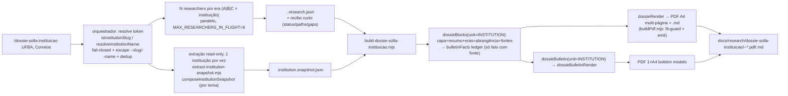

# Impl: Dossiê Solla por instituição + Boletim modelo (skill → dossiê + boletim)

Status: aprovado
Atualizado em: 2026-09-17
Issue: #1135
Intenção: docs/plans/dossie-solla-instituicao.md
Appetite restante: ~3–4 dias eng (herdado)

> Aprovado no modo `--auto` (`/work-issue --issue 1135 --auto`): a pausa do GATE foi convertida em apresentação-no-chat. Literais e cortes de escopo do plano de intenção foram assumidos; nada de schema/Consent/URL público entra aqui.

## Leitura da intenção (Outcome / o que NÃO negociar / o que reavaliar)

- **Outcome:** `/dossie-solla-instituicao <instituição>` entrega, numa invocação, um par **PDF A4 datado + companion `.md`** (identificação por `kind`/`sphere`/`scope`; seções por era A/B/C; tabelas **Objeto/Valor/Ano/Fase/Abrangência/Fonte**; painel de abrangência `instituição × setor × rede`; lacunas; fontes; defeso) **e** o **Boletim modelo** (1 página A4, linguagem de eleitor, ≤6 destaques + ≤14 "E mais", sem fontes, sem CTA, rótulo "Modelo — insumo interno" + defeso, `NEEDS ASSET`). Lote de 1+N; falha isolada não cancela o lote.
- **O que NÃO negociar:** catálogo **fail-closed** (token desconhecido → mensagem acionável + escape `--slug=<x> --name="<Nome>"`, nunca slug inventado) e dedup após resolução; eras A/B/C **reusadas** do C186 (não criar eras novas); abrangência `instituicao | setor | rede` **nunca somada**; fases `autorizado|empenhado|liquidado|pago|restos` (default `nao_informado`, empenho ≠ pago); "sem fonte, não publica" + lacuna explícita; PII mínima; leitura relativa (nunca % estadual absoluto); artefato **gitignored** (repo público); **sem schema/migration/DB write/segundo cadastro**; **não alterar** `/dossie-solla-cidade` nem `/relatorio-cidade` (só generalização aditiva do dono, com as specs C186/C163 verdes); **sem truncamento mecânico/descarte silencioso** (reformular no `summary` ou declarar "e mais N" — regra C188, aplicada no dono).
- **O que reavaliar (hipóteses da "Direção no codebase"):**
  - "reusar o extrator C186/C163 sem mudanças" — falso: `--municipality=`, `resolveAccessibleMunicipalityContext` e `loadSpeeches(municipalities:[id])` prendem o snapshot a município. O recorte institucional é **tema→instituição**; exige um composer novo que reusa a plumbing read-only, não o composer.
  - "reusar emendas/Câmara/saúde do C186 em tempo de build" — falso: o Portal **não filtra por instituição** e `fetchAuthorEmendas` exige `municipalityCode/Name`; a Câmara não filtra por instituição. Em `build`, emenda/proposição institucional sem autoria/fonte → **lacuna**; os números vêm dos itens de pesquisa (com fase).
  - "build reusa `build-dossie-solla-cidade.mjs`" — só a **técnica** (Chromium/`page.pdf`/fit-guard); a plumbing vira dono próprio (`buildPdf.mjs`) porque este é o 3º builder CLI (gatilho já registrado na review do C186).
  - **Design (fonte de verdade do port — portar classe a classe, sem redesenhar):** dossiê `docs/plans/dossie-solla-instituicao-ui-design.html`, **9 cenas**: 01 Capa; 02 Resumo; 03/04/05 Eras A/B/C; 06 Abrangência `instituição × setor × rede`; 07 Títulos/honrarias/vínculos; 08 Fontes/lacunas/defeso; 09 **empty-state** "era sem fonte". Boletim `docs/plans/dossie-solla-instituicao-boletim-ui-design.html`, **2 cenas** (composição completa + variação de poucos fatos). A estrutura visual é do `designer`; o implementer **porta classe a classe**.

## Abordagem recomendada

**Opções consideradas:** A) generalizar os libs do C186 in-place com `if` de unidade espalhado; B) novo conjunto de libs institucionais reusando só helpers puros; C) **hibrido**: seam explícito de unidade (`dossieUnit.mjs`) + generalização **aditiva** do dono (default município) + módulo fino de conteúdo institucional.
**Recomendação:** **C** — mantém **um dono** do pipeline (research/render/ledger/PDF) e uma só cópia das mecânicas compartilhadas, ao mesmo tempo em que dá à instituição seu vocabulário (checklist, abrangência 3-listas, copy) sem forçar a seção `região/polo` do C186 a virar uma união estruturalmente estranha.
**Rejeitadas:** **B** — twin do normalizador de pesquisa, do shell de render e do ledger do boletim (exatamente a drift que o repo proíbe); **A** — a seção de abrangência (3 listas) e a de região/polo (2 listas + "não some") são **estruturalmente** diferentes; um `if` por seção em ~5 libs deixa o C186 mais frágil e o diff maior.

## Componentes / mudanças

**Skill / command / subagente**

- **`.agents/skills/dossie-solla-instituicao/SKILL.md`** (novo) — fonte canônica; seções `Lote`, `Catálogo de instituições` (fail-closed/escape/dedup), `Pipeline (etapas)`, `Briefing por era (A/B/C)`, `Recibo do researcher`, `Contrato dos JSONs` (`institutionSlug`, `sphere: instituicao|setor|rede`), `Conteúdo` (dossiê + boletim), `Guardrails`, `Troubleshooting`, `Referências` (aponta os dois HTMLs hi-fi).
- **`.opencode/commands/dossie-solla-instituicao.md`** (novo) — frontmatter só `description:`; corpo carga a skill pelo **nome exato** e termina em `$ARGUMENTS`.
- **`.opencode/agent/dossie-solla-instituicao.md`** (novo) — `description:` + `mode: subagent`; researcher **por era**; escreve `data/dossie-solla-instituicao/<slug>.<era>.research.json`; devolve só o recibo; proibido `ssh`/`scp`/build/`--snapshot=`/commitar.

**Catálogo (novo, TS em `src/lib` pelo precedente `municipalityCatalog`)**

- **`src/lib/institutionCatalog.ts`** — `InstitutionKind` (`universidade|instituto_federal|empresa_publica|autarquia|orgao_publico|conselho_classe|entidade_classe|categoria_profissional|movimento|rede|outro`), `InstitutionSphere` (`federal|estadual|municipal|nao_governamental`), `InstitutionScope` (`nacional|BA`), `InstitutionCatalogEntry { slug, name, aliases, kind, sphere, scope, topics }`, `institutionCatalog` (seed **ufba** universidade/federal/BA; **correios** empresa_publica/federal/nacional; **enfermagem** categoria_profissional/federal/nacional com âncoras ABEn-BA/COFEN/Coren-BA), `getInstitutionCatalogEntry`, `isInstitutionSlug`, `institutionCatalogEntriesForName`.
- **`src/lib/institutionNameAliases.ts`** — `INSTITUTION_NAME_ALIASES`, `resolveInstitutionName` (fold `normalizeSearchPhrase`, espelhando `municipalityNameAliases.ts`).

**Seam + libs generalizados (aditivos; C186 verde)**

- **`scripts/lib/dossieUnit.mjs`** (novo) — `MUNICIPALITY_UNIT`, `INSTITUTION_UNIT`, `DOSSIER_UNITS`; campos `id`, `slugField` (`municipalitySlug`/`institutionSlug`), `sphereValues`+`defaultSphere`+`sphereLabels`+`sphereBadgeClass`, `breadthRank`, `researchDir`, `outDir`, `title`, `coverCopy`, `limits`, `checklist`, `identity(snapshot)`. Checklist institucional: A `era_a_formacao|sesab|consultor_ms|conquista|sas_ms|vinculo_institucional`; B `era_b_sesab|equipamentos|programas|obras|convenios`; C `era_c_discursos|proposicoes|emendas|titulos|atuacao|parcerias`.
- **`scripts/lib/dossieResearch.mjs`** (editar) — `normalizeDossierResearchInput(raw, { unit = MUNICIPALITY_UNIT })`, `mergeDossierResearch(researches, { unit })`, `dossierResearchReceipt(research, { unit })`, `dossierChecklistForEra(era, unit)`. Sem opções → comportamento C186 idêntico (mensagens `/municipalitySlug/`, `/researchedAt/`, `/era/` preservadas).
- **`scripts/lib/dossieBlocks.mjs`** (editar) — `buildDossierReport({ snapshot, research, emendas=null, camara=null, health=null, generatedAt, unit = MUNICIPALITY_UNIT })`; mecânicas compartilhadas (number rows, `bulletinFacts`, limites, `phaseLabel`) ficam; o shape de seção ramifica em `regiao` (município) vs `abrangencia` (3 listas `instituicao/setor/rede`, sem total combinado); adiciona contagem `omitted` por lista capada.
- **`scripts/lib/dossieRender.mjs`** (editar) — `renderDossierHtml/Md(report)` lê `report.unit`; shell/`document-table`/`asset-box` compartilhados; classes novas `identity-badge`, `scope-sector`, `scope-network`, `phase-paid`, `phase-pending`, `timeline-item`, `empty-panel`; `<dl>` da capa e `data-page` dirigidos pelo descritor.
- **`scripts/lib/dossieBulletin.mjs`** (editar) — `buildBulletin({ facts, municipality, region, identity = null, unit = MUNICIPALITY_UNIT, generatedAt })`; ranking por `unit.breadthRank` (`instituicao` antes de `setor`/`rede`); tetos 6/14 preservados.
- **`scripts/lib/dossieBulletinRender.mjs`** (editar) — `renderBulletinHtml(bulletin)` + `identity-pill`, `defeso-band`, `lacuna-panel`; reusa `highlight-card/-number/-title/-note/-eyebrow`, `more-item`, `timeline-step`, `model-label`, `asset-box`; copy de `unit.bulletinCopy`.
- **`scripts/lib/buildPdf.mjs`** (novo) — `A4_PAGE_BUDGET_PX`, `launchPdfBrowser`, `assertPageFits(page, { selector, budgetPx, label })`, `printPdf(page, outPath)`. Consumido por `build-dossie-solla-cidade.mjs` (editado p/ importar) e pelo builder novo. C163 intocado.

**Extração read-only + builder**

- **`scripts/lib/readOnlyExtract.mjs`** (novo) — `resolveCampaignActor(payload)` + `enterReadOnlySession()` (receita fail-closed do ator real + sessão read-only); consumido pelo extrator C163 (editar, sem mudança de comportamento) e pelo novo.
- **`scripts/institutionSnapshot.mjs`** (novo) — `composeInstitutionSnapshot({ payload, actor, slug, readAt, codeSha, database })` → `{ meta, institution:{ slug,name,kind,sphere,scope,aliases,topics }, speeches:{ topics, totalCount, rows }, gaps }`; reusa `buildSpeechListWhere` + `loadSegmentsForSpeeches` + `overrideAccess:false`, recorte por `topics` do catálogo (mapa tema→instituição).
- **`scripts/extract-institution-snapshot.mjs`** (novo) — CLI `--institution=<slug> --out=<json>`; `INSTITUTION_REPORT_CONFIRM=1`; sessão read-only; serializado 1 instituição por vez.
- **`scripts/build-dossie-solla-instituicao.mjs`** (novo) — CLI `--snapshot= --research-dir= --out-dir= [--generated-at=]`; exige `snapshot.institution.slug`; lê `<slug>.{a,b,c}.research.json` (recusa slug divergente); **não** chama `fetchAuthorEmendas`/`fetchCamaraActivity`/`fetchHealthData`; `buildDossierReport({ ..., unit: INSTITUTION_UNIT })` → dossiê + `buildBulletin({ facts, identity, unit })`; HTML cache + `.md` + dois PDFs (guardas `[data-page="resumo"]` e `[data-page="boletim"]`); `DOSSIER_STRICT=1` falha em lacuna.

**Testes / CI / docs**

- Novos: `tests/unit/institutionCatalog.unit.spec.ts`, `dossieInstitutionResearch.unit.spec.ts`, `dossieInstitutionBlocks.unit.spec.ts`, `dossieInstitutionRender.unit.spec.ts`, `dossieInstitutionBulletin.unit.spec.ts`, `dossieInstitutionBatchSkill.unit.spec.ts`, `tests/int/institutionSnapshot.int.spec.ts`.
- Editar: `tests/unit/opencodeCommands.unit.spec.ts` (incluir `'dossie-solla-instituicao'`); `scripts/lib/test-affected-core.mjs` (`SCRIPTS_SPEC_PINNED` += `dossieUnit.mjs`, `buildPdf.mjs`, `readOnlyExtract.mjs`, `institutionSnapshot.mjs`; `ciSkipInvariants` recalcula o closure e falha até casar); `.gitignore` (`/data/dossie-solla-instituicao/`, `/docs/research/dossie-solla-instituicao/`); `docs/changelog/2026-09-17-c187.md`.
- **Manter verdes:** specs C186 (`dossie*`) e C163 (`cityReport*`), provando os defaults aditivos.

### Dados → forma (pergunta 3 — data-presentation)

- **Dossiê — forma escolhida:** **tabelas/listas com fonte por linha** + badge de abrangência + badge de fase (tabela Objeto/Valor/Ano/Fase/Abrangência/Fonte; painel de abrangência com **3 listas e nenhum total combinado**; timeline de vínculo na página 1 + timeline de carreira reusada em página própria; tabela de lacunas). É a forma mais pobre que ainda desbloqueia a decisão (escolher ângulo/entrega e saber o que falta), com a abrangência visível em cada linha. **Rejeitadas:** dashboard/KPIs agregados (perdem a fonte item a item e convidam a somar); gráfico de série (não há série comparável entre eras/entes); mapa (sem geografia no escopo); % estadual absoluto (anti-goal).
- **Boletim — forma escolhida:** **número destacado + rótulo curto** (≤6 `.highlight-card`) + **lista densa ✓** (≤14 "E mais") + timeline de 4 passos; densidade > destaque grande. **Rejeitadas:** tabela/planilha (documento de gestor, não de eleitor); parágrafo longo (estoura 1 página); fontes no boletim (vivem só no dossiê); CTA de campanha (defeso).

## Decisões de engenharia (A–H)

**A. Seam de unidade.** Opções: A) `if` de unidade espalhado nos libs do C186; B) libs institucionais novas; C) descritor `dossieUnit.mjs` + generalização aditiva + módulo fino de conteúdo. **Recomendação: C** — um só dono por concern, C186 verde por default, vocabulário institucional isolado. **Rejeitadas:** B (twin do normalizador/render/ledger); A (união estrutural região×abrangência em 5 libs).

**B. Local do catálogo.** Opções: A) `src/lib/institutionCatalog.ts` + `src/lib/institutionNameAliases.ts`; B) `scripts/lib/*.mjs`; C) coleção Payload `Institution` + migration/seed. **Recomendação: A** — segue o precedente (`municipalityCatalog`/`municipalityNameAliases`), é importável pelo tsx dos scripts e testável nos specs TS. **Rejeitadas:** B (segundo lugar/idioma para o mesmo conceito); C (DB/migration/segundo cadastro para insumo interno sem URL pública — appetite e invariante).

**C. Extração read-only do acervo.** Opções: A) modo instituição em `composeCityReportSnapshot`/`extract-city-report-snapshot.mjs`; B) `institutionSnapshot.mjs` + `extract-institution-snapshot.mjs` reusando a plumbing read-only e os loaders de fala com recorte por tema; C) sem extração DB. **Recomendação: B** — o acervo + mapa tema→instituição é fonte declarada do produto, e o recorte não é município. **Rejeitadas:** A (reabre o contrato do snapshot C163 pinado no int spec); C (descarta fonte-chave e contraria a intenção).

**D. Fontes oficiais em tempo de build.** Opções: A) reusar `fetchAuthorEmendas`/`fetchCamaraActivity`/`fetchHealthData`; B) não buscar em build — emendas/proposições institucionais vêm dos itens de pesquisa com fonte; C) filtrar Câmara por nome da instituição na ementa. **Recomendação: B** — o Portal não filtra por instituição, a Câmara tampouco, e `fetchAuthorEmendas` exige município (imprimiria emenda municipal em dossiê institucional). "Sem atribuição → lacuna, nunca zero silencioso". **Rejeitadas:** A (atribuição errada); C (heurística de match nominal = falso positivo/omissão).

**E. Builders e plumbing de PDF.** Opções: A) builder único genérico com `--unit=`; B) `build-dossie-solla-instituicao.mjs` novo + extrair `buildPdf.mjs` (fit-guard + emit) e migrar o C186; C) copiar a plumbing do builder C186. **Recomendação: B** — este é o 3º builder CLI, exatamente o gatilho registrado na review do C186; um dono do "emitir A4 com guarda". C163 fica intocado (fora do escopo deste item). **Rejeitadas:** A (flag gêmea, duas identidades/saídas num entry só); C (twin da plumbing Chromium/orçamento/fit-guard).

**F. Herança de fatos pelo boletim.** Opções: A) derivar de `bulletinFacts` (ledger de fato com fonte) na mesma execução; B) segunda pesquisa. **Recomendação: A** — garantia estrutural: `buildBulletin` institucional recebe apenas o ledger; o renderer não vê research/snapshot crus. **Rejeitadas:** B (reintroduz síntese sem lastro).

**G. Sem truncamento/descarte silencioso (C188 no dono).** Opções: A) declarar "e mais N" no bloco compartilhado quando um cap corta, e a reformulação fica no `summary`; B) paginador de conteúdo completo além das lacunas; C) truncar. **Recomendação: A** — a lista capada é seleção de página, e o resto é **declarado** (`omitted`), nunca sumido; aplica-se ao dono (ambos os recortes), não só à instituição. **Rejeitadas:** B (fora do appetite; C188 dono da regra); C (viola o aceite).

**H. Campo do item para abrangência.** Opções: A) manter `sphere` genérico com enum da unidade (`municipio|regiao|polo` × `instituicao|setor|rede`); B) novo campo `breadth` só para instituição. **Recomendação: A** — um campo genérico, C186 (`item.sphere === 'municipio'`, pinado) verde; o descritor fornece enum/labels/classe. Ressalva documentada: o `sphere`/`scope` do **catálogo** (esfera/alcance do ente) é outro objeto e não deve ser confundido com `sphere` do **item** (abrangência). **Rejeitadas:** B (dois nomes para o mesmo conceito; ramificação no render/blocks).

## Fases verificáveis (tracer bullet first)

1. **Tracer (seam + contrato + conteúdo/render, sem extractor) — quota de meio dia.** `dossieUnit.mjs`; generalização aditiva de `dossieResearch`/`dossieBlocks`/`dossieRender`; módulo institucional com capa + resumo + Era C + abrangência + fontes; `buildPdf.mjs` extraído e C186 migrado; specs C186 verdes e `dossieInstitution{Research,Blocks,Render}` verdes. Prova o encadeamento mais arriscado cedo.
2. **Catálogo + pipeline agêntico.** `institutionCatalog.ts`/`institutionNameAliases.ts` + spec; `SKILL.md` + command + subagente; `dossieInstitutionBatchSkill.unit.spec.ts` (lote/resolução/fail-closed/escape/dedup/fan-out/guarda); `opencodeCommands.unit.spec.ts` atualizado; `test-affected-core.mjs` atualizado.
3. **Extração + builder.** `readOnlyExtract.mjs` (+ edição aditiva do extrator C163), `institutionSnapshot.mjs`, `extract-institution-snapshot.mjs`, `build-dossie-solla-instituicao.mjs`; `tests/int/institutionSnapshot.int.spec.ts`; decisão D exercida (sem emendas/Câmara/saúde em build).
4. **Boletim + port visual + docs.** `buildBulletin`/`dossieBulletinRender` institucionais (completo + variação de poucos fatos); port classe a classe das 9 cenas do dossiê e das 2 do boletim; guardas de fit (`[data-page="resumo"]`, `[data-page="boletim"]`); `.gitignore`; changelog.
5. **Gates.** `pnpm gate:fast` (lint 0 warnings, `tsc --noEmit`, unit) → build local de **UFBA** e de uma instituição esparsa (Enfermagem) conferindo PDF/MD/boletim (aceite manual) → `pnpm push` (PR CI roda o resto). Sem e2e (não há runtime no app); `tests/int` só o snapshot novo.

## Rabbit holes / Não escopo (engenharia)

- Forkar o pipeline institucional (research/render/ledger/PDF) — twin proibido; tudo passa pelo dono + descritor.
- Estender o snapshot C163/`assertSnapshotShape` ou editar `build-city-report.mjs` (só a extração aditiva de `readOnlyExtract` no extrator, sem mudança de comportamento).
- Puxar emendas por município / Câmara / IBGE–DATASUS para instituição (decisão D); "completar" com % estadual absoluto; somar `setor`/`rede` à instituição.
- Coleção Payload/migration/segundo cadastro; UI in-app no `/campanha`; índice/PDF agregado de lote.
- Reconstruir a carreira pré-2011 fora do acervo — vira **lacuna**, não invenção.
- Reabrir o design: os hi-fi estão aprovados — só port; se faltar superfície, aciona-se o `designer` (não se redesenha na implementação).
- `--unit` num builder único; migrar o builder C163 para `buildPdf.mjs` agora (fora do escopo).

## Riscos e mitigação

- **Regressão C186/C163 pela generalização:** defaults preservam assinaturas/erros; specs `dossie*`/`cityReport*` no `gate:fast`; build local do C186 conferido após migrar `buildPdf.mjs`.
- **`SCRIPTS_SPEC_PINNED` fora de sincronia:** `ciSkipInvariants` recalcula o closure e falha fechado; atualizar o mapa na mesma fase que cria o módulo.
- **Fit/overflow de página:** orçamentos explícitos e caps; se estourar, **aperta o teto/reformula copy — nunca espreme o layout**; "e mais N" onde cortar.
- **Recorte por tema impreciso (acervo):** `topics` por entrada do catálogo (revisável), cap por tema + "e mais N", e o SKILL declara o limite (acervo cobre 2011+).
- **Autoria de emenda ambígua:** sem atribuição/fonte → lacuna; nunca imprimir emenda municipal como institucional.
- **Fan-out/gitignore/PII:** `MAX_RESEARCHERS_IN_FLIGHT = 6` + extração serializada; artefatos gitignored; subagente proibido de commitar; telefone/e-mail nunca entram.
- **Appetite:** cortes já embutidos — sem APIs oficiais em build (D), sem health, sem agregado de lote, C163 intocado.

## Aceite de engenharia

- [ ] Aceite de produto da intenção coberto: dossiê PDF A4 + `.md` (identificação, eras A/B/C, abrangência 3-listas, títulos/vínculos, lacunas, fontes, defeso) **e** boletim modelo 1×A4 (≤6 destaques + ≤14 "E mais", sem fontes, sem CTA, rótulo "Modelo — insumo interno" + defeso, `NEEDS ASSET`).
- [ ] Catálogo fail-closed acionável + escape `--slug/--name` + dedup; eras A/B/C reusadas; abrangência `instituicao|setor|rede` **nunca somada**; fases por valor (empenho ≠ pago); "sem fonte, não publica"; PII mínima; artefato gitignored.
- [ ] Boletim herda **apenas** `bulletinFacts` (fato com fonte do dossiê); sem linha de fontes; sem CTA.
- [ ] Sem truncamento mecânico/descarte silencioso: lista capada declara "e mais N"; reformulação no `summary`.
- [ ] Generalização **aditiva** do dono; specs C186 e C163 verdes; `/dossie-solla-cidade` e `/relatorio-cidade` sem mudança de comportamento; `buildPdf.mjs` é dono único do emit A4 (C186 migrado).
- [ ] `test-affected-core.mjs` sincronizado (closure exato) e `opencodeCommands.unit.spec.ts` com `dossie-solla-instituicao`; command/subagente acoplados pelo nome exato.
- [ ] Unit novos verdes: `institutionCatalog`, `dossieInstitutionResearch`, `dossieInstitutionBlocks`, `dossieInstitutionRender`, `dossieInstitutionBulletin`, `dossieInstitutionBatchSkill`; int `institutionSnapshot`.
- [ ] `.gitignore` + changelog `docs/changelog/2026-09-17-c187.md`; `pnpm gate:fast` verde; build local aceito em UFBA + Enfermagem; `pnpm push`.

---

## Self-score decision-quality (gate ≥4/5)

1. **Decisões caras têm rejeitadas?** Sim — A–H com Opções/Recomendação/Rejeitadas explícitas (seam, catálogo, extração, APIs, builders/PDF, herança, truncamento, campo de abrangência). — **5/5**
2. **Abordagem cabe no appetite (3–4 dias)?** Sim — reuso máximo do dono C186, sem schema/DB, e cortes declarados (sem emendas/Câmara/IBGE em build, sem agregado, C163 intocado). — **4/5** (a generalização aditiva de 5 libs + o novo composer é o trecho que mais consome quota; por isso o tracer cedo e o corte de APIs).
3. **Rabbit holes nomeados?** Sim — fork do pipeline, extensão do snapshot C163, emenda municipal em dossiê institucional, match nominal da Câmara, coleção Payload, UI in-app, agregado, pré-2011 inventado, redesign. — **5/5**
4. **Depth check: reusa shells/helpers existentes?** Sim — `dossieCareer`, `dossieResearch/Blocks/Render/Bulletin/Render`, `cityReportFormat`, `reportText`, `cli`, `cityReportDatabase`/`buildSpeechListWhere`/`loadSegmentsForSpeeches`, `normalizeSearchPhrase`, e extrai `buildPdf.mjs`/`readOnlyExtract.mjs` onde há ≥2 consumidores. — **4/5** (a generalização toca módulos em uso; mitigada por defaults + specs).
5. **Intenção (aceite de produto) permanece satisfeita?** Sim — os dois artefatos, o catálogo fail-closed, os literais (1 página, ≤6/≤14, sem fontes, rótulo de modelo, abrangência não somável) e a regra C188 estão no aceite; a engenharia não reescreveu o outcome. — **5/5**

**Total 23/25 (média 4,6/5) — passa o gate ≥4/5.**

## Simplificação e débitos (Passo 5–6 do `work-issue`)

**Já resolvido no simplify (não reabrir):** bug de string `"iten"` no `moreNote`
(mapa de singular + testes de era vazia e `omitted > 0`); `abrangencia` → `reach`
(valor `data-page="abrangencia"` mantido); campos mortos do descritor removidos;
`resolveDossierUnit` fail-closed; exports órfãos desexportados e
`emitHtmlPairPdf` como dono único do emit (C186 migrado); `speeches.rows`
consumido como evidência com fonte (`acervo` no dossiê + ledger do boletim);
`isInstitutionUnit` centralizando o dispatch; caps em constantes nomeadas.

**Adiado com gatilho (não é Issue — DRY/polish em `scripts/**`, 2 call sites):\*\*

- Boilerplate gêmeo dos dois builders (`readJson`, `readEraResearch`, mkdir/write,
  `DOSSIER_STRICT`) — gatilho: 4º builder CLI ou edição simultânea; a parte
  valiosa (emit/fit-guard) já saiu para `buildPdf.mjs`.
- Mecânica copiada no branch institucional de `dossieBlocks.mjs`
  (`researchActionsByEra`, comparador, `bulletinFacts`, `gaps`/`pending`) —
  gatilho: 3º unit/recorte ou próxima edição dessas mecânicas.
- `instHeader`/`instFooter` × `sheetHeader`/`sheetFooter`; fase→classe CSS em dois
  renderers; typedef `DossierReport` frouxo (`checkJs` off); specs institucionais
  ~90% cópia do C186; guarda de PII do int spec por `not.toContain('@')`.

**Explicitamente fora (descartado):** renomear `sphere` do item para `breadth`
(opção B rejeitada na decisão H; documentado no `dossieUnit.mjs`); simetria
`unit` no report municipal; `meta.municipality`→`subjectName` no boletim.
