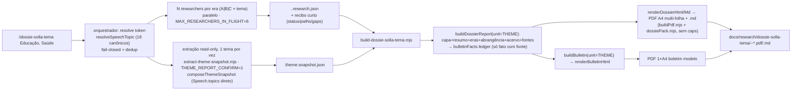

# Impl: Dossiê Solla por tema/área + Boletim modelo (skill → dossiê + boletim)

Status: aprovado
Atualizado em: 2026-09-18
Issue: #1143
Intenção: docs/plans/dossie-solla-tema.md
Appetite restante: ~2–3 dias eng (herdado)

> Aprovado no modo `--auto` (`/work-issue --issue 1143 --auto`): a pausa do GATE virou apresentação-no-chat. Literais e cortes do plano de intenção foram assumidos; **sem schema/migration/DB write**, sem Consent, sem URL pública e sem alterar `/dossie-solla-cidade` nem `/dossie-solla-instituicao` (generalização aditiva do dono, com as specs C186/C187 verdes).

## Leitura da intenção

- **Outcome:** `/dossie-solla-tema Educação` entrega, numa invocação, um par **PDF A4 datado + companion `.md`** (identificação da área — label `Educação` + valor canônico `educacao` + nota da taxonomia do acervo; seções por era A/B/C; tabelas **Objeto/Valor/Ano/Fase/Abrangência/Fonte**; painel de abrangência `área × segmento × rede`; **evidência direta do acervo por `Speech.topics`**; lacunas; fontes; defeso) **e** o **Boletim modelo** (1 página A4, linguagem de eleitor, ≤6 destaques + ≤14 "E mais", sem fontes, sem CTA, rótulo "Modelo — insumo interno"). Lote de 1+N; falha isolada não cancela o lote.
- **O que NÃO negociar:** token **na taxonomia fechada** dos 18 `SPEECH_TOPICS` (`src/lib/speechFacets.ts:14`), **fail-closed** — nunca slug inventado; eras A/B/C **reusadas** do C186 (sem eras novas); abrangência `area | segmento | rede` **nunca somada**; fases `autorizado|empenhado|liquidado|pago|restos` (default `nao_informado`, empenho ≠ pago); "sem fonte, não publica" + lacuna explícita (emenda/proposição por área **só com fonte**); acervo cobre **2011+** (pré-2011 = lacuna); PII mínima; leitura relativa (nunca % estadual absoluto); artefato **gitignored**; **sem schema/migration/DB write**; **sem truncamento mecânico/descarte silencioso** (regra C188 — lista capada declara "e mais N"); boletim herda **apenas** `bulletinFacts` (fato com fonte).
- **O que reavaliar (hipóteses da "Direção no codebase"):**
  - "só o render é binário" — verdade a confirmar: o **dispatch** é binário em 4 módulos (`dossieBlocks.mjs:222`, `dossieRender.mjs:813-827/1329-1330/2119-2127`, `dossieBulletinRender.mjs:372-376`); `isInstitutionUnit` tem 11 usos e o boletim (`dossieBulletin.mjs`) já é unit-aware.
  - "o ramo instituição é quase todo reutilizável" — verdade: a variante tema é **estruturalmente a mesma família** (abrangência 3-listas, eras correntes sem caps, carta/síntese/gráficos, acervo), então o certo é **generalizar a forma `subject`** em vez de geminar um terceiro branch (o gatilho do 3º recorte já estava registrado no simplify do C187).
  - "catálogo novo" — falso: o "catálogo" do tema já existe (`SPEECH_TOPICS`); falta **exportar** um resolver fail-closed do dono (`topicByKey` é privado, `speechFacets.ts:64`).
  - "guard de extração igual ao institucional" — a **receita** (`readOnlyExtract.mjs`) reusa, mas o **alvo/guard** é próprio (`THEME_REPORT_CONFIRM=1`); o compositor institucional é _institution-shaped_ (`matchNames`/`mentionExcerpt`, `institutionSnapshot.mjs:84-113`).
  - **Design (fonte de verdade do port — portar classe a classe):** dossiê `docs/plans/dossie-solla-tema-ui-design.html`, **14 cenas** (01 Capa e identificação da área; 02 A contribuição; 03 Resumo; 04 Síntese; 05 Gráficos; 06/07/08 Eras A/B/C; 09 Folha corrente/continuação; 10 Abrangência — lista completa; 11 Lacunas; 12 Notícias; 13 Acervo interno por tema; 14 Fontes/limites/defeso). Boletim `docs/plans/dossie-solla-tema-boletim-ui-design.html`, **2 cenas** (completo + variação de poucos fatos). O implementer **porta**, não redesenha.

## Abordagem recomendada

**Opções consideradas:** A) **descritor de unidade data-driven** + generalizar a forma `subject` (instituição e tema no mesmo dono) + registro por `unit.id`; B) terceiro branch `isThemeUnit` ao lado de `isInstitutionUnit` (relatório/render tema irmãos); C) o descritor carregar `buildReport`/`render` (função no dado).
**Recomendação:** **A** — a variante tema é a mesma forma da instituição (abrangência 3-listas, eras correntes, carta/síntese/gráficos/acervo); um **registro por id** substitui a cadeia de ternários e o descritor só ganha o vocabulário/copy que muda. Mantém **byte-idêntico** o caminho C186/C187 (mesmas funções, agora resolvidas por tabela) e escala para N recortes sem terceiro fork.
**Rejeitadas:** **B** — gemina o maior branch do pipeline (a drift que o repo proíbe; C187 já registrou a duplicação da mecânica com gatilho "3º unit/recorte"); **C** — função no descritor cria import circular (descritor em `dossieUnit.mjs`, builders em `dossieBlocks.mjs`) e transforma o dado em service locator.

### Componentes / mudanças

**Seam + resolução canônica (donos editados)**

- **`scripts/lib/dossieUnit.mjs`** — `THEME_UNIT` (`id:'theme'`, `slugField:'themeSlug'`, `shape:'subject'`, `spheres:['area','segmento','rede']`, `defaultSphere:'area'`, `sphereLabels`, `sphereBadgeClass` (`segmento→scope-sector`, `rede→scope-network`, `area→''`), `breadthRank`, `researchDir:'data/dossie-solla-tema'`, `series`, `title`, `bulletinTitle`, `bulletinMoreLimit`, `nounPlural:'temas'`, `subjectLabel:'Área'`); registro `DOSSIER_UNITS.theme` (`:63`); predicado `isSubjectUnit(unit)` (`shape === 'subject'`) — `isInstitutionUnit` permanece como alias fino (`id === 'institution'`) para não quebrar consumidores; `resolveDossierUnit` já fail-closed (`:74-82`).
- **`scripts/lib/dossieUnit.mjs` (descritor `subject`)** — campos que a forma genérica lê: `subjectName(snapshot)`, `identityBadges(snapshot)`, `scopeCopy`, `eraMethod`, `eraRecovery`, `reachCopy{ruleTitle,ruleBody}`, `coverageExtra`, `editorialSpheresLine`, `openingTitle(subjectName)`, `coverSubtitle`, `coverHowToUse`, `acervoNote`, `bulletinCopy`. `INSTITUTION_UNIT` recebe exatamente os literais de hoje (garante paridade); `THEME_UNIT` recebe os da família temática.
- **`src/lib/speechFacets.ts`** (editar o dono) — exportar `resolveSpeechTopic(token): SpeechTopic | null` (fecha sobre o `topicByKey`/`facetKey` já existentes), `speechTopicValues()` e `speechTopicLabel(value)`. Sem segundo mapa; o mesmo fold acento/caixa-insensível do parser do LLM.

**Pipeline generalizado (aditivo; C186/C187 verdes)**

- **`scripts/lib/dossieResearch.mjs`** — `THEME_RESEARCH_CHECKLIST` + `CHECKLIST_BY_UNIT.theme` (`:219`); nominal `era_a_formacao|era_a_sesab|era_a_consultor_ms|era_a_conquista|era_a_sas_ms|era_a_vinculo`; `era_b_sesab|era_b_politicas|era_b_investimentos|era_b_convenios|era_b_articulacao`; `era_c_discursos|era_c_proposicoes|era_c_relatorias|era_c_emendas|era_c_programas|era_c_audiencias|era_c_titulos`. Trocar o noun fixo do erro de merge (`:494`) por `unit.nounPlural` (`municípios|instituições|temas`).
- **`scripts/lib/dossieBlocks.mjs`** — generalizar `buildInstitutionReport` → `buildSubjectReport` (unit-driven): `directItems`/`scopeItem`/`speechFactsFromRows` usam `unit.defaultSphere`/`unit.spheres`; identidade/badges/`scopeCopy`/`eraMethod`/`reach`/`limits.coverage` vêm do descritor; `buildDossierReport` vira registro `{ municipality: buildMunicipalityReport, institution: buildSubjectReport, theme: buildSubjectReport }` (`:222`). `speechFactsFromRows(snapshot, sphere = default)` deixa de ter default `instituicao`.
- **`scripts/lib/dossieRender.mjs`** — generalizar `renderInstitutionDossierHtml/Md` → `renderSubjectDossierHtml/Md`; `unitHeader/unitFooter` (`:813-827`) passam a `isSubjectUnit(report.unit)`; `dossierPackAnchors` vira registro (`:1329`) com `THEME_PACK_ANCHORS` (`abrangencia-area|segmento|rede` → `scope:area|scope:segmento|scope:rede`); `INSTITUTION_SCOPE_WORDS` (`:1332`) sai do key do descritor. Reusa as classes já portadas (`.identity-badge`, `.scope-sector`, `.scope-network`, `.scope-cards`, `.more-note`, `.document-table`, etc.); o port das 14 cenas temáticas não introduz CSS novo além de copy.
- **`scripts/lib/dossieBulletin.mjs`** — sem mudança estrutural (já unit-aware: `breadthRank`/`bulletinMoreLimit`, `:51-68`).
- **`scripts/lib/dossieBulletinRender.mjs`** — generalizar `renderInstitutionBulletinHtml` → `renderSubjectBulletinHtml` (copy do descritor) e registrar `theme` (`:372-376`); mantém `defeso-band`, `identity-pill`, `lacuna-panel`, variação de poucos fatos.

**Extração read-only + builder (novos, reusando plumbing)**

- **`scripts/themeSnapshot.mjs`** (novo) — `composeThemeSnapshot({ payload, actor, value, label, taxonomyNote, readAt, codeSha, database })` → `{ meta:{kind:'theme'}, theme:{slug,value,label,taxonomyNote,topics:[value]}, speeches:{topics:[value],totalCount,rows}, gaps }`; reusa `buildSpeechListWhere({ page:1, topics:[value] })` (`speechListFilters.ts:38`) + `loadSegmentsForSpeeches`; projeta `summary`/links/ano/temas e **não** computa `matchNames`/`mentionExcerpt` (o recorte é a tag do acervo).
- **`scripts/extract-theme-snapshot.mjs`** (novo) — CLI `--theme=<valor|label> --out=<json>`; resolve com `resolveSpeechTopic` (fail-closed: desconhecido → lista os 18 canônicos, nunca slug inventado); `enterReadOnlySession({ confirmEnv:'THEME_REPORT_CONFIRM', … })`; serializado 1 tema por vez; escreve `data/dossie-solla-tema/<slug>.theme.snapshot.json`.
- **`scripts/build-dossie-solla-tema.mjs`** (novo) — CLI `--snapshot= --research-dir= --out-dir= [--generated-at=] --[--theme=]`; exige `snapshot.theme.slug`; lê `<slug>.{a,b,c}.research.json` (recusa slug divergente) e `<slug>.narrative.json` (opcional); **não** chama `fetchAuthorEmendas`/`fetchCamaraActivity`/`fetchHealthData`; `buildDossierReport({ …, unit: THEME_UNIT })` → dossiê + `buildBulletin({ facts, identity, unit: THEME_UNIT })`; `dossierPackAnchors(THEME_UNIT)`; HTML cache em `data/dossie-solla-tema/`; `.md` + dois PDFs via `buildPdf.mjs`/`dossiePack.mjs`; `DOSSIER_STRICT=1` falha em lacuna.

**Skill / command / subagentes**

- **`.agents/skills/dossie-solla-tema/SKILL.md`** (novo) — fonte canônica: `Lote`, `Áreas canônicas (taxonomia do acervo)`, `Pipeline (etapas)`, `Briefing por era (A/B/C)`, `Recibo do researcher`, `Recibo do redator`, `Contrato dos JSONs` (`themeSlug`, `sphere: area|segmento|rede`), `Conteúdo`, `Guardrails`, `Troubleshooting`, `Referências` (aponta os dois HTMLs hi-fi).
- **`.opencode/commands/dossie-solla-tema.md`** (novo) — frontmatter só `description:`; corpo carrega a skill pelo nome exato e termina em `$ARGUMENTS`.
- **`.opencode/agent/dossie-solla-tema.md`** + **`.opencode/agent/dossie-solla-tema-redacao.md`** (novos) — researcher por era / redator, espelhando C187; sem `ssh`/build/`--snapshot=`/`--theme=`/commit.

**Testes / CI / docs**

- Novos: `tests/unit/dossieTheme.unit.spec.ts`, `dossieThemeResearch.unit.spec.ts`, `dossieThemeBatchSkill.unit.spec.ts`, `tests/int/themeSnapshot.int.spec.ts`; spec do resolver em `tests/unit/speechFacets.unit.spec.ts` (estender).
- Editar: `tests/unit/opencodeCommands.unit.spec.ts` (`:13-21`, incluir `'dossie-solla-tema'`); `scripts/lib/test-affected-core.mjs` (`SCRIPTS_SPEC_PINNED` += `scripts/themeSnapshot.mjs`; `ciSkipInvariants` recalcula o closure até casar); `.gitignore` (`/data/dossie-solla-tema/`, `/docs/research/dossie-solla-tema/`); `docs/changelog/2026-09-18-c190.md`.
- **Manter verdes:** `dossie{Research,Blocks,Render,Bulletin}.unit.spec.ts`, `dossieInstitution*.unit.spec.ts`, `institutionCatalog.unit.spec.ts`, `speechFacets/speechListFilters/speechListUrl.unit.spec.ts` e o int institucional — provando o default aditivo.

### Dados → forma (pergunta 3 — data-presentation)

- **Dossiê — forma escolhida:** **tabela/lista com fonte por linha + badge de abrangência + badge de fase** (Objeto/Valor/Ano/Fase/Abrangência/Fonte; painel de abrangência com **3 listas e nenhum total combinado**; gráficos consolidados como no dono; **acervo por tema com universos/amostra declarados** — `Speech.topics = educacao` (2011+)). É a forma mais pobre que ainda desbloqueia a decisão (ângulo/entrega + o que falta). **Rejeitadas:** dashboard de área (perde a fonte item a item e convida a somar); gráfico de série entre áreas (não há série comparável); % estadual absoluto (anti-goal); painel territorial por município (território é o recorte do C186).
- **Boletim — forma escolhida:** **número destacado + rótulo curto** (≤6 `.highlight-card`) + **lista densa ✓** ("E mais", `bulletinMoreLimit`) + timeline; densidade > destaque grande. **Rejeitadas:** tabela/planilha (documento de gestor); parágrafo longo (estoura 1 página); fontes no boletim (vivem só no dossiê); CTA (defeso).

## Decisões de engenharia (A–G)

**A. Vocabulário de abrangência.** Opções: A) `area | segmento | rede` (default `area`); B) reusar `instituicao | setor | rede` do C187; C) só `area`. **Recomendação: A** — o render/blocks já resolvem esfera por descritor (`dossierSphereLabel/BadgeClass`, `scopeItem` vira `unit.spheres`); `area` é a política inteira, `segmento` o recorte interno (básica/superior/EJA), `rede` as entidades/escolas; preserva o guardrail "nunca somar" com vocabulário que não confunde com ente. **Rejeitadas:** B (uma "instituição" dentro do dossiê de área sugere atribuição de entidade — exatamente a confusão que o recorte evita; o hi-fi usa "Abrangência · área"); C (perde segmento/rede, que existem no material e no hi-fi).

**B. Generalização do dispatch e da forma.** Opções: A) registro por `unit.id` + generalizar a forma `subject` (instituição e tema no mesmo builder/renderer); B) terceiro branch tema irmão; C) descritor com funções `buildReport`/`render`. **Recomendação: A** — byte-parity C186/C187 (mesmas funções, agora resolvidas por tabela), sem terceiro fork do maior branch, honrando o gatilho do 3º recorte registrado no simplify do C187. **Rejeitadas:** B (twin da mecânica de `dossieBlocks`/`dossieRender`, drift garantido no próximo fix de pack/C188); C (import circular/TDZ e service locator).

**C. Onde vive a resolução do token.** Opções: A) exportar resolver do dono `src/lib/speechFacets.ts`; B) lib nova `src/lib/speechTopicCatalog.ts`; C) resolver na prosa da skill/script. **Recomendação: A** — `SPEECH_TOPICS`, `facetKey` e o `topicByKey` já vivem lá; exportar `resolveSpeechTopic` reusa o **mesmo** fold do parser do LLM (uma fonte de verdade para label↔valor). **Rejeitadas:** B (catálogo paralelo ao dono → drift); C (lógica de resolução não testável e duplicada em prompt).

**D. Composer e guard da extração read-only.** Opções: A) `scripts/themeSnapshot.mjs` + `extract-theme-snapshot.mjs` com `THEME_REPORT_CONFIRM=1`, reusando `readOnlyExtract.mjs`; B) parametrizar `composeInstitutionSnapshot`; C) reusar o extrator institucional com `--topics=`. **Recomendação: A** — a projeção do tema é diferente (sem `matchNames`/`mentionExcerpt`); a parte profunda (sessão read-only/ator/loaders) é reusada do dono, não geminada; guard próprio é o contrato de intenção explícita (o comando não adivinha o alvo). **Rejeitadas:** B (branch num compositor int-pinado por uma projeção que não compartilha o `institution` shape); C (o extrator institucional é institution-shaped e arrastaria `mentionExcerpt`/identidade de instituição para o dossiê temático).

**E. Escopo do recorte de dados em build.** Opções: A) sem APIs oficiais em build; checklist por era orientado a área; acervo por tema como **evidência de primeira classe**; emenda/proposição/relatoria só de item de pesquisa com fonte, senão lacuna; B) buscar Câmara por palavra-chave na ementa; C) reusar Portal/Câmara do C186. **Recomendação: A** — Portal não filtra por área e `fetchAuthorEmendas` exige município; match nominal/por tema é falso-positivo/omissão. O acervo (`Speech.topics`) é o recorte nativo e alimenta a seção de evidência e o ledger `bulletinFacts` (só fala com link). **Rejeitadas:** B/C (atribuição errada e "zero silencioso").

**F. Escape one-off.** Opções: A) **sem escape** — a taxonomia dos 18 temas é fechada; token desconhecido falha fechado com a lista canônica; B) espelhar `--slug=<x> --name="<Nome>"` do C187. **Recomendação: A** — o anti-goal é "inventar área/slug fora da taxonomia"; ao contrário do catálogo aberto de instituições, não existe "área desconhecida porém válida" (os labels são canônicos). **Rejeitada:** B (deixaria um slug inventado virar dossiê — contradiz outcome e recorte).

**G. Boletim por área.** Opções: A) generalizar `renderInstitutionBulletinHtml` → `renderSubjectBulletinHtml` (copy do descritor) e registrar `theme`; B) renderer tema separado. **Recomendação: A** — o delta é copy (pill `Área`/`educacao`, "pela <área>", rodapé "segmento e rede não são somados à área"); herança continua estrutural (`buildBulletin` só recebe `bulletinFacts`; ≤6 + `bulletinMoreLimit` "e mais"; sem fontes/CTA; `sparse`). **Rejeitada:** B (twin de ~130 linhas com delta de texto).

## Fases verificáveis (tracer bullet first)

1. **Tracer (seam + forma `subject` + resolução do token) — quota de meio dia.** `THEME_UNIT`/registro/`isSubjectUnit`; export do resolver em `speechFacets`; generalização de `dossieBlocks`/`dossieRender` para a forma `subject`; checklist tema em `dossieResearch`; um smoke de tema com snapshot/ pesquisa mínimos provando `buildDossierReport(unit=THEME)` → `renderDossierHtml/Md` e o `.md`. **Prova o encadeamento mais arriscado cedo** (paridade C187 + primeira composição temática) com as specs C186/C187 verdes.
2. **Pipeline agêntico + taxonomia.** `SKILL.md` + command + 2 subagentes; `dossieThemeBatchSkill.unit.spec.ts` (lote/resolução fail-closed/dedup/fan-out/sem escape/guarda); `opencodeCommands.unit.spec.ts` atualizado; `test-affected-core.mjs` atualizado; spec do resolver.
3. **Extração + builder.** `themeSnapshot.mjs`, `extract-theme-snapshot.mjs` (`THEME_REPORT_CONFIRM=1`), `build-dossie-solla-tema.mjs`; `tests/int/themeSnapshot.int.spec.ts`; decisão E exercida (sem emendas/Câmara/saúde em build; acervo alimenta evidência + ledger).
4. **Boletim + port visual + docs.** `renderSubjectBulletinHtml` tema (completo + variação de poucos fatos); port classe a classe das **14 cenas** do dossiê e das **2** do boletim; `.gitignore`; changelog `2026-09-18-c190.md`.
5. **Gates.** `pnpm gate:fast` (lint 0 warnings, `tsc --noEmit`, unit) → build local de **Educação** e de uma área de rótulo longo (ex.: Direitos Humanos) conferindo PDF/MD/boletim (aceite manual) → `pnpm push` (PR CI roda o resto). Sem e2e (não há runtime no app); `tests/int` só o snapshot novo.

## Rabbit holes / Não escopo (engenharia)

- Terceiro fork do pipeline (research/render/ledger/boletim) — twin proibido; tudo passa pelo dono + descritor registro.
- `INSTITUTION_SCOPE`/`institutionEraMethod`/copy hardcoded vazando para o tema; `sphere='instituicao'` default em `speechFactsFromRows`; noun fixo do `mergeDossierResearch`.
- Puxar emendas/Câmara/IBGE em build para "completar" a área; match por palavra-chave na ementa; tratar ausência como zero; somar segmento/rede à área.
- Catálogo/coleção Payload, schema/migration/DB write/segundo cadastro; UI in-app no `/campanha`; índice/PDF agregado de lote; fan-out das 18 áreas.
- Reabrir `/dossie-solla-cidade`/`/relatorio-cidade`/`/dossie-solla-instituicao` além da generalização aditiva; migrar o builder C163 para `buildPdf.mjs` agora.
- Reconstruir a carreira pré-2011 fora do acervo — vira **lacuna**, não invenção.
- Reabrir o design: os hi-fi estão prontos — só port; se faltar superfície, aciona-se o `designer` (não se redesenha na implementação).

## Riscos e mitigação

- **Regressão C186/C187 pela generalização:** mesmas funções resolvidas por tabela + descritor com os literais atuais; specs `dossie*`/`dossieInstitution*` no `gate:fast` são o oráculo; se a paridade falhar, a contingência é um `buildThemeReport` fino compondo os helpers já compartilhados (não geminar o branch inteiro).
- **`SCRIPTS_SPEC_PINNED` fora de sincronia:** `ciSkipInvariants` recalcula o closure e falha fechado; atualizar o mapa na mesma fase que cria `themeSnapshot.mjs`.
- **Recorte por tema impreciso (acervo):** o recorte é a tag `Speech.topics` (revisável na base); limite de amostra + "e mais N"; a skill declara "acervo cobre 2011+".
- **Token ambíguo/desconhecido:** valores e labels são únicos; o resolver do dono retorna `null` e o CLI/skill falham fechados com a lista canônica.
- **Fit/overflow de folha:** orçamentos explícitos + pack medido (`dossiePack` grow/shrink) + guarda A4 fail-closed; se estourar, aperta teto/copy — nunca espreme o layout nem corta texto.
- **PII/gitignore/fan-out:** projeção sem contato; artefatos gitignored; subagente proibido de commitar; `MAX_RESEARCHERS_IN_FLIGHT = 6`; extração serializada.
- **Appetite:** cortes embutidos — sem APIs em build (E), sem escape (F), sem agregado, sem casos especiais por área além do descritor.

## Aceite de engenharia

- [ ] Aceite de produto da intenção coberto: dossiê PDF A4 + `.md` (identificação da área label+valor canônico, eras A/B/C, abrangência `área×segmento×rede`, acervo por tema, lacunas, fontes, defeso) **e** boletim modelo 1×A4 (≤6 destaques + "E mais", sem fontes, sem CTA, rótulo "Modelo — insumo interno" + defeso, `NEEDS ASSET`).
- [ ] Taxonomia **fechada** fail-closed (18 canônicos) + dedup após resolução; **sem escape inventado**; eras A/B/C reusadas; abrangência `area|segmento|rede` **nunca somada**; fases por valor (empenho ≠ pago); "sem fonte, não publica"; acervo 2011+; PII mínima; artefato gitignored.
- [ ] Boletim herda **apenas** `bulletinFacts` (fato com fonte do dossiê); sem linha de fontes; sem CTA.
- [ ] Sem truncamento mecânico/descarte silencioso: lista capada declara "e mais N"; reformulação no `summary`.
- [ ] Generalização **aditiva** do dono; specs C186/C187 e int institucional verdes; `/dossie-solla-cidade` e `/dossie-solla-instituicao` sem mudança de comportamento; `buildPdf.mjs`/`dossiePack.mjs` seguem donos únicos do emit/paginação.
- [ ] **Sem schema, migration, Consent ou DB write**; extração read-only com `THEME_REPORT_CONFIRM=1`.
- [ ] `test-affected-core.mjs` sincronizado (closure exato) e `opencodeCommands.unit.spec.ts` com `dossie-solla-tema`; command/subagentes acoplados pelo nome exato.
- [ ] Unit novos verdes: `dossieTheme`, `dossieThemeResearch`, `dossieThemeBatchSkill` (+ resolver em `speechFacets`); int `themeSnapshot`; `.gitignore` + changelog; `pnpm gate:fast` verde; build local aceito em Educação + área de rótulo longo; `pnpm push`.

---

## Self-score decision-quality (gate ≥4/5)

1. **Decisões caras têm rejeitadas?** Sim — A–G com Opções/Recomendação/Rejeitadas explícitas (vocabulário, dispatch/forma, resolução do token, composer/guard, escopo de dados, escape, boletim). — **5/5**
2. **Abordagem cabe no appetite (2–3 dias)?** Sim — reuso máximo do dono C186/C187, sem schema/DB, cortes declarados (sem APIs em build, sem escape, sem agregado, sem e2e). — **4/5** (a generalização da forma `subject` é o trecho que mais consome quota; por isso o tracer cedo e o oráculo C187).
3. **Rabbit holes nomeados?** Sim — terceiro fork, copy hardcoded, APIs de área, match por palavra-chave, zero silencioso, catálogo/coleção, UI in-app, agregado, pré-2011 inventado, redesign. — **5/5**
4. **Depth check: reusa shells/helpers existentes?** Sim — `dossieUnit/Research/Blocks/Render/Bulletin/BulletinRender/Pack`, `buildPdf`, `readOnlyExtract`, `cityReportFormat`, `reportText`, `cli`, `buildSpeechListWhere`/`loadSegmentsForSpeeches`, `SPEECH_TOPICS` como catálogo; sem helper pass-through novo. — **4/5** (a generalização toca módulos em uso; mitigada por descritor com literais atuais + specs).
5. **Intenção (aceite de produto) permanece satisfeita?** Sim — os dois artefatos, a taxonomia fail-closed, os literais (1 página, ≤6/≤14, sem fontes, rótulo de modelo, abrangência não somável), o acervo como evidência de primeira classe e a regra C188 estão no aceite; a engenharia não reescreveu o outcome. — **5/5**

**Total 23/25 (média 4,6/5) — passa o gate ≥4/5.**

---

## Débitos capturados (triage pós-execute — C190)

Triage do simplify (2 revisores) + crítica do `designer`, via regras de
`capture-review-debts`. Nada aqui bloqueia a entrega certificada.

| #   | Achado                                                                                                                                                                    | Score | Tipo          | Destino                                                                                                                                     |
| --- | ------------------------------------------------------------------------------------------------------------------------------------------------------------------------- | ----- | ------------- | ------------------------------------------------------------------------------------------------------------------------------------------- |
| 1   | `scripts/build-dossie-solla-tema.mjs` é ~85% clone do builder institucional (3º clone do CLI); `extract-theme-snapshot.mjs` idem                                          | 3     | cheap_polish  | **defer** — lote `escala-dry-pos-c190` (runner único parametrizado por unit); gatilho: 4º recorte ou próxima edição simultânea dos builders |
| 2   | `SPEECH_SELECT`/limite/projeção base triplicados entre `themeSnapshot`/`institutionSnapshot`/`cityReportSnapshot` (drift real: typo `excerptTMS` corrigido nesta entrega) | 3     | cheap_polish  | **defer** — mesmo lote (helper base + delta por unit)                                                                                       |
| 3   | Copy institucional vaza para o município (`MUNICIPALITY_UNIT.synthesisSumGuard`, arias "institucional" nas páginas compartilhadas)                                        | 3     | cheap_polish  | **descartar** do escopo C190 (pré-existente C186 sob byte-parity congelada); vira bug separado se o produto pedir                           |
| 4   | Pureza no seam: `scopeListWords` redundante com `scopeLists[].sphere`; regex de era duplicado; condição dupla no ramo de dinheiro                                         | 2     | cheap_polish  | **absorver** no lote acima (F3)                                                                                                             |
| 5   | `dossieThemeBatchSkill.unit.spec.ts` é clone do spec institucional                                                                                                        | 2     | cheap_polish  | **absorver** (`describe.each`) no lote                                                                                                      |
| 6   | Assert vacuoso herdado em `dossieTheme.unit.spec.ts` (`omitted >= 0`)                                                                                                     | 2     | cheap_polish  | **absorver** no lote                                                                                                                        |
| 7   | Sincronização dos artefatos hi-fi do C190 (tabelas 10,5pt; cenas medidas de continuidade 15+16+10 e 16+16+9)                                                              | 2     | cheap_polish  | **absorver** — passo do artefato (designer), sem Issue; confirmação humana registrada no PR                                                 |
| 8   | Sem e2e (scripts/artefatos sem runtime no app)                                                                                                                            | 1     | defer_trigger | **descartar** — já declarado no impl; reavaliar se o pipeline ganhar rota/UI                                                                |

**Registro:** o lote `escala-dry-pos-c190` (itens 1, 2, 4, 5, 6) fica como
trabalho deferido deste plano, com gatilho explícito — sem Issue nova nesta
entrega para não editar/duplicar o tracker `in-progress`.
