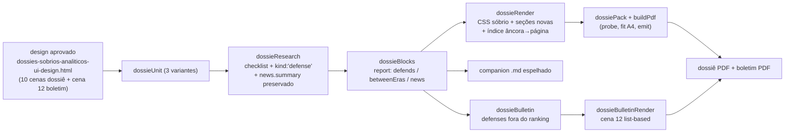

# Impl: Dossiês e boletins Solla sóbrios e analíticos — listas, análise (o que fez × o que defende) e consulta rápida (cidade · instituição · tema)

Status: **aprovado** — modo --auto
Atualizado em: 2026-09-22
Issue: #1251
Intenção: docs/plans/dossies-sobrios-analiticos.md
Appetite restante: **~4–5 dias eng** (herdado). Se estourar, corta-se o número de página no índice (vira nome de seção, precedente C163) e o `betweenEras` autoral; **nunca** o "defende" com lastro, a remoção de gráficos/cartões/selos, a guarda A4 nem os guardrails de produto.

## Leitura da intenção

- **Outcome:** as três variantes de dossiê (cidade/instituição/tema) e o boletim modelo relidos como documento sóbrio, list-based e analítico — "O essencial" abre (fez + defende + destaques + lacunas), cada era mantém anatomia constante, o "O que Solla defende" nasce com lastro (ato/notícia datada/trecho do acervo) e o índice+âncoras dão consulta rápida; nada some e os guardrails seguem intactos.
- **O que NÃO negociar:** sem fonte não publica; fase por valor (autorizado ≠ empenhado ≠ liquidado ≠ pago); esfera/abrangência explícita e nunca somada; leitura relativa (nunca % estadual); atribuição de emenda só com autoria checada; PII mínima; artefato gitignored; defeso (insumo interno/modelo, sem CTA); sem marca de campanha, sem imagens nem placeholders de imagem; boletim 1 página A4 com rótulo "Modelo — insumo interno". Outcome de produto inviolável.
- **O que reavaliar (hipóteses da intenção):**
  - "O dossiê precisa de índice com página" — o paginador de 2 passadas (`dossieRender.mjs:535-540`, `:1990-1995`) já conhece a página de cada folha na 2ª passada; o mapa âncora→página é colhido sem reescrever o paginador (Decisão A).
  - "'O que defende' reusa a pesquisa existente" — confirmado: item de checklist com `sourceUrl`+`sourceDate` obrigatórios já é o contrato de lastro (`dossieResearch.mjs:478-485`); falta só discriminar `kind: 'defense'` (MUDANÇA) e preservar `news.summary`, hoje normalizado e descartado (`dossieResearch.mjs:554` → `dossieBlocks.mjs:503-508`/`:1140-1145`).
  - "'Gráficos consolidados' morre" — confirmado no render; `chartPrimitives.mjs` **não** morre (consumidor Instagram em `graficosInstagramRender.mjs:18`).
  - O guard do emit exige `[data-page="resumo"]` (`buildPdf.mjs:242-246`): a folha "O essencial" mantém a âncora `resumo` e só muda título/conteúdo.

## Abordagem recomendada

**Opções consideradas:** A) port classe-a-classe do design aprovado sobre a engine existente, editando os donos (`dossie*`, builders, SKILLs) | B) renderer v2 em paralelo (fork com feature flag) | C) uma linguagem por variante (3 redesenhos).
**Recomendação: A** — o design é a restrição aprovada ("portar classe a classe, sem redesenhar") e a engine já é multiplexada por `unit` (`dossieUnit.mjs:440-451`); editar o dono mantém pack/fit/emit e não twina spec.
**Rejeitadas:** B porque duplica render/CSS/specs e deixaria dois caminhos de paginação para manter; C porque a intenção pede **um** desenho para a família e triplicaria a atualização de specs/skills.

### Componentes / mudanças

- **`scripts/lib/dossieResearch.mjs`** — checklists por era × variante (`:30-335`) ganham itens de posições/defesas com `kind: 'defense'` (MUDANÇA explícita); normalizer (`:422`) propaga `kind` ao item (`:497-515`); `news.summary` continua normalizado (`:554`) e passa a ser preservado no merge/report. Nenhum schema novo de arquivo.
- **`scripts/lib/dossieBlocks.mjs`** — `report.defends` (defesas com lastro, por variante), `report.news[].summary`, `bulletinFacts[].defense` (MUDANÇA); `buildDossierSynthesis` (`:641`) alimenta a leitura entre eras; `bulletinFacts` cidade `:383-427` e subject `:1049-1083`.
- **`scripts/lib/dossieRender.mjs`** — novo `DOSSIER_PRINT_CSS` sóbrio (substitui `PRINT_CSS :358-484`/`INSTITUTION_PRINT_CSS :732-761`); folhas novas/reescritas: capa, `resumo` = O essencial + índice, `sintese` = Leitura entre eras, `trajetoria` em tabela, eras (leitura + tabela + lista "O que fez"), `defende` (nova), região, lacunas, notícias/acervo/fontes; mapa `anchorPages` colhido na 1ª passada (`:487-533`, `:1950-1988`); MD espelhado (`:585`, `:2053`) com sumário.
- **`scripts/lib/dossieBulletin.mjs` / `dossieBulletinRender.mjs`** — `buildBulletin` (`:42`) separa `defenses` (≤2) do ranking `:18-29`/caps `:13-14`; render da cena 12 (`:118-213` município, `:245-390` subject) list-based, sem `asset-box`/card.
- **`scripts/lib/buildPdf.mjs`** — sem mudança no contrato; os 3 builders alinham `onDossierOverflow`/`onBulletinOverflow` (`emitHtmlPairPdf :224`).
- **Builders** — `build-dossie-solla-cidade.mjs`, `-instituicao.mjs`, `-tema.mjs`: callbacks de fit nos três (hoje só cidade tem dossier-overflow `:289-293` e só tema tem bulletin-shrink `:239-245`).
- **`.agents/skills/dossie-solla-{cidade,instituicao,tema}/SKILL.md`** — "Conteúdo do dossiê" (`cidade:269`, `instituicao:248`, `tema:266`) e "Conteúdo do Boletim modelo" (`:311`/`:291`/`:310`) reescritos; contrato JSON com os ids de defesa.
- **`.opencode/agent/dossie-solla-{cidade,instituicao,tema}-redacao.md`** — `narrative.json` ganha `betweenEras` (MUDANÇA, opcional, fallback determinístico); regras do defende (não é opinião; só registro).
- **Migration:** sem migration — escopo `scripts/` + skills/agentes/specs; nada em `src/`, sem banco.
- **Access / Consent:** não toca. Nenhum write path, nenhum PII novo.
- **UI:** Impeccable C (redesenho de superfície existente) — shape→craft→critique→polish já feitos no gate; o impl **porta o design** e usa os specs de render como prova; o artefato do designer é imutável como registro (mudança material volta ao humano no PR).

### Dados → forma (se aplicável)

- **Forma:** listas e tabelas (`.plain-list`, `.index-list`, `.document-table`, `.action-list`, `.position-list`, boletim `.bulletin-list`/`.period-list`) + prosa curta; **sem** gráficos, cartões ou selos coloridos; fase e esfera/abrangência como texto/coluna; números sempre na tabela/prosa com fonte e data.
- **Por quê:** é a forma aprovada no gate e a que sustenta "leitura antes do inventário" com rastreio item a item; a leitura relativa/local se mantém (contagens por recorte, nunca soma entre esferas).
- **Rejeitadas:** gráficos (rejeitado pelo humano; devolveria o inventário visual), cartões lado a lado e selos (idem), e derivar visual novo além do design (decisão do designer, não da engine).

## Decisões de engenharia

### A) Índice + âncoras no PDF

**Opções:** A) mapa âncora→página colhido na 2ª passada do renderer + índice com número de página real | B) índice textual sem página (precedente C163 `cityReportRender.mjs:361,411`) | C) outline/bookmarks do PDF (`page.pdf({ outline })`).

**Recomendação: A** — o design (cena 02, `ui-design.html:798-910`) mostra o índice com número de página (`index-number`/`index-page`) e o rodapé corrente com a âncora do companion (`#o-essencial`, `:902-908`); a 2ª passada já percorre as partes em ordem com `nextPage()` (`dossieRender.mjs:487-533`/`:1950-1988`), então basta registrar `anchorPages[data-page] = pageNo` na 1ª passada e renderizar o índice na 2ª. Seções omitidas (era vazia) aparecem com o texto do design ("sem evidência nominal suficiente; consulte as lacunas", cena 04 `:1118-1122`), nunca com número inventado.

**Rejeitadas:** B porque o design aprovado e a intenção ("consulta rápida", linha 42) pedem a página, e o custo de A é local; C porque outline não aparece no documento impresso, não controla o layout e não espelha no `.md` — fica fora (não é o mecanismo de consulta).
**Corte declarado:** se estourar o fit da folha `resumo` ou a quota, cai-se para B (índice só com nome de seção) e o rodapé `#âncora` fica de fora; o índice por seção permanece.

### B) "O que defende" — origem do dado

**Opções:** A) item de checklist novo por era (`era_X_defesas`, `kind: 'defense'`) reusando o contrato item→research→report | B) seção nova `defenses[]` no `research.json` com validação própria | C) derivar de `news.summary` + acervo sem campo novo.

**Recomendação: A** — é o mesmo arquivo e o mesmo pipeline (sem segundo pipeline de pesquisa): o item já exige `answer` + `sourceUrl` + `sourceDate` (`dossieResearch.mjs:471-485`), vira gap fail-closed sem fonte, e o `brief` reformulado (≤80/≤120, `:26-27`) garante o fit. O contrato do item de defesa fica: `answer` = frase da posição ("Defende X"), `details` = lastro identificado (ato/proposição, ou "Notícia: veículo · data", ou trecho de fala), `sourceUrl`/`sourceDate` = fonte do lastro, `area` do checklist = rótulo da posição (ex. "Ensino superior", "Saúde regional"). O report segrega por `item.kind === 'defense'` e publica `report.defends`; `news.summary` é **preservado** (corrige a perda `dossieBlocks.mjs:503-508`/`:1140-1145`) para a redação citar o lastro datado. Sem item pesquisado ou sem fonte → gap com label ("Posições e defesas"), e a seção imprime "Sem registro localizado" com a regra "resultado de busca não prova ausência" (cena 11 `:1903-1918`) — nunca uma defesa inferida.

**Rejeitadas:** B porque twina normalizer/receipt/merge para ganho nulo (o item já carrega fonte e data) e amplia a superfície dos specs; C porque posição derivada de keyword/LLM é inferência — anti-goal explícito ("não atribuir a Solla uma defesa que não tem registro", intenção linha 21).

### C) Boletim defende

**Opções:** A) `bulletinFacts` marca `defense: true`; `buildBulletin` separa `defenses` (≤2) do ranking e dos caps de 6+14; render imprime o bloco no lugar dos cards | B) reusar 1–2 destaques existentes como "defesas" | C) o redator escreve as defesas do boletim.

**Recomendação: A** — o ledger continua sendo o único insumo (`dossieBulletin.mjs:1-6`), os fatos de defesa já têm `sourceUrl` (exigido no research) e o bloco é **sem linha de fonte e sem CTA**, como as demais linhas (specs pinam `not.toContain('source-link')`, `dossieInstitution.unit.spec.ts:396`, `dossieTheme.unit.spec.ts:490`). As defesas ficam **fora** do ranking (`:18-29`) e não deslocam fatos de "fez"; entram na contagem `factsPrinted`/`factsRemaining` (`:103-109`) para o "e mais N" não mentir. Bloco vazio (nenhuma defesa com lastro) = bloco omitido, nunca inventado. Shrink: `onBulletinOverflow` passa a existir nos 3 builders; a primeira redução tira destaques e, se ainda estourar, tira a 2ª defesa — sempre contabilizada.

**Rejeitadas:** B porque confunde "fez" com "defende" (a dimensão nova é o ponto do item) e não tem lastro próprio no card; C porque vira opinião editorial sem registro — anti-goal.

### D) Carta/resumo/anatomia — mapeamento design → código

| Design (cena)                                | Hoje                                                                                 | Decisão                                                                                                                                                                                                                                                            |
| -------------------------------------------- | ------------------------------------------------------------------------------------ | ------------------------------------------------------------------------------------------------------------------------------------------------------------------------------------------------------------------------------------------------------------------ |
| 01 Capa (`:743-795`)                         | `renderCover:116` / `renderSubjectCover:920`                                         | portar classes; **morre** o `assetBox` "NEEDS ASSET" (`:141`, `:952`) e o painel de imagem                                                                                                                                                                         |
| 02 O essencial + índice (`:797-910`)         | `renderSummary:238` / `renderSubjectSummary:1056` (deliveries+hooks+pending capados) | vira **O essencial**: lede (redação) + fatos-chave (contagens/valores/lacunas) + índice; as listas capadas saem da impressão (o ledger do boletim continua); âncora `data-page="resumo"` **mantida** (guard do emit)                                               |
| 03 Leitura entre eras (`:912-1017`)          | `renderUnitSynthesisPage:1781` (Síntese)                                             | vira **Leitura entre eras** (âncora `sintese` mantida): bullets de concentração/instrumentos/continuidade/ruptura/lacunas + "Síntese operacional" em tabela + callout; a tabela "Recursos por fase" (`:1815-1834`) permanece (número com fase, sem gráfico)        |
| 04 Trajetória completa (`:1019-1129`)        | `renderTrajectory:162` + `timelineGrid:83` (grid)                                    | vira **tabela** Período/Papel/Como recuperar (com incertezas na própria linha)                                                                                                                                                                                     |
| 05 Era (`:1131-1253`)                        | `renderEraSheet:1188`                                                                | anatomia constante: leitura (`era-summary`/narrative) + tabela Objeto/Valor/Ano/Fase/Esfera\|Abrangência/Fonte + lista "O que fez · item — alcance — lastro" (`action-list`); **morrem** os cards (`action-grid :1202-1206`) e os selos (`scope`/`phase :400-402`) |
| 06 Região/polo (`:1255-1369`)                | `renderRegion:248` + listas `:318`                                                   | mesmo fluxo (duas listas separadas, "não somar"), sem `scope-compare` decorativo                                                                                                                                                                                   |
| 07 Lacunas (`:1371-1455`)                    | `renderGapSheet:1536`                                                                | mantém tabela + "continuação N"                                                                                                                                                                                                                                    |
| 08 Notícias/acervo/fontes (`:1457-1597`)     | `renderNewsSheet:1601`, `renderAcervoSheet:1657`, `renderUnitSourcesPage:1724`       | mantém as seções correntes; notícias ganham a coluna "Uso" (Era, dado real `news.era`) e o acervo perde o `acervo-stat-grid:1671-1682` (números viram texto/meta)                                                                                                  |
| 09/10 Deltas instituição/tema (`:1599-1848`) | `renderSubjectScope:1270` (`scope-cards`), `renderSubjectHonorSheet:1436`            | abrangência vira **tabela** (morrem `scope-cards :1290-1309`); honrarias/títulos em tabela + identificação em `document-table` (morre `identity-badge :734-738`)                                                                                                   |
| 11 O que Solla defende (`:1850-1933`)        | **não existe**                                                                       | seção nova (`data-page="defende"`, `#o-que-solla-defende` no MD): lede + `position-list` (label/leitura/fonte+data) + callout "Como usar"                                                                                                                          |
| 12 Boletim (`:1935-2051`)                    | `dossieBulletinRender` cards                                                         | list-based: destaques (`bulletin-list`) + defesas (`bulletin-defense-list`) + trajetória 4 períodos (`period-list`) + "E mais" (`plain-list`) + rodapé defeso                                                                                                      |

**"Defende" por era?** Não — o design aprovado materializa a seção própria (cena 11) e o essencial a aponta; cada era mantém leitura + tabela + "O que fez". A questão em aberto da intenção (recomendação A, "seção própria indexável") fica confirmada pelo design.
**"O que morre":** Gráficos consolidados (`renderUnitChartsPage:1838-1923`, chamadas `:501`/`:1963`, imports `:8-14`, CSS `:464-470`), cards (`action-grid`), `scope-cards`, `acervo-stat-grid`, selos `scope`/`phase`, `identity-badge`, `asset-box`/NEEDS ASSET e o placeholder de imagem. O `placeholder-bar` de **valor ausente** (`:70-73`) permanece (é dado, não imagem); a célula sem valor pode seguir a nota do design ("Não localizado ≠ zero", cena 05 `:1207-1210`).

### E) CSS

**Opções:** A) um bloco sóbrio novo compartilhado pelas 3 variantes + boletim (substitui `PRINT_CSS`/`INSTITUTION_PRINT_CSS`) | B) manter `PRINT_CSS` e sobrepor um "sober" por cima | C) CSS por variante.

**Recomendação: A** — o design tem um sistema único (tokens `--ink/--accent/--line/--paper`, `ui-design.html:9-30`) e o delta instituição/tema hoje já é pequeno (`INSTITUTION_PRINT_CSS:732-761` é só `PRINT_CSS` + extensões); a substituição encolhe o CSS (morrem `.chart-*`, `.action-grid`, `.scope-cards`, `.highlight-*`, `.asset-box`) e evita duas linguagens. Sem marca de campanha, sem imagens; boletim reescrito no mesmo sistema (cena 12), com bloco próprio porque o layout A4 de 1 página difere do dossiê.
**Rejeitadas:** B porque conviveriam dois estilos e o "sober" venceria por cascata imprevisível; C porque racha a família (anti-goal do design).

### F) Specs / skills / redação

**Opções:** A) atualizar os specs para o **novo** contrato e reescrever as seções das SKILLs/agentes no mesmo PR | B) manter os asserts antigos e adaptar o render para continuar passando | C) deixar specs/skills para depois.

**Recomendação: A** — `dossieRender.unit.spec.ts:94-108,130-132,179-183,215-256`, `dossieInstitution.unit.spec.ts:235-254,256-277,327-346,387-410`, `dossieTheme.unit.spec.ts:247-268,315-335,429-562`, `dossieBlocks.unit.spec.ts:100-263`, `dossieBulletin.unit.spec.ts:23-81` e os 3 specs de lote (`dossieBatchSkill.unit.spec.ts:101-136` e irmãos, que exigem "A contribuição (carta)", "**Síntese**", "Gráficos consolidados") passam a pinar: âncoras preservadas + `defende`; ausência de `graficos`/`chart-grid`/`action-grid`/`scope-cards`/`asset-box`; presença de `index-list`/`document-table`/`position-list`/`bulletin-defense-list`. Nunca afrouxar um assert para "passar". As 3 SKILLs: reescrever "Conteúdo do dossiê"/"Conteúdo do Boletim modelo", o "Contrato dos JSONs" (ids novos de defesa) e o troubleshooting que cita síntese/gráficos (`cidade:281-294`, `:346-355`); os 3 agentes de redação ganham o contrato `betweenEras` e as regras do defende. **C210** toca as mesmas SKILLs (`briefing-capacitacao-solla.md:57`): C209 reescreve conteúdo, C210 adiciona o ponteiro — rebase esperado, sem bloqueio.

**Rejeitadas:** B porque inverteria o dono (o spec passaria a ditar layout morto) e travaria o redesign; C porque deixaria o CI verde mentindo e a skill ensinando o layout antigo.

## Fases verificáveis

1. **Tracer — contrato do defende + `news.summary` ponta a ponta (quota ~1,0 dia).** Checklist `*_defesas` nas 3 variantes com `kind: 'defense'` (`dossieResearch.mjs:30-335`); normalizer propaga `kind` (`:497-515`); `buildDossierReport` publica `report.defends` e `bulletinFacts[].defense`; `news.summary` preservado (`dossieBlocks.mjs:503-508`, `:1140-1145`); uma superfície real: seção `defende` no **companion `.md`** + render mínimo no HTML. **Prova:** units de research (item vira defesa; sem fonte vira gap) + blocks (defends + ledger) + render (seção existe, lacuna aparece).
2. **Dossiê sóbrio — PDF/MD nas 3 variantes (quota ~1,5 dia).** `DOSSIER_PRINT_CSS` novo + folhas do mapeamento D (O essencial, leitura entre eras, trajetória em tabela, eras, defende, região/lacunas/notícias/acervo/fontes), remoção de gráficos/cartões/selos/assets; atualizar os specs de render das 3 variantes. **Prova:** `pnpm test:unit` + build local (snapshot/research existentes de Miguel Calmon; uma instituição e um tema) com guarda A4 verde e inspeção do PDF/MD; nenhuma ocorrência de `chart-grid`/`action-grid`/`scope-cards`/`NEEDS ASSET` no HTML.
3. **Índice + consulta rápida (quota ~0,5 dia).** `anchorPages` na 1ª passada, índice na folha `resumo` (cena 02) e sumário/âncoras no `.md`; era omitida marcada como no design. **Prova:** unit pinando o mapa (`resumo`=2, `trajetoria`=3/4, `era-c`=N) e build real conferindo número×folha no PDF.
4. **Boletim sóbrio + defende + fit (quota ~1,0 dia).** Cena 12 list-based nos 2 renders; `defenses` no `buildBulletin`; `onBulletinOverflow` nos 3 builders + `onDossierOverflow` alinhado; specs do boletim. **Prova:** unit (defesas fora dos caps/ranking, contagem fecha, sparse sem enchimento) + fixture com 2 defesas cabendo em 1 A4.
5. **Skills, redação e gates (quota ~1,0 dia).** 3 SKILLs + 3 agentes (`betweenEras`) + 3 specs de lote + `docs/changelog/2026-09-22-c209.md`; `pnpm gate:fast`; push por `pnpm push`.

**Rabbit hole declarado dentro do tracer:** se `report.defends` exigir mais que `kind` + `area` (ex. vínculo automático defesa×notícia por URL), para na derivação e deixa o vínculo textual no `details` — sem matching especulativo.

## Rabbit holes / Não escopo (engenharia)

- **Reescrever o paginador/emit** para "fazer TOC de verdade" (blocks de página, outline PDF): corte — o mapa da 2ª passada basta; `buildPdf.mjs:200-206` fica sem `outline`.
- **Fork de renderer por variante** ou renderer v2 com feature flag.
- **Gráfico novo / voltar chart** — `chartPrimitives.mjs` só permanece para `graficosInstagramRender.mjs:18`; nenhum consumo novo no dossiê.
- **Inferir defesa por keyword** de notícia ou de acervo (LLM palpite): posição só entra como item de pesquisa com fonte.
- **Migrar `research.json` antigos** (data/ gitignored): sem itens de defesa eles viram lacuna explícita; nenhuma migração/`--force`.
- **Tocar `src/`** (acervo/`Speech`, schema, migration), URL pública, kit de marca, C210 (briefing) e C163 (relatório de cidade).
- **Auditoria de design por variante:** um port, um artefato; sem hi-fi novo.

## Riscos e mitigação

- **Fit A4 com mais seções (índice + defende + leitura entre eras):** índice compacto (7–9 linhas) na folha `resumo`; guarda `assertPageFits` segue fail-closed (`buildPdf.mjs:191`); callbacks `onDossierOverflow`/`onBulletinOverflow` nos 3 builders; o corte é de copy/índice, nunca do layout.
- **Perda de informação ao remover gráficos:** os números permanecem em tabela/prosa (`moneyByPhase`, contagens por era/esfera nas eras e na leitura entre eras); spec novo pina que os valores não evaporam.
- **"Defende" virar opinião editorial:** `kind:'defense'` + `sourceUrl`/`sourceDate` obrigatórios (fail-closed no normalizer) + auditoria de redação por citação (a skill já a descreve); sem registro, lacuna explícita.
- **Boletim estourar 1 página com o bloco novo:** defesas ≤2, `brief` curto, shrink determinístico e contagem `factsRemaining` honesta.
- **CI vermelho por specs antigos:** atualização dos specs no mesmo PR (Decisão F); proibido afrouxar asserção para passar.
- **Conflito com C210 nas SKILLs/specs de lote:** rebase com as duas mudanças (conteúdo C209 + ponteiro C210); ordem de merge pela prioridade.
- **Deriva do design:** o artefato aprovado é fonte de verdade do port; divergência material volta ao humano antes de improvisar.

## Aceite de engenharia

- [ ] Aceite de produto da intenção coberto: 3 variantes + boletim sóbrios/list-based; "O essencial"; leitura entre eras; "O que Solla defende" com lastro; índice+âncoras; nada some; sem gráficos/cartões/selos/imagens; boletim 1 página sem CTA/fonte visível com bloco defende.
- [ ] Invariantes AGENTS/engineering-standards: sem `src/`, sem schema/migration/URL, artefato gitignored, defeso, sem marca de campanha, edita o dono (sem twin de engine/pipeline).
- [ ] Testes de domínio previstos (unit): research (defesa/lacuna), blocks (`defends`, `news.summary`, contagens), render das 3 variantes (âncoras, índice, ausência dos artefatos mortos, MD espelhado), boletim (defesas fora dos caps, sparse, contagem) e skills de lote (novo contrato); gates `pnpm gate:fast` verdes.
- [ ] Guarda A4 fail-closed preservada em dossiê e boletim; nenhum "…" e nenhum descarte silencioso.

## Débitos triados pós-simplify (não reabrir)

Triagem de `capture-review-debts` (2026-09-22, modo autônomo do `--auto`):

- **Registrado:** Issue **#1265** (`C209-DRY`, `depends: [1251]`, plano
  `docs/plans/escala-dry-pos-c209.md`) — F1 orquestração compartilhada dos 3 builders
  (loop probe→pack→measure→emit), F2 par `layout:'card'` morto no packer, F3 séries
  mortas da síntese (`byYear`/`acervoByYear`/`moneyByYear`/`moneyProposals`).
- **Adiado com gatilho:** copy do boletim-município hardcoded no render (gatilho: a copy
  mudar 2× ou surgir um 4º shape de boletim); builders instituição/tema sem `resumoOnly`
  (gatilho: overflow não-resumo neles ou C189 tocar os builders).
- **Descartado:** `BULLETIN_MORE_LIMIT` (fallback defensivo), mutação de
  `report.meta.pageTotal` (decisão travada do paginador), `factsPrintable` (contrato pinado),
  reconstrução 2× do documento (Decisão A).

## Critérios de aceite visual (crítica do designer, trigger c)

Certificado pelo `designer` (tier primário) em 2026-09-22 com ajustes residuais aplicados
(célula "Tema canônico" sem token concatenado). `Design tier: designer` registrado no PR.

## Self-score (0–5, gate ≥4)

| Critério                           | Nota | Justificativa                                                                                                                                                                       |
| ---------------------------------- | ---- | ----------------------------------------------------------------------------------------------------------------------------------------------------------------------------------- |
| Decisões caras com rejeitadas      | 5    | A–F deliberam índice/defende/boletim/anatomia/CSS/specs com opções e rejeitadas nomeadas; o guarda-chuva (port vs fork) também.                                                     |
| Cabe no appetite (~4–5 dias)       | 4    | 5 fases somam ~5 dias; cortes declarados (página no índice, `betweenEras`) e tracer cedo; o custo maior é o port do dossiê nas 3 variantes + o contrato do defende.                 |
| Rabbit holes nomeados              | 5    | Paginador/outline, fork por variante, gráfico novo, inferência de defesa, migração de research e C210 fora.                                                                         |
| Depth check (reusa shells/helpers) | 5    | Reusa `dossieUnit` (seam por variante), normalizer/checklist, pack/medição/emit e o ledger do boletim; não cria módulo pass-through; `chartPrimitives` preservado para o Instagram. |
| Intenção permanece satisfeita      | 5    | O outcome de produto não foi reescrito; a engenharia só escolheu forma (mapa de páginas, `kind:'defense'`, bloco do boletim, CSS único).                                            |

**Total 24/25 (média 4,8/5) — passa o gate ≥4/5.**
