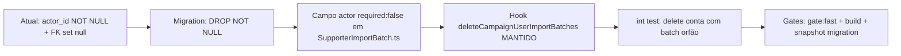

# Impl: Alinhar schema de `supporter_import_batch.actor_id` (NOT NULL ↔ ON DELETE set null)

Status: aprovado
Atualizado em: 2026-08-24
Issue: #643
Intenção: docs/plans/drift-c6-supporter-import-batch-actor.md
Appetite restante: herdado — correção de drift de schema pequena, sem novo comportamento de produto.

## Leitura da intenção

- **Outcome:** O schema de `supporter_import_batch` deixa de ser contraditório: `actor_id` passa a ser compatível com a FK `ON DELETE set null` existente, sem reintroduzir o erro de runtime que C111 já contornou no app.
- **O que NÃO negociar:** Fail-closed em LGPD/consent (não afetado); contratos de URL pública (não afetado); o padrão repo de cleanup via hook (não via cascade de schema) para relações de `CampaignUser`.
- **O que reavaliar:** Se o hook `deleteCampaignUserImportBatches` torna-se redundante após a mudança — reavaliado e mantido por higiene de dados (ver Abordagem).

## Abordagem recomendada

**Opções consideradas:** A | B
**Recomendação:** A — tornar `actor_id` nullable (migration `DROP NOT NULL` + campo `required:false`). Torna a FK `ON DELETE set null` coerente com a coluna, remove a contradição de schema, e não introduz cascade de schema (alinhado à convenção repo: cleanup por hook, não por cascade).
**Rejeitadas:** B (CASCADE) — viola a convenção documentada do repo (CampaignUser.ts:325-343): cascade escrita à mão numa migration é drift revertido pelo próximo `migrate:create` (precedente webauthn).

### Componentes / mudanças

- **`src/collections/SupporterImportBatch.ts`** (`actor` field): alterar `required: false` para que a config Payload reflita o schema nullable e evite futuro drift em `migrate:create`. Reuso do campo/relação existente — nenhuma nova collection.
- **Migration:** `2026XXXX_XXXXXX_make_supporter_import_batch_actor_nullable` — `ALTER TABLE supporter_import_batch ALTER COLUMN actor_id DROP NOT NULL;` no `up()`; `ALTER COLUMN actor_id SET NOT NULL;` no `down()`. Idempotente via `IF NOT EXISTS`/probe de constraint pg, seguindo o padrão hand-trimmed do repo (`push:false`).
- **`src/collections/CampaignUser.ts:369`** (`deleteCampaignUserImportBatches`, wired em `beforeDelete` :443): **MANTIDO**. O schema fica coerente, mas o hook continua removendo as linhas de staging transitórias na deleção da conta (evita órfãos com `actor_id NULL` até o sweep de expiração). Precedente passkey/notificação respeitado.
- **`src/utilities/people/personDelete.ts:374`** e **`src/utilities/people/personCapacityExit.ts:189`**: hand-deletes de batch permanecem inalterados (já não dependem do hook; não afetados).
- **Access / Consent:** nenhuma mudança. Sem novo PII, sem nova chave Consent, fail-closed intacto.
- **UI:** nenhuma mudança de superfície. Criação de batch (`supporterImportToken.ts:37`) continua passando `actor` — válido sob nullable.

### Dados → forma

Não aplicável: não há nova apresentação de dados; é correção de restrição de coluna.

## Fases verificáveis

1. **Tracer / schema+server** — criar migration `make_supporter_import_batch_actor_nullable` (up/down idempotente) + `required:false` no campo `actor`; rodar `pnpm generate:types` e `pnpm migrate` localmente. Quota: pequena, dentro do appetite.
2. **Int test** — em `tests/int/personDelete.int.spec.ts` (caminho de deleção de `campaignUser` que dispara `beforeDelete`), adicionar caso: deletar conta com batch órfão e afirmar remoção limpa (sem órfão, sem falha de FK). `campaignFixtures.ts:819-826` já descobre/own batches, sem leak.
3. **Gates** — `pnpm gate:fast`; `pnpm build` (aplica `payload migrate`); snapshot da migration validado (coluna nullable aplicada). Push via `pnpm push`.

## Rabbit holes / Não escopo

- `payload_locked_documents_rels` FK é cascade — não afetado, fora de escopo.
- Tornar `actor` opcional NÃO quebra as actions de import (continuam passando `actor`).
- Não escopo: remover o hook `deleteCampaignUserImportBatches` (seria "mais minimal" mas deixaria órfãos NULL — rejeitado).
- Não escopo: mudar semântica de expiração/sweep dos batches.

## Riscos e mitigação

- **Regressão do padrão passkey/notificação:** intacto — hook mantido, sem alteração de access. Mitigação: int test na Fase 2 cobre o path.
- **Linhas órfãs com NULL actor:** evitadas mantendo o hook + hand-deletes. Mitigação: teste afirma remoção na deleção da conta.
- **Idempotência em DBs onde a migration já rodou / NOT NULL já removido:** usar probe de constraint + `IF NOT EXISTS` no up/down. Mitigação: re-execução segura em trabalhos de deploy.

## Aceite de engenharia

- [ ] Aceite de produto da intenção ainda coberto (schema não-contraditório, sem regressão de runtime)
- [ ] Invariantes AGENTS/engineering-standards (migrations commitadas, `push:false`, idempotência, padrão hook-based)
- [ ] Testes de domínio previstos (int test de delete de conta com batch órfão em `personDelete.int.spec.ts`)
- [ ] Self-score decision-quality ≥4 (decisão cara com rejeitadas; appetite respeitado; rabbit holes nomeados; reuso de hook/fixtures existentes; outcome de produto inalterado)
