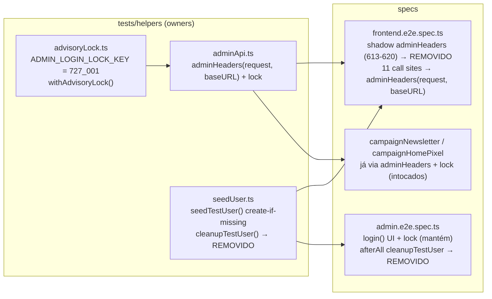

# Impl: E2E-ADMIN-LOGIN-LOCK — Unificar os logins do usuário de teste no helper `adminHeaders` com advisory lock

Status: rascunho
Atualizado em: 2026-08-24
Issue: #767
Intenção: body da Issue #767 (dívida restante do S10, fechamento parcial no #805)
Appetite restante: herdado (dívida de teste) — ~0,25 dia, mudança mecânica em 2 arquivos

## Leitura da intenção

- **Outcome:** todos os logins do usuário de teste (`dev@payloadcms.com`) no e2e — REST e UI — passam pelo mesmo ponto de serialização (`adminHeaders` com `pg_advisory_lock(727001)`), e o usuário compartilhado nunca é apagado no meio da suíte paralela. A corrida read-modify-write de sessão (token perdedor → 403 em toda requisição admin) deixa de existir entre os specs restantes.
- **O que NÃO negociar:** nenhum spec deixa de ser autossuficiente; nenhum projeto/worker é serializado (a serialização é por-lock, não por topologia); o login UI do admin (`login.ts`) continua testando o formulário genuinamente (não vira API login).
- **O que reavaliar:** o changelog `docs/changelog/2026-08-23-ops73-followup.md` registra `cleanupTestUser` como já removido — mas o código o mantém vivo (`seedUser.ts:42-54`, chamado em `admin.e2e.spec.ts:20`). Esta entrega converge código e registro documental.

## Abordagem recomendada

**Remover o shadow local de `adminHeaders` em `frontend.e2e.spec.ts` e rotear os 11 call sites pelo helper com lock; remover `cleanupTestUser` (helper + afterAll do admin).**

**Opções consideradas:** A (remover o shadow e importar o helper com lock + remover cleanup) | B (envolver o shadow existente com `withAdvisoryLock`, mantendo o bloco de login no spec) | C (lock inline em cada call site do frontend) | D (remover só o cleanup, deixar o shadow) | E (manter cleanup, mas envolver o delete em lock + re-seed)

**Recomendação:** A — porque o helper `adminHeaders` já é o owner do concern (mesma chave do `login()` UI, throw em login não-ok, unlock no `finally`); o shadow de `frontend.e2e.spec.ts:613-620` é o mesmo bloco pré-lock que `adminApi.ts` refatorou no #805 — mantê-lo seria twin com conhecimento vazando em 2 módulos. E remover `cleanupTestUser`: com credenciais constantes + `seedTestUser` create-if-missing, o delete não cumpre nenhum propósito (o usuário é idêntico a cada run, sem estado por-teste) e só cria a janela de ausência que a intenção quer fechar — além de convergir o registro do OPS73-FOLLOWUP.

**Rejeitadas:** B (mantém o bloco de login duplicado e o conhecimento espalhado — depth check: o módulo profundo já existe e é `adminApi.ts`; DRY); C (espalha `withAdvisoryLock` em 11 pontos — pass-through raso que o helper já encapsula); D (deixa a corrida que a intenção pede para fechar); E (o lock não fecha a janela: o `seedTestUser` concorrente roda fora do lock, e o delete invalida tokens vivos de workers em voo; adicionar lock a um delete que não precisa existir é custo puro).

### Componentes / mudanças

- **`tests/e2e/frontend.e2e.spec.ts`**: importar `adminHeaders` de `../helpers/adminApi`; remover o shadow local (linhas 613-620); trocar os 11 call sites `adminHeaders(request)` → `adminHeaders(request, baseURL)` (linhas 608, 827, 985, 1018, 1099, 1152, 1216, 1306, 1366, 1437, 1505 — `baseURL` já está no escopo do describe, linha 593); remover `testUser` do import da linha 3 (fica órfão — só o shadow o usava). `APIRequestContext` permanece (outros helpers locais: `createTag`, `resetSocialFeedSettings`, `bustSocialFeed`, `cleanupS2Fixtures`, …).
- **`tests/e2e/admin.e2e.spec.ts`**: remover `cleanupTestUser` do import (linha 3) e o `test.afterAll` (linhas 19-21). Resto intocado — REST já via `adminHeaders` (51, 148) e UI via `login()` com lock (16).
- **`tests/helpers/seedUser.ts`**: remover `cleanupTestUser` (linhas 39-54). `seedTestUser` fica como está.
- **Migration:** sem migration (mudança de helpers de teste).
- **Access / Consent:** n/a (teste).
- **UI:** n/a (teste).

## Fases verificáveis

1. **Fase 1 — Unificar os logins do frontend** (`tests/e2e/frontend.e2e.spec.ts`): novo import `adminHeaders`; remover shadow; atualizar os 11 call sites; limpar import `testUser`. → `pnpm lint`, `pnpm typecheck` (e `pnpm knip` — pega o export morto se algo escapar).
2. **Fase 2 — Remover `cleanupTestUser`** (`admin.e2e.spec.ts` + `seedUser.ts`): remover afterAll/import e a função. → `pnpm lint`, `pnpm knip`.
3. **Fase 3 — Gates e verificação da serialização:** `pnpm gate:fast`; e2e alvo `pnpm test:e2e --no-deps --project=frontend` e `pnpm test:e2e --no-deps --project=admin` (ou por arquivo); rodada full local com `PLAYWRIGHT_WORKERS=4` (a corrida só se demonstra com projetos em paralelo — mesma topologia do deploy `verify`); registrar entrada em `docs/changelog/<data>-e2e-admin-login-lock.md` (converge a discrepância do OPS73-FOLLOWUP); push via `pnpm push`.

## Rabbit holes / Não escopo (engenharia)

- Auth `campaignUser` (`campaignE2EFixtures`, `campaignHttpTest.ts:56`) — coleção de auth separada, sem sessão read-modify-write compartilhada; fora do escopo.
- `playwright.config.ts` (fullyParallel, workers, cadeia de projetos) — é a topologia que expõe a corrida; NÃO serializar projetos nem subir workers.
- `seedTestUser()` espalhado (10 no frontend + admin/newsletter/pixel): manter — create-if-missing é idempotente com credenciais constantes (o perdedor do unique-conflict procede); NÃO envolver em lock (não é write read-modify-write). Gatilho de revisitação: se o usuário de teste ganhar credenciais não-constantes, virar fixture de projeto em vez de seed por teste.
- NÃO trocar o login UI do admin por API login (o spec testa o formulário).
- NÃO promover o advisory lock a mecanismo de produção (comentário do próprio `advisoryLock.ts`).

## Riscos e mitigação

- **Corrida do afterAll cleanup vs seeds concorrentes:** eliminada pela remoção do delete. Gate de review: nunca reintroduzir delete do usuário compartilhado (o changelog já documenta a remoção como intenção).
- **Janela de usuário ausente:** some junto (sem delete, sem janela; create-if-missing é idempotente).
- **Custo de serialização:** 11 logins do frontend agora passam pelo lock; cada lock é ~ms e o describe já é `serial` — impacto negligenciável contra o custo de 403 retries.
- **Mudança de semântica de falha:** o shadow usava `expect(login.ok()).toBeTruthy()` (asserção Playwright); o helper lança `Error` — ambos rejeitam a promise, então `.catch(() => undefined)` (linha 985) e os `try/finally` dos specs seguem válidos.
- **Import órfão `testUser`:** removido na Fase 1; knip/lint pegam se escapar.
- **Flake pré-existente não relacionado no verify full:** classe conhecida (timeouts de `locator.check`, C142) — não bloqueia esta entrega; o PR roda o conjunto curado.

## Aceite de engenharia

- [ ] Aceite de produto da intenção ainda coberto (todos os logins do usuário de teste serializam no mesmo lock; cleanup não apaga o usuário compartilhado)
- [ ] Invariantes AGENTS/engineering-standards (reusa o owner existente `adminApi.ts` — sem twin; zero schema/access/UI tocados)
- [ ] Testes de domínio previstos: e2e alvo (frontend + admin) e full-4-workers local / verify CI (sem unit/int — mudança confinada a helpers de teste)

---

## Self-score decision-quality (gate ≥4)

1. **Decisões caras têm rejeitadas?** Sim — D1 (remover shadow vs envolver vs lock nos call sites) e D2 (remover cleanup vs lock+re-seed vs manter) com opções e motivos registrados. 1/1
2. **Abordagem cabe no appetite?** Sim — ~0,25 dia, mecânico, 2 arquivos, reusa 100% da infra do #805. 1/1
3. **Rabbit holes nomeados?** Sim — auth campaignUser, topologia do config, seedTestUser sem lock (com gatilho de revisitação), login UI genuíno. 1/1
4. **Depth check: reusa shells/helpers existentes?** Sim — zero helper novo; `adminHeaders`/`advisoryLock` já são o módulo profundo; removemos o twin (shadow) em vez de criar mais um. 1/1
5. **Intenção permanece satisfeita?** Sim — a engenharia (lock no helper + sem delete) é exatamente a ação pedida no body da Issue, sem reescrever o outcome. 1/1

**Score: 5/5.** Ponto único de fragilidade: D2 depende de "nenhum outro consumidor de `cleanupTestUser`" — verificado por grep (único call site: `admin.e2e.spec.ts:20`) e coberto pelo `pnpm knip` da Fase 2.
