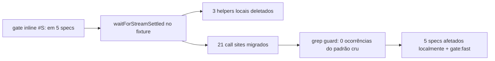

# Impl: E2E-DEBT-S-GATE — Consolidar o gate `#S:` de stream em um helper único

Status: rascunho
Atualizado em: 2026-08-24
Issue: #827
Intenção: body da Issue #827 (kind chore; depends OPS83; P3)
Appetite restante: herdado — chore pequeno de refactor de e2e, sem mudança de product code

## Leitura da intenção

- **Outcome:** eliminar as ~18 cópias inline do gate `waitForFunction(() => document.querySelectorAll('div[id^="S:"]').length === 0)` espalhadas por specs e2e, extraindo `waitForStreamSettled` para `tests/e2e/fixtures/campaignE2EFixtures.ts` e migrando os sites restantes no padrão validado OPS83 (settle + poll específico onde medido). Sem mudança de product code.
- **O que NÃO negociar:** nome do helper (`waitForStreamSettled`, fixado pela Issue); destino (`campaignE2EFixtures.ts`); gates de re-render de **outro tipo** ficam intactos (polls específicos de `leadershipLink`, footer `'1 município encontrado'` com 30s, `toHaveCount(0)` de chips, `waitForRouterSettled` dev-only, `script[id^="meta-pixel-"]`, `networkidle`); nenhum teste de produto/schema/CI é tocado.
- **O que reavaliar:** a intenção diz "7 specs"; o explorador confirmou **5** specs com o gate (campaignMunicipalities, campaignPeople, campaignPermissionProfile, campaignMunicipalityDeliberation, campaignUpdatesMobile) — o número real da migração é 5 specs / 21 call sites. Também se reavalia o timeout default do helper (ver Decisão 1) — a intenção não o fixa ("pese e decida documentado").

## Abordagem recomendada



**Opções consideradas:** A | B | C  
**Recomendação:** A — helper único no fixture com default explícito de 15s e pass-through de `options` — porque é o destino fixado pela Issue, o fixture já é o dono dos helpers de página (depth check: 5 helpers de página exportados hoje — `expectPostResponse`, `checkRadixWhenHydrated`, `waitForRouterSettled`, `expectCampaignBiometricsReady`, `campaignPageChrome`), e o 15s está validado pelos dois helpers locais de OPS83 + pela convenção 15_000 do fixture (todos os helpers de espera usam 15s).

### Decisões de engenharia (formato caro/barato)

**Decisão 1 — assinatura e timeout default do helper.**

```text
Opções: A | B | C
Recomendação: A — `waitForStreamSettled(page: Page, options?: { timeout?: number })`
  → `page.waitForFunction(fn, undefined, options)` com default 15_000
  porque: (a) `waitForFunction` só aceita options na 3ª posição — o pass-through é
  obrigatório, não cosmético; (b) os dois helpers locais de OPS83 (deliberation L14,
  updatesMobile L16) já provam 15s suficiente para a classe de gate; (c) a convenção
  do fixture é 15_000 (checkRadixWhenHydrated, expectCampaignBiometricsReady,
  waitForRouterSettled); (d) default explícito é self-documenting.
Alternativas rejeitadas:
  B — `waitForStreamSettled(page)` sem options, 15s hardcoded — porque o pass-through
    é grátis (só a 3ª posição do waitForFunction) e perde a válvula de escape por site
    para futuros flakies; reabrir o helper para adicionar options depois é rework.
  C — sem timeout explícito (default Playwright 30s) — preservaria byte-a-byte o
    comportamento dos 14 sites inline que hoje rodam a 30s, mas ignora o padrão
    validado OPS83 (15s) e a convenção do fixture; default 30s implícito também
    esconderia o budget do gate.
```

Efeito colateral deliberado: os 14 sites inline (8 em campaignMunicipalities, 4 em campaignPeople, 2 em campaignPermissionProfile) passam de 30s → 15s. Aceito porque o gate espera **commit de DOM** (escala de ms uma vez que o stream resolve — o shell `#S:` some junto com o último chunk RSC); 15s é budget comprovado na mesma classe de gate por 2 specs desde OPS83; o `options` permite override por site se algum dia precisar. Registrado em Riscos.

**Decisão 2 — corpo do helper é cópia literal do gate validado.**

```text
Opções: A | B
Recomendação: A — `page.waitForFunction(() => document.querySelectorAll('div[id^="S:"]').length === 0, undefined, options)` idêntico ao gate atual, com JSDoc explicando o mecanismo (shells transientes `#S:*` escondidos do stream RSC, origem OPS83, aviso "the generic S: gate alone is not enough" → polls complementares ficam nos call sites).
Alternativas rejeitadas:
  B — reescrever como `expect(...).toPass`/locator — porque muda a semântica do gate
    (waitForFunction avalia no DOM raiz, sem retry de assertion por locator) e qualquer
    reescrita é uma mudança de comportamento não pedida num chore de extração.
```

**Decisão 3 — destino e estrutura do helper.**

```text
Opções: A | B | C
Recomendação: A — `campaignE2EFixtures.ts`, junto dos outros helpers de página.
Alternativas rejeitadas:
  B — arquivo novo `tests/e2e/fixtures/waitForStreamSettled.ts` — porque é pass-through
    raso (depth check #2): um arquivo de 1 função para 1 call site de import é cerimônia
    sem volatilidade; o fixture já é o módulo profundo de esperas.
  C — `e2eTest.ts`/outro fixture — porque o destino está fixado pela Issue e os 5 specs
    já importam de `campaignE2EFixtures.js`.
```

### Componentes / mudanças

- **`tests/e2e/fixtures/campaignE2EFixtures.ts`**: novo export `waitForStreamSettled(page: Page, options?: { timeout?: number }): Promise<void>` — JSDoc com o mecanismo do gate, origem OPS83, default 15s, aviso dos polls complementares. `Page` já é type-only import no arquivo (L4). Nada mais no fixture muda (ownership/session/setup intocados).
- **`tests/e2e/campaignMunicipalities.e2e.spec.ts`**: deletar helper local `settleMunicipalityStream` (L55–56); migrar 11 sites — 3 chamadas (L455/466/725) + 8 inline (L153/972/1243/1323/1398/1457/1561/1648); adicionar `waitForStreamSettled` ao bloco de import do fixture (L6–20). `Page` permanece usado por outros helpers locais.
- **`tests/e2e/campaignPeople.e2e.spec.ts`**: migrar 4 inline (L41/52/107/343); adicionar ao import do fixture (L1–7).
- **`tests/e2e/campaignPermissionProfile.e2e.spec.ts`**: migrar 2 inline (L97/115); import vira `{ expect, test, waitForStreamSettled }`. Os `waitForLoadState('networkidle')` (L27/47/62/77/93/113) são padrão distinto ANTES do gate — manter.
- **`tests/e2e/campaignMunicipalityDeliberation.e2e.spec.ts`**: deletar helper local `settleStream` (L14–17); migrar 1 chamada (L63); adicionar ao import do fixture (L4–10). `Page` permanece usado por `openFeedAs` (L57).
- **`tests/e2e/campaignUpdatesMobile.e2e.spec.ts`**: deletar helper local `settleStream` (L16–19); migrar 3 chamadas (L63/126/143); adicionar ao import (L4). `Page` permanece usado por `scrollFeedToBottom` (L47).
- **Migration:** sem migration (nenhuma mudança de schema).
- **Access / Consent:** n/a — sem product code.
- **UI:** n/a.

### Dados → forma (se aplicável)

n/a — nenhuma mudança de dados/forma; a forma é o código de teste.

## Fases verificáveis

1. **Helper + tracer bullet (spec menor)** — adicionar `waitForStreamSettled` ao fixture com JSDoc; migrar `campaignMunicipalityDeliberation` (1 call + helper local removido) e rodar esse spec isolado para validar o traço antes do bulk: `pnpm test:e2e --no-deps -- tests/e2e/campaignMunicipalityDeliberation.e2e.spec.ts`.
2. **Bulk municípios e pessoas** — `campaignMunicipalities` (11 sites + helper local removido) e `campaignPeople` (4 sites).
3. **Restante** — `campaignPermissionProfile` (2) e `campaignUpdatesMobile` (3 + helper local removido).
4. **Verificação** — grep guard: `grep -rn "querySelectorAll.*id\^=\"S:\"" tests/e2e` deve retornar **zero** ocorrências (nenhum site residual nem variante nova). Rodar os 5 specs afetados localmente (`pnpm test:e2e --no-deps --` com os 5 arquivos; usar `--workers=1` se necessário — limitação OPS72 #72 de seed paralelo) + `pnpm gate:fast` (lint/typecheck/unit — pega unused imports que a remoção dos helpers locais puder deixar). Pirâmide (OPS90): chore puro de e2e **não exige** unit/int novos — o nível certo de validação é o próprio e2e afetado + gates; o diff (só `tests/e2e/**`) classifica `selected` no CI (blast radius), nunca full.
5. **Changelog (OPS44)** — o fluxo de entrega pede entrada mesmo para chore: `docs/changelog/2026-08-24-e2e-debt-s-gate.md` (uma entrada no formato do agregado) + `pnpm changelog:build` + `pnpm changelog:check`.
6. **Entrega** — `pnpm gate:fast` na iteração; `pnpm push -u origin HEAD`; PR via `GITHUB_TOKEN=<PAT> node scripts/github-pr.mjs --head <branch> --title "E2E-DEBT-S-GATE — <título>" --body-file <arquivo>` com `Closes #827`; incluir este `*-impl.md` no commit.

## Rabbit holes / Não escopo (engenharia)

- **Não** unificar os polls complementares (leadershipLink L727, footer `'1 município encontrado'` L1398/1561, chips `toHaveCount(0)` L454/465, `getByRole('row')` em people) — OPS83 validou "settle + poll específico"; cada um é gate de re-render de outro tipo e substituí-los seria mudança de comportamento fora do chore.
- **Não** refatorar `waitForRouterSettled` (OPS42, dev-only, outro mecanismo de quiescência) nem o gate `script[id^="meta-pixel-"]` (campaignHomePixel) — são outros gates, flagrados pelo explorador como fora do padrão `#S:`.
- **Não** criar teste unitário para o helper — `waitForFunction` só existe em browser; o nível certo é o próprio e2e (OPS90).
- **Não** tocar nada além do gate no fixture (ownership/cleanup/session code é região sensível; diff mínimo).
- **Não** "melhorar" o seletor (`div[id^="S:"]` → `[id^="S:"]` etc.) — cópia literal, ver Decisão 2.
- **Não** reabrir a contagem de specs da intenção (7 vs 5 reais) como trabalho extra — o explorador confirmou e o diff de verificação cobre.

## Riscos e mitigação

- **Timeout 30s → 15s em 14 sites inline** (municipalities 8, people 4, permissionProfile 2). Mitigação: gate espera commit de DOM (ms-scale), 15s validado na mesma classe por 2 specs OPS83 + convenção do fixture; se um site flakyar no CI, override por site via `options` (Decisão 1). Registrado no JSDoc do helper.
- **Site residual não migrado** (grep inicial achou 17 ocorrências cruas; migração mexe em 14 inline + 3 defs de helper). Mitigação: grep guard na Fase 4 exige 0 ocorrências de `querySelectorAll.*id\^="S:"`; diff do PR revisa isso.
- **Import unused deixado pela remoção dos helpers locais** — `Page` permanece usado em todos os 5 specs (verificado: deliberation `openFeedAs`, updatesMobile `scrollFeedToBottom`, municipalities/people outros helpers) — mas lint/knip do `gate:fast` pegaria qualquer resíduo; rodar na Fase 4.
- **Regressão silenciosa de gate** (editar site errado / trocar semântica na cópia). Mitigação: Decisão 2 fixa corpo literal; os 5 specs rodando na Fase 4 são o teste de comportamento; polls complementares no diff ficam intocados (revisão foca nisso).
- **Flakiness pré-existente mascarada** — specs afetados têm flakies históricos (OPS83 verify #15). Mitigação: rodar os 5 localmente e separar falha do diff de falha pré-existente antes de escalar para o pipeline.

## Aceite de engenharia

- [x] Aceite de produto da intenção ainda coberto — gate `#S:` único (`waitForStreamSettled`), 21 call sites migrados, padrão OPS83 preservado, zero product code
- [x] Invariantes AGENTS/engineering-standards — sem schema/access/LGPD/URL; helpers no módulo dono (fixture), sem twin
- [x] Testes de domínio previstos (unit/int) onde access/write paths mudam — n/a: nenhum access/write path muda; validação = e2e afetado + `pnpm gate:fast` (pirâmide OPS90)

---

Self-score decision-quality: **5/5** — (1) decisões caras com rejeitadas (timeout/default, corpo do helper, destino); (2) cabe no appetite (chore mecânico, 1 helper + 21 sites); (3) rabbit holes nomeados; (4) depth check reusa o fixture dono dos helpers de página; (5) intenção satisfeita sem reescrever o outcome.
