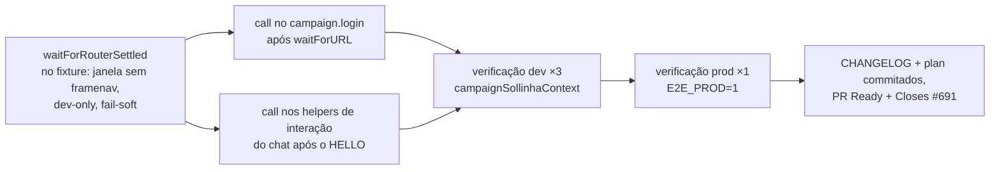

# Impl: e2e dev — navegação RSC do login commita tarde e remonta o layout (interação silenciosamente perdida)

Status: implementado (evidência coletada 2026-08-11 — aceite ×3 dev + ×1 prod)
Atualizado em: 2026-08-11
Issue: #691
Intenção: docs/plans/e2e-dev-router-quiescencia.md
Appetite restante: herdado (~0,5 dia eng — um helper de "quiescência do router" no fixture)

## Leitura da intenção

- **Outcome:** em dev mode, interagir com a página nunca mais perde o fill/Enter para uma remontagem tardia do layout; prod mode (CI) intacto.
- **O que NÃO negociar:** nenhuma asserção de produto muda; app não muda; nada de `networkidle` mágico; helper dev-only ou inócuo em prod; precedentes `checkRadixWhenHydrated` (retry até o estado certo) e OPS30 (resiliência ao compile frio no fixture).
- **O que reavaliar:** a hipótese "o `waitForURL` resolve no redirect otimista antes do commit RSC". Medido com sonda nesta máquina (load 45, 2026-08-11): o `waitForURL` resolve **no commit** (o pushState/replaceState só ocorre quando a payload RSC termina de renderizar), e o commit perigoso não é o do redirect — é um **segundo** framenav que dispara **após o `goto` do próprio teste** (~150–500 ms depois do load), sem request nenhum (`history.replaceState('/campanha')`), cujo commit React remonta o layout 150–250 ms depois do framenav. Consequência: consertar só o `login` do fixture **não** protege o fluxo `login → goto → interagir` (o caso do B188).

## Abordagem recomendada

**Opções consideradas:** A | B | C | D
**Recomendação:** **A** — helper `waitForRouterSettled(page)` no fixture (padrão `checkRadixWhenHydrated`), chamado **no `campaign.login`** (cobre o modelo "waitForURL otimista" e interações diretas pós-login) **e nos helpers de abertura do chat** (`openChatAndSend`/`openChat`/`askViaInput` dos 5 specs da família Sollinha, após o wait do HELLO — o único ponto onde o journey interage imediatamente após o load). A janela é **ausência de `framenavigated`** (500 ms, 2× a maior defasagem observada framenav→remontagem: 158–252 ms), não network idle.
**Rejeitadas:** B (retry da interação tipo "re-fill até a resposta aparecer") porque re-send duplicaria com o mock gated do B199 (que conta requests) e muda a semântica de cada interação; C (só no `login`) porque a evidência mostra que a remontagem perigosa dispara **depois** do `goto` do teste — o login não a enxerga; D (espera `networkidle` ou wrap global de `page.goto`) porque a intenção corta networkidle (HMR nunca fica idle em dev) e o wrap global paga em todo goto de toda spec.

### Componentes / mudanças

- **`waitForRouterSettled`** (`tests/e2e/fixtures/campaignE2EFixtures.ts`, ao lado de `checkRadixWhenHydrated`): escuta `framenavigated`; retorna quando `now - lastNav > 500 ms` (`expect(...).toPass({ timeout: 15_000 })`); **no-op em prod** (`process.env.CI || process.env.E2E_PROD === '1'` — mesma detecção do `playwright.config.ts`); **fail-soft no timeout** (router que nunca quiesce sob HMR extremo não mascara a falha real — a asserção seguinte carrega o sinal; corte do rabbit hole da intenção).
- **`campaign.login`** (mesmo arquivo): `await waitForRouterSettled(page)` após o `waitForURL`.
- **Helpers dos specs** (após o `expect(HELLO).toBeVisible`): `campaignSollinhaContext.e2e.spec.ts` (`openChatAndSend` — o teste B188 que flakeia; e `openMobileDrawer` — ajuste pós-gate, ver abaixo), `campaignAiChatResize.e2e.spec.ts` (`openChatAndSend`), `campaignAiLinks.e2e.spec.ts` (`openChatAndSend`), `campaignAiTranscribe.e2e.spec.ts` (`openChat`), `campaignAiChatFollowUps.e2e.spec.ts` (`askViaInput` — o retry 60 s atual é o fallback caro que o settle evita). `campaignAiChatOpeningChips` e `campaignSollinhaWidth` não interagem com fill logo após o load (chips já têm retry via `toPass`) — fora de escopo.
- **Migration:** sem migration. **Access / Consent:** sem mudança (test-infra). **UI:** Impeccable A — N/A, infra de testes.
- **Sonda temporária** `tests/e2e/campaignProbe.e2e.spec.ts` (evidência) — **deletada** antes do PR.

### Ajuste pós-gate (evidência de execução, 2026-08-11 — mesma sessão)

O run 3 do aceite pegou o **clique do drawer** na mesma janela de remontagem: o B198 "link interno" falhou com o drawer nunca abrindo (snapshot: botão ativo, dialog ausente — click silent no-op), load 61 no momento. A classe não é só fill/Enter — é **qualquer interação no layout** dentro da janela pós-load. `openMobileDrawer` do `campaignSollinhaContext` ganhou o mesmo settle antes do clique (1 linha, mesmo mecanismo); re-run do arquivo completo verde 10/10. O clique do FAB do B199 já era retried via `toPass` (padrão B13/B17) — intocado.

### Evidência (2026-08-11, máquina com worktrees paralelos, load 31–61)

- **Aceite dev — `campaignSollinhaContext` 10/10 ×3 consecutivos** (runs 23:04–23:26, load 31–61; inclui o B188 "reload na mesma aba" que flakeava 5/5 na sessão B199). O run 3 falhou 1 (clique do drawer do B198 na janela — ajuste pós-gate acima) e re-rodou 10/10 com o settle no `openMobileDrawer`.
- **Irmão da família — `campaignAiChatResize` 8/8** em dev (load 36–48).
- **Prod — `campaignSollinhaContext` 8/8 com `E2E_PROD=1`** (build `NEXT_DIST_DIR=.next/e2e`; 30,7 s total — helper no-op confirmado).
- **Sonda (deletada):** 3 runs de sonda — bug reproduzido 2× antes do fix (fill+Enter → `input-value=""`, `probe-sent=false`; cascade do overlay de dev no run 2) e 1× sobreviveu com fill atrasado ~2 s; sinais: 2× `REQ /campanha?_rsc=1fr2x rsc=1` → commit (`FRAMENAV`+`waitForURL` mesmo ms) → `goto` → **`replace /campanha` sem request ~150–500 ms após HELLO** → textarea novo 158–252 ms depois.

## Fases verificáveis

1. **Fixture + helper (tracer)** — implementar `waitForRouterSettled` + call no `login`; `pnpm exec tsc --noEmit` + `pnpm exec knip`.
2. **Call sites nos specs** — os 5 helpers; `pnpm format` + lint.
3. **Evidência dev (aceite)** — `campaignSollinhaContext.e2e.spec.ts` **×3 consecutivos** em dev a 2 workers (inclui o B188 "reload na mesma aba", o teste que flakeia 5/5 na sessão B199); + 1× `campaignAiChatResize` (irmão da família). Registrar load average junto.
4. **Evidência prod** — `campaignSollinhaContext.e2e.spec.ts` **1× com `E2E_PROD=1`** (no-op do helper; CI imune por construção — confirma).
5. **Docs + limpeza** — deletar `campaignProbe.e2e.spec.ts`; entrada curta no `docs/CHANGELOG-AGENTS.md`; status do impl plan `em execução` → fechado na entrega.
6. **Gates + push** — `pnpm gate:fast`, `pnpm format:check`, `pnpm exec knip`, `pnpm check:cycles`; `pnpm push` → PR Ready `--base main` + `Closes #691`.

## Rabbit holes / Não escopo (engenharia)

- Esperar `networkidle` — cortado na intenção (HMR nunca quiesce em dev).
- Wrap global de `page.goto` — paga em todo goto de toda spec; o corte da intenção é "só onde interage imediatamente após o load".
- Consertar a remontagem do Next dev em si — fora de escopo da intenção.
- Retry de interação (re-send) — risco de double-send com o mock gated do B199; o settle elimina a causa.
- Ressuscitar o retry de login do OPS30 (removido no OPS36 pelo session-seeding) — classes diferentes; o settle não reabre aquela decisão.

## Riscos e mitigação

- **Janela de quiescência curta demais sob carga extrema** (defasagem framenav→remontagem > 500 ms): observado máx. 252 ms; o `toPass` esparso (~100/350/850 ms) efetivamente alarga a janela; se reaparecer flake, subir a janela (constante com um número — mudança de 1 linha, gatilho de revisitação registrado).
- **Helper mascara falha real:** timeout fail-soft — a asserção seguinte do journey continua sendo o sinal honesto.
- **Custo em dev:** ~0,5–1 s por login de browser e por interação de chat (a janela de 500 ms + a cadência esparsa do `toPass`; medido ~850 ms por call site); zero em prod (no-op).
- **Custo em CI:** zero (no-op por `process.env.CI`).

## Aceite de engenharia

- [x] Aceite de produto da intenção ainda coberto (nenhuma asserção de produto tocada; app intacto)
- [x] Invariantes AGENTS/engineering-standards (sem migration/access/Consent; fixtures test-infra)
- [x] Testes de domínio previstos: gate:fast + e2e conforme evidência (×3 dev + ×1 prod)
- [x] Self-score decision-quality: 5/5 (opções rejeitadas registradas; evidência de sonda antes da decisão; depth check: reusa o fixture único de helpers; sem módulo novo)
