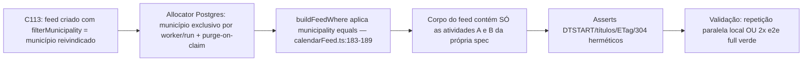

# Impl: E2E-FLAKE-C113 — Feed vivo (C113) falha sob 4 workers

Status: rascunho
Atualizado em: 2026-08-24
Issue: #763
Intenção: Issue #763 (body)
Appetite restante: herdado — pequeno (mudança test-only + validação estatística; ~0,5 dia eng)

## Leitura da intenção

- **Outcome:** o teste C113 "serves a live feed" (`tests/e2e/campaignAgendaFeed.e2e.spec.ts:116`) fica hermético sob 4 workers no e2e full — o par de asserts `toContain/not.toContain("DTSTART:…")` (:205-206) para de colidir com atividades de OUTRAS specs rodando em paralelo, sem reduzir workers nem enfraquecer o aceite original do C113 (mesmo link serve conteúdo novo: criação → GET → edição → GET → cancelamento → GET → 304 barato).
- **O que NÃO negociar:** correção test-only preferida; sem migration/schema; sem UI; sem tocar o contrato de produção do feed (`loadFeedActivities`/`buildFeedWhere`/rota `ical/[secret]` estão corretos — feed sem filtros é configuração legítima); o aceite funcional do C113 permanece intacto.
- **O que reavaliar:** a hipótese "escopo por município isola de fato" — depende do contrato do allocator (`claimMunicipality` → índice EXCLUSIVO por worker/run vivo, com purge-on-claim removendo resíduo: `tests/e2e/fixtures/campaignE2EFixtures.ts:152-184`, `tests/helpers/campaignMunicipalityAllocator.ts:98-115`). Verificado no código: exclusividade vale por runID de fixture (um teste = um runID), então qualquer feed filtrado pelo município reivindicado só enxerga linhas da própria spec. Segunda descoberta da exploração que muda o peso das opções: **o assert do 304 (:230-233) é igualmente sensível a contaminação** — o ETag é hash do corpo inteiro (`src/utilities/calendarFeed.ts:108`), então uma atividade alheia surgindo/desaparecendo entre dois GETs vira 200 onde se esperava 304. Isso importa porque a alternativa B (asserts por UID) NÃO fecha essa superfície; o escopo fecha.

## Abordagem recomendada

**Opções consideradas:** A | B | C

- **A. Escopar o feed de teste com `filterMunicipality` (recomendada):** no create do `calendarFeed` do C113 (:150-157), passar `filterMunicipality: municipality.id` (o município JÁ reivindicado pelo teste para as próprias atividades). `buildFeedWhere` acrescenta `{ municipality: { equals: id } }` (`src/utilities/calendarFeed.ts:183-189`) e o corpo passa a conter somente A e B. Hermeticidade vem de graça do allocator: o slot é exclusivo por run vivo, resíduo é purgado no claim. Bônus de realismo: feeds filtrados são a configuração comum de produção (o diálogo valida município dentro do escopo do criador — `createCalendarFeedLink`, `src/lib/schemas/calendarFeed.ts`), e o caminho SEM filtros continua coberto pelos testes C98 do mesmo spec.
- **B. Trocar asserts de horário por UID (parse de bloco VEVENT):** extrair o VEVENT cujo `UID:${slug}@teqo.jorgesolla.com.br` (`calendarFeed.ts:71`) corresponde à atividade B e assertar DTSTART dentro do bloco. Fecha o par :205-206 (slugs são canônicos/únicos), mas exige helper de parsing (~10-15 linhas) e **deixa aberto o vazamento do ETag/304** (:190, :233): o hash cobre o corpo completo, incluindo eventos alheios — o flake migraria do assert de DTSTART para o assert de revalidação. Como correção primária não fecha o aceite; como complemento de A é cerimônia contra cenário impossível sob escopo.
- **C. Reduzir workers no e2e full:** mata o propósito do verify (tempo de ciclo) e esconde a classe de bug (compartilhamento de DB entre workers) em vez de torná-la inocua por construção. Rejeitada de plano.

**Recomendação: A** — porque torna o teste hermético por construção (exclusividade do allocator já garantida e em uso), com UMA linha a mais num fixture create; preserva 100% do aceite C113; alinha o teste com o uso real de produção (feed filtrado); e é a única opção que fecha TODAS as superfícies sensíveis (DTSTART, títulos negativos e ETag/304). Os asserts de substring DTSTART ficam como estão: sob escopo, o único VEVENT com `startAtB` é o da própria spec (horas intra-teste distintas: 10:00, 11:00→12:00).
**Rejeitadas:** B porque não fecha o vazamento do ETag/304 (superfície comprovadamente exposta — foi o mesmo mecanismo do sintoma reportado) e adiciona parsing sem cenário remanescente que o justifique após A; C porque degrada o verify em vez de corrigir o teste.

### Componentes / mudanças

- **Teste C113** (`tests/e2e/campaignAgendaFeed.e2e.spec.ts:149-157`): no `fixtures.payload.create({ collection: 'calendarFeed', … })`, incluir `filterMunicipality: municipality.id` + comentário curto (EN) explicando o contrato: claimed municipalities are exclusive per live run (allocator), so the scoped feed cannot see parallel workers' activities — e que isso também estabiliza o ETag/304. Nenhum assert muda; nenhum helper novo.
- **Helpers de fixture:** nenhum — `claimMunicipality()` já é chamada pelo teste (:127) e `purgeMunicipalityResidue` já limpa o slot no claim.
- **Migration:** sem migration.
- **Access / Consent:** sem mudança — o create usa `user: coordinator` + `overrideAccess: false` exatamente como hoje; `filterMunicipality` não tem field-access restrito (`src/collections/CalendarFeed.ts:66-73`); coordinator é unrestricted (`accessibleMunicipalityIds: null`), logo nenhuma intersecção de escopo advisor interfere.
- **UI:** Impeccable A — sem superfície.
- **Dados → forma:** N/A (sem dados novos; o iCal gerado é o mesmo).

## Fases verificáveis

1. **Tracer (fix, ~1 linha):** editar o create do `calendarFeed` no C113 conforme acima; rodar o spec completo local: `pnpm test:e2e -- tests/e2e/campaignAgendaFeed.e2e.spec.ts` (3 testes verdes, incluindo os C98 intactos).
2. **Sonda determinística (opcional, recomendada, NÃO commitada):** reproduzir o mecanismo em vez de apostar em estatística — temporariamente criar (via `rootPayload`, fora do ownership, em OUTRO município) uma atividade `confirmado` hoje às 11:00 (=14:00Z, a mesma hora do `startAtB` original) e confirmar: com o feed global antigo o assert :206 falharia; com o feed escopado passa; remover a sonda. Se pulada, registrar o motivo no PR.
3. **Validação anti-flake (aceite da issue — um dos dois):**
   - repetição paralela local com contenção real entre specs de agenda: `PLAYWRIGHT_WORKERS=4 pnpm test:e2e -- tests/e2e/campaignAgendaFeed.e2e.spec.ts --repeat-each=4 tests/e2e/campaignActivity.e2e.spec.ts tests/e2e/campaignAgendaMobile.e2e.spec.ts`; ou
   - e2e full verde em 2 runs consecutivos.
4. **Gates:** `pnpm gate:fast`; 1 entrada curta em `docs/changelog/<data>-e2e-flake-c113.md`; `pnpm push` → PR Ready `--base main` com `Closes #763`; auto-merge + checks (CI roda o conjunto curado/full de e2e).

## Rabbit holes / Não escopo (engenharia)

- **Trocar asserts DTSTART por parsing de bloco VEVENT/UID:** não agora — sob escopo não há cenário que o justifique (1 call site, cerimônia sem volatilidade). Gatilho de revisitação: qualquer recorrência do flake COM feed escopado → migrar os asserts de horário para extração por UID.
- **Escopar também os feeds dos testes C98 do mesmo arquivo:** desnecessário — eles fazem apenas asserts positivos sobre títulos únicos por runID (`fixtures.value()`), imunes a linhas alheias; churn sem retorno.
- **Mudar `loadFeedActivities`/`buildFeedWhere`/rota para "conhecer" teste:** produção está correta; feed global sem filtros é configuração legítima do produto (schema aceita, diálogo permite).
- **Reduzir workers / `describe.serial` / retries maiores:** mascaramento; rejeitado com a opção C.
- **Criar helper compartilhado de asserção iCal:** DRY < 2 call sites.

## Riscos e mitigação

- **Flake estatístico não reproduzir localmente (janela de colisão estreita):** mitigação = sonda determinística da fase 2 (prova o mecanismo nas duas direções) + repetição paralela com as specs irmãs que criam atividades confirmadas; se ainda assim recorrer no verify, o gatilho do rabbit hole 1 entra (UID-block) — mas sob escopo o mecanismo original fica impossível, não improvável.
- **Regression-blindness: escopo esconder quebra futura de feeds GLOBAIS:** mitigação = cobertura existente mantida: C98 exerce o fluxo sem filtros pela UI (header + FAB mobile) e os testes int da rota cobrem o comportamento do endpoint; nada é removido.
- **Contaminação via resíduo de run crashado no município reivindicado:** já tratado pelo `purgeMunicipalityResidue` no claim (`campaignE2EFixtures.ts:174`) — comportamento existente, não alterado.
- **Mudança silenciosa do que o C113 prova:** aceite funcional preservado (mesmo link, criação→edição→cancelamento→304 refletem); o filtro exercita a configuração dominante de produção, não um caso artificial.

## Aceite de engenharia

- [ ] Aceite de produto da intenção ainda coberto: C113 verde e hermético sob 4 workers, sem reduzir paralelismo nem retries, com o aceite funcional original intacto (link vivo + validadores)
- [ ] Invariantes AGENTS/engineering-standards: mudança test-only; identificadores EN; sem migration/schema/access/Consent; sem tocar URL pública nem contrato de resposta do feed
- [ ] Testes previstos: nenhum unit/int novo necessário (nenhum path de produção muda); validação = fase 2 (opcional) + fase 3 (obrigatória, um dos dois critérios da issue)
- [ ] Gates executados: `pnpm gate:fast` + validação anti-flake antes do push

---

### Self-score decision-quality (gate ≥4)

1. Decisões caras têm rejeitadas? **Sim** — B e C rejeitadas com motivo técnico (B não fecha ETag/304; C degrada o verify).
2. Abordagem cabe no appetite? **Sim** — 1 linha + comentário + validação; corte explícito de tudo além disso.
3. Rabbit holes nomeados? **Sim** — parsing UID, escopar C98, helper iCal, serial/workers, mexer na rota.
4. Depth check (reusa o que existe)? **Sim** — reusa `claimMunicipality`, allocator, purge-on-claim e `buildFeedWhere` existentes; zero módulo novo.
5. Intenção (aceite de produto) permanece satisfeita? **Sim** — outcome é estabilidade do C113 no e2e full; engenharia não enfraqueceu nenhum assert nem o verify.

**Score: 5/5** — aprovado para execução.
