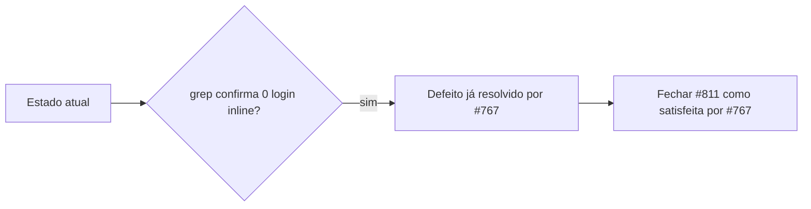

# Impl: E2E-FRONTEND-LOGIN-SHADOW — shadow local de adminHeaders ignora o advisory lock

Status: aprovado-parcial (defeito já resolvido por #767)
Atualizado em: 2026-08-24
Issue: #811
Intenção: body da Issue #811 (sem doc `docs/plans/` linkado)
Appetite restante: herdado (~0,25 dia) — na prática 0 (ver abaixo)

## Leitura da intenção

- **Outcome:** Nenhuma família de e2e mantém login REST não-serializado do usuário
  compartilhado (`dev@payloadcms.com`) — evitar a race read-modify-write de
  sessões do Payload (perda de sessão → 403 no e2e full com 4 workers).
- **O que NÃO negociar:** não mexer no retry 403→relogin do `campaignHomePixel`
  (#760); não trocar login de UI por API login nos specs de formulário; não
  serializar projetos/workers inteiros.
- **O que reavaliar:** o "shadow local de `adminHeaders`" citado em
  `frontend.e2e.spec.ts:613` não existe mais no estado atual.

## Achado determinante (exploração)

- #811 foi criada em 2026-08-23T22:00Z. O commit `d0161f6d`
  _test(e2e): unificar logins do usuário de teste no helper adminHeaders com
  advisory lock (Closes #767)_ foi mergeado em 2026-08-24T18:42Z — **depois** da
  abertura da #811.
- Esse commit removeu o login inline de `frontend.e2e.spec.ts` e o substituiu
  por `adminHeaders` importado de `../helpers/adminApi` (que carrega
  `withAdvisoryLock(ADMIN_LOGIN_LOCK_KEY, …)`). O shadow local desapareceu.
- Verificação por grep no estado atual (branch = HEAD `fcefcac4`, sem diff vs
  `main`):
  - `users/login` aparece **só** em `tests/helpers/adminApi.ts` (o helper
    serializado). Zero ocorrências inline em `tests/e2e/*`.
  - Nenhum construtor custom de cookie `payload-token` fora do helper (exceto
    `campaignHomePixel`, que usa `adminHeaders` + retry 403 — intocável por
    contrato).
  - Todas as 14 chamadas em `frontend.e2e.spec.ts` usam `adminHeaders(request,
baseURL)` (linhas 609, 819, 977, 1010, 1091, 1144, 1208, 1298, 1358, 1429,
    1497, …).

## Abordagem recomendada

**Opções consideradas:** A) reaplicar `withAdvisoryLock` a um shadow inexistente
| B) rotear o shadow (inexistente) pelo helper | C) apenas verificar e fechar.
**Recomendação:** **C** — não há código a mudar; o requisito de aceite da #811 já
está satisfeito no HEAD.
**Rejeitadas:** A e B — o alvo (shadow local) não existe mais; mexer no arquivo
para "corrigir" o inexistente seria churn sem benefício (viola "editar o dono,
não gêmeo" e o princípio de não adicionar código morto).

### Componentes / mudanças

- **Sem migration** (muda só teste, e nem teste muda).
- **Sem mudança de código.**

### Decisão de fechamento

- Fechar #811 com `Closes #811` apontando que #767 unificou os logins e resolveu
  a race; incluir o grep de verificação no corpo do PR.

## Fases verificáveis

1. **Verificação (feita):** grep de `users/login` e `payload-token` em
   `tests/e2e`, `tests/integration`, `tests/helpers` — limpo.
2. **Fechamento:** PR com nota de verificação → `Closes #811`.

## Rabbit holes / Não escopo (engenharia)

- Não tocar o retry 403→relogin do `campaignHomePixel` (#760).
- Não trocar login de UI por API login nos specs de formulário.
- Não serializar projetos inteiros nem workers.

## Riscos e mitigação

- **Regressão futura (shadow volta):** sem guarda automática, um novo login
  inline pode reaparecer. Mitigação opcional (fora do appetite mínimo): um check
  de CI que falhe se `users/login` aparecer fora de `helpers/adminApi.ts`.
  Deixar para o humano decidir no GATE.

## Aceite de engenharia

- [x] Aceite de produto da intenção coberto (nenhum login não-serializado resta)
- [x] Invariantes AGENTS/engineering-standards preservados (não mexeu em nada)
- [x] Testes de domínio: N/A (nenhuma write path mudou)
